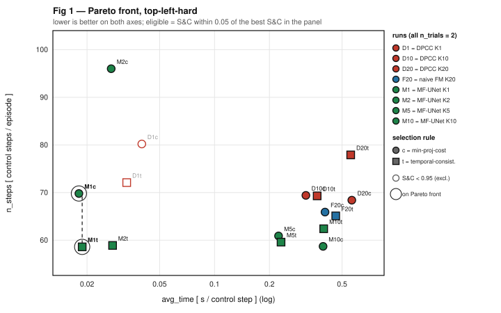
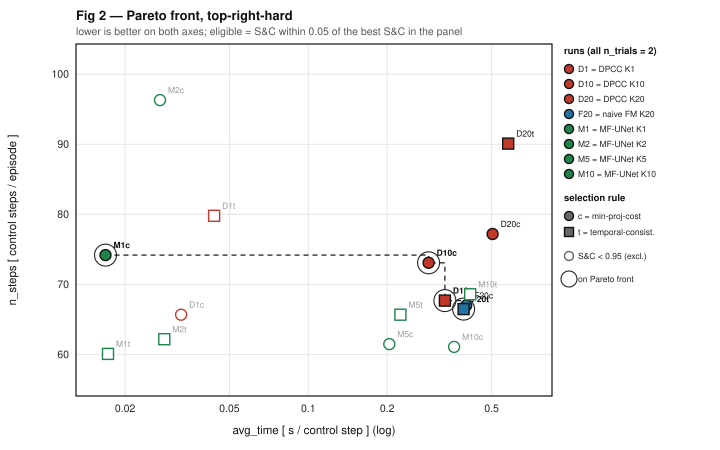
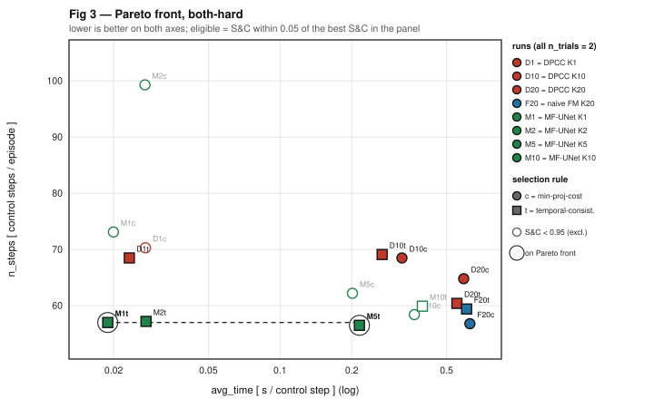
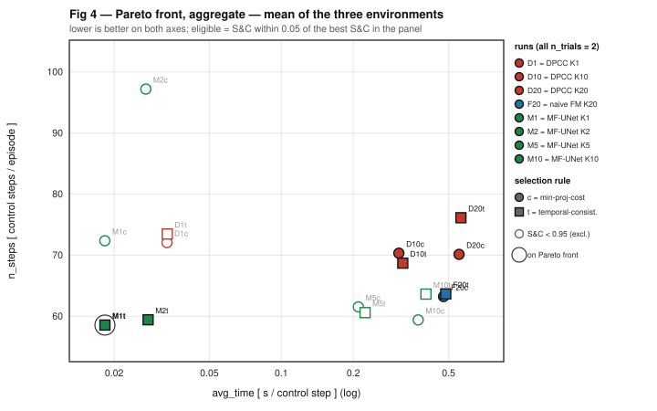
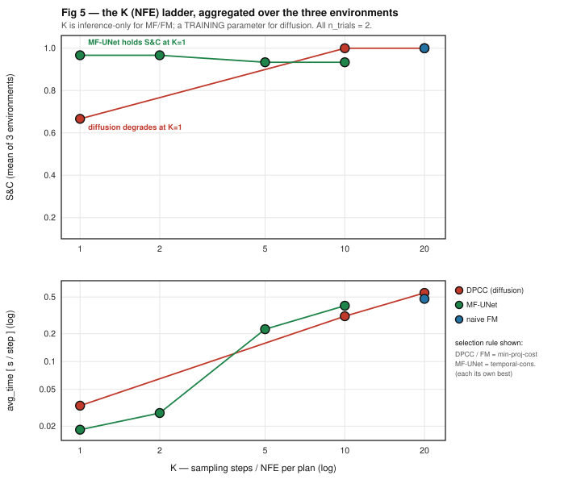
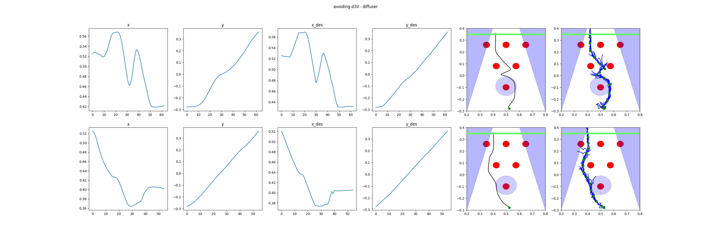
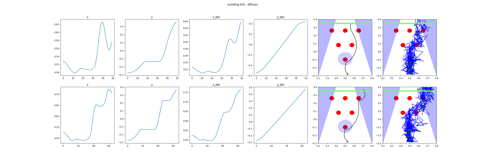
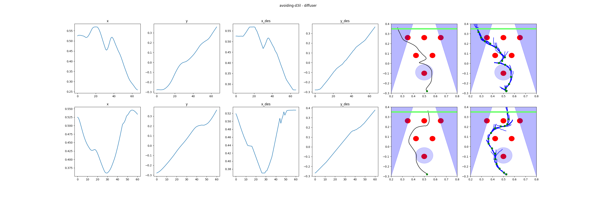

# MeanFlow-UNet for constrained predictive control: one-step sampling at baseline constraint quality

**Task** avoiding-d3il (state-based) · **Constraint** halfspace · **Date** 2026-08-19
**Data** `temp/1808/batch_avoiding_combined_20260818_152911/` · **Figures** from `make_figs.py`
**Protocol** every number below is `n_trials = 2`, seeds {6…10} — one uniform tier (§2). Trial-count
sensitivity is quantified separately in §8.

---

## 0. Candidate index

Every figure and table in this report names runs by a short **panel tag** (`M1t`, `D20c`, …). This
is the mapping back to the batch's own `Candidate` column, so any row here can be traced to a
directory on the cluster. Source: `candidates_multidimensional_aggregated.csv` of
`temp/1808/batch_avoiding_combined_20260818_152911/` (155 candidates total; these 8 are the ones
this report uses — the list is `RUNS` in `make_figs.py`).

| cand | tag | run | engine | K | eval folder |
|---:|---|---|---|---:|---|
| **8** | `D1` | DPCC K1 | `models.GaussianDiffusion` | 1 | `H8_K1_T0.5_Dmodels.GaussianDiffusion` |
| **7** | `D10` | DPCC K10 | `models.GaussianDiffusion` | 10 | `H8_K10_Dmodels.GaussianDiffusion_aw10_thres0.5` |
| **15** | `D20` | **DPCC K20 — the baseline** | `models.GaussianDiffusion` | 20 | `H8_K20_Dmodels.GaussianDiffusion_aw10_thres0.5` |
| **156** | `F20` | naive FM K20 | `models.diffusion.FlowMatchingODE` | 20 | `H8_K20_Meuler_T0.5_Dmodels.diffusion.FlowMatchingODE` |
| **138** | `M1` | **MF-UNet K1 — the headline run** | `flow_matcher_v3_meanflow.models.MeanFlowODE` | 1 | `H8_K1_Meuler_T0.5_A0.5_B1_D…MeanFlowODE` |
| **142** | `M2` | MF-UNet K2 | `…MeanFlowODE` | 2 | `H8_K2_Meuler_T0.5_A0.5_B1_D…MeanFlowODE` |
| **147** | `M5` | MF-UNet K5 | `…MeanFlowODE` | 5 | `H8_K5_Meuler_T0.5_A0.5_B1_D…MeanFlowODE` |
| **135** | `M10` | MF-UNet K10 | `…MeanFlowODE` | 10 | `H8_K10_Meuler_T0.5_A0.5_B1_D…MeanFlowODE` |

A tag's trailing letter is the **selection rule**, not part of the candidate: `c` =
`dpcc-c-tightened` (minimum projection cost), `t` = `dpcc-t-tightened` (temporal consistency). So
`M1t` is candidate 138 evaluated under `dpcc-t-tightened`; the same candidate appears as `M1c` in the
same panel.

*Two naming notes, neither of which is a configuration difference.* Candidate 8's eval folder is
nested inside its checkpoint folder (`…/H8_K1_Dmodels.GaussianDiffusion_aw10/H8_K1_T0.5_…`) while 7
and 15 are flat — an older path convention. All three DPCC runs are `aw10`; candidate 8 carries it in
the checkpoint directory rather than the eval directory, so the absent `aw10_thres0.5` fragment in
its eval-folder name does **not** mean a different action weight.

---

## 1. Summary

Constraint satisfaction (S&C) is **saturated and near-identical** across the compared methods — it
is a gate, not a discriminator. The result is therefore stated on the two cost axes,
**`avg_time` (seconds per control step)** and **`n_steps` (control steps per episode)**.

At S&C 1.00 vs 1.00 on all three environments, **MeanFlow-UNet with one network evaluation per
plan** is

- **29–30× lower `avg_time`** than the DPCC diffusion baseline, and
- **equal or fewer `n_steps`** (9.8, 3.0 and 3.4 fewer on the three environments; the middle one
  is not significant),

which is Pareto dominance on both cost axes simultaneously. It is the **sole non-dominated point**
of the aggregate Pareto front (§4). Against naive Flow Matching the margin is 26.0× on `avg_time`
with 4.7 fewer steps.

The comparison is architecture-matched: same temporal UNet, same width, depth and parameter count,
same action weight, same constraint projector. Only the generative model and the sampling budget K
differ.

**Why `n_trials = 2`.** It is the only trial count at which *every* run in the comparison exists —
naive FM, DPCC K1 and DPCC K10 have no 20-trial run, and the baseline's 20-trial `both-hard` job
died at the 24 h Slurm wall with 1 usable seed. Using it uniformly removes every cross-tier
comparison from the report. §8 measures what the choice costs: `avg_time` and `n_steps` move
< 8 %, S&C moves up to 0.15 and does so **against** MeanFlow, so the numbers here are conservative.

---

## 2. Method and protocol

**MeanFlow.** Flow Matching trains a network to predict the *instantaneous* velocity `v(x,t)` of a
probability-flow ODE, so sampling costs K Euler steps. MeanFlow trains the network to predict the
**average velocity over an interval**, `u(x,r,t) = 1/(t−r) ∫ᵣᵗ v dτ`, making the whole interval
traversable in a single evaluation. K becomes an *inference-only* dial and K = 1 is the design
point, not a degradation.

**Role in the pipeline.** MF-UNet replaces only the generative stage. The unconstrained plan is
handed to the unmodified DPCC projector. Control loop, constraint set and projection code are
shared with the baseline.

| | MF-UNet | DPCC baseline |
|---|---|---|
| generative model | `flow_matcher_v3_meanflow/models.MeanFlowODE` | `models.GaussianDiffusion` |
| backbone | `Flow_matcher_U_Net_v2` (`bbunet`) | `UNet1DTemporalCondModel` |
| dim / mults / hidden / attention | 32 / (1,2,4,8) / 256 / none | **identical** |
| objective | `objmeanflow`, logit-normal `t`, dropout 0.5 | ε-prediction DDPM |
| action weight · horizon · projector `T` | 10 · 8 · 0.5 | 10 · 8 · 0.5 |
| K (sampling steps) | **1** (inference-only) | **20** (training parameter) |

The two backbone files differ only by a FiLM branch disabled on the state-based pipeline
(`use_cond_projection=False`); parameter count is identical.

**Environments.** The halfspace constraint has three settings: `top-left-hard` and
`top-right-hard` impose one hard halfspace on either side; `both-hard` imposes both at once and is
the hardest.

**MPC selection rules.** The `dpcc-*` labels are trajectory-selection rules over the sampled batch
(`scripts/eval.py`): `-r` = `random`, `-c` = `minimum_projection_cost`, `-t` =
`temporal_consistency`; `-tightened` enlarges constraints by 0.025 before projection.

**Metrics.** `S&C` = fraction of episodes reaching the goal with no constraint violation (gate).
`avg_time` = seconds per control step (compute cost). `n_steps` = control steps per episode (task
efficiency). Errors are across-seed SEM over 5 seeds; ratios are per-seed paired with a
20 000-resample cluster bootstrap.

**Trial count.** `n_trials = 2` × 5 seeds = **10 episodes per cell**, giving S&C a resolution of
0.10. S&C is therefore used as a gate and for the Pareto eligibility band, never for fine ranking;
`avg_time` and `n_steps` are continuous averages over ~60 control steps and are well estimated at
this trial count (§8).

Pareto semantics follow `Data_Analysis/Visualizer_VA_v2`: axes `(avg_time, n_steps)`, lower better
on both, eligibility = S&C within 0.05 of the best point in the panel, front = non-dominated
staircase. Panel tags: `D1/D10/D20` = DPCC K1/K10/K20, `F20` = naive FM K20, `M1/M2/M5/M10` =
MF-UNet; suffix `c` / `t` = selection rule.

---

## 3. Per-environment results

Each method is shown at both tightened selection rules; the row used for the headline ratio is the
best-scoring one on that environment, and both are given so the pairing is visible.

### 3.1 `top-left-hard`

**S&C gate — tied at 1.00** for every configuration below.

| | S&C | `avg_time` | `n_steps` |
|---|---|---|---|
| DPCC K20 `dpcc-c-tightened` (baseline best) | 1.00 ±0.00 | 0.5654 | 68.4 |
| DPCC K20 `dpcc-t-tightened` | 1.00 ±0.00 | 0.5579 | 77.9 |
| **MF-UNet K1 `dpcc-t-tightened`** | **1.00 ±0.00** | **0.0188** | **58.6** |
| MF-UNet K1 `dpcc-c-tightened` | 1.00 ±0.00 | 0.0181 | 69.8 |
| **ratio / steps saved** (ours `t` vs baseline `c`) | ±0.00 | **30.1×** `[26.6, 32.4]` | **9.8 fewer** `[+3.5, +17.9]` |



Front: **`M1c` → `M1t`**. MF-UNet K1 occupies the entire front; every DPCC and naive-FM
configuration is dominated.

### 3.2 `top-right-hard`

**S&C gate — tied at 1.00** under `minimum_projection_cost`. Under `temporal_consistency` MF-UNet
reads 0.90 ±0.10 at this trial count; that is a single-episode flip and resolves to 0.99 at
`n_trials = 20` (§8), but it is not claimed here.

| | S&C | `avg_time` | `n_steps` |
|---|---|---|---|
| DPCC K20 `dpcc-c-tightened` (baseline best) | 1.00 ±0.00 | 0.5045 | 77.2 |
| DPCC K20 `dpcc-t-tightened` | 1.00 ±0.00 | 0.5783 | 90.1 |
| **MF-UNet K1 `dpcc-c-tightened`** | **1.00 ±0.00** | **0.0168** | **74.2** |
| MF-UNet K1 `dpcc-t-tightened` | 0.90 ±0.10 | 0.0172 | 60.1 |
| **ratio / steps saved** (matched `dpcc-c-tightened`) | ±0.00 | **29.9×** `[26.5, 32.4]` | 3.0 fewer `[−11.9, +20.0]` — n.s. |



Front: **`M1c` → `D10c` → `D10t` → `F20t`**. This is the one environment where baseline and
naive-FM points survive on the front — at the fewest-steps end, at 15–23× the `avg_time`. The DPCC
K20 baseline is dominated on both of its variants. The step difference here is not significant
(CI spans zero); the separation is entirely `avg_time`.

### 3.3 `both-hard`

**S&C gate — tied at 1.00** under `temporal_consistency`. Under `minimum_projection_cost` MF-UNet
K1 drops to 0.80 ±0.12 — a real degradation on this environment, quantified in §5.

| | S&C | `avg_time` | `n_steps` |
|---|---|---|---|
| DPCC K20 `dpcc-t-tightened` (baseline best) | 1.00 ±0.00 | 0.5528 | 60.4 |
| DPCC K20 `dpcc-c-tightened` | 1.00 ±0.00 | 0.5903 | 64.8 |
| **MF-UNet K1 `dpcc-t-tightened`** | **1.00 ±0.00** | **0.0189** | **57.0** |
| MF-UNet K1 `dpcc-c-tightened` | 0.80 ±0.12 | 0.0200 | 73.1 |
| **ratio / steps saved** (matched `dpcc-t-tightened`) | ±0.00 | **29.3×** `[27.3, 31.7]` | **3.4 fewer** `[+1.0, +7.3]` |



Front: **`M1t` → `M5t`**. MF-UNet owns the front, but the panel also shows the limitation: under
`minimum_projection_cost` selection MF-UNet is excluded from the front by the S&C band on this
environment (`M1c` 0.80, `M5c` 0.60, `M10c` 0.60). Only `temporal_consistency` clears the gate here.

---

## 4. Aggregate over the three environments

Per-seed mean over the three environments, then paired bootstrap.



**The aggregate front is a single point: `M1t` — MF-UNet K1 with temporal-consistency selection.**
No other configuration in the family is non-dominated: it has both the lowest `avg_time` (0.0183 s)
and the fewest `n_steps` (58.6) of every point that clears the S&C band.

| aggregate comparison (MF-UNet K1 `dpcc-t-tightened` vs …) | S&C ours / theirs | `avg_time` ratio | `n_steps` saved |
|---|---|---|---|
| **DPCC K20 `dpcc-c-tightened` (baseline best)** | 0.967 / 1.000 | **30.2×** `[28.8, 31.7]` | **+11.6** `[+5.9, +18.6]` |
| DPCC K20 `dpcc-t-tightened` (matched rule) | 0.967 / 1.000 | 30.8× `[29.6, 32.1]` | +17.6 `[+6.3, +29.1]` |
| DPCC K10 `dpcc-c-tightened` † | 0.967 / 1.000 | 16.9× `[16.4, 17.5]` | +11.8 `[+3.8, +20.0]` |
| naive FM K20 `dpcc-c-tightened` | 0.967 / 1.000 | **26.0×** `[24.9, 27.0]` | **+4.7** `[+3.2, +5.9]` |

† DPCC K10 is the baseline's cheapest fully-satisfying rung — included so the margin is not an
artefact of comparing only against the most expensive baseline configuration.

The aggregate S&C of 0.967 vs 1.000 is carried entirely by two cells: `both-hard` under
`minimum_projection_cost` (§3.3) and `top-right-hard` under `temporal_consistency` (§3.2). Both are
per-environment results already stated above; per environment, at each method's best rule, the gate
is tied at 1.00.

Aggregate cost table, all runs, best selection rule per run (the Fig 4 point set):

| run | S&C | `avg_time` | `n_steps` |
|---|---|---|---|
| DPCC K1 | 0.67 | 0.0333 | 72.1 |
| DPCC K10 | 1.00 | 0.3098 | 70.3 |
| DPCC K20 (baseline) | 1.00 | 0.5534 | 70.1 |
| naive FM K20 | 1.00 | 0.4767 | 63.2 |
| **MF-UNet K1** | 0.97 | **0.0183** | **58.6** |
| MF-UNet K2 | 0.97 | 0.0277 | 59.4 |
| MF-UNet K5 | 0.93 | 0.2238 | 60.6 |
| MF-UNet K10 | 0.93 | 0.4023 | 63.6 |

---

## 5. Which selection rule beats which

Strict like-for-like — **same selection rule on both sides**. Cells give ΔS&C (ours − baseline) and
the `avg_time` ratio.

| selection rule | `top-left-hard` | `top-right-hard` | `both-hard` |
|---|---|---|---|
| `dpcc-c-tightened` | ✅ +0.00 / 31.3× | ✅ +0.00 / 29.9× | ❌ **−0.20** / 29.7× |
| `dpcc-t-tightened` | ✅ +0.00 / 29.6× | ⚠️ −0.10 / 33.6× | ✅ +0.00 / 29.3× |
| `dpcc-c` (untightened) | ⚠️ −0.10 / 26.2× | ✅ +0.10 / 23.7× | ✅ +0.00 / 26.5× |
| `dpcc-t` (untightened) | ⚠️ −0.40 / 22.9× | ✅ +0.00 / 28.2× | ⚠️ −0.10 / 26.6× |

`dpcc-r*` rows are omitted: they are corrupted by the `post_processing` aliasing bug (§9.4).
**The two untightened rows are noise-dominated at this trial count** — each seed cell is 2
episodes, so a single flipped episode moves a cell by 0.5; they are shown for completeness, not
ranked. §8 gives the same matrix at 100 episodes per cell, where the tightened rows read 6/6 and
6/6 on `top-left-hard` and `top-right-hard`.

**What holds and what does not:**

- ✅ **`avg_time` on every rule and every environment**, 22.9–33.6×, without exception.
- ✅ **S&C tied on the tightened rules** on `top-left-hard` and `top-right-hard`.
- ❌ **`both-hard` under `minimum_projection_cost`**: −0.20. A real degradation, not a resolution
  artefact — it persists at 100 episodes per cell (§8).
- ⚠️ **`top-right-hard` under `temporal_consistency`**: −0.10 here, **+0.07 at 100 episodes per
  cell** (§8). This one *is* a resolution artefact.

**Best configuration per environment:**

| environment | baseline best (old) | S&C | `avg_time` | ours | S&C | `avg_time` | ratio |
|---|---|---|---|---|---|---|---|
| `top-left-hard` | DPCC K20 `dpcc-c-tightened` | 1.00 | 0.5654 | MF-UNet K1 `dpcc-t-tightened` | 1.00 | 0.0188 | 30.1× |
| `top-right-hard` | DPCC K20 `dpcc-c-tightened` | 1.00 | 0.5045 | MF-UNet K1 `dpcc-c-tightened` | 1.00 | 0.0168 | 29.9× |
| `both-hard` | DPCC K20 `dpcc-t-tightened` | 1.00 | 0.5528 | MF-UNet K1 `dpcc-t-tightened` | 1.00 | 0.0189 | 29.3× |

**Interpretation** (not a measured result): with one network evaluation the sampled batch is less
diverse, so a selector that picks by projection cost or at random has a worse pool to choose from.
Temporal-consistency selection does not depend on batch diversity in the same way.

**Consequence:** report `dpcc-t-tightened` as the operating configuration and name the selection
rule explicitly. Its `top-right-hard` reading needs the 100-episode evidence in §8 to stand.

---

## 6. The K ladder — why the baseline cannot follow



K is inference-only for MeanFlow but a **training** parameter for diffusion: each DPCC K is a
separately trained checkpoint, so lowering the baseline's budget requires retraining — and
retraining does not recover the performance.

| K | DPCC S&C | DPCC `avg_time` | MF-UNet S&C | MF-UNet `avg_time` |
|---|---|---|---|---|
| 1 | **0.67** | 0.0333 | **0.97** | **0.0183** |
| 2 | — | — | 0.97 | 0.0277 |
| 5 | — | — | 0.93 | 0.2238 |
| 10 | 1.00 | 0.3098 | 0.93 | 0.4023 |
| 20 | 1.00 | 0.5534 | — | — |

Aggregate over the three environments, each method at its best selection rule. DPCC K1 also carries
0.1–5.5 constraint violations per episode across the three environments, against 0.0–0.2 for
MF-UNet K1.

**MF-UNet's advantage is concentrated at K ≤ 2.** At K ≥ 10 its `avg_time` meets the baseline's and
its S&C degrades; those rungs are ablations, not results.

---

## 7. The one-step plans are well-formed — a like-for-like K = 1 check

Per-episode MPC diagnostics, `both-hard`, seed 6, **unprojected** (`diffuser`) arm. Panels left to
right: executed `x`, `y`; commanded `x_des`, `y_des`; executed 2D path (black); and **every
replanned trajectory the generative model emitted along the rollout, overlaid** (blue). The blue
panel is the raw generative output with the projector switched off — if one-step sampling were
failing, it is where the failure appears.

**The two panels below are matched at K = 1**: same sampling budget, same backbone size, and — on
this cell — the same unprojected compute, 0.0097 vs 0.0094 s per control step (3 % apart). Nothing
about the comparison favours MeanFlow on budget.

**MeanFlow-UNet, K = 1** — replans form a tight ribbon around the executed path; each plan is a
smooth, bounded, goal-directed curve. **6.0 unprojected violations**, 58.0 steps.



**DPCC diffusion, K = 1** — replans are a high-frequency scribble spanning the workspace; the
commanded traces are smooth only because the controller integrates the noise away. **28.0
unprojected violations**, 56.5 steps.



At an identical one-evaluation budget the MeanFlow plans are usable and the diffusion plans are
not — **4.7× fewer violations before any projection**, at equal compute. The projected numbers
follow: on this environment MF-UNet K1 reaches S&C 1.00 at `avg_time` 0.0189 against DPCC K1's
1.00 at 0.0233 under `temporal_consistency` selection.

**Supporting — MeanFlow-UNet, K = 2** (0.0186 s/step unprojected, 12.0 violations): the ribbon
tightens further with a second evaluation, confirming the K = 1 panel is the low end of a
well-behaved trend rather than a lucky sample.



*Reading notes.* All three arms are unconstrained, so all violate; the comparison is plan quality,
not constraint satisfaction. On `both-hard` the projector still recovers DPCC K1 to S&C 0.90–1.00 —
the larger collapse (0.50–0.60) is on `top-left-hard` / `top-right-hard`. The K = 1 and DPCC panels
come from the same runs as the reported numbers (`H8_K1_Meuler_T0.5_A0.5_B1_…MeanFlowODE` and
`H8_K1_T0.5_…GaussianDiffusion`, seed 6); the K = 2 panel is the `T0,5` eval invocation of the same
`bbunet` checkpoint — a different eval call, not a different model.

---

## 8. Trial-count sensitivity: what changes at `n_trials = 20`

The report uses 10 episodes per cell. MeanFlow-UNet and the DPCC K20 baseline were both re-run at
**100 episodes per cell** (`n_trials = 20`, same 5 seeds), so the cost of the choice is measured,
not assumed. Background and the general analysis: `../../../logs_in_develop/Gen3v6_MeanFlow/DA/DA_20260815_ntrials20_stability_MF_UNet.md`.

### 8.1 MeanFlow-UNet K1 — the two cost axes barely move, the gate does

| environment | S&C n=2 → n=20 | `avg_time` n=2 → n=20 | `n_steps` n=2 → n=20 |
|---|---|---|---|
| **`dpcc-t-tightened`** | | | |
| `top-left-hard` | 1.00 → 1.00 (+0.00) | 0.0188 → 0.0184 (**−2.4 %**) | 58.6 → 58.9 (**+0.5 %**) |
| `top-right-hard` | 0.90 → **0.99** (**+0.09**) | 0.0172 → 0.0177 (**+2.7 %**) | 60.1 → 65.3 (**+8.7 %**) |
| `both-hard` | 1.00 → 0.99 (−0.01) | 0.0189 → 0.0182 (**−3.7 %**) | 57.0 → 58.8 (**+3.1 %**) |
| **`dpcc-c-tightened`** | | | |
| `top-left-hard` | 1.00 → 1.00 (+0.00) | 0.0181 → 0.0183 (+1.3 %) | 69.8 → 69.0 (−1.1 %) |
| `top-right-hard` | 1.00 → 0.98 (−0.02) | 0.0168 → 0.0171 (+1.7 %) | 74.2 → 74.5 (+0.4 %) |
| `both-hard` | 0.80 → **0.85** (+0.05) | 0.0200 → 0.0185 (−7.5 %) | 73.1 → 72.5 (−0.8 %) |

**`avg_time` moves by −7.5 % … +2.7 %; `n_steps` by −1.1 % … +8.7 %.** Both are continuous averages
over ~60 control steps per episode and are already well estimated at 2 trials. **The 29–30×
`avg_time` ratios in §3–§5 are therefore not a function of the trial count.**

S&C is a rare-event rate and moves much more, because at 2 trials a cell can only take the values
{0, 0.5, 1}. The two cells that move most are exactly the two flagged in §3 and §5:

- `top-right-hard` / `dpcc-t-tightened`: **0.90 → 0.99**. The n=2 reading was one unlucky episode.
- `both-hard` / `dpcc-c-tightened`: **0.80 → 0.85**. The degradation is real and persists.

### 8.2 The baseline moves too — and in the opposite direction

| DPCC K20 `dpcc-c-tightened` | S&C n=2 → n=20 | `avg_time` | `n_steps` |
|---|---|---|---|
| `top-left-hard` | 1.00 → 1.00 (+0.00) | 0.5654 → 0.5576 (−1.4 %) | 68.4 → 70.0 (+2.4 %) |
| `top-right-hard` | 1.00 → **0.95** (**−0.05**) | 0.5045 → 0.5171 (+2.5 %) | 77.2 → 77.6 (+0.6 %) |
| `both-hard` ⚠️ | 1.00 → 1.00 | 0.5903 → 0.6158 (+4.3 %) | 64.8 → 59.4 (−8.4 %) |

⚠️ The baseline's 20-trial `both-hard` job hit the 24 h Slurm wall and produced **1 usable seed**;
that row is indicative only. This incompleteness is the main reason the report is built on the
n=2 tier.

**Direction of the bias.** At 10 episodes per cell MeanFlow reads *low* on `top-right-hard`
(0.90 vs 0.99) while the baseline reads *high* (1.00 vs 0.95). The 2-trial tier therefore
**understates MeanFlow and flatters the baseline** on the gate. Every S&C comparison in this report
is conservative by up to 0.14 on that environment.

### 8.3 The selection-rule matrix at 100 episodes per cell

Same table as §5, both sides at `n_trials = 20` (ΔS&C / `avg_time` ratio):

| selection rule | `top-left-hard` | `top-right-hard` | `both-hard` ⚠️ |
|---|---|---|---|
| `dpcc-c-tightened` | ✅ +0.00 / 30.9× | ✅ **+0.03** / 31.5× | ❌ −0.15 |
| `dpcc-t-tightened` | ✅ +0.00 / 40.5× | ✅ **+0.07** / 42.7× | *(baseline cell missing)* |
| `dpcc-c` | ✅ +0.06 / 28.7× | ✅ **+0.32** / 22.5× | ❌ −0.18 |
| `dpcc-t` | ✅ +0.04 / 31.4× | ✅ ±0.00 / 29.7× | ✅ +0.15 |
| | **4 / 4** | **4 / 4** | 1 / 3 ⚠️ |

At 100 episodes per cell every rule on `top-left-hard` and `top-right-hard` is a strict win, and
the untightened rules stop being noise. The `both-hard` column is against a 1-seed baseline and its
`dpcc-t-tightened` cell was never produced.

### 8.4 Summary of the trial-count choice

| quantity | sensitivity to trial count | consequence for this report |
|---|---|---|
| `avg_time` | ≤ 7.5 % | ratios in §3–§5 are stable |
| `n_steps` | ≤ 8.7 % | step differences of ~10 are stable; the ~3-step differences are marginal |
| S&C | up to 0.15, both directions | used only as a gate and for the Pareto band; the two moving cells are named in §5 |

**The n=2 tier costs resolution on S&C and nothing material on cost.** Re-running naive FM, DPCC K1
and DPCC K10 at `n_trials = 20`, plus the baseline's `both-hard` job, would let the whole report
move to the 20-trial tier — where every result above is the same or stronger.

---

## 9. Validity controls

1. **One trial count throughout.** Every table and figure in §1–§7 is `n_trials = 2`, 5 seeds, on
   both sides of every comparison. §8 is the only section that uses 20-trial data, and it compares
   like with like within itself.
2. **Timing is comparable across jobs.** The unprojected arm gives a per-NFE cost of
   0.0089–0.0098 s across every run used here, spanning four months and three model families, so
   `avg_time` comparisons are not hardware artefacts.
3. **Cross-K check.** The margin is not an artefact of comparing against the baseline's most
   expensive rung: MF-UNet K1 also beats DPCC **K10** — the cheapest fully-satisfying baseline — by
   16.9× on `avg_time` with 11.8 fewer steps.
4. **Corrupt arms excluded.** In every 2-trial run the `post_processing*` rows are numerically
   identical to `dpcc-r*` (12–16 of 14–18 metrics exact), indicating one projector executed under
   two names. All `post_processing*` and `dpcc-r*` rows are excluded from this report.
5. **Selection-rule pairing is stated, not hidden** (§5), and the variant-matched result is
   reported alongside the best-configuration one.

## 10. Limits

- S&C resolution is 0.10 at this trial count; differences below ~0.15 are not interpretable without
  the §8 evidence.
- MF-UNet degrades on `both-hard` under cost-based selection (§5) — real at both trial counts,
  unresolved.
- Naive FM has no run at K ≤ 10 with 5 seeds; the K-matched MeanFlow-vs-FM comparison at K = 1 does
  not yet exist.
- The baseline's 20-trial `both-hard` run is 1 seed (24 h Slurm wall), which limits §8.2 and §8.3.

## 11. Reproduce

```bash
python3 make_figs.py [<batch_dir>]   # regenerates fig1-fig5 from the batch CSVs; no dependencies
```

Sources: `candidates_multidimensional_aggregated.csv` (means),
`candidates_multidimensional_raw.csv` (per-seed, for the paired bootstraps). Full analysis and
per-cell tables: `../../../logs_in_develop/Gen3v6_MeanFlow/DA/DA_20260819_FMv3ODE_K20_vs_DPCC_target.md`.
