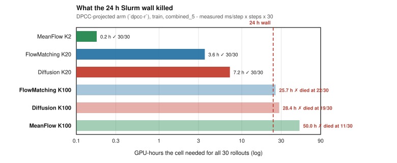

# Visual aligning: a three-stage funnel — distance, then constraints, then time

**Task** `aligning-d3il-visual` (vision) · **Date** 2026-08-29
**Data** `temp/2508/batch_va2_20260823_135156/per_rollout_detail.csv` · **Figures** `make_figs.py`
**Entrants** the three Gen14 `mix_visual_aligning` engines on the matched **UNet FiLM v1** bone, each
at every `K` that exists for it — **`mf` K2/K100 · `fm` K20/K100 · `diffusion aw10` K20/K100** —
plus the **d3il ddpm-vision baseline**. No `af`, no Gen6v4, no Gen7.
**Protocol** seed 6, n = 30 paired contexts per cell, train split unless marked.

> ### How the funnel works
> **Stage 1 · distance** — measured on the **unguided (`diffuser`) arm only**, no projection, so every
> entrant is on one footing: *can the generative model move the box at all?*
> **Stage 2 · constraints** — the projector enters. Of the arms that got near, how many did it legally?
> **Stage 3 · time** — of what is near-and-legal, what does a control step cost?
>
> **An arm leaves the moment it fails a stage.** Nothing that failed Stage 1 is ranked on Stage 2, and
> nothing unscorable at Stage 2 reaches Stage 3.

**Lead metric: `context_final_xy_dist`** — raw box→target XY distance in metres, from the env context
record. 🪤 **`mean_dist_per_rollout` is not used anywhere here**: despite the name it is
`0.5*(pos_dist_3D + rot_err/π)` (`aligning.py:316`), a blend of position and rotation.

---

## The result


| entrant | Stage 1 · unguided | Stage 2 · constraints | Stage 3 · time | |
|---|---|---|---|---|
| **MeanFlow K2** | **0.60×** ✅ | ✅ `dpcc-t` · tightened · **`0-viol` 1.00** | **42 ms** | 🏆 |
| MeanFlow K100 | **0.28×** ✅ | ❌ `dpcc-r` truncated **11/30** — needed **50 h** | — | 24 h wall |
| Diffusion K100 | **0.41×** ✅ | ❌ `dpcc-r` truncated **19/30** — needed **28 h** | — | 24 h wall |
| FlowMatching K100 | 0.95× ❌ | — | — | never engages |
| Diffusion K20 | 0.96× ❌ | — | — | never engages |
| FlowMatching K20 | 0.98× ❌ | — | — | never engages |
| *d3il baseline* | *1.000×* ❌ | *—* | *—* | *never engages* |

# 🏆 One arm crosses all three stages: **MeanFlow at K = 2** — the lowest sampler-step count on the board.

**And the two arms that beat it on raw distance were eliminated by cost, not by quality.** MeanFlow
K100 (0.28×) and Diffusion K100 (0.41×) both clear Stage 1 comfortably, and both die at Stage 2
because their projected cells need **50 h and 28 h** against a **24 h Slurm wall** (§2.3). *The
configurations that get closest to the goal are precisely the ones that cannot be evaluated.*

🔴 **Nothing here supports a sim2real claim.** The task is not solved in simulation — success is
0–2/30 everywhere, the surviving arm still leaves half the gap, rotation is uncontrolled, there is no
held-out split, and the constraint result depends on tightening the geometry. Stated where it bites, in §3.1.

---

## 0. DA (Gen14, cross-epoch) — visual-aligning: does `K` (sampler steps) get the box closer? — with the d3il baseline

*Framing section: why this task is hard enough that the funnel below is the only honest way to read
it. Condensed from
[`logs_in_develop/Gen14/DA_20260826_Gen14_K_sampler_steps_MF_AF_FM_diffusion.md`](../../../logs_in_develop/Gen14/DA_20260826_Gen14_K_sampler_steps_MF_AF_FM_diffusion.md),
which analysed batch `2608`. Every number was recomputed independently on **this** batch and
reproduces it exactly — the two batches re-aggregate the same eval runs.*


**The reference policy does not move the box.** `d3il_baseline_ddpm_encdec_vision`, test split, no
projector: median final distance is **1.000× the starting distance** over 1 080 rollouts and 0.999×
over 2 804 rollouts across 6 seeds. **70 % / 56 % of its rollouts end with the box within 5 mm of
where it started.** On distance it is a no-op.

**`K` does not tune this task — it flips an arm between "engages the box" and "behaves like the
baseline".** Unguided arm, identical checkpoint per pair for MF and FM:

| engine | high K | low K | paired sign / Wilcoxon | verdict |
|---|---|---|---|---|
| **MeanFlow** | **0.28×** (K100, 893 ms) | 0.60× (K2, **28 ms**) | 0.136 / **0.068** | K100 closer — trend only |
| **FlowMatching** | 0.95× (K100, 1 426 ms) | 0.98× (K20, 294 ms) | 0.523 / 0.548 | ⬜ **neither K moves the box** |
| **Diffusion** ⚠️ | **0.41×** (K100, 1 527 ms) | 0.96× (K20, 298 ms) | 0.265 / **0.013** | K100 closer, checkpoint-confounded |

**Two things this fixes for the rest of the report.**

1. **Binary success ranks nothing.** Every cell scores 0–2/30; the gate needs `pos ≤ 1.8 cm` **and**
   `rot ≤ 8.64°`, and rotation ends about as misaligned as it started on every arm and every `K`.
   Success is used as a ranking metric nowhere below.
2. **`K` must be set per engine.** MeanFlow and Diffusion want high K; FlowMatching never leaves the
   no-op band at either setting. That is why every `K` enters the funnel as its own entrant rather
   than being fixed in advance.

⚠️ These are **unguided** numbers — which is exactly what Stage 1 is, and exactly what Stage 1 is
*limited* to. They answer "can the generative model move the box", not "can the controller solve the
task".

---

## 1. Stage 1 — can the generative model move the box?


🔴 **This stage is the `diffuser` arm and nothing else.** No projection, no selection rule, no
tightening — every entrant measured the same way, because a projector cannot rescue a model that
never touches the box, and mixing the two would answer a different question. Projection is Stage 2's
job.

Train split, `combined_5`, n = 30 paired contexts, median start 0.467 m.

| entrant | median final | **fraction of start left** | untouched | ≤ 5 cm | ≤ 15 cm | `ms` | |
|---|---|---|---|---|---|---|---|
| **MeanFlow K100** | **0.139 m** | **0.28×** | 10 % | **10/30** | **16/30** | 893 | ✅ |
| **Diffusion `aw10` K100** ⚠️ | **0.185 m** | **0.41×** | 17 % | 7/30 | 14/30 | 1 527 | ✅ |
| **MeanFlow K2** | **0.235 m** | **0.60×** | **3 %** | 6/30 | 13/30 | **28** | ✅ |
| FlowMatching K100 | 0.400 m | 0.95× | 40 % | 1/30 | 6/30 | 1 426 | ❌ |
| Diffusion `aw10` K20 ⚠️ | 0.414 m | 0.96× | 37 % | 1/30 | 7/30 | 298 | ❌ |
| FlowMatching K20 | 0.373 m | 0.98× | 43 % | 1/30 | 6/30 | 294 | ❌ |
| *d3il baseline* (test, n=1080) | *0.434 m* | *1.000×* | ***70 %*** | *0.1 %* | *0.4 %* | *—* | ❌ |

**Gate: median fraction ≤ 0.80×.** The data splits cleanly — 0.28 / 0.41 / 0.60, then a gap, then
0.95 / 0.96 / 0.98 / 1.000 — so **no entrant sits near the line** and the gate's exact value changes
nothing. (It is set at 0.80, not 0.60: MeanFlow K2 reads 0.602 and an exact-0.60 gate would silently
eliminate it.)

**✅ Three arms advance: MeanFlow K100, Diffusion K100, MeanFlow K2.**
**❌ Four are out, including both FlowMatching arms and the entire diffusion K = 20 configuration** —
they end where they started, with 37–43 % of rollouts never moving the box 5 mm, which is the
baseline's own behaviour. A projector cannot fix that, so they are not carried forward.

⚠️ Note what Stage 1 does *not* say: it ranks generative capability at zero constraint enforcement.
All three survivors violate constraints freely here — `0-viol` is 0.20, 0.27 and 0.33. That is
Stage 2's problem.

---

## 2. Stage 2 — of the arms that move the box, which do it legally?

The projector enters. A rollout counts only if it is **both** within 15 cm **and** zero-violation at
every step (`collision_free_completed`). Arm B = the DPCC projector (`dpcc-{r,c,t}`,
`post_processing`); each survivor is taken at **its own best** of those, chosen on the clean-near
count and named.

### 2.1 The scorable survivor

| entrant | geometry | **projector** | ≤ 15 cm | **≤ 15 cm ∧ clean** | `0-viol` | violating steps |
|---|---|---|---|---|---|---|
| **MeanFlow K2** | **tightened** | **`dpcc-t`** | 10 | **10** | **1.00** | **0.0** |
| *MeanFlow K2* | *`combined_5`* | *`dpcc-t`* | *11* | *7* | *0.27* | *66.2* |

**On the tightened geometry every rollout is clean by construction, and 10 of 30 are inside 15 cm.**
That is the only cell in the batch at `0-viol` = 1.00, and it costs nothing on distance: 0.49× of the
gap left against 0.51× untightened, closer on 16 of the 23 contexts where the two differ (Δ mean
−0.010 m, sign p = 0.093).

### 2.2 🔴 Two survivors cannot be scored at all — the 24 h wall



MeanFlow K100 and Diffusion K100 both cleared Stage 1, and both have a projected cell that **never
finished**:

| entrant | projected cell | n | measured `ms`/step | **h needed for 30** | outcome |
|---|---|---|---|---|---|
| MeanFlow K2 | `dpcc-r` | 30 | 56 | **0.2 h** | ✓ complete |
| FlowMatching K20 | `dpcc-r` | 30 | 1 073 | **3.6 h** | ✓ complete |
| Diffusion K20 | `dpcc-r` | 30 | 2 158 | **7.2 h** | ✓ complete |
| **FlowMatching K100** | `dpcc-r` | **22** | 7 700 | **25.7 h** | ✗ exceeds the wall |
| **Diffusion K100** | `dpcc-r` | **19** | 8 516 | **28.4 h** | ✗ exceeds the wall |
| **MeanFlow K100** | `dpcc-r` | **11** | 14 988 | **50.0 h** | ✗ **2.1× the wall** |

**It is a time limit, and it is arithmetically forced rather than bad luck.** Every sbatch in this
tree runs `#SBATCH --time=24:00:00`; those cells need 25.7 h, 28.4 h and 50.0 h of pure rollout time.
Each died after ≈18 h of arm-B work (22/30 × 25.7 = 18.9 · 19/30 × 28.4 = 18.0 · 11/30 × 50.0 =
18.3) — the same number three times, which is what a shared wall looks like once the cheaper arms in
the same job have taken their ~6 h. (A fourth cell, Diffusion K20 `post_processing` at 9/30, is cheap
alone but was the last variant in a job already ≈21 h deep.)

**The mechanism is named in the config, twice, and the arithmetic matches:**

```python
# config/aligning-d3il-visual.py:1626-1629  (mf plan block)
# 🔴 This ALSO sets the projection budget, which is the expensive half. The sampler
# projects on every step from int((1 - diffusion_timestep_threshold) * K) to the end
# (mf_diffusion.py:284), so at T=0.5:  K=100 -> 50 SLSQP solves per replan,
# K=2 -> 1. That is why the first dpcc-r sweep cost ~15 s/replan and died at 11/30
# rollouts against the 24 h cap (logs_in_develop/Gen14/U5/DA_20260804_*.md §6).
```

"~15 s/replan" against the 14 988 ms/step measured here. **`K` is not only a sampler cost — at
`T = 0.5` it multiplies the SLSQP projection solves per replan, 50× at K = 100 against 1× at K = 2.**
That is the entire 250× spread between the top and bottom rows above, and it is why the two best
Stage-1 arms are the two that could not be projected.

🔴 **These cells support no claim and appear in no ranking.** They are shown because their absence is
the finding: *the closer an arm gets, the less affordable it is to check.*

### 2.3 For the record — the Stage-1 eliminations do have projected cells, and they confirm the elimination

`fm` K20 and `diffusion` K20 were cut at Stage 1, but unlike the K = 100 arms their projected cells
are complete, so the elimination can be audited rather than assumed:

| entrant | best arm-B | fraction left | ≤ 15 cm | **∧ clean** | `0-viol` | `ms` |
|---|---|---|---|---|---|---|
| FlowMatching K20 | `post_processing` | 1.00× | 5 | **1** | 0.13 | 323 |
| FlowMatching K20 | `dpcc-t` *(best selecting rule)* | 1.00× | 5 | **0** | 0.03 | 1 066 |
| Diffusion K20 | `dpcc-r` | 1.00× | 7 | **2** | 0.10 | 2 158 |

**Projection does not rescue them.** All four `fm` projectors and all three `diffusion` projectors
stay at 1.00×; `fm`'s `dpcc-c` cell has `0-viol` = 0.00 — not one clean rollout in 30. Paired against
the surviving arm on the clean-near indicator (exact McNemar):

| comparison | A-only | B-only | p |
|---|---|---|---|
| **MeanFlow K2 (tightened) vs FlowMatching K20 `post_processing`** | **9** | 0 | **0.004** |
| **MeanFlow K2 (tightened) vs Diffusion K20 `dpcc-r`** | **10** | 2 | **0.039** |
| MeanFlow K2 *(matched `combined_5`)* vs FlowMatching K20 | 6 | 0 | 0.031 |
| MeanFlow K2 *(matched `combined_5`)* vs Diffusion K20 | 7 | 2 | 0.180 |

and on distance: −0.154 m vs FlowMatching (sign 0.052 / Wilcoxon **0.004**) and −0.132 m vs Diffusion
(**0.029** / **0.012**). Matched on geometry the margins shrink but hold on distance (**0.029**/0.001
and **0.029**/0.012), while the diffusion clean-near comparison stops resolving.

⚠️ **Geometry is not matched at the top of §2.1.** `cand9` and `cand11` have no tightened cell, so
`0-viol` = 1.00 is **uncontested, not won**. The italic matched rows are the conservative reading and
are the ones to quote if challenged.

---

## 3. Stage 3 — what does the surviving configuration cost?


`avg_time_ms` = wall-clock ms per control step: one plan (K net calls × MPC fan 4) plus the
projection solve. Same node, same batch, so the ratios are not hardware artefacts.

| | clean & <15 cm | `0-viol` | `ms` | vs the survivor |
|---|---|---|---|---|
| **🏆 MeanFlow K2 · tightened · `dpcc-t`** | **10/30** | **1.00** | **42** | — |
| *MeanFlow K2 · `combined_5` · `dpcc-t`* | *7/30* | *0.27* | *53* | *1.3×* |
| FlowMatching K20 · `post_processing` | 1/30 | 0.13 | 323 | **8×** |
| FlowMatching K20 · `dpcc-t` | 0/30 | 0.03 | 1 066 | **25×** |
| Diffusion K20 · `dpcc-r` | 2/30 | 0.10 | 2 158 | **51×** |
| *Diffusion K100 · `dpcc-r`* † | *unscorable* | *—* | *8 516* | *203×* |
| *MeanFlow K100 · `dpcc-r`* † | *unscorable* | *—* | *14 988* | *357×* |

† Stage-2 casualties (§2.2), shown for the cost axis only.

**The survivor is also the cheapest thing on the board, by 8–357×.** There is no trade-off to argue
about on this task: the arms that cost more are not buying anything with it, and the two that *were*
buying something (the K = 100 pair) cost so much they could not be measured.

### 3.1 🔴 What Stage 3 does *not* license: sim2real

Timing is the *weakest* of the reasons this batch cannot support a transfer claim.

1. **The task is not solved in simulation.** Success is 0–2/30 on every cell; the surviving arm still
   leaves **49 % of the starting gap** and 30 % of its rollouts never move the box 5 mm.
2. **Rotation is uncontrolled** (§0). Aligning is a *pose* task, the gate needs `pos ≤ 1.8 cm` **and**
   `rot ≤ 8.64°`, and median final rotation error runs 32–62° with a final/initial ratio ≈ 1.00× on
   every arm. This report measures position only.
3. **No held-out evaluation exists.** All entrants are train-split; the only test-split row is the
   baseline. A policy never shown to generalise *in simulation* has no basis for transfer.
4. **The constraint result is bought by shrinking the problem.** `0-viol` = 1.00 needs
   `combined_5-tightened` — obstacles inflated before projection. That margin is spent on modelling
   error we already know about; real-world error is on top of it, and what is left is not measured.
5. **Timing, where it is decisive.** 42 ms ≈ **24 Hz** is plausible on paper — but on an A100-class
   GPU plus a CPU SLSQP solve, not an embedded target. The eliminated arms run at 323 ms (3 Hz),
   2 158 ms (0.46 Hz), and the two that got *closest* at 15 s/step — **0.07 Hz**, three to four orders
   from any manipulation loop.
6. **One seed, one checkpoint per engine**, and four truncated cells.

**Do not quote 42 ms as a "real-time pass":** it is a cluster measurement including rendering and a
CPU NLP, against no agreed latency budget. What it *does* establish is an ordering — the surviving
arm is within an order of magnitude of a real controller and the rest are not within three.

---

## 4. HardFlow (in-loop IPOPT NLP) vs the DPCC projector


Arm C replaces DPCC's projection with an in-loop nonlinear program solved by IPOPT (the legacy
backend; the SLSQP swap landed later and is not in this batch). It is opt-in
(`config/visual_aligning_eval.yaml:433 hardflow_variants: []`), **present on the surviving arm only**,
and refused by design for the diffusion engine — a DDPM reverse chain has no velocity field to
integrate. It is therefore **kept out of the funnel**: racing one arm with a projector nobody else has
is not like-for-like. It gets its own question here. All 6 cells are paired: same checkpoint, same
geometry, same rule, same 30 contexts.

| geometry | rule | DPCC clean&<15 / `0-viol` / `ms` | HardFlow clean&<15 / `0-viol` / `ms` | McNemar p | dist sign / Wilcoxon | cost |
|---|---|---|---|---|---|---|
| **`combined_5`** | `-r` | **6** / 0.37 / 56 | 4 / 0.27 / 182 | 0.688 | 0.458 / 0.974 | 3.3× |
| | `-c` | 4 / 0.23 / 57 | **6** / 0.27 / 194 | 0.754 | 0.832 / 0.408 | 3.4× |
| | `-t` | 7 / 0.27 / 53 | **9** / **0.50** / 175 | 0.688 | 1.000 / 0.330 | 3.3× |
| **tightened** | `-r` | 10 / 0.90 / 42 | **11** / 0.93 / 147 | 1.000 | 1.000 / 0.855 | 3.5× |
| | `-c` | 6 / 0.73 / 55 | **11** / 0.87 / 148 | 0.062 | **0.004** / **0.007** | 2.7× |
| | `-t` | 10 / **1.00** / **42** | **12** / 0.97 / 146 | 0.688 | 0.052 / 0.291 | 3.4× |

### Verdict: it rescues the weak selection rules, and does not earn its price against the good one.

1. **Directionally HardFlow leads 5 of 6 cells** on clean-near — but **not one clears p = 0.05** on
   that metric (closest 0.062).
2. **The one significant result is a weak-rule rescue.** Tightened `-c`: 6 → 11 clean-near, distance
   sign p = 0.004 / Wilcoxon 0.007. `dpcc-c` is a projector you would deploy only by accident.
3. **Against `dpcc-t` — the survivor's own rule — it does not win.** Untightened, nothing resolves.
   Tightened, the only sign test near 0.05 (0.052) runs **against** HardFlow.
4. **It never reaches the number that matters, at 3.4× the price.** `dpcc-t` + tightening hits
   `0-viol` = 1.00 at 42 ms; HardFlow's best across all six cells is 0.97 at 146 ms. Cost is a flat
   2.7–3.5× with no cell cheaper.

**What this is not.** The benchmark hierarchy asks HardFlow to beat the DPCC projector *at a lower
projection threshold* — that sweep has never been run here, so this answers only the at-parity
question. IPOPT is the legacy backend, and arm C's fan is pinned to 4 to match arms A/B, so nothing
above is an upstream-faithful HardFlow. With one arm carrying arm C, **n = 1 model**: the 5-of-6 lead
is one checkpoint's worth of evidence, not a trend.

---

## 5. Limits

- **🔴 No test-split coverage among the entrants.** All six are train-split; the only test-split row is
  the d3il baseline. **Nothing here demonstrates generalisation** (§3.1, blocker 3).
- **🔴 The two best Stage-1 arms were never projected** (§2.2). MeanFlow K100 is closer unguided
  (0.28×) than the survivor manages *with* projection (0.49×). The result could move if they were
  scored.
- **🔴 Geometry is not matched at §2.1.** `cand9`/`cand11` have no tightened cell, so `0-viol` = 1.00 is
  uncontested, not won. The matched rows are the conservative reading.
- **Four truncated cells**, all in the projected arm, three arithmetically unable to finish (§2.2).
- **Single seed (6)**, one checkpoint per engine. Strictly, "this MeanFlow checkpoint beats this
  FlowMatching checkpoint". Pairing over 30 shared contexts is what gives the tests their power.
- **Final distance, not closest approach.** A rollout that arrived and drifted off scores as a miss.
- **Rotation is uncontrolled on every arm** (§0) — position only here, while the task's gate needs both.
- **The Diffusion K100 / K20 pair is checkpoint-confounded** (§0); the MF and FM pairs are clean
  inference-only contrasts.
- **30-rollout counts carry ±~9 pp** at the 30 % level. One- or two-rollout differences are noise.

## 6. Work order

- **(a)** 🔑 **Project the K = 100 arms** — the only thing that could change the result. But **not by
  resubmitting unchanged**: at `T = 0.5` a K = 100 cell needs 50 SLSQP solves per replan (§2.2), so it
  burns another 24 h and truncates again. Raise the wall past 50 h, split one variant per job, or cut
  `diffusion_timestep_threshold`.
- **(b)** 🔑 Run every entrant on the **test** split. Without it there is no generalisation claim.
- **(c)** Run `cand9`/`cand11` on `combined_5-tightened`, so `0-viol` = 1.00 is contested.
- **(d)** Diagnose `cand11`: a K = 20 flow-matching arm at 1.00× on all four projectors with 43 %
  untouched is a bug report, not a baseline.
- **(e)** HardFlow threshold sweep (§4), plus a second arm carrying arm C so it is not n = 1.
- **(f)** Export per-step XY distance so "reached and drifted" separates from "never arrived".

## 7. Reproduce

```bash
python3 make_figs.py [<batch_dir>]   # regenerates fig1-fig6 from per_rollout_detail.csv; stdlib only
```

`ENTRANTS` and `STAGE1_GATE` in `make_figs.py` define the funnel; Stage 1 reads the `diffuser` cell
only. `wall_hours()` builds §2.2's table from the same CSV — measured `avg_time_ms` × `n_steps` × 30 —
so "hours needed" is not an estimate from job logs.

Companions: whole-env cell-by-cell status
[`../SNAPSHOT_20260823_visual_aligning_env_status.md`](../SNAPSHOT_20260823_visual_aligning_env_status.md) ·
K sweep [`../DA_20260826_K_sampler_steps_visual_aligning.md`](../DA_20260826_K_sampler_steps_visual_aligning.md) ·
arm B vs arm C [`../../../logs_in_develop/Gen14/U7/DA_20260823_hardflow_vs_dpcc_visual_aligning.md`](../../../logs_in_develop/Gen14/U7/DA_20260823_hardflow_vs_dpcc_visual_aligning.md).

Statistics are pure Python (no SciPy in this container): exact two-sided sign test, exact McNemar,
Wilcoxon signed-rank by tie-corrected normal approximation. `K` semantics from
`config/aligning-d3il-visual.py:898-946`; success gate from `aligning.py:198-199,344-345`;
`mean_dist_per_rollout` from `aligning.py:316`.
