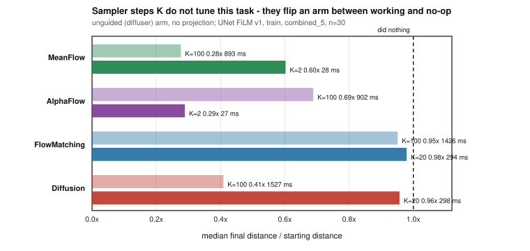
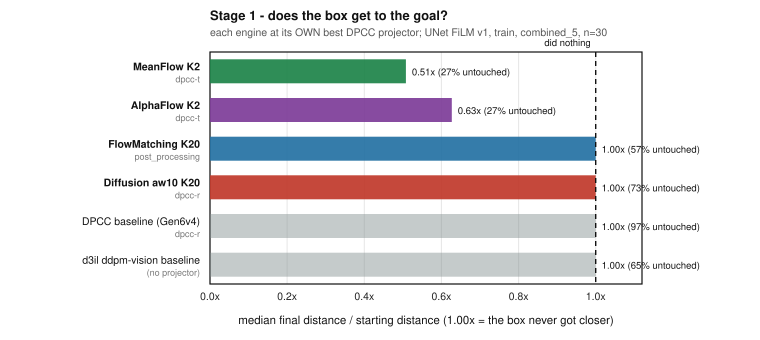
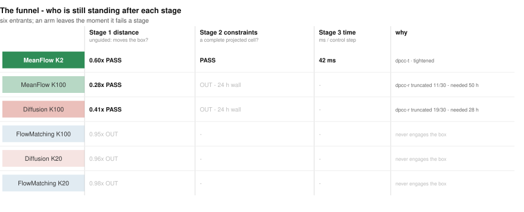
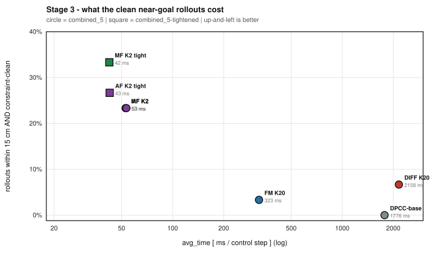
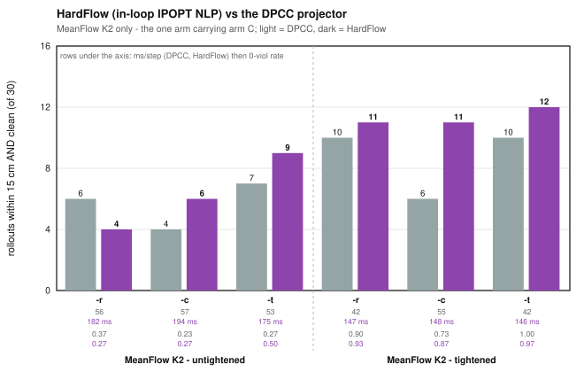

# Visual aligning: one funnel, four engines — who actually gets the box to the goal, legally, and at what cost

**Task** `aligning-d3il-visual` (vision) · **Date** 2026-08-29
**Data** `temp/2508/batch_va2_20260823_135156/per_rollout_detail.csv` · **Figures** `make_figs.py`
**Protocol** seed 6, n = 30 paired contexts per cell, train split unless marked. Every cell is
`(model × projector × geometry × split)`; nothing is averaged across projectors.

**Lead metric: `context_final_xy_dist`** — raw box→target XY distance in metres, straight from the
env context record.
🪤 **`mean_dist_per_rollout` is not used anywhere in this report.** Despite the name it is
`0.5*(pos_dist_3D + rot_err/π)` (`aligning.py:316`) — a blend of position and rotation. Distance
claims built on it are contaminated by the angle term.

---

## The chain, in one table

Each engine at its **own best DPCC projector**, chosen on the constraint-clean near-goal tail and
named in every row. Matched backbone (UNet FiLM v1, 4.04 M), matched geometry, matched contexts.

| | Stage 1 · **gets there** | Stage 2 · **legally** | Stage 3 · **cost** |
|---|---|---|---|
| **MeanFlow K2** `dpcc-t` | 0.51× of the gap left | **7/30** clean & <15 cm | **53 ms** |
| **AlphaFlow K2** `dpcc-t` | 0.63× | **7/30** | **53 ms** |
| FlowMatching K20 `post_processing` | 1.00× — *no-op* | 1/30 | 323 ms |
| FlowMatching K20 `dpcc-t` *(selecting rule)* | 1.00× — *no-op* | 0/30 | 1 066 ms |
| Diffusion K20 `dpcc-r` (DPCC engine) | 1.00× — *no-op* | 2/30 | 2 158 ms |
| *Gen6v4 in-repo DPCC baseline* (test) | *1.00× · 97 % untouched* | *0/30* | *1 776 ms* |
| *d3il ddpm-vision baseline* (test, n=1080) | *1.000× · 70 % untouched* | *—* | *—* |

**The result:** on the matched-backbone train pool the two low-K engines are the only arms that move
the box at all under projection, they are the only arms that produce constraint-clean near-goal
rollouts in numbers, and they do it **6–41× cheaper** than the K = 20 engines. Tightening the geometry
then takes MeanFlow to **zero constraint violations on all 30 rollouts at 42 ms**, keeping 10 of them
inside 15 cm.

⚠️ **One honest exception, stated up front:** Gen7's own FM checkpoint (`cand4`, UNet v1 K20) *does*
work — on the **held-out test split** it reaches 10/30 clean & <15 cm at 1 126 ms (§1.3). The "FM is a
no-op" finding is about the **Gen14 `mix` FM arm** (`cand11`), not about flow matching as such.

---

## 0. DA (Gen14, cross-epoch) — visual-aligning: does `K` (sampler steps) get the box closer? — with the d3il baseline

*Framing section: why this task is hard enough that the funnel below is the only honest way to read it.
Condensed from [`logs_in_develop/Gen14/DA_20260826_Gen14_K_sampler_steps_MF_AF_FM_diffusion.md`](../../../logs_in_develop/Gen14/DA_20260826_Gen14_K_sampler_steps_MF_AF_FM_diffusion.md),
which analysed batch `2608`. Every number below was recomputed independently on **this** batch and
reproduces it exactly — the two batches re-aggregate the same eval runs.*



**The reference policy does not move the box.** `d3il_baseline_ddpm_encdec_vision`, test split, no
projector: median final distance is **1.000× the starting distance** over 1 080 rollouts, and 0.999×
over 2 804 rollouts across 6 seeds. **70 % / 56 % of its rollouts end with the box within 5 mm of where
it started** — never meaningfully contacted. On distance it is a no-op.

**`K` does not tune this task — it flips an arm between "engages the box" and "behaves like the
baseline".** Unguided arm, no projection, identical checkpoint per pair (inference-only contrast for
MF/AF/FM):

| engine | high K | low K | paired sign / Wilcoxon | verdict |
|---|---|---|---|---|
| **MeanFlow** | **0.28×** (K100, 893 ms) | 0.60× (K2, **28 ms**) | 0.136 / **0.068** | K100 closer — trend only |
| **AlphaFlow** | 0.69× (K100, 902 ms) | **0.29×** (K2, **27 ms**) | **0.008** / **0.031** | 🔴 **reversed** — low K wins |
| **FlowMatching** | 0.95× (K100) | 0.98× (K20) | 0.523 / 0.548 | ⬜ neither K moves the box |
| **Diffusion** ⚠️ | **0.41×** (K100) | 0.96× (K20) | 0.265 / **0.013** | K100 closer, checkpoint-confounded |

**Three things this section fixes for the rest of the report.**

1. **Binary success ranks nothing.** Every cell scores 0–2/30; the gate needs `pos ≤ 1.8 cm` **and**
   `rot ≤ 8.64°`, and rotation ends about as misaligned as it started on every arm (median final/initial
   ≈ 1.00×). Success is not used as a ranking metric anywhere below.
2. **There is no "tune K and win".** MeanFlow and Diffusion want high K; AlphaFlow and FlowMatching want
   low K. `K` must be set per engine, and AlphaFlow's inversion — 50× more Euler steps landing *further*
   from the target on 22/30 rollouts — is a red flag on the sampler, not a result.
3. **The cheap arms are not the weak arms.** AlphaFlow K2 (27 ms) ties MeanFlow K100 (893 ms) on median
   distance, 0.29× vs 0.28×. That is what makes the cost axis in §3 worth measuring.

⚠️ These are **unguided** numbers — no constraint projection at all, so they answer "can the generative
model move the box", not "can the controller solve the task". The funnel starts now.

---

## 1. Stage 1 — does the box get to the goal?



Matched backbone (UNet FiLM v1), train split, `combined_5`, n = 30 paired contexts, median start
0.467 m. Each engine at its own best arm-B projector; all four of that engine's projectors are in §1.2.

| engine | K | **projector** | median final | **fraction of start left** | untouched | ≤ 5 cm | **≤ 15 cm** |
|---|---|---|---|---|---|---|---|
| **MeanFlow** | 2 | `dpcc-t` | **0.193 m** | **0.51×** | 27 % | 4/30 | **11/30** |
| **AlphaFlow** | 2 | `dpcc-t` | **0.264 m** | **0.63×** | 27 % | 2/30 | **9/30** |
| FlowMatching | 20 | `post_processing` | 0.440 m | 1.00× | 57 % | 0/30 | 5/30 |
| FlowMatching | 20 | `dpcc-t` | 0.430 m | 1.00× | 63 % | 0/30 | 5/30 |
| Diffusion `aw10` | 20 | `dpcc-r` | 0.438 m | 1.00× | 73 % | 2/30 | 7/30 |
| *Gen6v4 DPCC baseline* | *20* | *`dpcc-r`* | *0.434 m* | *1.00×* | ***97 %*** | *0/30* | *0/30* |

**Read the fraction column.** 1.00× means the typical rollout ends exactly as far from the target as it
began. **Three of the four projected K = 20 rows, and the in-repo DPCC baseline, are at 1.00×** — under
the projector they do not move the box. The two low-K engines remove 37–49 % of the gap.

Paired over the same 30 contexts (exact sign test / Wilcoxon signed-rank):

| comparison | Δ mean | closer on | sign | Wilcoxon |
|---|---|---|---|---|
| **MeanFlow K2 `dpcc-t` vs FlowMatching K20 `dpcc-t`** | **−0.136 m** | 21/27 | **0.006** | **0.002** |
| **MeanFlow K2 `dpcc-t` vs Diffusion K20 `dpcc-r`** | **−0.122 m** | 19/26 | **0.029** | **0.012** |
| **AlphaFlow K2 `dpcc-t` vs FlowMatching K20 `dpcc-t`** | **−0.101 m** | 22/29 | **0.008** | **0.005** |
| AlphaFlow K2 `dpcc-t` vs Diffusion K20 `dpcc-r` | −0.086 m | 18/29 | 0.265 | 0.103 |
| MeanFlow K2 vs AlphaFlow K2 (both `dpcc-t`) | −0.036 m | 19/29 | 0.136 | 0.393 |

**✅ Stage 1 passes for MeanFlow and AlphaFlow.** Three of the four cross-engine tests clear 0.05 on both
tests; the fourth (AlphaFlow vs Diffusion) is directional only. **MeanFlow and AlphaFlow are not
separable from each other** on this axis — treat them as one result, not a ranking.

### 1.2 All four projectors, median fraction of start left

Nothing is hidden behind the best-projector choice: no `fm`/`diffusion` cell reaches 0.95×.

| engine | `dpcc-r` | `dpcc-c` | `dpcc-t` | `post_processing` |
|---|---|---|---|---|
| **MeanFlow K2** | **0.44×** | 0.72× | **0.51×** | **0.44×** |
| **AlphaFlow K2** | 0.61× | 0.67× | **0.63×** | 0.61× |
| FlowMatching K20 | 1.00× | 1.00× | 1.00× | 1.00× |
| Diffusion K20 | 1.00× | 1.00× | 1.00× | *(no cell)* |

### 1.3 ⚠️ The exception — Gen7's FM checkpoint, on the held-out split

`cand4` (Gen7 `fm_visual_aligning`, UNet FiLM v1, K = 20) is the only arm in this batch verified on the
**test** split, and it works: median 0.149–0.220 m, **0.33–0.50× of the gap left**, 13–15 of 30 rollouts
within 15 cm. It is the strongest evidence in the batch that this task is solvable at all — and it says
the §1 no-op finding belongs to the **Gen14 `mix` FM arm** (`cand11`), not to flow matching. Why the two
FM checkpoints diverge this far is unresolved and is the first thing to chase.

---

## 2. Stage 2 — of the rollouts that got near, how many were legal?



Being near the goal is worthless if the box was pushed through an obstacle to get there. Stage 2 keeps
only rollouts that are **both** within 15 cm **and** zero-violation at every step
(`collision_free_completed`).

| engine | geometry | **projector** | ≤ 15 cm | **≤ 15 cm ∧ clean** | `0-viol` | mean violating steps |
|---|---|---|---|---|---|---|
| **MeanFlow K2** | `combined_5` | `dpcc-t` | 11 | **7** | 0.27 | 66.2 |
| **MeanFlow K2** | **tightened** | `dpcc-t` | 10 | **10** | **1.00** | **0.0** |
| **AlphaFlow K2** | `combined_5` | `dpcc-t` | 9 | **7** | 0.40 | 60.0 |
| **AlphaFlow K2** | **tightened** | `dpcc-t` | 8 | **8** | 0.93 | 1.1 |
| FlowMatching K20 | `combined_5` | `post_processing` | 5 | 1 | 0.13 | 129.1 |
| FlowMatching K20 | `combined_5` | `dpcc-t` | 5 | **0** | 0.03 | 128.6 |
| Diffusion K20 | `combined_5` | `dpcc-r` | 7 | 2 | 0.10 | 131.4 |
| *Gen6v4 DPCC baseline* | *`combined_5`* | *`dpcc-r`* | *0* | ***0*** | *0.00* | *122.1* |

Paired per context (exact McNemar on the clean-near indicator):

| comparison | A-only | B-only | p |
|---|---|---|---|
| **MeanFlow `dpcc-t` vs FlowMatching `dpcc-t`** | **7** | 0 | **0.016** |
| **MeanFlow `dpcc-t` vs FlowMatching `post_processing`** | **6** | 0 | **0.031** |
| MeanFlow `dpcc-t` vs Diffusion `dpcc-r` | 7 | 2 | 0.180 |
| AlphaFlow `dpcc-t` vs FlowMatching `post_processing` | 7 | 1 | 0.070 |

**✅ Stage 2 passes, and the constraint filter costs the low-K engines almost nothing while it wipes out
the high-K ones.** MeanFlow keeps 7 of 11 near-goal rollouts, AlphaFlow 7 of 9; FlowMatching keeps 0 of
5 under its best selecting projector and Diffusion 2 of 7. The in-repo DPCC baseline has **no rollout at
all that is both near and clean**, and its `dpcc-r`/`dpcc-c` cells have `0-viol` = 0.00 — not one clean
rollout in 30.

**Tightening the geometry is the operating point.** It is only available for the low-K arms in this
batch. On MeanFlow it takes `dpcc-t` to **`0-viol` = 1.00 — every rollout clean, zero violating steps —
while keeping 10 of 30 inside 15 cm** at no distance cost: 0.49× of the gap left against 0.51×
untightened, and closer than the untightened cell on 16 of the 23 contexts where they differ
(Δ mean −0.010 m, sign p = 0.093). That is the single strongest cell in the batch on the train pool. Tightening is not free elsewhere: on AlphaFlow it costs
one near-goal rollout (9 → 8) for `0-viol` 0.40 → 0.93.

⚠️ **This is where the comparison stops being geometry-matched.** `cand9`/`cand11` have no tightened
cells, so the `0-viol` = 1.00 result cannot be contested by the K = 20 engines — running them tightened
is work item (a).

---

## 3. Stage 3 — what does a clean near-goal rollout cost?



`avg_time_ms` = wall-clock ms per control step: one plan (K net calls × MPC fan 4) plus the projection
solve. Same node, same batch, so the ratios are not hardware artefacts.

**Geometry-matched (`combined_5`, both sides untightened) — the defensible comparison:**

| | clean & <15 cm | `ms` | **speedup** |
|---|---|---|---|
| **MeanFlow K2 `dpcc-t`** | **7/30** | **53** | — |
| **AlphaFlow K2 `dpcc-t`** | **7/30** | **53** | — |
| FlowMatching K20 `post_processing` | 1/30 | 323 | **6×** |
| FlowMatching K20 `dpcc-t` | 0/30 | 1 066 | **20×** |
| Diffusion K20 `dpcc-r` | 2/30 | 2 158 | **41×** |

**At each side's own operating point (MeanFlow tightened — split/geometry mismatched, see caveats):**

| | clean & <15 cm | `0-viol` | `ms` | **speedup** |
|---|---|---|---|---|
| **MeanFlow K2 `dpcc-t`, tightened** | **10/30** | **1.00** | **42** | — |
| Diffusion K20 `dpcc-r`, `combined_5` | 2/30 | 0.10 | 2 158 | **51×** |
| *Gen6v4 DPCC baseline, test split* | *0/30* | *0.00* | *1 776* | ***42×*** |
| *Gen7 FM K20 `dpcc-t`, **test** split* | *10/30* | *0.43* | *1 126* | *27×* |

**✅ Stage 3 passes and it is the widest margin in the report.** The cost gap is structural, not tuned:
K = 2 is two network evaluations against 20 (`post_processing` is cheap only because it skips MPC
selection entirely, and it still yields 1 clean near-goal rollout against MeanFlow's 7), and the DPCC projector's NLP solve is the same on both
sides. **MeanFlow at 42 ms delivers strictly more clean near-goal rollouts than the DPCC baseline at
1 776 ms delivers at any setting — 10 versus 0.**

The last row is the one to keep honest about: Gen7's FM matches MeanFlow's clean-near count on the
**held-out** split, at **27× the cost**. Cost is the axis where the claim is safest; the count is the
axis where the split mismatch bites.

---

## 4. HardFlow (in-loop IPOPT NLP) vs the DPCC projector — does the hard solver earn its price?



Arm C replaces DPCC's projection with an in-loop nonlinear program solved by IPOPT (the legacy backend;
the SLSQP swap landed later and is not in this batch). It is opt-in
(`config/visual_aligning_eval.yaml:433 hardflow_variants: []`), available on `cand6` and `cand14` only,
and refused by design for the diffusion engine — a DDPM reverse chain has no velocity field to integrate.
**Arm B and arm C are never mixed into one row.** All 12 cells are paired: same checkpoint, same
geometry, same selection rule, same 30 contexts.

| model · geometry | rule | DPCC clean&<15 / `0-viol` / `ms` | HardFlow clean&<15 / `0-viol` / `ms` | McNemar p | cost |
|---|---|---|---|---|---|
| **MeanFlow · `combined_5`** | `-r` | 6 / 0.37 / 56 | 4 / 0.27 / 182 | 0.688 | 3.3× |
| | `-c` | 4 / 0.23 / 57 | **6** / 0.27 / 194 | 0.754 | 3.4× |
| | `-t` | 7 / 0.27 / 53 | **9** / **0.50** / 175 | 0.688 | 3.3× |
| **MeanFlow · tightened** | `-r` | 10 / 0.90 / 42 | **11** / 0.93 / 147 | 1.000 | 3.5× |
| | `-c` | 6 / 0.73 / 55 | **11** / 0.87 / 148 | 0.062 | 2.7× |
| | `-t` | 10 / **1.00** / **42** | **12** / 0.97 / 146 | 0.688 | 3.4× |
| **AlphaFlow · `combined_5`** | `-r` | 5 / 0.37 / 53 | **9** / 0.53 / 178 | 0.125 | 3.4× |
| | `-c` | 2 / 0.17 / 55 | **4** / 0.33 / 192 | 0.625 | 3.5× |
| | `-t` | **7** / 0.40 / 53 | 3 / 0.30 / 186 | 0.219 | 3.5× |
| **AlphaFlow · tightened** | `-r` | 6 / 0.80 / 49 | **9** / 0.90 / 154 | 0.250 | 3.2× |
| | `-c` | **7** / 0.73 / 49 | 6 / 0.83 / 159 | 1.000 | 3.2× |
| | `-t` | **8** / **0.93** / 43 | 5 / 0.87 / 156 | 0.375 | 3.7× |

### ❌ Verdict: no. On a task this hard the extra solver does not buy a result.

1. **Not one of the 12 paired comparisons clears p = 0.05** — on the clean-near count (McNemar, above) or
   on distance (sign / Wilcoxon; the single exception is MeanFlow-tightened `-c`, p = 0.004 on distance,
   which is the weak-rule rescue in point 3). Directionally HardFlow leads on 8 of the 12 cells and trails on 4.
2. **It costs a flat 2.7–3.7× on every single cell**, with no cell where it is cheaper. Against §3's
   20–51× engine margin, this is spending a third of the budget for a difference no test can resolve.
3. **What it actually does is rescue DPCC's weak selection rules.** HardFlow's largest gains are all on
   `-c` and `-r` (MeanFlow-tightened `-c`: 6 → 11; AlphaFlow untightened `-r`: 5 → 9). Against
   `dpcc-t` — the rule you would deploy — it splits 2–2 and is *worse* on both AlphaFlow blocks.
4. **It never reaches the number that matters.** `dpcc-t` + tightening hits **`0-viol` = 1.00 at 42 ms**.
   HardFlow's best across all 12 cells is 0.97, at 146 ms.

**What this is not.** The benchmark hierarchy asks HardFlow to beat the DPCC projector *at a lower
projection threshold* — the threshold sweep that would test that has never been run on this task, so
this section answers only the at-parity question. Also: IPOPT here is the legacy backend, and arm C's
candidate fan is pinned to 4 to match arms A/B, so nothing below is an upstream-faithful HardFlow.

---

## 5. Limits

- **Single seed (6)** on every cell. Pairing over 30 shared contexts is what gives these tests their
  power; nothing here is a multi-seed result.
- **Split mismatch.** The two engines that win (MeanFlow, AlphaFlow) have **no test-split cells**. Every
  headline number in §1–§3 is train-split against a train-split high-K arm; the baselines in the italic
  rows are test-split. Generalisation is demonstrated for `cand4` alone (§1.3).
- **Geometry mismatch.** `cand9`/`cand11` have no tightened cells, so the `0-viol` = 1.00 operating point
  is uncontested rather than won.
- **Final distance, not closest approach.** A rollout that arrived and drifted off scores as a miss. The
  per-step curve exists on the cluster but is the blended `mean_distance`; true minimum XY distance is
  recorded nowhere.
- **Rotation is uncontrolled on every arm** (§0) — this report measures position only, and the task's own
  success gate needs both.
- **The Diffusion K100 / K20 pair is checkpoint-confounded** (§0); the MF/AF/FM pairs are clean
  inference-only contrasts.
- **30-rollout counts carry ±~9 pp** at the 30 % level. Differences of one or two rollouts are noise.

## 6. Work order

- **(a)** Run `cand9`/`cand11` on `combined_5-tightened`. Until then §2's best cell is uncontested, not won.
- **(b)** Run MeanFlow K2 and AlphaFlow K2 on the **test** split. This is the biggest hole in the report.
- **(c)** Resolve the two FM checkpoints (§1.3): Gen7 `cand4` works, Gen14 `cand11` is a no-op, same
  engine and same backbone family.
- **(d)** HardFlow threshold sweep — the comparison the hierarchy actually asks for (§4).
- **(e)** Export per-step XY distance so "reached and drifted" separates from "never arrived".

## 7. Reproduce

```bash
python3 make_figs.py [<batch_dir>]   # regenerates fig1-fig5 from per_rollout_detail.csv; stdlib only
```

Companions: whole-env cell-by-cell status
[`../SNAPSHOT_20260823_visual_aligning_env_status.md`](../SNAPSHOT_20260823_visual_aligning_env_status.md) ·
K sweep [`../DA_20260826_K_sampler_steps_visual_aligning.md`](../DA_20260826_K_sampler_steps_visual_aligning.md) ·
arm B vs arm C [`../../../logs_in_develop/Gen14/U7/DA_20260823_hardflow_vs_dpcc_visual_aligning.md`](../../../logs_in_develop/Gen14/U7/DA_20260823_hardflow_vs_dpcc_visual_aligning.md) ·
DiT vs U-Net [`../../../logs_in_develop/Gen14/U8/DA_20260823_Gen14_U8_mf_dit_visual_aligning.md`](../../../logs_in_develop/Gen14/U8/DA_20260823_Gen14_U8_mf_dit_visual_aligning.md).

Statistics are pure Python (no SciPy in this container): exact two-sided sign test, exact McNemar,
Wilcoxon signed-rank by tie-corrected normal approximation. `K` semantics from
`config/aligning-d3il-visual.py:898-946`; success gate from `aligning.py:198-199,344-345`;
`mean_dist_per_rollout` from `aligning.py:316`.
