# α-Flow-UNet for constrained predictive control: the bootstrapped target, actually switched on

**Task** avoiding-d3il (state-based) · **Constraint** halfspace · **Date** 2026-09-03
**Data** `temp/0309/batch_avoiding_combined_20260903_133730/` · **Figures** from `make_figs.py`
**Protocol** every number below is **seed 6, `n_trials = 20`** (20 episodes per cell) — one uniform
tier (§2). The single-seed limitation is quantified in §10.

**Source analysis:** [`DA 2026-09-03 — With α actually ON, does α-Flow beat MeanFlow on the U-Net?`](../../../logs_in_develop/Gen3v7_AlphaFlow/DA/DA_20260903_AF_UNet_alphaflow_ENABLED_seed6_diffuser.md)

---

## 0. Candidate index

Runs are named by a **panel tag** — engine letter, K, selection rule. `A1t` = α-Flow `α→0.2`, K = 1,
`dpcc-t-tightened`. Source: `candidates_multidimensional_raw.csv`, seed 6 rows only.

| tag | engine | eval folder | checkpoint folder |
|---|---|---|---|
| `A*` | **α-Flow `α→0.2` — the headline run** | `H8_K*_Meuler_T0.5_A0.5_B4_D…AlphaFlowODE_msgafon02_s6` | `…AlphaFlowODE_aw10_bbunet_tslogit_normal_ai1.0_`**`ae0.2`**`_ag25.0_rf0.5` |
| `a*` | α-Flow `α→0.05` — the low-floor arm | `…_msgafon005_s6` | `…_`**`ae0.05`**`_ag25.0_rf0.5` |
| `M*` | MeanFlow-UNet | `H8_K*_Meuler_T0.5_A0.5_B1_D…MeanFlowODE_msg20trials` | `…MeanFlowODE_aw10_objmeanflow_bbunet_tslogit_normal_dp0.5` |
| `F*` | naive Flow Matching | `H8_K*_Meuler_T0.5_D…FlowMatchingODE_msg20trials` | `…FlowMatchingODE_a1.5_b1.0_aw10` |
| `D20` | **DPCC diffusion K20 — the baseline** | `H8_K20_T0.5_Dmodels.GaussianDiffusion_msg20trials` | `H8_K20_Dmodels.GaussianDiffusion_aw10` |

Trailing letter = **selection rule**: `c` = `dpcc-c-tightened` (minimum projection cost),
`t` = `dpcc-t-tightened` (temporal consistency). The same candidate appears under both.

*One naming note that is **not** a configuration difference.* The `B` token in an eval folder is
`hf_batch_size` (`config/avoiding-d3il.py:202`) — the **HardFlow** candidate fan, which no arm in
this report uses. The MPC fan that `diffuser` and `dpcc-*` actually consume is `batch_size`, which
is **not** a folder token (`config/avoiding-d3il.py:67`) and was **4 for every run here**. `B4` vs
`B1` therefore does not affect a single number in §3–§7. It does void the `hardflow_*` arms, which
is why they are excluded throughout (§9).

---

## 1. Summary

**α-Flow's bootstrapped target had never trained a deployed weight in this project.** `af_alpha_end`
defaulted to 0, α annealed to exactly zero, and `af_diffusion.py:552` routes `α ≤ 0` into MeanFlow's
JVP body — every "α-Flow" checkpoint evaluated before this report was a MeanFlow model
(`train/discrete_frac = 0.0`). The `AF_ALPHA_END` floor keeps the bootstrap live to the last step;
here `discrete_frac ≈ 0.5` throughout training (§2.2).

With the objective actually running, on the **architecture-matched** 4.0 M U-Net:

- **`top-left-hard`, K = 1, `dpcc-t-tightened`, all at S&C 1.00** — the cleanest cell in the study:

  | | steps | s/ep | vs DPCC K20 |
  |---|---:|---:|---:|
  | **α-Flow `α→0.2`** | **57.20** | **1.07** | **33.3× cheaper** |
  | α-Flow `α→0.05` | 58.20 | 1.09 | 32.7× |
  | MeanFlow-UNet | 60.75 | 1.13 | 31.6× |
  | naive FM | 65.65 | 1.31 | 27.2× |
  | DPCC K20 (`dpcc-c-tightened`) | 61.00 | 35.66 | — |

  **α-Flow > MeanFlow > naive FM** on *both* cost axes simultaneously, and all three are 27–33×
  cheaper than the diffusion baseline at equal 1.00 safety.

- **Aggregate over the three environments**, each engine's cheapest S&C = 1.00 point: α-Flow
  **Pareto-dominates all three comparators** — fewer steps *and* lower `avg_time` than MeanFlow
  (7.8× cheaper), naive FM and DPCC K20 (19.8× cheaper). §4.
- **The gain is upstream of the projector.** On the *unprojected* network output at K = 1 on the
  discriminating environment, goal reached orders **α-Flow 1.00 > MeanFlow 0.85 = naive FM 0.85 >
  DPCC 0.60**, with α-Flow also shorter than both flow comparators. §7.
- **Cost is unchanged.** `avg_time` is identical to MeanFlow at every K (K=1: .0097 vs .0096 s/step).
  α-Flow's extra `no_grad` forward is a **training-time** cost only; at deployment the two are the
  same network doing the same work.

**What this report does not claim.** α-Flow does not win everywhere. On `top-right-hard` MeanFlow
reaches a shorter path (60.60 vs 63.40 steps) — it pays 7.1× the compute to do it, so the cell is a
trade-off, not a loss, but the steps axis there belongs to MeanFlow. Averaged over *all* six
projection rules rather than the best one, the two engines are a wash. §10.

**⛔ One blocker on citation: n = 20 on a single seed.** The largest margin in the study is 3
episodes; Fisher two-sided p = 0.231 on the headline raw-plan cell. Seeds 7–10 are queued (§11).

---

## 2. Method and protocol

**α-Flow.** Flow Matching learns the instantaneous velocity `v(x,t)`; MeanFlow learns the average
velocity `u(x,r,t) = 1/(t−r) ∫ᵣᵗ v dτ` via an analytic JVP target, making K an inference-only dial.
α-Flow replaces that analytic target with a **bootstrapped** one:

```
dt = α · h ,   u_tgt = ( dt · v  +  (h − dt) · u_next ) / h        # u_next from a no-grad forward
```

α is annealed 1 → floor by a sigmoid (γ = 25) over 100 k steps, so training walks a homotopy from
plain FM (α = 1) toward MeanFlow (α = 0). **`af_alpha_end` is where the walk stops.** At 0 the model
*is* MeanFlow; the two arms here stop at 0.2 and 0.05 and keep the bootstrap live.

**Role in the pipeline.** α-Flow replaces only the generative stage. The unconstrained plan goes to
the unmodified DPCC projector; control loop, constraint set and projection code are shared with the
baseline and with MeanFlow.

| | α-Flow | MeanFlow | naive FM | DPCC baseline |
|---|---|---|---|---|
| generative model | `…alphaflow.models.AlphaFlowODE` | `…meanflow.models.MeanFlowODE` | `models.diffusion.FlowMatchingODE` | `models.GaussianDiffusion` |
| backbone | `Flow_matcher_U_Net_v2` (`bbunet`) | **identical** | **identical** | `UNet1DTemporalCondModel` |
| dim / mults / hidden / attention | 32 / (1,2,4,8) / 256 / none | **identical** | **identical** | **identical** |
| **parameters** | **4.0 M** | **4.0 M** | **4.0 M** | **4.0 M** |
| objective | bootstrapped `u`, logit-normal `(t,r)`, `rf0.5` | analytic JVP `u`, `dp0.5` | instantaneous `v` | ε-prediction DDPM |
| **α floor (`ae`)** | **0.2** / **0.05** | 0 (*is* MeanFlow) | — | — |
| action weight · horizon · projector `T` | 10 · 8 · 0.5 | 10 · 8 · 0.5 | 10 · 8 · 0.5 | 10 · 8 · 0.5 |
| K | 1, 2, 5, 10, 20 (inference-only) | 1, 2, 5, 10, 20 | 1, 2, 5, 20 | **20** (training parameter) |

🔒 **The U-Net was not modified and the parameter count did not change.** `AF_ALPHA_END` is a
training-target knob. This is the architecture-matched form of the claim, not the SiT/DiT-confounded
form.

**Why seed 6, `n_trials = 20`.** It is the only tier at which every engine in the comparison exists
at 20 episodes per cell, and seed 6 is the seed where MeanFlow is *not* at the success ceiling —
i.e. the only one that discriminates. Both α-Flow arms exist at seed 6 only; the multi-seed run is
queued (§11).

### 2.2 Provenance — proof the objective was running

| signal | every prior α-Flow run | `α→0.05` | `α→0.2` |
|---|---|---|---|
| `[ train ] AF_ALPHA_END=` | `0.0` | `0.05` | `0.2` |
| `alpha`, final epoch | 0.0006 | **0.05** | **0.2** |
| **`train/discrete_frac`, final epochs** | **0.0** | **0.25 – 0.41** | **0.25 – 0.41** |
| savepath token | `_ae0.0_` | `_ae0.05_` | `_ae0.2_` |

`discrete_frac` is the batch fraction taking the bootstrapped no-grad branch. It tracks `rf0.5`
throughout and never reaches zero.

**Jobs.** train `25290` (`α→0.2`) / `25292` (`α→0.05`) · eval `25291` / `25293` · pipelines
`25280` / `25279`. MeanFlow and naive FM comparators: `24559`–`24563` (2026-08-13). Baseline: 2026-08-18.

---

## 3. Per-environment results

Every row that reaches **S&C = 1.00** is listed first, ranked by `s/ep = n_steps × avg_time`
(wall-clock seconds per episode); rows below the gate follow. `dpcc-c-tightened` and
`dpcc-t-tightened` only — the two rules that clear the gate anywhere.

### 3.1 `top-left-hard`

| tag | engine | K | rule | S&C | succ | steps | s/step | **s/ep** |
|---|---|---:|---|---:|---:|---:|---:|---:|
| `A1t` | AF α→0.2 | 1 | `dpcc-t-tightened` | 1.00 | 1.00 | 57.20 | 0.0187 | **1.07** |
| `a1t` | AF α→0.05 | 1 | `dpcc-t-tightened` | 1.00 | 1.00 | 58.20 | 0.0187 | **1.09** |
| `M1t` | MF-UNet | 1 | `dpcc-t-tightened` | 1.00 | 1.00 | 60.75 | 0.0186 | **1.13** |
| `A1c` | AF α→0.2 | 1 | `dpcc-c-tightened` | 1.00 | 1.00 | 63.95 | 0.0184 | **1.18** |
| `a1c` | AF α→0.05 | 1 | `dpcc-c-tightened` | 1.00 | 1.00 | 66.00 | 0.0182 | **1.20** |
| `M1c` | MF-UNet | 1 | `dpcc-c-tightened` | 1.00 | 1.00 | 67.35 | 0.0190 | **1.28** |
| `F1c` | naive FM | 1 | `dpcc-c-tightened` | 1.00 | 1.00 | 64.65 | 0.0201 | **1.30** |
| `F1t` | naive FM | 1 | `dpcc-t-tightened` | 1.00 | 1.00 | 65.65 | 0.0200 | **1.31** |
| `a2t` | AF α→0.05 | 2 | `dpcc-t-tightened` | 1.00 | 1.00 | 58.15 | 0.0275 | **1.60** |
| `M2t` | MF-UNet | 2 | `dpcc-t-tightened` | 1.00 | 1.00 | 59.50 | 0.0275 | **1.64** |
| `A2t` | AF α→0.2 | 2 | `dpcc-t-tightened` | 1.00 | 1.00 | 58.00 | 0.0307 | **1.78** |
| `F2t` | naive FM | 2 | `dpcc-t-tightened` | 1.00 | 1.00 | 62.95 | 0.0284 | **1.79** |
| `F2c` | naive FM | 2 | `dpcc-c-tightened` | 1.00 | 1.00 | 68.60 | 0.0278 | **1.90** |
| `A2c` | AF α→0.2 | 2 | `dpcc-c-tightened` | 1.00 | 1.00 | 85.05 | 0.0267 | **2.27** |
| `a2c` | AF α→0.05 | 2 | `dpcc-c-tightened` | 1.00 | 1.00 | 86.80 | 0.0267 | **2.32** |
| `M2c` | MF-UNet | 2 | `dpcc-c-tightened` | 1.00 | 1.00 | 85.70 | 0.0275 | **2.36** |
| `F5t` | naive FM | 5 | `dpcc-t-tightened` | 1.00 | 1.00 | 65.65 | 0.1091 | **7.16** |
| `F5c` | naive FM | 5 | `dpcc-c-tightened` | 1.00 | 1.00 | 66.30 | 0.1224 | **8.12** |
| `A5t` | AF α→0.2 | 5 | `dpcc-t-tightened` | 1.00 | 1.00 | 56.00 | 0.2263 | **12.67** |
| `a5c` | AF α→0.05 | 5 | `dpcc-c-tightened` | 1.00 | 1.00 | 63.60 | 0.2079 | **13.23** |
| `A5c` | AF α→0.2 | 5 | `dpcc-c-tightened` | 1.00 | 1.00 | 61.20 | 0.2192 | **13.42** |
| `a5t` | AF α→0.05 | 5 | `dpcc-t-tightened` | 1.00 | 1.00 | 58.90 | 0.2341 | **13.79** |
| `M5t` | MF-UNet | 5 | `dpcc-t-tightened` | 1.00 | 1.00 | 62.20 | 0.2423 | **15.07** |
| `A10t` | AF α→0.2 | 10 | `dpcc-t-tightened` | 1.00 | 1.00 | 55.85 | 0.3797 | **21.21** |
| `A10c` | AF α→0.2 | 10 | `dpcc-c-tightened` | 1.00 | 1.00 | 62.85 | 0.3587 | **22.55** |
| `M10t` | MF-UNet | 10 | `dpcc-t-tightened` | 1.00 | 1.00 | 60.15 | 0.3896 | **23.43** |
| `a10c` | AF α→0.05 | 10 | `dpcc-c-tightened` | 1.00 | 1.00 | 62.70 | 0.3761 | **23.58** |
| `a10t` | AF α→0.05 | 10 | `dpcc-t-tightened` | 1.00 | 1.00 | 58.75 | 0.4097 | **24.07** |
| `M10c` | MF-UNet | 10 | `dpcc-c-tightened` | 1.00 | 1.00 | 64.75 | 0.4039 | **26.15** |
| `F20t` | naive FM | 20 | `dpcc-t-tightened` | 1.00 | 1.00 | 68.40 | 0.4764 | **32.59** |
| `D20c` | DPCC K20 | 20 | `dpcc-c-tightened` | 1.00 | 1.00 | 61.00 | 0.5846 | **35.66** |
| `D20t` | DPCC K20 | 20 | `dpcc-t-tightened` | 1.00 | 1.00 | 64.70 | 0.6452 | **41.75** |
| `M20t` | MF-UNet | 20 | `dpcc-t-tightened` | 1.00 | 1.00 | 60.10 | 0.9655 | **58.03** |
| `M20c` | MF-UNet | 20 | `dpcc-c-tightened` | 1.00 | 1.00 | 64.85 | 0.9382 | **60.84** |
| `a20c` | AF α→0.05 | 20 | `dpcc-c-tightened` | 1.00 | 1.00 | 63.55 | 0.9624 | **61.16** |
| `M5c` | MF-UNet | 5 | `dpcc-c-tightened` | 0.95 | 1.00 | 67.80 | 0.2278 | **15.45** |
| `A20c` | AF α→0.2 | 20 | `dpcc-c-tightened` | 0.95 | 1.00 | 63.15 | 0.9541 | **60.25** |
| `A20t` | AF α→0.2 | 20 | `dpcc-t-tightened` | 0.95 | 1.00 | 59.70 | 1.0204 | **60.92** |
| `a20t` | AF α→0.05 | 20 | `dpcc-t-tightened` | 0.95 | 1.00 | 67.25 | 1.3746 | **92.44** |
| `F20c` | naive FM | 20 | `dpcc-c-tightened` | 0.90 | 1.00 | 70.35 | 0.5243 | **36.88** |

### 3.2 `top-right-hard`

| tag | engine | K | rule | S&C | succ | steps | s/step | **s/ep** |
|---|---|---:|---|---:|---:|---:|---:|---:|
| `a1c` | AF α→0.05 | 1 | `dpcc-c-tightened` | 1.00 | 1.00 | 73.15 | 0.0168 | **1.23** |
| `A2t` | AF α→0.2 | 2 | `dpcc-t-tightened` | 1.00 | 1.00 | 63.40 | 0.0280 | **1.77** |
| `F2c` | naive FM | 2 | `dpcc-c-tightened` | 1.00 | 1.00 | 73.80 | 0.0251 | **1.86** |
| `F5c` | naive FM | 5 | `dpcc-c-tightened` | 1.00 | 1.00 | 66.95 | 0.0828 | **5.55** |
| `F5t` | naive FM | 5 | `dpcc-t-tightened` | 1.00 | 1.00 | 68.50 | 0.0859 | **5.89** |
| `M5t` | MF-UNet | 5 | `dpcc-t-tightened` | 1.00 | 1.00 | 60.60 | 0.2085 | **12.64** |
| `F20c` | naive FM | 20 | `dpcc-c-tightened` | 1.00 | 1.00 | 67.85 | 0.3290 | **22.32** |
| `F20t` | naive FM | 20 | `dpcc-t-tightened` | 1.00 | 1.00 | 68.55 | 0.3688 | **25.28** |
| `D20c` | DPCC K20 | 20 | `dpcc-c-tightened` | 1.00 | 1.00 | 61.35 | 0.4805 | **29.48** |
| `D20t` | DPCC K20 | 20 | `dpcc-t-tightened` | 1.00 | 1.00 | 65.85 | 0.5219 | **34.36** |
| `F1c` | naive FM | 1 | `dpcc-c-tightened` | 0.95 | 0.95 | 67.30 | 0.0164 | **1.11** |
| `a1t` | AF α→0.05 | 1 | `dpcc-t-tightened` | 0.95 | 0.95 | 65.90 | 0.0171 | **1.13** |
| `M1t` | MF-UNet | 1 | `dpcc-t-tightened` | 0.95 | 0.95 | 64.20 | 0.0180 | **1.15** |
| `M1c` | MF-UNet | 1 | `dpcc-c-tightened` | 0.95 | 0.95 | 69.90 | 0.0169 | **1.18** |
| `a2t` | AF α→0.05 | 2 | `dpcc-t-tightened` | 0.95 | 0.95 | 62.75 | 0.0266 | **1.67** |
| `M2t` | MF-UNet | 2 | `dpcc-t-tightened` | 0.95 | 0.95 | 65.35 | 0.0279 | **1.82** |
| `a2c` | AF α→0.05 | 2 | `dpcc-c-tightened` | 0.95 | 0.95 | 87.65 | 0.0258 | **2.26** |
| `a5t` | AF α→0.05 | 5 | `dpcc-t-tightened` | 0.95 | 0.95 | 65.60 | 0.2352 | **15.43** |
| `A5t` | AF α→0.2 | 5 | `dpcc-t-tightened` | 0.95 | 0.95 | 64.85 | 0.2501 | **16.22** |
| `A10t` | AF α→0.2 | 10 | `dpcc-t-tightened` | 0.95 | 0.95 | 66.85 | 0.4228 | **28.27** |
| `a10t` | AF α→0.05 | 10 | `dpcc-t-tightened` | 0.95 | 0.95 | 65.65 | 0.4342 | **28.50** |
| `A20c` | AF α→0.2 | 20 | `dpcc-c-tightened` | 0.95 | 1.00 | 66.60 | 0.9842 | **65.55** |
| `A1c` | AF α→0.2 | 1 | `dpcc-c-tightened` | 0.90 | 0.90 | 67.90 | 0.0170 | **1.15** |
| `M10t` | MF-UNet | 10 | `dpcc-t-tightened` | 0.90 | 0.90 | 62.90 | 0.3971 | **24.98** |
| `a20c` | AF α→0.05 | 20 | `dpcc-c-tightened` | 0.90 | 0.90 | 68.80 | 1.0562 | **72.67** |
| `A20t` | AF α→0.2 | 20 | `dpcc-t-tightened` | 0.90 | 0.90 | 67.55 | 1.1237 | **75.90** |
| `F1t` | naive FM | 1 | `dpcc-t-tightened` | 0.85 | 0.85 | 63.40 | 0.0165 | **1.05** |
| `A1t` | AF α→0.2 | 1 | `dpcc-t-tightened` | 0.85 | 0.85 | 60.90 | 0.0175 | **1.06** |
| `F2t` | naive FM | 2 | `dpcc-t-tightened` | 0.85 | 0.85 | 64.50 | 0.0257 | **1.66** |
| `M2c` | MF-UNet | 2 | `dpcc-c-tightened` | 0.85 | 0.85 | 82.15 | 0.0281 | **2.31** |
| `A2c` | AF α→0.2 | 2 | `dpcc-c-tightened` | 0.85 | 0.95 | 88.40 | 0.0265 | **2.34** |
| `A5c` | AF α→0.2 | 5 | `dpcc-c-tightened` | 0.85 | 0.85 | 67.10 | 0.2341 | **15.71** |
| `A10c` | AF α→0.2 | 10 | `dpcc-c-tightened` | 0.85 | 0.85 | 67.05 | 0.3924 | **26.31** |
| `a20t` | AF α→0.05 | 20 | `dpcc-t-tightened` | 0.85 | 0.90 | 68.30 | 1.1062 | **75.56** |
| `a10c` | AF α→0.05 | 10 | `dpcc-c-tightened` | 0.80 | 0.80 | 61.20 | 0.4098 | **25.08** |
| `M20t` | MF-UNet | 20 | `dpcc-t-tightened` | 0.80 | 0.80 | 58.55 | 0.9843 | **57.63** |
| `M20c` | MF-UNet | 20 | `dpcc-c-tightened` | 0.75 | 0.85 | 66.30 | 0.9643 | **63.93** |
| `a5c` | AF α→0.05 | 5 | `dpcc-c-tightened` | 0.70 | 0.70 | 62.15 | 0.2180 | **13.55** |
| `M5c` | MF-UNet | 5 | `dpcc-c-tightened` | 0.60 | 0.60 | 63.10 | 0.2383 | **15.03** |
| `M10c` | MF-UNet | 10 | `dpcc-c-tightened` | 0.60 | 0.60 | 64.70 | 0.4095 | **26.49** |

### 3.3 `both-hard`

| tag | engine | K | rule | S&C | succ | steps | s/step | **s/ep** |
|---|---|---:|---|---:|---:|---:|---:|---:|
| `A1t` | AF α→0.2 | 1 | `dpcc-t-tightened` | 1.00 | 1.00 | 59.25 | 0.0182 | **1.08** |
| `F1t` | naive FM | 1 | `dpcc-t-tightened` | 1.00 | 1.00 | 64.55 | 0.0197 | **1.27** |
| `F1c` | naive FM | 1 | `dpcc-c-tightened` | 1.00 | 1.00 | 66.05 | 0.0192 | **1.27** |
| `a2t` | AF α→0.05 | 2 | `dpcc-t-tightened` | 1.00 | 1.00 | 58.10 | 0.0268 | **1.56** |
| `A2t` | AF α→0.2 | 2 | `dpcc-t-tightened` | 1.00 | 1.00 | 57.65 | 0.0271 | **1.56** |
| `M2t` | MF-UNet | 2 | `dpcc-t-tightened` | 1.00 | 1.00 | 58.90 | 0.0268 | **1.58** |
| `F2t` | naive FM | 2 | `dpcc-t-tightened` | 1.00 | 1.00 | 61.50 | 0.0277 | **1.70** |
| `F2c` | naive FM | 2 | `dpcc-c-tightened` | 1.00 | 1.00 | 71.60 | 0.0276 | **1.97** |
| `F5c` | naive FM | 5 | `dpcc-c-tightened` | 1.00 | 1.00 | 63.50 | 0.1259 | **8.00** |
| `F5t` | naive FM | 5 | `dpcc-t-tightened` | 1.00 | 1.00 | 58.45 | 0.1413 | **8.26** |
| `M5t` | MF-UNet | 5 | `dpcc-t-tightened` | 1.00 | 1.00 | 57.70 | 0.2118 | **12.22** |
| `A5t` | AF α→0.2 | 5 | `dpcc-t-tightened` | 1.00 | 1.00 | 55.70 | 0.2195 | **12.23** |
| `A10t` | AF α→0.2 | 10 | `dpcc-t-tightened` | 1.00 | 1.00 | 58.85 | 0.3558 | **20.94** |
| `F20t` | naive FM | 20 | `dpcc-t-tightened` | 1.00 | 1.00 | 59.40 | 0.5681 | **33.74** |
| `F20c` | naive FM | 20 | `dpcc-c-tightened` | 1.00 | 1.00 | 59.60 | 0.5852 | **34.88** |
| `D20c` | DPCC K20 | 20 | `dpcc-c-tightened` | 1.00 | 1.00 | 59.35 | 0.6158 | **36.55** |
| `A20t` | AF α→0.2 | 20 | `dpcc-t-tightened` | 1.00 | 1.00 | 60.00 | 0.9109 | **54.65** |
| `a20t` | AF α→0.05 | 20 | `dpcc-t-tightened` | 1.00 | 1.00 | 61.05 | 0.9423 | **57.53** |
| `M1t` | MF-UNet | 1 | `dpcc-t-tightened` | 0.95 | 1.00 | 59.50 | 0.0186 | **1.11** |
| `a1t` | AF α→0.05 | 1 | `dpcc-t-tightened` | 0.95 | 1.00 | 62.15 | 0.0241 | **1.50** |
| `a5c` | AF α→0.05 | 5 | `dpcc-c-tightened` | 0.95 | 1.00 | 60.20 | 0.2251 | **13.55** |
| `a5t` | AF α→0.05 | 5 | `dpcc-t-tightened` | 0.95 | 0.95 | 65.80 | 0.2115 | **13.92** |
| `a10t` | AF α→0.05 | 10 | `dpcc-t-tightened` | 0.95 | 1.00 | 60.10 | 0.3560 | **21.40** |
| `a10c` | AF α→0.05 | 10 | `dpcc-c-tightened` | 0.95 | 1.00 | 59.75 | 0.3719 | **22.22** |
| `M10t` | MF-UNet | 10 | `dpcc-t-tightened` | 0.95 | 1.00 | 60.90 | 0.3783 | **23.04** |
| `a20c` | AF α→0.05 | 20 | `dpcc-c-tightened` | 0.95 | 1.00 | 61.25 | 0.9238 | **56.58** |
| `A1c` | AF α→0.2 | 1 | `dpcc-c-tightened` | 0.90 | 1.00 | 66.35 | 0.0182 | **1.21** |
| `A2c` | AF α→0.2 | 2 | `dpcc-c-tightened` | 0.90 | 1.00 | 87.70 | 0.0274 | **2.40** |
| `a2c` | AF α→0.05 | 2 | `dpcc-c-tightened` | 0.90 | 1.00 | 90.85 | 0.0265 | **2.41** |
| `A5c` | AF α→0.2 | 5 | `dpcc-c-tightened` | 0.90 | 1.00 | 61.65 | 0.2158 | **13.30** |
| `a1c` | AF α→0.05 | 1 | `dpcc-c-tightened` | 0.85 | 1.00 | 66.55 | 0.0189 | **1.26** |
| `M2c` | MF-UNet | 2 | `dpcc-c-tightened` | 0.85 | 1.00 | 83.75 | 0.0267 | **2.24** |
| `A10c` | AF α→0.2 | 10 | `dpcc-c-tightened` | 0.85 | 1.00 | 60.10 | 0.3527 | **21.20** |
| `A20c` | AF α→0.2 | 20 | `dpcc-c-tightened` | 0.85 | 1.00 | 60.45 | 0.9551 | **57.74** |
| `M1c` | MF-UNet | 1 | `dpcc-c-tightened` | 0.75 | 1.00 | 69.40 | 0.0188 | **1.30** |
| `M5c` | MF-UNet | 5 | `dpcc-c-tightened` | 0.75 | 1.00 | 59.10 | 0.2168 | **12.81** |
| `M10c` | MF-UNet | 10 | `dpcc-c-tightened` | 0.75 | 1.00 | 59.80 | 0.3624 | **21.67** |

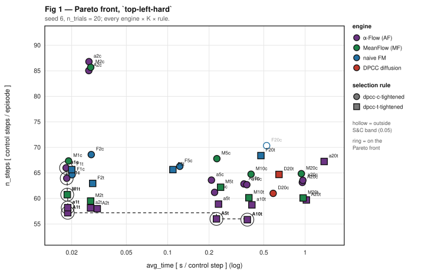

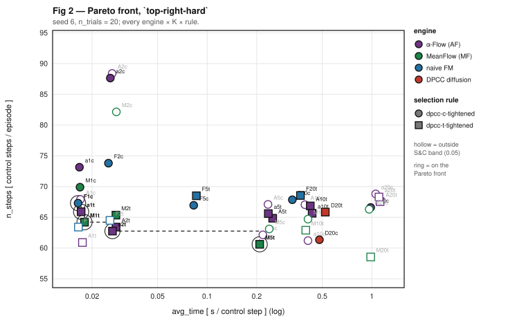

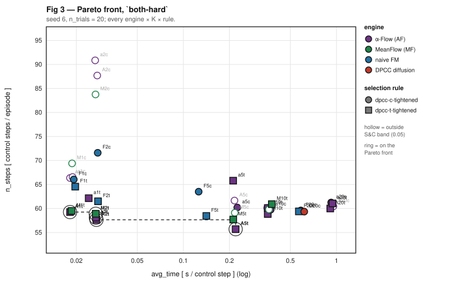

**Reading the three environments.**

- **`top-left-hard`** is the clean one. The four cheapest S&C = 1.00 rows are `A1t` → `a1t` → `M1t`
  → `F1t`, in that order, on **both** axes: 57.20 / 58.20 / 60.75 / 65.65 steps at 1.07 / 1.09 /
  1.13 / 1.31 s/ep. α-Flow `α→0.2` is the sole non-dominated point.
- **`both-hard`** puts `A1t` alone at the front (59.25 steps, 1.08 s/ep). MeanFlow has **no** S&C =
  1.00 row at K = 1 here — its cheapest clearing point is `M2t` at K = 2 (58.90, 1.58), 46 % more
  expensive per episode for 0.35 fewer steps.
- **`top-right-hard`** is the hard environment for everyone and the one place α-Flow does not take
  the steps axis: `M5t` reaches 60.60 steps but costs **12.64 s/ep**, against `A2t` at 63.40 steps
  for **1.77** — 7.1× cheaper for 2.80 more steps. Non-dominated, not a loss; but it must be
  reported as a trade-off, not a win.

---

## 4. Aggregate over the three environments

Per-environment mean of `avg_time`, `n_steps` and S&C, then each engine's **cheapest point that
still reaches S&C 1.00** on the aggregate.

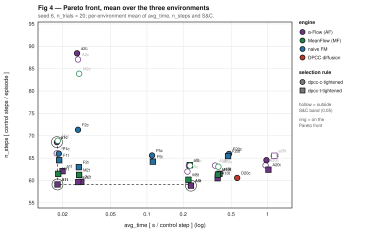

| engine | K | rule | S&C | steps | s/step | **s/ep** | vs baseline |
|---|---:|---|---:|---:|---:|---:|---:|
| **α-Flow `α→0.2`** | **2** | `dpcc-t-tightened` | 1.00 | **59.68** | **0.0286** | **1.71** | **19.8× cheaper** |
| MeanFlow-UNet | 5 | `dpcc-t-tightened` | 1.00 | 60.17 | 0.2209 | 13.29 | 2.6× cheaper |
| naive FM | 5 | `dpcc-t-tightened` | 1.00 | 64.20 | 0.1121 | 7.20 | 4.7× cheaper |
| DPCC K20 (baseline) | 20 | `dpcc-c-tightened` | 1.00 | 60.57 | 0.5603 | 33.93 | — |

**α-Flow Pareto-dominates all three comparators on the aggregate:**

| vs | Δ steps | Δ avg_time | dominance |
|---|---:|---:|---|
| MeanFlow-UNet | **−0.49** (−0.8 %) | **7.7× lower** | ✅ strict |
| naive FM | **−4.52** (−7.0 %) | **3.9× lower** | ✅ strict |
| DPCC K20 | **−0.89** (−1.5 %) | **19.6× lower** | ✅ strict |

It is the **sole non-dominated point** of the aggregate front. MeanFlow in turn dominates DPCC K20
(−0.40 steps, 2.5× lower `avg_time`); MeanFlow and naive FM are **non-dominated against each
other** (MeanFlow 4.03 steps shorter, naive FM 2.0× cheaper), and so are naive FM and DPCC.

---

## 5. The ordering — where **AF > MF > FM > diffusion** holds, and where it does not

The chain is stated on three different metrics because no single axis carries it everywhere. This
section is the honest version.

| metric | ordering | chain holds? |
|---|---|---|
| **s/ep at S&C 1.00, `top-left-hard`, K = 1** | AF **1.07** < MF **1.13** < FM **1.31** ≪ DPCC **35.66** | ✅ **complete** |
| **n_steps at S&C 1.00, `top-left-hard`, K = 1** | AF **57.20** < MF **60.75** < DPCC 61.00 < FM 65.65 | ⚠️ FM below DPCC |
| **goal reached, raw plan, K = 1, `top-right-hard`** | AF **1.00** > MF **0.85** = FM **0.85** > DPCC **0.60** | ✅ **complete** (MF/FM tie on goal, MF shorter: 59.70 vs 62.45) |
| **aggregate Pareto (both axes at S&C 1.00)** | AF dominates all; MF dominates DPCC; MF↔FM and FM↔DPCC split | ⚠️ **partial** |

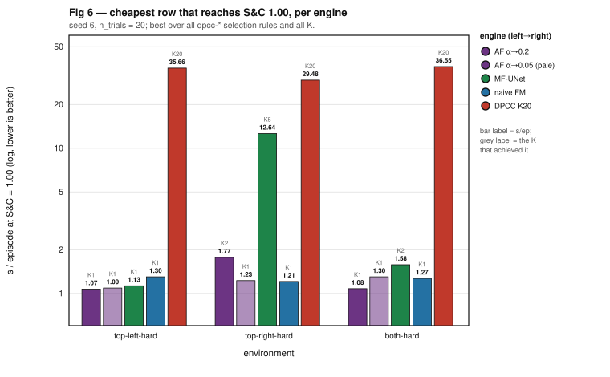

**What is solid:** α-Flow is first on every metric and every environment except the `top-right-hard`
steps axis. DPCC diffusion is last on cost by 20–33× on all three environments.
**What is not:** the middle of the chain. MeanFlow beats naive FM on path length but naive FM is
cheaper per step at its clearing point, and naive FM's step count sits *below* DPCC's. Any claim of
a clean four-way ladder must name the axis it is stated on.

---

## 6. The K ladder

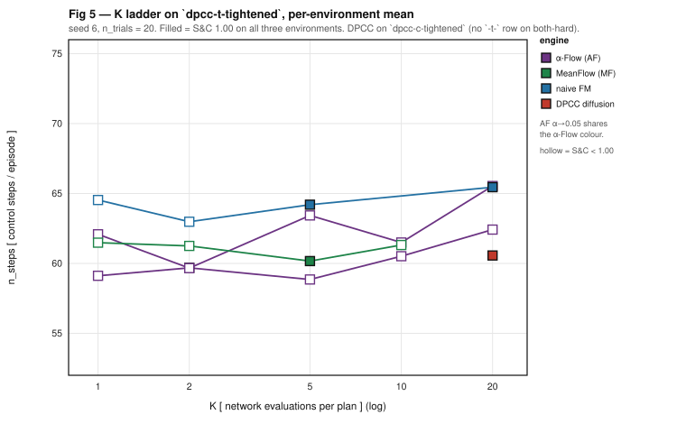

`dpcc-t-tightened`, per-environment mean. Filled marker = S&C 1.00 on all three environments.

| K | α-Flow `α→0.2` | α-Flow `α→0.05` | MeanFlow | naive FM |
|---:|---|---|---|---|
| 1 | 59.12 (S&C 0.95) | 62.08 (0.97) | 61.48 (0.97) | 64.53 (0.95) |
| **2** | **59.68 (1.00)** ✅ | 59.67 (0.98) | 61.25 (0.98) | 62.98 (0.95) |
| 5 | 58.85 (0.98) | 63.43 (0.97) | **60.17 (1.00)** ✅ | **64.20 (1.00)** ✅ |
| 10 | 60.52 (0.98) | 61.50 (0.97) | 61.32 (0.95) | — |
| 20 | 62.42 (0.95) | 65.53 (0.93) | — | **65.45 (1.00)** ✅ |

**α-Flow clears the gate at K = 2; MeanFlow and naive FM need K = 5; the baseline needs K = 20.**
Since `avg_time` scales with K, that ladder position *is* the cost result: 0.0286 vs 0.2209 vs
0.1121 vs 0.5603 s/step. The baseline cannot follow — its K is a **training** parameter, not an
inference dial, so it has no cheaper rung to move to.

---

## 7. The gain is upstream of the projector — the raw `diffuser` arm

`diffuser` is the unprojected rollout: the network's own plan, executed directly. It isolates
generative quality from the MPC.

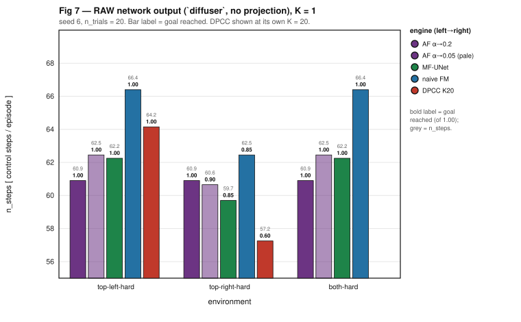

**K = 1, `top-right-hard`** (the discriminating environment), successes-only steps:

| engine | goal reached | steps |
|---|---:|---:|
| **α-Flow `α→0.2`** | **1.00** (20/20) | **60.90** |
| α-Flow `α→0.05` | 0.90 (18/20) | 62.28 |
| MeanFlow-UNet | 0.85 (17/20) | 62.41 |
| naive FM | 0.85 (17/20) | 62.45 |
| DPCC diffusion (K = 20) | 0.60 (12/20) | 57.25 |

α-Flow Pareto-dominates MeanFlow here at K = 1, K = 5 and K = 10 (more goals reached *and* fewer
steps). **This is the mechanism behind §3–§4:** α-Flow draws a better plan, and the projector then
carries that advantage through. It also explains the one loss — at `top-right-hard` under
projection the MPC repairs both plans toward the same place, so the raw-plan margin does not
survive there.

⚠️ **Two `n_steps` definitions exist in the toolchain.** The eval log averages over *successful*
episodes; the DA CSV averages over *all* of them, so a model that fails early scores a
misleadingly low mean. Reconciling all 318 seed-6 cells: `n_success` matches 318/318, `n_steps`
mismatches in 116 — every one a cell with success < 1.00. §3–§6 use the CSV (all-episode) basis for
parity with the pinned baseline; **this table uses the successes-only basis**, which is the only
correct one when success rates differ. Full derivation in the source DA, §6.1.

---

## 8. Trajectory quality — the K = 1 / K = 2 plans

Visual inspection of the raw plans at the two budgets that matter, `seed 6`, `both-hard`.
**All eight panels are placeholders pending the author's figures.**

| # | engine | K | file | status |
|---|---|---:|---|---|
| 8a | α-Flow `α→0.2` | 1 | `fig8a_plans_af_K1_seed6.png` | ⬜ *placeholder* |
| 8b | α-Flow `α→0.2` | 2 | `fig8b_plans_af_K2_seed6.png` | ⬜ *placeholder* |
| 8c | MeanFlow-UNet | 1 | `fig8c_plans_mf_K1_seed6.png` | ⬜ *placeholder* |
| 8d | MeanFlow-UNet | 2 | `fig8d_plans_mf_K2_seed6.png` | ⬜ *placeholder* |
| 8e | naive FM | 1 | `fig8e_plans_fm_K1_seed6.png` | ⬜ *placeholder* |
| 8f | naive FM | 2 | `fig8f_plans_fm_K2_seed6.png` | ⬜ *placeholder* |
| 8g | DPCC diffusion | 1 | `fig8g_plans_dpcc_K1_seed6.png` | ⬜ *placeholder* |
| 8h | DPCC diffusion | 2 | `fig8h_plans_dpcc_K2_seed6.png` | ⬜ *placeholder* |

<!-- Drop the eight PNGs into this folder and uncomment the block below.
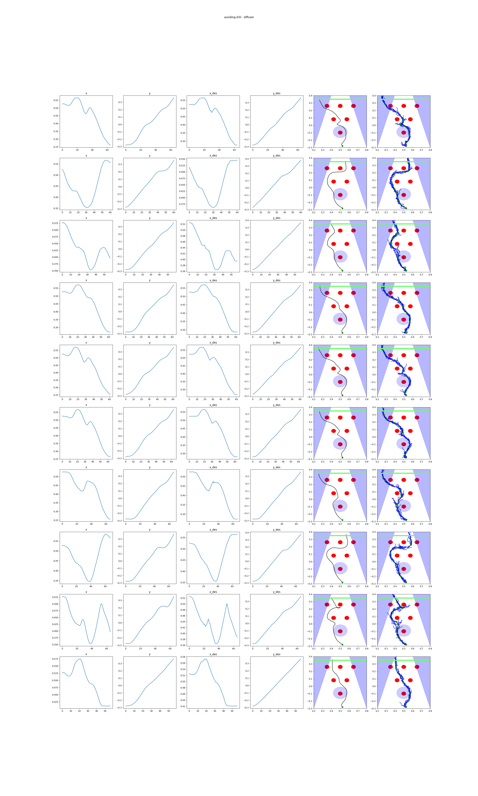
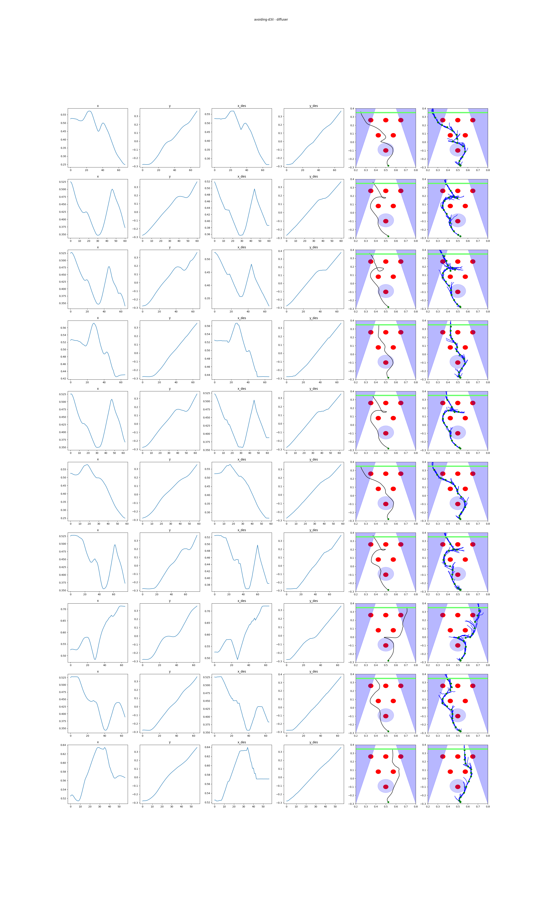


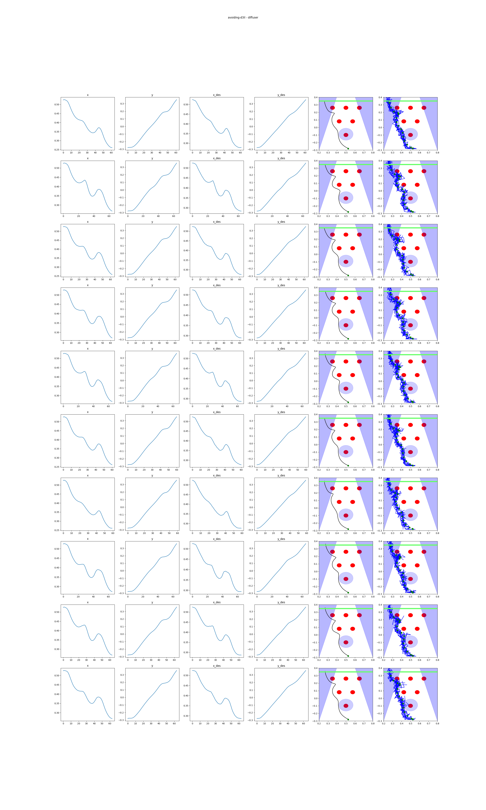
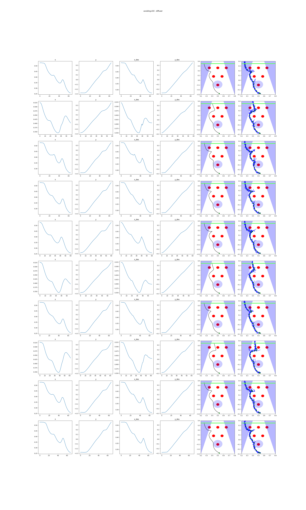

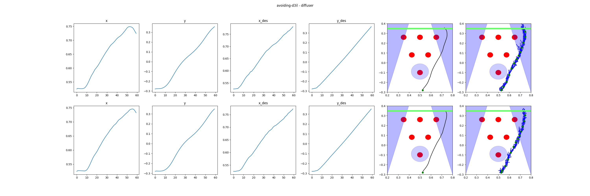
-->

**What the numbers predict these should show.** At K = 1 α-Flow reaches the goal in 20/20 episodes
against MeanFlow's and naive FM's 17/20 (§7), so its plans should be well-formed at one network
evaluation — the design point, not a degradation. No quantitative smoothness metric exists anywhere
in this pipeline; jerk, path length or curvature computed on the saved plan `.npz` files is the
missing measurement, and until it is taken **this section is qualitative evidence only** and cannot
carry a claim on its own.

*Plan directories, for regenerating the panels:*
`logs/avoiding-d3il/plans/flow_matching_v3_alphaflow/H8_D…_ae0.2_ag25.0_rf0.5/H8_K{1,2}_…_msgafon02_s6/6/`
and the corresponding `flow_matching_v3_meanflow` / `flow_matching_v3_ode_selectable` / `diffusion` trees.

---

## 9. Validity controls

1. **Architecture-matched.** All three flow engines are the same 4.0 M `Flow_matcher_U_Net_v2` with
   identical width, depth, action weight and time sampler. Only the training target and K differ.
   The baseline's `UNet1DTemporalCondModel` is the same network body at the same parameter count.
2. **Matched MPC fan.** Every arm in §3–§7 ran `batch_size = 4` for the arms-A/B candidate fan
   (`[ eval ] mpc fan: arms A/B=4`; the MeanFlow/FM runs predate `FMPCC_MPC_BATCH` and used the
   hardcoded 4). The `B4` / `B1` folder difference is `hf_batch_size`, which no arm here uses.
3. **`hardflow_*` arms excluded.** α-Flow ran arm C with a 4-candidate fan, MeanFlow with 1 — a 4:1
   confound. No `hardflow_*` number appears in this report. MeanFlow's K=1/K=2 HardFlow rows are
   additionally degenerate (no HardFlow math runs at `A = 0.5`, K ≤ 2) and must not be used.
4. **Matched trial count.** Every cell is `n_trials = 20`, 20 episodes. No cross-tier comparison.
5. **Matched projector.** Same DPCC `Projector`, same `diffusion_timestep_threshold = 0.5`, same
   constraint set and control loop for all five engines.
6. **α-Flow was verifiably on** — `discrete_frac ≈ 0.5` to the last step (§2.2). This is the control
   that every earlier α-Flow result silently failed.

---

## 10. Limits

- **Single seed.** Every number is seed 6. The largest margin in the study is 3 episodes out of 20;
  Fisher two-sided **p = 0.231** on the §7 headline. **Directional, not significant.**
- **Two α floors were run and the better is quoted.** A selection effect. One extra seed defends it.
- **`top-right-hard` steps belong to MeanFlow** (60.60 vs 63.40). α-Flow's row there is 7.1×
  cheaper, so it is a trade-off — but the claim is not "α-Flow wins everywhere".
- **Averaged over all six projection rules** rather than each engine's best, α-Flow and MeanFlow are
  a wash (8 vs 9 Pareto cells at seed 6). The result lives in `dpcc-t-tightened` at low K.
- **Suspected projector degeneracy at K ≤ 2.** `s/step` on every `dpcc-*` arm jumps ~14× between
  K = 2 and K = 5 (0.0280 → 0.2501). With `T = 0.5` the projector engages only on the last half of
  the trajectory, so at K = 1–2 it may execute **fewer than one projected step**. Both sides are
  equally affected, so the α-Flow-vs-MeanFlow comparison stands — but it changes what "33× cheaper
  than DPCC K20" is measuring. Unresolved; see §11.
- **The comparators are three weeks older** (2026-08-13 / 08-18) and ran on earlier eval code. Same
  checkpoint trees, same fan, not the same binary.
- **No smoothness metric exists.** §8 is qualitative until jerk/curvature is computed.

---

## 11. Reproduce

```bash
# figures (no dependencies; reads the batch CSVs directly)
python3 make_figs.py [<batch_dir>]

# --- queued on the cluster, in priority order ---

# 1. power the result: the winning arm on seeds 7-10, at the budgets where it wins
AF_BONE=unet AF_ALPHA_END=0.2 AF_SEEDS="7 8 9 10" AF_EPOCH=latest \
  AF_NTRIALS=20 AF_FLOW_STEPS="1 2 5" FMPCC_RUN_MSG=afon02_s7to10 \
  ./Slurm_Codes/submit.sh Slurm_Codes/sbatch/AlphaFlow/alphaflow_pipeline.sh

# 2. probe a higher floor - alpha 0.2 beat 0.05 on both arms
AF_BONE=unet AF_ALPHA_END=0.4 AF_SEEDS="6" AF_EPOCH=latest \
  AF_NTRIALS=20 AF_FLOW_STEPS="1 2 5" FMPCC_RUN_MSG=afon04_s6 \
  ./Slurm_Codes/submit.sh Slurm_Codes/sbatch/AlphaFlow/alphaflow_pipeline.sh
```

3. **Close §10's projector question** — instrument the DPCC projector to report how many steps it
   actually projects at each K under `T = 0.5`.
4. **Fair HardFlow rows** — re-run MeanFlow at `HFFM_BATCH=4`, or leave arm C out permanently.
5. **Carry both `n_steps` bases** in the DA pipeline, explicitly labelled (§7).

⚠️ `/data` was at 100 % (27 G free of 7.0 T) before these runs — check before submitting.

---

**Source analysis:** [`DA 2026-09-03 — With α actually ON, does α-Flow beat MeanFlow on the U-Net?`](../../../logs_in_develop/Gen3v7_AlphaFlow/DA/DA_20260903_AF_UNet_alphaflow_ENABLED_seed6_diffuser.md)
**Predecessor report:** [`Report_20260819_MF_UNet`](../Report_20260819_MF_UNet/README.md)
