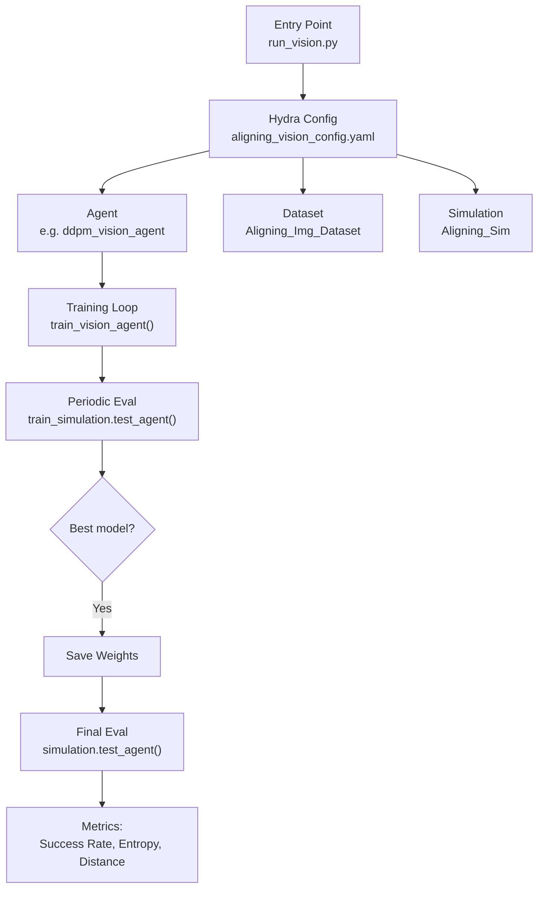

# D3IL Native Visual Aligning — Code Guide

> **Context:** How to run the D3IL benchmark's *visual aligning* task using the upstream (native) D3IL codebase, with Slurm job submission following the same conventions as our FM-PCC [train_visual_aligning_dpcc.sh](file:///workspaces/FM-PCC/Slurm_Codes/sbatch/diffuser_visual_aligning/train_visual_aligning_dpcc.sh).

---

## 1. Architecture Overview

The native D3IL visual aligning pipeline is composed of four layers:



| Component | File | Role |
|---|---|---|
| **Entry point** | [run_vision.py](file:///workspaces/d3il/run_vision.py) | Hydra-driven main; trains vision agent with periodic sim eval |
| **Task config** | [aligning_vision_config.yaml](file:///workspaces/d3il/configs/aligning_vision_config.yaml) | Dataset paths, sim settings, training hyperparams |
| **Agent configs** | [configs/agents/](file:///workspaces/d3il/configs/agents) | Per-agent YAML (model arch, optimizer, etc.) |
| **Agent code** | [agents/](file:///workspaces/d3il/agents) | `*_vision_agent.py` files |
| **Simulation** | [aligning_sim.py](file:///workspaces/d3il/simulation/aligning_sim.py) | Multiprocessing eval with MuJoCo env |
| **Dataset** | [aligning_dataset.py](file:///workspaces/d3il/environments/dataset/aligning_dataset.py) | `Aligning_Img_Dataset` for vision |

---

## 2. How `run_vision.py` Differs from `run.py`

| Feature | `run.py` (state-based) | `run_vision.py` (vision) |
|---|---|---|
| Config default | `aligning_config.yaml` | `aligning_vision_config.yaml` |
| Dataset class | `Aligning_Dataset` (state obs) | `Aligning_Img_Dataset` (images) |
| Train method | `agent.train_agent()` (internal epoch loop) | `agent.train_vision_agent()` (outer epoch loop with periodic sim eval) |
| Sim eval during training | None (only test MSE on val set) | Yes — `train_simulation.test_agent(agent)` every `eval_every_n_epochs` |
| Observation space | `obs_dim: 20` (full state) | `obs_dim: 3` (robot EE pos) + 2×RGB images (96×96) |
| `if_vision` flag | `False` (not set) | `True` |

> [!IMPORTANT]
> The vision pipeline **must** use `run_vision.py`, not `run.py`. The training loop structure is fundamentally different — `run_vision.py` wraps the epoch loop externally and calls `train_vision_agent()` (one epoch at a time), then runs sim evaluation to pick the best checkpoint.

---

## 3. Available Vision Agents for Aligning

All agents have corresponding `*_vision_agent.yaml` configs and `*_vision_agent.py` implementations:

| Agent | Config Key | `window_size` | Extra Overrides | Architecture |
|---|---|---|---|---|
| **DDPM-MLP** | `ddpm_vision_agent` | 1 | `agents.model.model.model.t_dim=4`, `agents.model.model.n_timesteps=4` | Diffusion + MLP denoiser |
| **DDPM-EncDec (ACT-style)** | `ddpm_encdec_vision` | 8 | — | Diffusion + Transformer Enc-Dec |
| **DDPM-Transformer** | `ddpm_transformer_vision_agent` | 5 | `agents.model.model.n_timesteps=16` | Diffusion + Transformer denoiser |
| **ACT** | `act_vision_agent` | 3 | — | Action Chunking Transformer |
| **BeSO** | `beso_vision_agent` | 5 | `agents.num_sampling_steps=16`, `agents.sigma_min=0.01`, `agents.sigma_max=3` | Score-based diffusion |
| **BeT-MLP** | `bet_mlp_vision_agent` | 1 | — | Behavior Transformer (MLP) |
| **BC** | `bc_vision_agent` | 1 | — | Behavior Cloning |
| **cVAE** | `cvae_vision_agent` | 1 | `agents.model.model.encoder.latent_dim=32`, `agents.kl_loss_factor=67.46` | Conditional VAE |
| **GPT-BC** | `gpt_vision_agent` | 5 | — | GPT-based BC |
| **IBC** | `ibc_vision_agent` | 1 | `agents.sampler.sampler_stepsize_init=0.0493` | Implicit BC (energy-based) |

---

## 4. Will You Get GIF/Video?

> [!WARNING]
> **Short answer: Not by default in the native D3IL pipeline.**

The native D3IL codebase **does not** produce GIF or video files from the standard benchmark flow. Here is why:

### 4.1 Rendering Architecture

The simulation config has a `render` flag (see [aligning_sim.py:51](file:///workspaces/d3il/simulation/aligning_sim.py#L51)):

```python
env = Robot_Push_Env(render=self.render, if_vision=self.if_vision)
```

Both `train_simulation` and `simulation` blocks in `aligning_vision_config.yaml` set `render: False`:

```yaml
train_simulation:
  render: False    # ← no visual window during training eval
simulation:
  render: False    # ← no visual window during final eval
```

### 4.2 MujocoViewer Video Support

The underlying [MujocoViewer](file:///workspaces/d3il/environments/d3il/d3il_sim/sims/mujoco/mj_utils/mujoco_viewer.py) **does** have `start_recording()` / `stop_recording()` / `save_video()` methods that produce `.mp4` files under `environments/d3il/videos/`. However:

1. **No benchmark script calls these methods** — the simulation loop in `aligning_sim.py` never calls `start_recording()`.
2. The viewer raises `"Cannot Record videos when RenderMode == BLIND"` if `render=False` (blind mode).
3. Even with `render=True`, you only get a live MuJoCo window — no automatic recording.

### 4.3 How to Get Video

There are **three approaches** to get visual output:

| Method | Effort | Output |
|---|---|---|
| **A. Set `render: True` + manual viewer recording** | Low | `.mp4` (requires display or Xvfb) |
| **B. Custom recording wrapper** | Medium | `.gif` or `.mp4` — add `imageio` frame capture in the eval loop |
| **C. Use FM-PCC eval pipeline** | Already done | GIF/MP4 via `eval_visual_aligning_dpcc.py --record all` |

> [!TIP]
> For our project, we already have the FM-PCC eval pipeline ([eval_visual_aligning_dpcc.sh](file:///workspaces/FM-PCC/Slurm_Codes/sbatch/diffuser_visual_aligning/eval_visual_aligning_dpcc.sh)) that handles GIF generation with `--record` mode. The native D3IL benchmark is designed purely for numeric metrics (success rate, entropy, distance) — not visual diagnostics.

---

## 5. Running Natively — Command Line

### 5.1 Local (Interactive)

From the `d3il/` root:

```bash
# DDPM-MLP vision on aligning (single seed)
MUJOCO_GL=egl python run_vision.py \
    --config-name=aligning_vision_config \
    agents=ddpm_vision_agent \
    agent_name=ddpm_vision \
    seed=42 \
    window_size=1 \
    group=aligning_ddpm_vision_test \
    wandb.entity=YOUR_ENTITY \
    wandb.project=YOUR_PROJECT \
    agents.model.model.model.t_dim=4 \
    agents.model.model.n_timesteps=4
```

### 5.2 Multi-Seed Sweep (Hydra `--multirun`)

```bash
MUJOCO_GL=egl python run_vision.py \
    --config-name=aligning_vision_config \
    --multirun seed=0,1,2,3,4,5 \
    agents=ddpm_vision_agent \
    agent_name=ddpm_vision \
    window_size=1 \
    group=aligning_ddpm_seeds \
    agents.model.model.model.t_dim=4 \
    agents.model.model.n_timesteps=4
```

> [!NOTE]
> `--multirun` runs seeds **sequentially** in the same process. For parallel seeds, use separate Slurm jobs (see §6).

---

## 6. Slurm Scripts (FM-PCC Style)

These scripts follow the same pattern as [train_visual_aligning_dpcc.sh](file:///workspaces/FM-PCC/Slurm_Codes/sbatch/diffuser_visual_aligning/train_visual_aligning_dpcc.sh), adapted for the native D3IL entry point.

### 6.1 DDPM-MLP Vision — Slurm

```bash
#!/bin/bash
#SBATCH --job-name=d3il_aligning_ddpm_vision
#SBATCH --nodes=1
#SBATCH --ntasks=1
#SBATCH --cpus-per-task=8
#SBATCH --mem=32G
#SBATCH --gres=gpu:1
#SBATCH --time=24:00:00
#SBATCH --partition=gpu-1-student

set -e

# Logging setup
CURRENT_LOG=$(scontrol show job $SLURM_JOB_ID | grep -oP 'StdOut=\K\S+')
if [ -n "$CURRENT_LOG" ]; then
    ln -snf "$CURRENT_LOG" Slurm_Codes/logs/latest.log
fi

echo "JOB START: $(date)"

# Setup Workspace Paths
FMPCC_ROOT="$HOME/FMPCC"
REPO="$FMPCC_ROOT/FM-PCC"
D3IL_ROOT="$REPO/d3il"
CONDA_DIR="$HOME/miniconda3"
CONDA_ENV_NAME="FMPCC"

source "$CONDA_DIR/etc/profile.d/conda.sh"
conda activate "$CONDA_ENV_NAME"

export FMPCC="$REPO"
export D3IL_ROOT="$D3IL_ROOT"
export D3IL_ENV_ROOT="$D3IL_ROOT/environments/d3il"
export PYTHONPATH="$FMPCC:$D3IL_ROOT:$D3IL_ENV_ROOT:$PYTHONPATH"

# Headless rendering
export MUJOCO_GL="egl"
export PYOPENGL_PLATFORM="egl"
export MPLBACKEND="agg"

# W&B Login
if [ -f "$HOME/FMPCC/.wandb_api_key" ]; then
    export WANDB_API_KEY=$(cat $HOME/FMPCC/.wandb_api_key)
    export WANDB_MODE="online"
fi

cd "$D3IL_ROOT"

# ─── Run D3IL native DDPM-MLP visual aligning ───────────────────────────
python run_vision.py \
    --config-name=aligning_vision_config \
    --multirun seed=0,1,2,3,4,5 \
    agents=ddpm_vision_agent \
    agent_name=ddpm_vision \
    window_size=1 \
    group=aligning_ddpm_vision_seeds \
    wandb.entity=YOUR_WANDB_ENTITY \
    wandb.project=d3il-aligning-ddpm-vision \
    agents.model.model.model.t_dim=4 \
    agents.model.model.n_timesteps=4

echo "Job completed successfully."
```

### 6.2 DDPM-EncDec (ACT-style) Vision — Slurm

```bash
#!/bin/bash
#SBATCH --job-name=d3il_aligning_ddpm_encdec_vision
#SBATCH --nodes=1
#SBATCH --ntasks=1
#SBATCH --cpus-per-task=8
#SBATCH --mem=32G
#SBATCH --gres=gpu:1
#SBATCH --time=24:00:00
#SBATCH --partition=gpu-1-student

set -e

CURRENT_LOG=$(scontrol show job $SLURM_JOB_ID | grep -oP 'StdOut=\K\S+')
if [ -n "$CURRENT_LOG" ]; then
    ln -snf "$CURRENT_LOG" Slurm_Codes/logs/latest.log
fi

echo "JOB START: $(date)"

FMPCC_ROOT="$HOME/FMPCC"
REPO="$FMPCC_ROOT/FM-PCC"
D3IL_ROOT="$REPO/d3il"
CONDA_DIR="$HOME/miniconda3"
CONDA_ENV_NAME="FMPCC"

source "$CONDA_DIR/etc/profile.d/conda.sh"
conda activate "$CONDA_ENV_NAME"

export FMPCC="$REPO"
export D3IL_ROOT="$D3IL_ROOT"
export D3IL_ENV_ROOT="$D3IL_ROOT/environments/d3il"
export PYTHONPATH="$FMPCC:$D3IL_ROOT:$D3IL_ENV_ROOT:$PYTHONPATH"

export MUJOCO_GL="egl"
export PYOPENGL_PLATFORM="egl"
export MPLBACKEND="agg"

if [ -f "$HOME/FMPCC/.wandb_api_key" ]; then
    export WANDB_API_KEY=$(cat $HOME/FMPCC/.wandb_api_key)
    export WANDB_MODE="online"
fi

cd "$D3IL_ROOT"

# ─── This is the DEFAULT agent in aligning_vision_config.yaml ────────────
python run_vision.py \
    --config-name=aligning_vision_config \
    --multirun seed=0,1,2,3,4,5 \
    agents=ddpm_encdec_vision \
    agent_name=ddpm_encdec_vision \
    window_size=8 \
    group=aligning_ddpm_encdec_vision_seeds \
    wandb.entity=YOUR_WANDB_ENTITY \
    wandb.project=d3il-aligning-ddpm-encdec

echo "Job completed successfully."
```

### 6.3 Generic Template — Any Agent

```bash
#!/bin/bash
#SBATCH --job-name=d3il_aligning_AGENT_NAME
#SBATCH --nodes=1
#SBATCH --ntasks=1
#SBATCH --cpus-per-task=8
#SBATCH --mem=32G
#SBATCH --gres=gpu:1
#SBATCH --time=24:00:00
#SBATCH --partition=gpu-1-student

set -e

CURRENT_LOG=$(scontrol show job $SLURM_JOB_ID | grep -oP 'StdOut=\K\S+')
if [ -n "$CURRENT_LOG" ]; then
    ln -snf "$CURRENT_LOG" Slurm_Codes/logs/latest.log
fi

echo "JOB START: $(date)"

FMPCC_ROOT="$HOME/FMPCC"
REPO="$FMPCC_ROOT/FM-PCC"
D3IL_ROOT="$REPO/d3il"
CONDA_DIR="$HOME/miniconda3"
CONDA_ENV_NAME="FMPCC"

source "$CONDA_DIR/etc/profile.d/conda.sh"
conda activate "$CONDA_ENV_NAME"

export FMPCC="$REPO"
export D3IL_ROOT="$D3IL_ROOT"
export D3IL_ENV_ROOT="$D3IL_ROOT/environments/d3il"
export PYTHONPATH="$FMPCC:$D3IL_ROOT:$D3IL_ENV_ROOT:$PYTHONPATH"

export MUJOCO_GL="egl"
export PYOPENGL_PLATFORM="egl"
export MPLBACKEND="agg"

if [ -f "$HOME/FMPCC/.wandb_api_key" ]; then
    export WANDB_API_KEY=$(cat $HOME/FMPCC/.wandb_api_key)
    export WANDB_MODE="online"
fi

cd "$D3IL_ROOT"

# ──────────────────────────────────────────────────────────────────────────
# FILL IN: Replace the placeholders below
#   AGENT_CONFIG_KEY   → e.g. ddpm_vision_agent, act_vision_agent, etc.
#   AGENT_NAME         → e.g. ddpm_vision, act_vision, etc.
#   WINDOW_SIZE        → 1 for MLP-based, 3-8 for history-based
#   EXTRA_OVERRIDES    → agent-specific params (see table in §3)
# ──────────────────────────────────────────────────────────────────────────
python run_vision.py \
    --config-name=aligning_vision_config \
    --multirun seed=0,1,2,3,4,5 \
    agents=AGENT_CONFIG_KEY \
    agent_name=AGENT_NAME \
    window_size=WINDOW_SIZE \
    group=aligning_AGENT_NAME_seeds \
    wandb.entity=YOUR_WANDB_ENTITY \
    wandb.project=d3il-aligning-AGENT_NAME \
    EXTRA_OVERRIDES

echo "Job completed successfully."
```

---

## 7. Key Configuration Details

### 7.1 `aligning_vision_config.yaml` Defaults

```yaml
# Task geometry
obs_dim: 3          # robot EE position (x, y, z)
action_dim: 3       # delta action (dx, dy, dz)
window_size: 8      # history length (overridden per-agent via CLI)

# Training
epoch: 4            # ← very low! This is epochs of the OUTER loop
eval_every_n_epochs: 2
train_batch_size: 64
val_batch_size: 64

# Simulation (training eval — lightweight)
train_simulation:
  render: False
  n_cores: 1
  n_contexts: 1
  n_trajectories_per_context: 1
  if_vision: True

# Simulation (final eval — full benchmark)
simulation:
  render: False
  n_cores: 5
  n_contexts: 60
  n_trajectories_per_context: 8
  if_vision: True
```

> [!CAUTION]
> The default `epoch: 4` is very low for vision training. The D3IL paper reports training for longer. You may want to increase this for real experiments. Each outer-loop epoch runs through the entire training dataset once via `train_vision_agent()`.

### 7.2 DDPM-MLP Vision Agent Config Highlights

From [ddpm_vision_agent.yaml](file:///workspaces/d3il/configs/agents/ddpm_vision_agent.yaml):

- **Model**: `DiffusionMLPNetwork` inside a `Diffusion` wrapper, inside a `DiffusionPolicy` shell
- **Visual encoder**: `MultiImageObsEncoder` with ResNet18 backbone (2 cameras: `agentview_image` + `in_hand_image` at 96×96)
- **Encoder output dim**: 64 per camera → 128 total → used as `state_dim` and `obs_dim` for the diffusion model
- **Diffusion steps**: 4 (very fast)
- **Optimizer**: AdamW, lr=1e-4

### 7.3 Config Override Hierarchy

The Hydra override nesting differs between MLP and EncDec variants:

```
DDPM-MLP:    agents.model.model.model.t_dim=4    (Policy → Diffusion → MLPNetwork)
DDPM-EncDec: (no t_dim; uses Transformer architecture)
```

---

## 8. Dataset Prerequisite

The aligning dataset must be downloaded and placed at:
```
d3il/environments/dataset/data/aligning/
```

Required files (see [data directory](file:///workspaces/d3il/environments/dataset/data/aligning)):
- `train_files.pkl` — training trajectory file paths
- `eval_files.pkl` — evaluation trajectory file paths
- `train_contexts.pkl` — training environment contexts
- `test_contexts.pkl` — test environment contexts

Download link from D3IL README:
```
https://drive.google.com/file/d/1SQhbhzV85zf_ltnQ8Cbge2lsSWInxVa8/view?usp=drive_link
```

---

## 9. Output Structure

After training, Hydra creates a timestamped output directory:

```
d3il/logs/aligning/runs/{agent_name}/{YYYY-MM-DD}/{HH-MM-SS}/
├── .hydra/
│   ├── config.yaml          # resolved config snapshot
│   ├── hydra.yaml
│   └── overrides.yaml
├── eval_best_ddpm.pth       # best checkpoint (by sim eval)
├── last_ddpm.pth            # final checkpoint
├── non_ema_model_state_dict.pth
└── run_vision.log           # training log
```

### 9.1 Metrics Logged to W&B

| Metric | Description |
|---|---|
| `train_loss` | Per-batch training loss |
| `best_model_epochs` | Epoch where best model was saved |
| `Metrics/successes` | Final eval success rate (0-1) |
| `Metrics/entropy` | Mode coverage entropy |
| `Metrics/distance` | Mean distance metric |
| `score` | Combined: `0.5 * (success_rate + entropy)` |

---

## 10. Comparison: D3IL Native vs FM-PCC DPCC Pipeline

| Aspect | D3IL Native | FM-PCC DPCC |
|---|---|---|
| Entry point | `d3il/run_vision.py` | `diffuser_visual_aligning_test/train_visual_aligning_dpcc.py` |
| Config system | Hydra YAML | Custom pickle/YAML + argparse |
| Training | `train_vision_agent()` | Custom training loop with DPCC model |
| Eval | `aligning_sim.test_agent()` | `eval_visual_aligning_dpcc.py` |
| GIF/Video | ❌ Not produced | ✅ `--record all` mode |
| Model types | DDPM only (baseline) | DPCC (diffusion + projection) |
| Obs space | 3D (EE pos) | 9D (expanded representation) |
| Working dir | `d3il/` (must `cd` there) | `FM-PCC/` (project root) |

---

## 11. Quick-Reference: Running Each Agent

Copy-paste ready commands (run from `d3il/` directory):

```bash
# ──── DDPM-MLP ────
MUJOCO_GL=egl python run_vision.py --config-name=aligning_vision_config \
  --multirun seed=0,1,2,3,4,5 agents=ddpm_vision_agent agent_name=ddpm_vision \
  window_size=1 group=aligning_ddpm_seeds \
  agents.model.model.model.t_dim=4 agents.model.model.n_timesteps=4

# ──── DDPM-EncDec ────
MUJOCO_GL=egl python run_vision.py --config-name=aligning_vision_config \
  --multirun seed=0,1,2,3,4,5 agents=ddpm_encdec_vision agent_name=ddpm_encdec_vision \
  window_size=8 group=ddpm_encdec_vision_seeds

# ──── DDPM-Transformer ────
MUJOCO_GL=egl python run_vision.py --config-name=aligning_vision_config \
  --multirun seed=0,1,2,3,4,5 agents=ddpm_transformer_vision_agent \
  agent_name=ddpm_transformer_vision window_size=5 \
  group=aligning_ddpm_transformer_seeds agents.model.model.n_timesteps=16

# ──── ACT ────
MUJOCO_GL=egl python run_vision.py --config-name=aligning_vision_config \
  --multirun seed=0,1,2,3,4,5 agents=act_vision_agent agent_name=act_vision \
  window_size=3 group=aligning_act_seeds

# ──── BeSO ────
MUJOCO_GL=egl python run_vision.py --config-name=aligning_vision_config \
  --multirun seed=0,1,2,3,4,5 agents=beso_vision_agent agent_name=beso_vision \
  window_size=5 group=aligning_beso_seeds \
  agents.num_sampling_steps=16 agents.sigma_min=0.01 agents.sigma_max=3

# ──── BeT-MLP ────
MUJOCO_GL=egl python run_vision.py --config-name=aligning_vision_config \
  --multirun seed=0,1,2,3,4,5 agents=bet_mlp_vision_agent agent_name=bet_mlp_vision \
  window_size=1 group=aligning_bet_mlp_seeds

# ──── BC ────
MUJOCO_GL=egl python run_vision.py --config-name=aligning_vision_config \
  --multirun seed=0,1,2,3,4,5 agents=bc_vision_agent agent_name=bc_vision \
  window_size=1 group=aligning_bc_seeds

# ──── cVAE ────
MUJOCO_GL=egl python run_vision.py --config-name=aligning_vision_config \
  --multirun seed=0,1,2,3,4,5 agents=cvae_vision_agent agent_name=cvae_vision \
  window_size=1 group=aligning_cvae_seeds \
  agents.model.model.encoder.latent_dim=32 agents.kl_loss_factor=67.46378648811798

# ──── GPT-BC ────
MUJOCO_GL=egl python run_vision.py --config-name=aligning_vision_config \
  --multirun seed=0,1,2,3,4,5 agents=gpt_vision_agent agent_name=gpt_bc \
  window_size=5 group=aligning_gpt_bc_seeds

# ──── IBC ────
MUJOCO_GL=egl python run_vision.py --config-name=aligning_vision_config \
  --multirun seed=0,1,2,3,4,5 agents=ibc_vision_agent agent_name=ibc_vision \
  window_size=1 group=aligning_ibc_seeds \
  agents.sampler.sampler_stepsize_init=0.0493
```

> [!NOTE]
> All commands require `wandb.entity` and `wandb.project` to be set. Either add them as CLI overrides or edit `aligning_vision_config.yaml` directly. To run without W&B, the code already sets `mode="disabled"` in `run_vision.py`.
