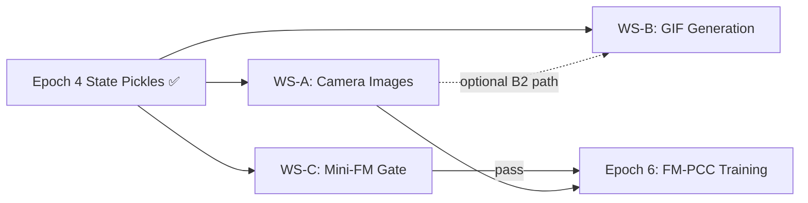

# Gen11 Epoch 5 — Visual Collection, Trajectory Visualisation & FM Sanity Gate: PLAN

**Date**: 2026-06-05  
**Status**: Blueprint — no code in this document.  
**Predecessor**: [Epoch4 CLOSURE](../Epoch4_expert_data/CLOSURE.md) (1769 state-only episodes across 4 scenes, ✅ complete)  
**Patterns inherited**:
- Gen9 [`camera_image_from_state/CHANGELOG.md`](../../Gen9/camera_image_from_state/CHANGELOG.md) — replay-and-capture pipeline for D3IL  
- Gen7 [`u_f_13/UF13_nonvisual_gif_investigation.md`](../../Gen7_FMPCC_Viusal_Aligning/New_Based_On_Gen6_V4/u_f_13/UF13_nonvisual_gif_investigation.md) — GIF generation from MuJoCo offscreen render  
- Gen7 [`fix_18_nonvisual_step1/CHANGELOG.md`](../../Gen7_FMPCC_Viusal_Aligning/New_Based_On_Gen6_V4/fix_18_nonvisual_step1/CHANGELOG.md) — env-render hook for non-visual GIF capture  

**Goal**: Three workstreams that convert the Epoch 4 state dataset into a training-ready visual+state dataset and confirm data correctness before FM-PCC training begins.

---

## 0. Guiding Principles

1. **Two-stage architecture is the law.** Epoch 4 was Stage 1 (state-only, headless). Epoch 5 adds Stage 2 (replay → render cameras). *(Epoch 4 PLAN §5)*
2. **No training in Epoch 5** (except the mini-FM sanity gate on ≤100 episodes). Full FM-PCC training is Epoch 6 scope.
3. **Adapt, don't reinvent.** Gen9's `collect_visual_avoiding_data.py` is the template for camera capture. Gen7's GIF pipeline is the template for video generation. Transplant and specialise.
4. **Every workstream ships independently.** WS-A (cameras), WS-B (GIFs), WS-C (mini-FM) have no inter-dependencies — they can be developed and merged in any order.

---

## 1. Workstream Overview

| WS | Name | Input | Output | Est. effort |
|---|---|---|---|---|
| **A** | Camera Image Collection | Epoch 4 state pickles (`logs/uav_expert_data/{scene}/{homotopy}/{ep}.pkl`) | `images/bp-cam/{ep}/{t}.png` + `images/fpv-cam/{ep}/{t}.png` per episode | 4–6 h |
| **B** | GIF / Video Generation | Same state pickles (or WS-A images) | Per-episode `.gif` + optional `.mp4` in `logs/uav_expert_data/gifs/{scene}/` | 3–5 h |
| **C** | Mini-FM Sanity Gate | ≤100 empty-scene episodes (state-only) | Pass/fail verdict + RMS table in this epoch's CHANGELOG | 2–4 h |

---

## 2. WS-A — Camera Image Collection (Stage 2)

### 2.1 What it does

Replay each Epoch 4 state-only episode inside MuJoCo (with GPU offscreen rendering), capture two camera streams per timestep, save as PNGs.

### 2.2 Camera streams

| Stream | Source | View | Resolution |
|---|---|---|---|
| `bp-cam` | Bird's-eye / cage camera (mounted above scene) | Overhead world view — drone + obstacles + floor | 96×96 (matches D3IL visual aligning convention) |
| `fpv-cam` | Body-frame FPV camera (mounted on drone) | First-person forward view | 96×96 |

> [!NOTE]
> Gen9 used `env.bp_cam` + `env.robot.inhand_cam` for the D3IL robot arm. For the UAV, we need to:
> 1. **Confirm** whether the X2 quadrotor model XML has an FPV camera body site, or if one needs to be added.
> 2. **Define** the bp-cam mounting point — a fixed overhead camera looking down at the scene (similar to the cage cam in aligning, but covering the UAV flight volume).
> 3. If no cameras exist on the UAV model, **add** `<camera>` tags to the scene XMLs or `quadrotor_modified.xml`.

### 2.3 Replay strategy

Adapt the Gen9 pattern (`collect_visual_avoiding_data.py`):

```
for each episode pickle:
    load obs (T, 6), targets (T, 3), scene, homotopy
    env = create_uav_env(scene_xml, render=offscreen)
    set drone initial state from obs[0]
    for t in range(T):
        set drone qpos/qvel to match obs[t]   # direct state injection, NOT action replay
        mj.mj_forward(model, data)             # update physics state without stepping
        bp_img  = bp_cam.render(96, 96)
        fpv_img = fpv_cam.render(96, 96)
        save_png(bp_img,  f"images/bp-cam/{ep_id}/{t}.png")
        save_png(fpv_img, f"images/fpv-cam/{ep_id}/{t}.png")
```

> [!IMPORTANT]
> **State injection vs action replay**: Gen9 replayed actions via `env.step()`. For UAV data, direct `qpos`/`qvel` injection via `mj_forward()` is safer — it avoids PID replay drift and guarantees pixel-perfect correspondence between the stored state and the rendered frame. The Epoch 4 pickles store `obs (T,6) = [p, v]` and `targets (T,3) = [p_des]`, which is enough to reconstruct the full MuJoCo state.

### 2.4 Output layout

```
logs/uav_expert_data/
  {scene}/{homotopy_safe}/{ep_id}.pkl        ← Epoch 4 (already exists)
  images/bp-cam/{scene}/{homotopy_safe}/{ep_id}/
    0.png, 1.png, …                          ← NEW (Epoch 5 WS-A)
  images/fpv-cam/{scene}/{homotopy_safe}/{ep_id}/
    0.png, 1.png, …                          ← NEW (Epoch 5 WS-A)
```

### 2.5 File deliverables (WS-A)

| File | Role | Based on |
|---|---|---|
| `uav_expert_data_collect/collect_camera_images.py` | Standalone replay-and-capture script | Gen9 `collect_visual_avoiding_data.py` |
| `Slurm_Codes/sbatch/uav_expert_data/collect_camera_images.sh` | SLURM wrapper (`MUJOCO_GL=egl`, GPU) | Gen9 `collect_visual_avoiding.sh` |

### 2.6 Verification (WS-A)

```bash
# 1. Image count matches state timesteps
python -c "
import os, pickle
root = 'logs/uav_expert_data'
ep = 'empty/N_A/<first_ep>.pkl'
T = len(pickle.load(open(f'{root}/{ep}','rb'))['obs'])
nb = len(os.listdir(f'{root}/images/bp-cam/empty/N_A/<first_ep>'))
nf = len(os.listdir(f'{root}/images/fpv-cam/empty/N_A/<first_ep>'))
print(f'T={T}, bp={nb}, fpv={nf}, match={T==nb==nf}')
"

# 2. Non-uniform pixels (not black/white)
python -c "
import cv2, numpy as np
bp = cv2.imread('<path_to_bp_frame>')
print(f'shape={bp.shape}, mean={bp.mean():.1f}, std={bp.std():.1f}')
# std > 10 → non-trivial image content
"
```

---

## 3. WS-B — GIF / Video Generation

### 3.1 What it does

Produce a short GIF (or MP4) per episode showing the drone flying the expert trajectory in simulation. This is for **human inspection only** — it does not feed into training.

### 3.2 Two implementation options

| Option | How | Pros | Cons |
|---|---|---|---|
| **B1: Render-from-state** | Same as WS-A but assemble frames into GIF via `imageio.mimsave()` instead of saving individual PNGs | Single pass; no dependency on WS-A | Heavier per-episode (GPU render + GIF encode) |
| **B2: Assemble-from-PNGs** | Read WS-A's saved PNGs → stitch bp+fpv side-by-side → `imageio.mimsave()` | Lightweight post-process; runs on CPU | Requires WS-A to be complete first |

**Recommendation**: Implement **B1** as the primary path (standalone, no dependency). Optionally add a B2 assembly mode that runs after WS-A.

### 3.3 GIF layout per frame

```
┌──────────────┬──────────────┐
│   bp-cam     │   fpv-cam    │
│  (overhead)  │  (body FPV)  │
│   96×96      │   96×96      │
└──────────────┴──────────────┘
   192 × 96 px stitched frame
```

Optional overlay: episode ID, scene name, timestep counter, homotopy class label (burn into frame as text via `cv2.putText`).

### 3.4 Output layout

```
logs/uav_expert_data/gifs/
  {scene}/{homotopy_safe}/
    {ep_id}.gif                ← 10 fps, ~200–640 frames per episode
    {ep_id}.mp4                ← optional higher-quality version
  montage_{scene}.gif          ← optional: 4-up grid of representative episodes
```

### 3.5 File deliverables (WS-B)

| File | Role | Based on |
|---|---|---|
| `uav_expert_data_collect/generate_trajectory_gifs.py` | Standalone GIF generator (Option B1) | Gen7 UF-13 pseudocode, Gen7 Fix 18.6 env-render hook |
| `uav_expert_data_collect/assemble_gifs_from_pngs.py` | Lightweight assembler (Option B2) | New (simple `imageio` loop) |
| `Slurm_Codes/sbatch/uav_expert_data/generate_gifs.sh` | SLURM wrapper for B1 | Gen9/Gen7 SLURM patterns |

### 3.6 Scope control

- **In scope**: Per-episode GIF, per-scene montage, SLURM wrapper.
- **Out of scope**: Fancy overlays (3D trajectory trace, velocity heatmap) — nice-to-have for Epoch 6 paper figures.

### 3.7 Verification (WS-B)

Spot-check 5 GIFs per scene:
- Drone is visible and moving along the expected path
- Obstacles match the scene (corridor walls, pillars, s-curve walls)
- No black/corrupted frames
- Episode length matches state pickle (±1 frame)

---

## 4. WS-C — Mini-FM Sanity Gate

### 4.1 What it does

Train a **tiny FM** on ≤100 empty-scene episodes. If it can reproduce PID trajectories at < 0.1 m RMS on held-out episodes, the entire Epoch 4 data pipeline (schema, action convention, horizon config) is confirmed correct.

*(This was already specified in Epoch 4 PLAN §3 and CLOSURE §"Immediate next step". Epoch 5 executes it.)*

### 4.2 Setup

| Parameter | Value |
|---|---|
| Data | 100 episodes from `logs/uav_expert_data/empty/N_A/` |
| Train/eval split | 80 / 20 |
| Model | Existing FM-PCC architecture (`flow_matcher/` or `flow_matcher_v3/`) |
| Config | Minimal: `H=8, D=9, T_flow=20` (fast ODE), small UNet |
| Training | ~500–1000 steps (just enough to overfit on trivial empty-scene data) |
| Eval metric | RMS position error between FM-predicted trajectory and ground-truth PID trajectory |

### 4.3 Pass / fail criteria

| Metric | Pass | Fail |
|---|---|---|
| RMS position error (held-out) | < 0.1 m | ≥ 0.1 m |
| Action delta norm (predicted vs GT) | within 2× of GT mean | > 5× GT mean |
| Tensor shape through dataloader | `(B, H=8, D=9)` confirmed | Shape mismatch error |

### 4.4 What to do on failure

| Failure mode | Likely cause | Fix |
|---|---|---|
| Shape mismatch | Schema ↔ dataloader incompatibility | Fix dataloader or re-export pickles |
| RMS > 0.1 m but converging | Insufficient training steps | Train longer (2000+ steps) |
| RMS diverging | Action convention wrong (absolute vs delta) | **Critical** — re-examine Epoch 4 Decision 1 |
| NaN loss | Normalisation bug or data corruption | Inspect pickle contents, check for NaN/Inf |

### 4.5 File deliverables (WS-C)

| File | Role |
|---|---|
| `uav_expert_data_collect/mini_fm_sanity.py` | Driver script: loads 100 eps, trains tiny FM, evals, prints verdict |
| Config entry in `config/` | Minimal UAV FM config (small UNet, H=8, D=9) |

### 4.6 Deliverable

A pass/fail table in this epoch's CHANGELOG.md with the RMS number and a go/no-go verdict for Epoch 6 FM-PCC training.

---

## 5. Execution Order & Dependencies



**All three workstreams can start in parallel.** WS-B Option B2 depends on WS-A, but Option B1 is independent. WS-C is fully independent.

**Recommended execution order** (for a single developer):
1. **WS-C first** (~2–4 h) — fastest to unblock Epoch 6; catches data bugs early.
2. **WS-B next** (~3–5 h) — visual validation of what the data looks like IRL.
3. **WS-A last** (~4–6 h) — camera images only needed when visual FM-PCC training begins.

---

## 6. Pre-Flight Checklist

Before writing any WS-A or WS-B code, resolve:

| # | Question | Blocker for | Resolution path |
|---|---|---|---|
| 1 | Does the X2 quadrotor XML have a body-mounted camera site? | WS-A, WS-B | Inspect `quadrotor_modified.xml` for `<camera>` tags |
| 2 | Where should the scene-level bp-cam be mounted? | WS-A, WS-B | Pick a fixed overhead position per scene (corridor: along corridor axis; pillars: above centre; etc.) |
| 3 | What image resolution for UAV? | WS-A | Default 96×96 (D3IL convention). May increase to 128×128 if UAV scenes need more detail. |
| 4 | Does the existing FM dataloader accept UAV pickles? | WS-C | Load one pickle through the dataloader, check tensor shape |

---

## 7. Risk Register

| # | Risk | Severity | Mitigation |
|---|---|---|---|
| 1 | No camera defined on X2 model → WS-A/B blocked | 🟡 High | Inspect XML first (Pre-Flight #1); add `<camera>` tags if missing |
| 2 | `mj_forward()` state injection doesn't produce correct renders | 🟠 Medium | Smoke-test 1 episode: compare rendered frame vs expected drone position |
| 3 | EGL not available on cluster GPU nodes | 🟠 Medium | Already solved in Gen9 + Epoch 3 — reuse `MUJOCO_GL=egl` pattern |
| 4 | GIF file sizes too large (640 frames × 192×96 px) | 🟢 Low | Subsample to every 3rd frame (→ ~3 fps effective) or use MP4 |
| 5 | Mini-FM fails → data convention wrong | 🔴 Critical | Catch early (WS-C is first); fix before scaling WS-A |
| 6 | Color channel swap (RGB↔BGR) in saved PNGs | 🟠 Medium | Known issue from Gen9 Bugfix 4 and Gen7 Fix 18.6.1; apply `cv2.cvtColor` before write |

---

## 8. What Epoch 5 Does NOT Include

- ❌ Full FM-PCC training on UAV data *(Epoch 6)*
- ❌ DPCC safety-filter integration *(Epoch 6 architecture)*
- ❌ Visual encoder training / fine-tuning *(Epoch 6)*
- ❌ DAgger on-policy correction *(Epoch 7+)*
- ❌ Multi-controller data collection (`pid_high_gain`, `pid_low_gain`) *(Epoch 4 optional, not executed)*
- ❌ Domain randomisation at render time (texture/lighting variation) *(Epoch 6+ enhancement)*

---

## 9. Epoch 6 Forward-Look

| Idea | Source | When |
|---|---|---|
| FM-PCC training on full 1769-episode UAV dataset (state-only first) | Epoch 4 PLAN §9 | Epoch 6 primary |
| Visual FM-PCC training using WS-A camera images | This plan WS-A | Epoch 6 secondary |
| DPCC projection at FM interpolation steps | Epoch 4 PLAN §9, SafeFlowMPC | Epoch 6 architecture |
| Domain randomisation (texture, lighting, camera jitter) | New | Epoch 6+ |

---

## 10. Documentation Deliverables

| File | Purpose |
|---|---|
| `logs_in_develop/Gen11/Epoch5_visual_and_validation/EPOCH5_PLAN.md` | This document |
| `logs_in_develop/Gen11/Epoch5_visual_and_validation/CHANGELOG.md` | Per-workstream implementation log (created as work proceeds) |
| `logs_in_develop/Gen11/Epoch5_visual_and_validation/CLOSURE.md` | Final results, mini-FM verdict, deliverables inventory |

---

## 11. One-Line Summary

> **Replay Epoch 4's 1769 state pickles through MuJoCo offscreen rendering to capture camera images (WS-A) and generate per-episode GIFs (WS-B), while independently running a mini-FM sanity gate (WS-C) to confirm data correctness before Epoch 6 FM-PCC training.**

---

## Cross-References

| Document | Content |
|---|---|
| [`../Epoch4_expert_data/CLOSURE.md`](../Epoch4_expert_data/CLOSURE.md) | Dataset stats, schema, fix history |
| [`../Epoch4_expert_data/EPOCH4_EXECUTION_PLAN.md`](../Epoch4_expert_data/EPOCH4_EXECUTION_PLAN.md) | Two-stage architecture (§5), mini-FM gate (§3), Epoch 5 forward-look (§9) |
| [`../../Gen9/camera_image_from_state/CHANGELOG.md`](../../Gen9/camera_image_from_state/CHANGELOG.md) | Gen9 camera collection pattern (template for WS-A) |
| [`../../Gen7_FMPCC_Viusal_Aligning/New_Based_On_Gen6_V4/u_f_13/`](../../Gen7_FMPCC_Viusal_Aligning/New_Based_On_Gen6_V4/u_f_13/UF13_nonvisual_gif_investigation.md) | GIF generation investigation (template for WS-B) |
| [`../../Gen7_FMPCC_Viusal_Aligning/New_Based_On_Gen6_V4/fix_18_nonvisual_step1/CHANGELOG.md`](../../Gen7_FMPCC_Viusal_Aligning/New_Based_On_Gen6_V4/fix_18_nonvisual_step1/CHANGELOG.md) | Non-visual GIF capture via env-render hook |
| [`../Epoch_3_uav_in_env/EPOCH3_CLOSURE.md`](../Epoch_3_uav_in_env/EPOCH3_CLOSURE.md) | Scene XMLs verified, controller scene-agnostic |
