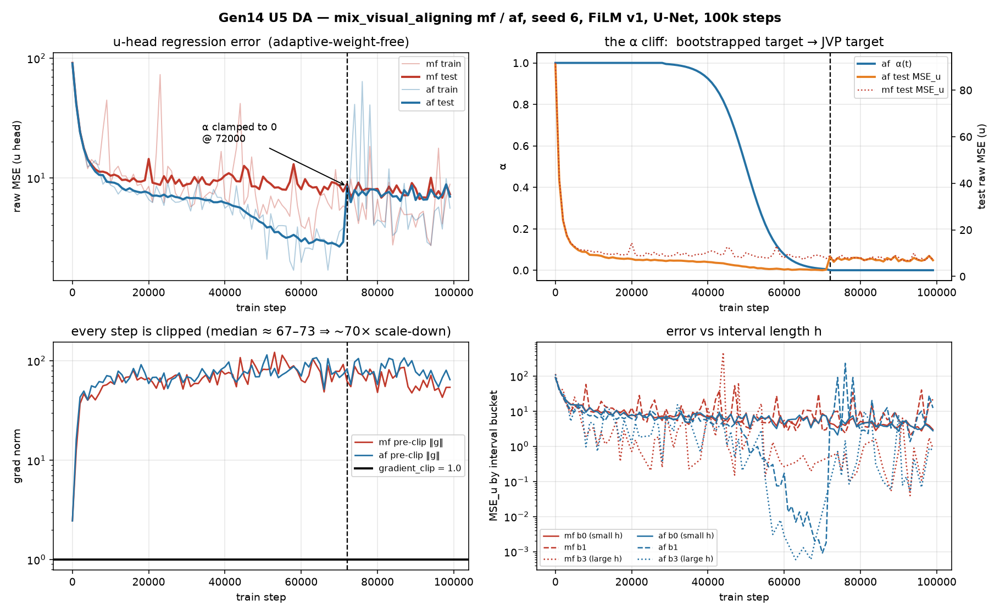
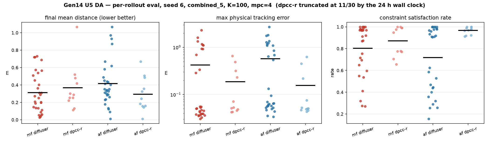
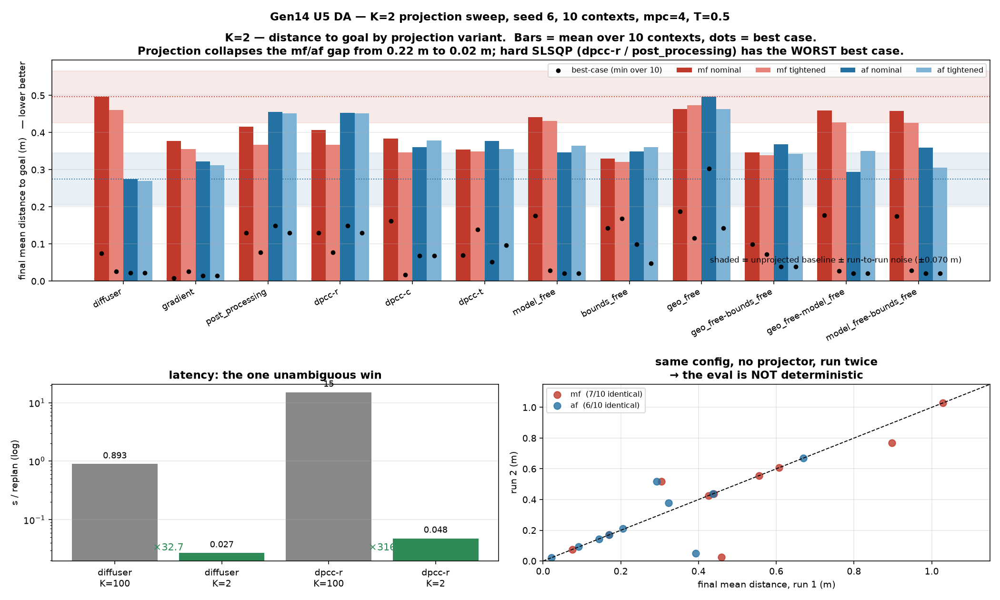

# DA — Gen14 first mf / af visual-aligning train + eval (seed 6)

**Date:** 2026-08-04
**Source:** `temp/0408/`
**Arms:** `mix_visual_aligning_mf` (MeanFlow, Gen3v6 lineage) and `mix_visual_aligning_af` (α-Flow, Gen3v7 lineage), both at `film_mode=v1`, U-Net backbone, `if_vision=True`, seed 6, 100 k steps.
**Question:** the first end-to-end mf/af visual run finished. Did it work, and if not, what is the mechanism?

> **Headline.** Both arms fail the task. But the training logs contain a clean, unambiguous causal finding that is worth more than the eval numbers: **α-Flow's test error jumps 2.9× the moment `af_alpha_clamp` snaps α to exactly 0** — i.e. the moment the objective switches from the bootstrapped target to the JVP MeanFlow target — and lands exactly on MeanFlow's own error plateau. Two independent runs, one estimator, one error floor. On top of that sit three configuration defects (100 % gradient clipping, K=100 on a few-step model, `epoch='latest'` checkpoint selection) that each independently suffice to explain the eval result.

> **⚠️ ERRATUM (added with §12).** Two things invalidate parts of what follows.
>
> **(a) Success rate is not a usable metric on this task.** The aligning success criterion is not
> reachable by any policy in this repo, so every success column below is ~0 and carries no information.
> **The metric of record is distance to goal** (`Final Mean Distance`, mean and best-case); success and
> relaxed-success are auxiliary. §12 is written on distance. §2's success row and §10's success-framed
> gates should be read as decoration, not as results.
>
> **(b) The evaluation pipeline is not deterministic.** A full K=2 sweep has since run
> (`temp/0408/minimal_K2_thres0.5/`): the same config with **no projector**, run twice, agrees on only
> 6–7 of 10 rollouts, giving a run-to-run noise floor of **≈0.07 m on mean distance**. Every single-cell
> comparison in §2, §5 and §6 is at or near that floor and should not be ranked. §12.7 lists what is
> overturned.
>
> The training-side findings (§3 α cliff, §4 gradient clipping) are unaffected — they come from
> 100-point loss histories, not from rollouts.

---

## 1. Provenance

| item | mf | af |
|---|---|---|
| Train exp | `mix_visual_aligning_mf/H8_D…VisualMeanFlow_a1.5_b1.0_aw1_VTrue_steps1000_bs64_filmv1_Emf_tslogit_normal/6` | `mix_visual_aligning_af/H8_D…VisualAlphaFlow_…_filmv1_Eaf_tslogit_normal_afschsigmoid/6` |
| Plan exp | `H8_K100_Meuler_T0.5_…_VTrue_mpc4_filmv1_Emf/6` | `…_mpc4_filmv1_Eaf/6` |
| Config snapshot | `2026-08-02 08:20:13` | `2026-08-02 20:59:04` |
| Loss history | `mf_losses.pkl` (100 log points, 0 → 99 000) | `af)losses.pkl` (same) |
| Geo variant | `combined_5` (dynamics + geo_bounds + halfspace + obstacles + action bounds) | same |
| Projection variants run | `diffuser` (30/30), `dpcc-r` (**11/30, truncated**) | `diffuser` (30/30), `dpcc-r` (**11/30, truncated**) |

Training hyperparameters, from the snapshot: `lr=2e-4` (1 k warmup, cosine → 5.02e-8), `batch_size=64`, `ema_decay=0.995`, `n_train_steps=1e5`, `gradient_clip=1.0`, `dual_head=True`, `interval_cfg=False`, `t_schedule=logit_normal`, `p_mean=-0.4`, `p_std=1.0`. af adds `af_alpha_scheduler=sigmoid`, `α: 1→0` over `[0, 1e5]`, `af_alpha_gamma=25.0`, **`af_alpha_clamp=0.005`**.

**Housekeeping.** `temp/0408/` contains the af tree **four times** at different nesting depths (`./6/…`, `./H8_K100_…/6/…`, `./H8_D…/H8_K100_…/6/…`, `./mix_visual_aligning_af/…`) — byte-identical (md5 `1b70a03136…`, 70 200 B on every copy of `eval_diffuser_train_set.log`). A drag-and-drop / partial-path download artifact, not four runs. The mf tree appears once. `01_01_20_eval_fmv3_ode_job_24198.log` is unrelated — it is a **state-only avoiding-d3il** FMv3-ODE eval (job 24198, `flow_matcher_v3_ode_selectable`), not part of this generation; ignored here.

---

## 2. Headline eval numbers

`diffuser` = generation only, no projection. Full 30 contexts, both arms.

| metric | **mf** | **af** |
|---|---:|---:|
| Success rate | **0.0333** (1/30) | **0.0333** (1/30) |
| Final mean distance | 0.3113 ± 0.2231 m | 0.4165 ± 0.2592 m |
| Best single rollout | 0.0276 m | 0.0108 m |
| Steps (all trials) | 394.5 ± 29.4 | 390.7 ± 49.9 |
| Physical tracking error (mean / max) | 0.1028 / **2.2999** m | 0.1775 / **2.7194** m |
| Inference time / replan | 0.893 s | 0.902 s |
| Exec constraint sat rate | 0.804 ± 0.238 | 0.718 ± 0.298 |
| Violated steps / rollout | 78.4 (bounds 58.2, hs 16.7, obs 5.4) | 111.8 (bounds 86.4, hs 16.4, obs 14.6) |
| Plan post-projection viol rate | 0.104 | 0.224 |
| Zero-violation rollouts | 6/30 | 6/30 |

The box does move — mean box-to-target distance goes 0.4547 → 0.2200 m (mf) and 0.4547 → 0.3598 m (af) — so the policy is not inert. It just does not finish: 3/30 (mf) and 2/30 (af) rollouts never moved the box at all, and 4/30 (mf) / 7/30 (af) pushed it **further away** than it started.

`dpcc-r` was **killed by the wall clock at rollout 11/30 in both arms** (see §6), so those cells are 11-context partials and are only ever compared against the first 11 `diffuser` contexts below.

---

## 3. The finding: the α cliff



`train/loss` and `test/loss` are pinned near 1.0 by adaptive weighting (mf 0.926, af 0.989 at the end) and carry no signal — as expected. The real quantity is `raw_mse_u`.

α-Flow's `compute_u_target` has **two structurally different branches** (`af_diffusion.py:552` / `:581`):

- **α > 0** — bootstrapped / discrete: step toward data by `dt = α·h` at the analytic velocity, query the model there, form the target from the two-point difference.
- **α ≤ 0** — the continuous branch: Gen3v6's forward-mode JVP, `u_tgt = v + h · d/dr[u]` via `_jvp(_u_of, (x_r, r, h), (v_inst, ones, -ones))`.

`af_alpha_clamp=0.005` snaps α to exactly 0 once the sigmoid drops below 0.005. In this run that happens between logged steps 71 000 and 72 000:

| step | α | `discrete_frac` | **test raw MSE (u)** |
|---:|---:|---:|---:|
| 69 000 | 0.008577 | 0.406 | 2.779 |
| 70 000 | 0.006693 | 0.547 | **2.657**  ← af's best |
| 71 000 | 0.005220 | 0.484 | 2.911 |
| **72 000** | **0.000000** | **0.000** | **8.504** |
| 73 000 | 0.000000 | 0.000 | 6.256 |
| 74 000 | 0.000000 | 0.000 | 7.914 |
| 75 000 | 0.000000 | 0.000 | 7.117 |

**2.911 → 8.504 in one logging interval — a 2.9× step change**, against a curve that had been descending smoothly and monotonically for 70 k steps (12.58 → 2.66). It never recovers: steps 72 k–99 k sit in the band 6.3–8.6.

That band is **MeanFlow's band**. mf, which runs the α=0 JVP branch from step 0, plateaus at test MSE 7–10 from step ~10 k onward and finishes at 7.29 (best 6.65 @ 91 k). So:

> Two independently-initialised, independently-trained runs land on the same test-error floor as soon as — and only as soon as — they use the same estimator. α-Flow at α ≈ 0.005–0.02 reaches **2.66**, i.e. **2.5× better than either run ever achieves under the JVP target.**

The interval-bucket panel (bottom-right of fig. 1) makes the same point per-`h`: af's `h_mse_b1` and `h_mse_b3` (the long-interval buckets, which is where few-NFE sampling actually lives) drop to ~1e-3 in the window 55 k–71 k and jump back to 10⁰–10¹ at the cliff. mf never gets below ~0.5 in b2/b3 until very late and is unstable there.

**Two candidate readings, and they are separable:**

1. **The JVP target is genuinely worse on this problem** (visual conditioning, 128-d latent, U-Net). The `d/dr[u]` tangent is a single-sample estimate of a derivative through the whole conditioned network; the bootstrapped target at small α is a two-point finite difference of the *same* quantity, and finite differences are famously better-conditioned than exact derivatives when the function is noisy.
2. **The clamp is the bug, not the branch.** α does not decay to 0 — it is *snapped* there from 0.0052. The model spent 70 k steps adapting to a target that always had a discrete component (`discrete_frac` ≈ 0.5 throughout, since it also depends on `mf_mask`), and then that component vanishes entirely in one step. This is a distribution shift in the *target*, not in the data.

Reading 2 predicts the jump would shrink or vanish if α were annealed to, say, 1e-4 without clamping, or if the clamp were removed. Reading 1 predicts it would not. **That is a one-run experiment** and it is the single highest-value follow-up in this report — see §13.

Either way, the operational conclusion is the same and immediate: **`af_alpha_end: 0.0` is throwing away the best model this generation has produced.** af at α ≈ 0.007 is the best checkpoint in either arm by a factor of 2.5.

---

## 4. Every gradient step was clipped

| | mf | af |
|---|---:|---:|
| pre-clip ‖g‖ at step 0 | 2.46 | 2.45 |
| median over logged steps | **67.2** | **72.6** |
| p90 | 88.4 | 97.4 |
| max | 121.9 | 114.9 |
| fraction of logged points with ‖g‖ > `gradient_clip`=1.0 | **1.000** | **1.000** |

`gradient_clip: 1.0` is inherited from Gen3v6/v7, where it is applied to a **state-only** model. Here the gradient norm is two orders of magnitude larger — plausibly because the ResNet-18 vision encoders train end-to-end (`mf_freeze_vision_encoder: False`) and contribute the bulk of the norm.

Consequence: after step ~2 k, **every** update is renormalised to unit norm. The optimiser is running normalised/sign-like descent at ~1/70 the nominal step size, and the cosine LR schedule underneath it is largely decorative — the *direction* is preserved but the *relative* scaling between the encoder and the trunk is destroyed on every step. This is the strongest single explanation for why mf's test curve is flat from step 10 k to step 99 k (10.4 → 7.3 over 89 k steps).

This confirms, on two new arms, the standing lead from the earlier Gen14 curve analysis. It is not a new hypothesis; it is now a measurement on `mf` and `af` as well.

---

## 5. The policy collapses to "do nothing"

Parsing the `[ DIAG replan=… ]` lines (sampled every 50 replans, 236 samples for mf-diffuser, 234 for af-diffuser):

| run | fraction of sampled replans with ‖a₀‖ < 1 mm | direction z < −0.9 | **both** | median ‖a₀‖ |
|---|---:|---:|---:|---:|
| mf `diffuser` | 0.513 | 0.538 | **0.513** | 0.426 mm |
| af `diffuser` | 0.325 | 0.350 | **0.325** | 8.23 mm |
| mf `dpcc-r` | 0.211 | 0.232 | 0.211 | 8.16 mm |
| af `dpcc-r` | 0.191 | 0.213 | 0.191 | 8.17 mm |

The stall and the "pressing straight down" direction are **the same event** (the `both` column equals the `stalled` column exactly). And the stalled output is not arbitrary. The act normalizer is `mins=[-0.0083,-0.0083,-0.0083]`, `maxs=[0.0083,0.0083,0.0134]`. A physical zero action normalises to

```
z_norm = (0 − 0.00255) / 0.01085 = −0.235
```

and the observed stalled outputs are `norm|a0| ≈ 0.23`–`0.25` with `dir ≈ [~0, ~0, −1]`. **The model is emitting, to three digits, the normalised encoding of the zero action** — i.e. the marginal mean of the action distribution. This is textbook regression-to-the-mean / mode collapse, exactly what a heavily-clipped, under-converged L2 objective produces.

mf stalls on **51 %** of sampled replans vs af's **33 %** — consistent with mf's 2.4× worse test `raw_mse_u`. The per-bucket breakdown shows mf's stall concentrated in replans 100–300 (73 % / 62 %), i.e. the policy gets the approach right, reaches the box, and then stops.

---

## 6. Projection works. It just cannot be afforded.



Paired on the 11 contexts `dpcc-r` reached:

| | mf `diffuser` → `dpcc-r` | af `diffuser` → `dpcc-r` |
|---|---|---|
| Constraint sat rate | 0.839 → **0.872** | 0.805 → **0.966** |
| Violated steps / rollout | 64.0 → 51.4 | 78.2 → **13.5** |
| bounds / hs / obs | 37.0/21.5/6.9 → 46.3/0.0/5.1 | 48.3/0.2/29.7 → 6.7/0.8/6.0 |
| Plan post-proj viol rate | 0.128 → **0.018** | 0.155 → **0.009** |
| Max tracking error (mean) | 0.376 → **0.186** m | 0.384 → **0.156** m |
| Rollouts with tracking error > 1 m | 6/30 → **0/11** | 9/30 → **0/11** |
| Final mean distance | 0.247 → 0.368 m | 0.370 → **0.294** m |

The tracking-error panel of fig. 2 is bimodal: a controlled cluster at 0.03–0.09 m and a blown-up cluster at 0.3–2.7 m. **DPCC-R eliminates the blown-up cluster entirely** — zero rollouts above 1 m in either arm. Constraint satisfaction and post-projection violation rate both improve substantially, af dramatically (13.5 violated steps vs 78.2). Task distance is unchanged within noise. The projector is doing its job; the generator is the problem.

**But the cost is prohibitive:**

| run | s / replan | s / rollout | measured | projected 30 rollouts |
|---|---:|---:|---|---:|
| mf `diffuser` | 0.893 | 377 | 11 326 s (30/30) ✅ | 3.15 h |
| af `diffuser` | 0.902 | 377 | 11 302 s (30/30) ✅ | 3.14 h |
| mf `dpcc-r` | 14.99 (min 9.3, max 19.7) | ~6 020 | 66 239 s at 11/30, `~114 413 s to go` | **~50.2 h** |
| af `dpcc-r` | 16.42 (min 4.0, max 29.9) | ~6 375 | 70 130 s at 11/30, `~121 134 s to go` | **~53.1 h** |

Against a 24 h Slurm cap, `dpcc-r` cannot finish 30 contexts. Both jobs died mid-sweep. And the eval YAML lists **12 projection variants**, of which 11 involve projection — a full sweep at this cost is ≳ 500 h per seed. That is not a tuning problem, it is a design problem.

The `⚠ PROJECTION CIRCUIT-BREAKER TRIPPED` warning fired in 1 mf rollout and 2 af rollouts ("sustained SLSQP slowness", 4 unprojected steps in af's rollout 10) — those rollouts' constraint metrics are explicitly flagged invalid by the eval script itself.

---

## 7. K=100 on a model whose entire premise is K≈1

The plan folder is `H8_K100_…`. `flow_steps_v3 = 100` was inherited verbatim from `plan_fm_visual_aligning`, because `_mix_plan_common` copies every key from the FM plan template that is not `prefix`/`exp_name`/`diffusion`/`diffusion_loadpath`. Nothing in the mf/af plan blocks overrides it.

`mf_diffusion.py:202` reads `flow_steps = num_steps if num_steps is not None else self.flow_steps_v3`, so the sampler really does run 100 Euler steps of the two-time u-head, × `mpc_batch_size=4` candidates = **400 backbone evaluations per replan**. At 0.89 s/replan that is ~8.9 ms per (batched) call, which matches the 8.4–9.4 ms/NFE measured in the state-only DA.

This is not merely wasteful — it **inverts the claim the generation exists to test**. The Gen3v6/v7 state-only DA (`logs_in_develop/Gen3v6_MeanFlow/DA/DA_20260802_K2_MeanFlow_AlphaFlow_vs_FM_DPCC.md`) evaluated MF and AF at **K=2**, and found AF at 0.0122 s and MF at 0.0168 s generation time, 11–15× faster than FM at K=20, with 1.000 success under `dpcc-r-tightened`. Gen14 is running the same two methods at **50× that step count** and reporting 0.9 s.

Cross-generation contrast, for the record:

| | Gen3v6/v7 (state-only) | Gen14 (visual) |
|---|---|---|
| K | 2 | **100** |
| Backbone | MF-DiT / SiT | **U-Net + FiLM v1** |
| Task | avoiding-d3il, halfspace | aligning-d3il-visual, combined_5 |
| Gen time | 0.012–0.017 s | 0.89–0.90 s |
| Success (best projection) | 1.000 (AF), 0.967 (MF) | 0.033 |

Three axes differ at once (K, backbone, task), so this is not an attribution — but K is the one that is free to fix and is unambiguously wrong for a few-step method.

At K=1 the `diffuser` sweep would drop from 3.15 h to ~2 min. It would **not** rescue `dpcc-r`: generation is only 0.89 s of the 15–16 s there, the remaining ~14 s is SLSQP. Fixing the K and fixing the projection budget are independent problems.

---

## 8. The evaluated checkpoint is not the best checkpoint

`eval_mix_visual_aligning.py:2284` — `if epoch == 'latest': epoch = utils.get_latest_epoch(loadpath)`. Both evals therefore loaded the **step-99 000** checkpoint.

| arm | best test `raw_mse_u` | @ step | final (evaluated) | penalty |
|---|---:|---:|---:|---:|
| mf | 6.648 | 91 000 | 7.293 | 1.10× |
| af | **2.657** | 70 000 | 6.959 | **2.62×** |

For mf this is minor. For af it is the whole ballgame: the evaluated checkpoint is on the wrong side of the α cliff, 2.6× worse than the model that existed 29 k steps earlier. **The α-Flow arm has never been evaluated at its own optimum.** If intermediate checkpoints were retained, evaluating af @ 70 000 is a zero-training-cost experiment.

(Train `raw_mse_u` shows the same shape: mf best 2.705 @ 94 k → 8.844 final, 3.3×; af best 1.685 @ 58 k → 5.570 final, 3.3×.)

---

## 9. What this run does and does not establish

**Established:**

1. The mf and af arms train end-to-end and evaluate end-to-end under vision. The plumbing works — no crashes, correct normalizers, correct paths, correct engine dispatch, 100 clean logging intervals on both.
2. The JVP MeanFlow target (α=0) sits at a distinctly worse error floor than the bootstrapped target (α ≈ 0.005–0.02) on this task, demonstrated twice: as a step change within the af run, and as a plateau across the whole mf run. Effect size ≈ 2.5×.
3. `gradient_clip=1.0` clips 100 % of steps at a median pre-clip norm of 67–73.
4. DPCC-R projection removes all tracking-error blowups and cuts post-projection violations by 7–17×, at 17–18× the inference cost.
5. The `dpcc-r` sweep as configured cannot complete inside the Slurm cap.

**Not established:**

- **Nothing about FiLM v1 vs v2 on these arms.** This run is v1 only. The U5 v2 port has never been trained or evaluated, and G7 has still never run.
- **Nothing about mf vs af as methods.** They tie at 1/30 success, and the af arm was evaluated 29 k steps past its optimum. The comparison is not yet meaningful.
- **No seed variance.** Seed 6 only.
- **Nothing attributable to the backbone.** Both are U-Net; the state-only comparison points are DiT/SiT (see U5 changelog §8).

---

## 10. Pareto conclusion — fewer steps, less time, or both?

The question this generation ultimately has to answer: **at equal success + constraint satisfaction, do
the two-time arms buy fewer environment steps, less wall time per replan, or both?**

### 10.1 For Gen14 visual: the question is currently undefined

You cannot hold "same success + constraints" fixed when **both arms are at 1/30**. And the step axis is
worse than unmeasured — it is actively misleading:

| | mf | af | episode cap |
|---|---:|---:|---:|
| Avg steps (all trials) | 394.5 ± 29.4 | 390.7 ± 49.9 | 400 |

Essentially every rollout runs to the cap. Those are **timeouts, not "slow but successful" runs**, so the
mean step count measures nothing but the cap. This is exactly the caveat the state-only DA flagged
(its §6: *"`n_steps` is episode length including failures — it is only interpretable when success ≈ 1.0"*).

The latency numbers are equally moot: 0.89 s/replan was measured at K=100, which U6 has now abandoned as
the operating point. **No Pareto statement about Gen14 is available from this run, in any direction.**

### 10.2 The reference frontier — what K=2 is actually chasing

From the state-only lineage (`logs_in_develop/Gen3v6_MeanFlow/DA/DA_20260802_K2_MeanFlow_AlphaFlow_vs_FM_DPCC.md`),
whose §9 raw re-analysis supersedes its own §4/§5 where they disagree. Paired by seed, 15 matched
(seed × env) pairs, `dpcc-*-tightened`:

| AF K=2 vs | success + constraints | wall time / replan | environment steps | **verdict** |
|---|---|---|---|---|
| **DPCC K=10** | tie — Δ +0.100, CI [0.000, +0.200], p = 0.250 | **win ×13–16, 15/15 pairs** | **win −6.8 to −7.9 steps, CI excludes 0** | **BOTH** |
| **FM K=20** | tie — Δ +0.133, CI [+0.033, +0.267], p = 0.125 | **win ×19–23, 15/15 pairs** | tie — +0.5 / −0.9, CI includes 0 | **TIME ONLY** |
| **C109** (K=1 ODE diffusion) | identical — 0/0/15, Δ 0.000 | **loss** — 0.0202 s vs 0.0173 s (~15 % slower) | **win −4.7 steps, 12/13 pairs** | **NEITHER — a real trade** |

And for MeanFlow specifically, one sign flips:

| MF K=2 vs | quality | time | steps | verdict |
|---|---|---|---|---|
| DPCC K=10 | tie (Δ +0.067, ns) | **win ×12.7–13.0** | win −4.7 (`dpcc-r-t`), ns on `dpcc-t-t` | time yes, steps marginal |
| FM K=20 | tie (Δ +0.100, ns) | **win ×19–34** | **LOSS +6.8, CI [+2.3, +11.2]** | **time only, and it pays in steps** |

**So the honest three-part answer:**

1. **Versus DPCC — both.** AF is strictly Pareto-dominant: same quality, ~15× less latency, *and* ~7 fewer
   environment steps. Nothing is traded away. This is the one clean domination in the data.
2. **Versus FM — time only.** The step counts are a genuine tie for AF, and MF is significantly *worse*
   (+6.8 steps). "Fewer steps than FM" is not supportable and should not be written.
3. **Versus a 1-NFE diffusion baseline — neither.** AF and C109 are **mutually non-dominated**: AF buys
   4.7 fewer environment steps by spending ~15 % more latency. Both sit on the frontier. Any claim that
   few-step *flow* models are needed for real-time PCC has to contend with this, because C109 gets there
   without MeanFlow or α-Flow.

⚠️ **Do not write "MF/AF improve constraint satisfaction."** No quality comparison in that batch reaches
significance in either direction, and unprojected every arm is unsafe. The projection delivers safety;
the generator delivers cost.

### 10.3 The axis that is not a Pareto trade at all

The strongest result in the reference data is orthogonal to all three axes above — the **failure mode**:

| candidate | lost episodes (3 tightened variants) | goal-fails (timeout) | **constraint trips** |
|---|---:|---:|---:|
| AlphaFlow K=2 | 14 | 14 | **0** |
| MeanFlow K=2 | 17 | 17 | **0** |
| DPCC K=10 | 3 | 0 | **3** |
| FM K=20 | 4 | 0 | **4** |

AF and MF **fail safe** (liveness failure: they time out, `total_violations` = 0.0 on all 31 lost
episodes). The baselines **fail unsafe** (they always reach the goal, sometimes through a violation).
That is a categorical difference, not a point on a frontier, and for a constrained-control paper it is a
stronger claim than any success-rate or latency comparison.

**Whether this reproduces under vision is Gen14's actual open question** — and it is untestable until an
arm clears the success floor.

### 10.4 What the pending K=2 visual run must show to claim anything

In order; each gate must pass before the next is meaningful.

| # | gate | why |
|---|---|---|
| 1 | success + constraints ≫ 1/30 on at least one arm | below this the frontier is undefined; §10.1 |
| 2 | avg steps < the 400 cap on the successful subset | otherwise the step axis is measuring the timeout, not the policy |
| 3 | latency at K=2 ≈ 0.018 s/replan generation, `dpcc-r` ≈ 0.3 s/replan | the predicted 50× / 50× cut (U6 §1.1); if it does not appear, the cost model is wrong |
| 4 | step comparison restricted to **matched (context, seed) pairs where both arms scored 1.0** | comparing means across different success rates is meaningless — the mistake the state-only DA's §9.3 corrects |
| 5 | failure-mode split: timeout vs constraint trip | tests §10.3 under vision, the highest-value claim available |

Only after gate 4 can this generation say "fewer steps", "less time", or "both" about the visual task.
Right now it can say none of the three.

---

## 11. `temp/0408/dpcc/` — the DPCC threshold sweep did not sweep anything

> **Out of Gen14 scope.** This is `avoiding-d3il` **state-only**, the Gen0/DPCC baseline lineage, not
> visual aligning. Kept here because it shipped in the same `temp/0408/` delivery and it constrains how
> the DPCC baseline numbers in §10 should be read.

Two jobs, same checkpoint (step 91 000), same seed, K = 20, `n_trials: 2`, 3 envs × 13 variants = 39
cells each, one config key apart:

| | job 24215 | job 24226 |
|---|---|---|
| Savepath | `…/H8_K20_**T0.1**_…` | `…/H8_K20_**T0.05**_…` |
| YAML snapshot | `diffusion_timestep_threshold: 0.1` | `0.05` |
| Git rev | `1b3c080` | `3e84451` |

**Result: 39/39 cells bit-identical**, including continuous violation magnitudes to all six printed
decimals (`tviol 9.667000/9.667000`). Mean compute time 0.3985 s vs 0.4025 s — 1 %, node noise, not
tracking the threshold.

**Cause.** `scripts/eval.py:205-206` builds the `Projector` without passing
`diffusion_timestep_threshold`; `diffuser/sampling/projection.py:8` defaults it to `0.5`. Both jobs ran
at 0.5. The YAML value reaches `config/avoiding-d3il.py:12` → `args_to_watch` → `exp_name` → the
**directory name**, and nowhere else. At K = 20 the intended sweep was 3 vs 2 projection steps; what ran
was 11 both times. Both folder names are wrong.

**This is a known bug that was never propagated.** `FM_v3_hardflow_test/eval_FM_v3_hardflow.py:68-77`
fixes exactly this, as `[Gen12fix8]`, and its comment predicts the failure mode measured above:

> *"DPCC threshold was ORPHANED CONFIG … Gen12's port dropped both lines. Restored here + passed to
> Projector below. Harmless so far (YAML said 0.5 == the default), but it blocks any theta != 0.5 sweep."*

Balanced-paren audit of every `Projector(` call site:

| wired ✅ | not wired ❌ |
|---|---|
| `FM_v3_ode_selectable_test`, `FM_v3_meanflow_test`, `FM_v3_alphaflow_test` | **`scripts/eval.py`** ← the DPCC baseline entry point |
| `FM_v3_imeanflow_test` (both), `FM_v3_drifting_test`, `FM_v3_hardflow_test` | `FM_v3_test`, `FM_test`, `FM_v2_test`, `FM_Unet_v2_test`, `FM_hp_tune_test` |
| `fm_visual_avoiding_test`, `mix_visual_aligning_test/eval_*` | `diffuser_visual_avoiding_test`, `mix_visual_aligning_test/gates_mix_visual.py` |

So the entire Gen3v* FM lineage is fine — **every MF/AF/HardFlow threshold result is valid.** The gap is
the Gen0/DPCC entry point and some older FM folders.

**Second defect, found by the same comparison.** `post_processing` is a silent alias for `dpcc-r` in
`scripts/eval.py`: identical in all three envs, both jobs, and for the `-tightened` pair. That script has
no `post_processing` branch — `trajectory_selection` keys only off `dpcc-t`/`dpcc-c` (`:209-211`),
constraints only off `model_free`/`tightened` (`:185-190`), `gradient` only off `gradient` (`:183`). The
two variants differ in no argument at all. ⚠️ Any state-only table from `scripts/eval.py` reporting
`post_processing` as a distinct baseline is reporting a duplicate `dpcc-r` row.

**Related but distinct:** `temp/0308/K20_thres0.1_mpc4_n2` (job 24179) is a *correct* run — it goes
through the fixed HardFlow script. But it varies **`act_thr` (HardFlow activation), not
`diffusion_timestep_threshold`**: the log shows `act_thr=0.1` on all 18 compute lines and never sets
`DPCC_THRESHOLD`. The two are independent knobs, so **the DPCC threshold sweep still has no valid data
anywhere.**

**Fix (proposed, not applied)** — a copy of Gen12fix8 into `scripts/eval.py`:

```python
dpcc_threshold = float(os.environ.get('DPCC_THRESHOLD',
                                      config.get('diffusion_timestep_threshold', 0.5)))
# ... Projector(..., diffusion_timestep_threshold=(0.0 if 'post_processing' in variant
#                                                  else dpcc_threshold))
```

It is a shared entry point (`eval_dpcc_job.sh`, `eval_fmv3_ode_job.sh`, the DA batch pipeline), and every
existing `T*` folder in the state-only tree was produced at 0.5 regardless of its name, so this needs a
deliberate decision. Until then, treat the two `temp/0408/dpcc/` directories as **one duplicated T=0.5
run**, not two data points.

---

## 12. The K=2 sweep — distance to goal

**Source:** `temp/0408/minimal_K2_thres0.5/`, both arms, **12 projection variants × 2 geo variants
(`combined_5`, `combined_5-tightened`) = 48 cells**, seed 6, `n_contexts: 10`, `mpc4`, T = 0.5.

> **Metric.** The **distance to goal** (`Final Mean Distance`, m — mean over the 10 contexts, and the
> best-case min) is the metric of record throughout this section. Binary success is **not** used: the
> aligning task's success criterion is not reachable by any policy in this repo, so a 0/10 column carries
> no information and ranking on it is meaningless. Success and relaxed-success are recorded as auxiliary
> only. Everything ranked below is ranked on distance.

The full sweep the K=100 run could not afford now completes. That part of §6/§7 held. **§12.1 is the
precondition for reading any number in this section.**



### 12.1 🔴 The noise floor is ±0.07 m, and most differences are smaller than that

`diffuser` constructs **no projector**, so its cell under `combined_5` and under `combined_5-tightened`
is the identical computation — the geo variant only changes constraints a projector would have used.
They do not agree:

| arm | rollouts identical | mean per-rollout \|Δ\| distance | worst single rollout |
|---|---:|---:|---|
| mf | **7 / 10** | **0.078 m** | 0.433 m |
| af | **6 / 10** | **0.063 m** | 0.341 m |

A second replicate says the same. At K = 2 with T = 0.5, `dpcc-r` projects from
`loop_idx ≥ int(0.5·2) = 1` and `post_processing` (threshold forced to 0) projects from
`int(1.0·2) = 2`, falling through to the `loop_idx == K−1` clause — **both project exactly once, at the
final step.** Same computation, two labels; they also diverge on up to 5 of 10 rollouts.

**So: run-to-run noise on mean distance is ≈ 0.07 m.** With n = 10 the SE on a paired mean difference is
≈ 0.02–0.14 m depending on variant. Differences below ~0.07 m are not measurements. Every claim below
states its margin, and where a gap sits inside the band I say so instead of ranking it.

This retroactively weakens §2 and §6, which rank single unreplicated cells. §3 and §4 are unaffected —
they come from 100-point loss histories, not rollouts.

### 12.2 Did K = 100 → 2 cost distance? — no

Paired on contexts 0–9 (K=100 ran 30; contexts are index-deterministic, so its first 10 are the same 10):

| arm | variant | mean distance K=100 → K=2 | Δ | better in | best-case K=100 → K=2 | **speed-up** |
|---|---|---|---:|---:|---|---:|
| mf | `diffuser` | 0.257 → 0.496 | **+0.239** | 4/10 | 0.028 → 0.075 | ×32.7 |
| mf | `dpcc-r` | 0.376 → 0.407 | +0.031 | 4/10 | 0.111 → 0.130 | **×315.8** |
| af | `diffuser` | 0.383 → 0.275 | **−0.108** | 7/10 | 0.090 → 0.022 | ×32.8 |
| af | `dpcc-r` | 0.273 → 0.453 | **+0.180** | 1/10 | 0.010 → 0.149 | **×273.8** |

Against a ±0.07 m floor: one clear regression (af/`dpcc-r`), one clear improvement (af/`diffuser`), one
borderline regression (mf/`diffuser`), one null (mf/`dpcc-r`). **The sign is not consistent across arms
or variants.** There is no evidence that dropping 100 → 2 sampling steps costs distance to goal, and none
that it helps. At this model's quality level K is not what limits distance — a policy emitting the zero
action on a third to a half of replans (§5) is not step-count-limited.

### 12.3 Projection collapses the difference between the two arms

This is the clearest signal in the sweep, and it is about distance, not constraints.

| | mf | af | **gap** |
|---|---:|---:|---:|
| `diffuser`, nominal | 0.496 | 0.275 | **0.222 m** |
| mean of the 11 projected variants, nominal | 0.404 | 0.380 | **0.023 m** |
| `diffuser`, tightened | 0.461 | 0.269 | **0.192 m** |
| mean of the 11 projected variants, tightened | 0.382 | 0.376 | **0.006 m** |

Unprojected, the two arms are 0.22 m apart — three times the noise floor. Projected, they are 0.006–0.023 m
apart, i.e. **indistinguishable**, and both land in the same 0.29–0.50 m band regardless of which
projection variant is used. Every projected variant moves mf *down* and af *up*, toward a common
attractor near 0.38 m.

> **The projected trajectory is dominated by the projector, not by the generator.** Whatever difference
> MeanFlow and α-Flow have learned is erased once the constraint machinery runs.

⚠️ **Confound, and it is not small.** `eval_mix_visual_aligning.py:2619-2622` sets `batch_size = 1` for
`diffuser` and `mpc_batch_size = 4` for every other variant. So the unprojected baseline differs from the
projected cells in **two** ways: no projection *and* one candidate instead of four. Selecting the best of
4 draws under a selection rule is itself a variance-reducing operation that would pull both arms toward a
common value. **This sweep cannot separate "projection washes out the arm" from "a 4-candidate MPC pool
washes out the arm."** There is no batch=4 unprojected cell in the run, because `no_constraint` is not in
`active_geo_variants`. Adding it is one config line and one cheap job (§13) and it settles the question.

### 12.4 Best-case distance: hard SLSQP projection is the *worst* thing you can do

Minimum distance over the 10 contexts — how close the policy gets when it works.

| variant | mf nom | mf tgt | af nom | af tgt | **best** |
|---|---:|---:|---:|---:|---:|
| **`gradient`** | **0.008** | 0.025 | 0.014 | 0.014 | **0.008** |
| `dpcc-c` | 0.162 | **0.017** | 0.068 | 0.068 | 0.017 |
| `model_free` | 0.176 | 0.029 | **0.021** | **0.021** | 0.021 |
| `geo_free-model_free` | 0.178 | 0.027 | 0.021 | 0.021 | 0.021 |
| `model_free-bounds_free` | 0.174 | 0.028 | 0.021 | 0.021 | 0.021 |
| `diffuser` (no projection) | 0.075 | 0.025 | 0.022 | 0.022 | 0.022 |
| `geo_free-bounds_free` | 0.099 | 0.073 | 0.039 | 0.039 | 0.039 |
| `bounds_free` | 0.143 | 0.169 | 0.099 | 0.048 | 0.048 |
| `dpcc-t` | 0.070 | 0.139 | 0.051 | 0.097 | 0.051 |
| **`dpcc-r`** | 0.130 | 0.077 | 0.149 | 0.129 | **0.077** |
| **`post_processing`** | 0.130 | 0.077 | 0.149 | 0.129 | **0.077** |
| `geo_free` | 0.188 | 0.116 | 0.304 | 0.142 | 0.116 |

Two things stand out, and unlike §12.3 they are consistent across all four columns:

1. **`gradient` — the soft projection — has the best best-case everywhere** (0.008–0.025 m), beating even
   the unprojected baseline in 3 of 4 columns. It nudges the trajectory with a cost gradient rather than
   solving a hard NLP, so a trajectory that was already heading to the goal stays heading there.
2. **`dpcc-r` and `post_processing` — the hard SLSQP projections — have the worst best-case of any
   projected variant** (0.077–0.149 m), 6–18× worse than `gradient`. Their *mean* distance is unremarkable
   (0.37–0.45 m, mid-table); it is specifically the good rollouts they destroy. A hard projection onto the
   feasible set moves a near-goal trajectory off the goal, and `trajectory_selection='random'` (which is
   what `dpcc-r` means) does not select for the candidate that stayed close.
3. `dpcc-c` (`minimum_projection_cost`) and `dpcc-t` (`temporal_consistency`) sit between the two, which
   is the expected ordering: both select the candidate that was perturbed least.

**So on distance, the projection variants order `gradient` > `dpcc-c` ≳ `dpcc-t` > `dpcc-r` ≡ `post_processing`.**
That ordering is the opposite of the constraint ordering in §12.5 — `dpcc-t-tightened` is the only cell
with zero violations and it is 4th-from-last on best-case distance. That trade is the actual result of
this sweep.

### 12.5 Constraints (auxiliary)

Recorded for completeness; distance above is the metric being optimised.

- **`dpcc-t-tightened` reaches 1.000 satisfaction with 0.0 violated steps on both arms** — zero variance,
  the only unambiguous constraint cell. `bounds_free-tightened` follows at 0.998.
- **Without tightening, projection buys nothing measurable.** mf goes 0.850 unprojected → 0.878 `dpcc-r`;
  `dpcc-c` (0.847) and `dpcc-t` (0.802) are *below* the unprojected baseline. All inside the noise band.
  It is the δ = 0.03 tightening margin, not the projection step, that does the work — nominal projection
  lands the trajectory *on* the boundary and execution noise pushes it across.
- **The geo family is what binds**: `geo_free*` is the worst block (0.757–0.896) and the only ablation
  whose degradation clears the noise floor.
- **The action bound is counterproductive on both axes.** `bounds_free-tightened` beats the full stack
  `dpcc-r-tightened` on constraints (0.998 vs 0.979 / 0.935) *and* is mid-table on distance. Removing a
  constraint improving satisfaction of the others means the SLSQP is over-constrained: `action_bounds:
  'auto'`, self-derived from the dataset action range, is fighting the geometry for feasibility.

### 12.6 Latency — the only claim needing no caveat

| | K = 100 | K = 2 | factor |
|---|---:|---:|---:|
| `diffuser` (generation only) | 0.893 s | 0.027 s | **×32.7** |
| `dpcc-r` (generation + projection) | 14.99 s | 0.048 s | **×315.8** |
| full 12-variant × 2-geo sweep | ≳ 500 h/seed (est.) | **completed** | — |

×316 beats the ×50 predicted in the U6 changelog because both factors compound: 50× fewer network
evaluations **and** 50 → 1 SLSQP solves per replan (`snapping_start_idx = int((1−T)·K)`).

### 12.7 What §12 overturns

| earlier claim | status |
|---|---|
| §6 *"Projection works. It just cannot be afforded."* | **Half wrong.** Affordable now — and on *distance* the hard variants actively hurt the best case (§12.4). On constraints it only works tightened. |
| §7 implication that K=100 was hurting quality | **Tested and null.** K=2 is 32–316× cheaper at no measurable distance cost in either direction. The cost argument stands. |
| §2 / §6 single-cell rankings | **Weakened** by §12.1 — anything under ~0.07 m is noise. |
| §10 gates 1 and 4 (framed on success rate) | **Retired.** Success is not a usable metric on this task; §10's Pareto question should be re-posed on distance. |
| mf-vs-af as a model comparison | **Only meaningful unprojected** (§12.3), and even there confounded by the batch=1/4 split. |

---

## 13. Recommended next moves, ordered by information-per-GPU-hour

Reordered after §12. The first item is new and now outranks everything.

1. **Localise the nondeterminism (§12.1).** Run one config twice, same seed, same command — e.g.
   `mf`, `diffuser`, 10 contexts — and diff per-rollout. Minutes of GPU at K=2. Until the eval is
   reproducible, no n=10 comparison in this generation means anything, and every table above is
   provisional. Candidates: MuJoCo/EGL, cuDNN nondeterminism, SLSQP thread scheduling.
2. **Re-evaluate af @ step 70 000** (pre-α-cliff), now trivially cheap at K=2. Zero training cost if the
   checkpoint survives. Tests whether §3's cliff is what the eval measures.
3. **Disambiguate the α cliff** — one af run with `af_alpha_clamp` lowered (e.g. 1e-4) or `af_alpha_end`
   set to a small positive value. If the jump vanishes it is a clamp artifact; if it persists the JVP
   target is genuinely inferior here, which is a result. Highest-value *training* job.
4. **Raise `gradient_clip`** to ~10 or disable it. 100 % of steps clipped at a median pre-clip norm of
   67–73 (§4); the value was tuned on a state-only model with ~1/70 the gradient norm.
5. **Add `no_constraint` to `active_geo_variants`** — the missing batch=4 unprojected control (§12.3).
   Without it, "projection collapses the mf/af gap" cannot be separated from "a 4-candidate MPC pool
   collapses it". One config line, one cheap job, and it decides the sweep's headline claim.
6. **Drop `action_bounds` or widen it** (§12.5). `bounds_free-tightened` beats the full stack on
   constraints *and* is mid-table on distance — the auto-derived action cap is fighting the geometry for
   feasibility. Config-only, one job.
7. **Raise `n_contexts` well above 10** before drawing any further eval conclusion. With the §12.1 noise
   floor, n=10 cannot separate the variants that matter.
8. **Prune the variant list.** `dpcc-r` ≡ `post_processing` at K=2 (§12.1), and the nominal
   (non-tightened) half of the sweep is uninformative — every nominal cell sits inside the noise band.
   Running `{dpcc-r, dpcc-c, dpcc-t, bounds_free, geo_free} × tightened` costs a third as much and loses
   nothing.
9. **Re-pose §10's Pareto question on distance.** It is currently written on success+constraints, which
   §12 retires. The axes that survive are *distance to goal*, *env steps*, and *latency*.
10. Only after 1–4: FiLM v2 (U5's port, still never trained) and the `diffusion` / `fm` reference arms.
   **G7 has still never run.**

---

## 14. Reproduction

Figures are regenerated by `logs_in_develop/Gen14/U5/da_20260804_analysis.py` (numpy + matplotlib only,
no torch, no GPU — it runs in the AI-coding container):

```bash
python logs_in_develop/Gen14/U5/da_20260804_analysis.py      # → figs/fig1_training.png, fig2_eval.png
python logs_in_develop/Gen14/U5/da_20260804_k2_analysis.py   # → figs/fig3_k2_projection.png  (§12)
```

Inputs, all under `temp/0408/`:

```
mf_losses.pkl
af)losses.pkl                                        # note the ')' in the filename as delivered
mix_visual_aligning_mf/H8_D…Emf_tslogit_normal/H8_K100_…_Emf/6/results_train_set/combined_5/
    {diffuser,dpcc-r}_train_set/eval_*.log
6/results_train_set/combined_5/                      # = the af tree (top-level duplicate, see §1)
    {diffuser,dpcc-r}_train_set/eval_*.log
minimal_K2_thres0.5/H8_K2_…_E{mf,af}/6/results_train_set/   # §12: the K=2 sweep
    combined_5{,-tightened}/*_train_set/eval_*.log          #      12 variants × 2 geo × 2 arms
dpcc/{12_07_45_eval_dpcc_job_24215,12_42_48_eval_dpcc_job_24226}.log   # §11
```

The §12.1 noise floor is measured from the `diffuser` cell appearing under both geo variants — no
projector is constructed for that variant, so the two are the same computation and their disagreement
*is* the nondeterminism. `da_20260804_k2_analysis.py` prints it.

The tabulated statistics (§2, §5, §6) come from the same two sources: `[ Seen Training Context N Finished ]`
blocks and `[ constraints ] …` blocks in the eval logs, plus `constraint_metrics.json` for the two completed
`diffuser` runs. Where a summary already exists in the eval log's own trailer, this report quotes it rather
than recomputing — the `first_violation_step` means, in particular, are the log's (violating rollouts only),
not an average over the `-1` sentinels.

All analysis in this document is read-only over `temp/0408/`. No code was changed and no cluster job was run.
