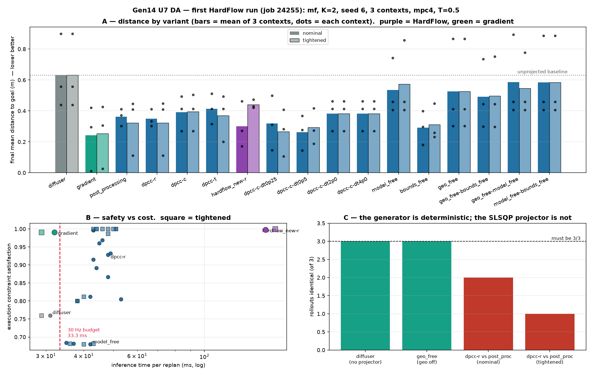

# DA — Gen14 U7 first HardFlow run (job 24255)

**Date:** 2026-08-05
**Source:** `temp/0408/H8_K2_Meuler_T0.5_…VisualMeanFlow_VTrue_mpc4_filmv1_Emf/`
+ `temp/0408/18_39_40_eval_mix_visual_aligning_24255.log`
**Run:** `mf` (MeanFlow), seed 6, **K = 2**, `mpc4`, T = 0.5, `--record none`, git `e5f4d06`.
**Grid:** 17 projection variants × 2 geo variants = **34 cells**, **n_contexts = 3**.
**Question:** the U7 HardFlow port ran for the first time. Does arm C work, and what does it buy?

> **Metric.** **Distance to goal** (`Final Mean Distance`, mean over 3 contexts + best case). Success
> rate is 0.000 in all 34 cells and is not used — the aligning success criterion is not reachable by any
> policy in this repo. Constraint satisfaction is reported as the second axis because that is what the
> projection exists to buy.

> **⚠️ n = 3 — the ranking in §2 is essentially one context away from being different.** Measured, not
> asserted:
>
> - Across the 17 variants, **context 0's spread is 6.2× (nominal) / 8.8× (tightened) context 2's**
>   (range 0.887 m vs 0.143 m). Almost all the between-variant variance lives in one of the three
>   episodes.
> - Dropping **any single** context moves a variant's mean by up to **0.169 m** — comparable to the
>   entire span of the §2 table (0.242 → 0.631 m).
> - Drop context 0 and the top-4 reorders completely: `['gradient', 'dpcc-c-dt0p5', 'bounds_free',
>   'hardflow_new-r']` → `['dpcc-c-dt0p5', 'bounds_free', 'geo_free', 'dpcc-r']`. **`gradient` leaves
>   the podium entirely.** HardFlow's own rank swings 3 ↔ 7 depending on which context you drop.
>
> **So treat every mean in §2 and §6 as one draw, not an estimate.** They could plausibly be reproduced
> in a different order by the same code on three different contexts. What does *not* depend on n:
> the port working (§1); §3's extremes, where the gaps are an order of magnitude larger than this
> swing (0.998 vs 0.680 satisfaction; 2.065 m vs <0.36 m tracking error); §4's cost, which is a 3.3×
> ratio reproduced from an independent generation; and §5, which is a structural argument about
> which pairs *must* be identical and does not use the means at all.



---

## 1. The port works, and the guard that mattered fired correctly

```
[ eval ] HardFlow variants enabled (U7): ['hardflow_new-r']
[ hardflow ] engine=mf  init_noise_scale=1.0  two_time=True  act_thr=0.5  visual=True
[ eval ] HardFlow sampler active for variant 'hardflow_new-r_train_set' (engine=mf, trajectory_dim=9)
…
Job completed successfully.
```

Item-by-item: 34/34 completed, `hardflow_new-r` at items 17 and 34, no exception, no skip.

- **`visual=True`** — the U7 §3 blindness guard. This is the check that a verbatim port would have
  failed silently: Gen3v6/v7 strip string keys before the network call, and Gen14's image conditioning
  travels under the string key `cond['visual_latent']`. Had it been stripped, `_project_cond` would have
  returned `None` and every HardFlow rollout would have run **unconditioned** while producing entirely
  plausible numbers.
- **`init_noise_scale=1.0`, `two_time=True`** — correct for the MeanFlow host (`mf_diffusion.py:204`,
  σ=1.0; two-time `_predict_velocity(..., h=…)` queried at h=0). This is the fix_4 trap that cost Gen3v6
  a full K-sweep.

**One real defect found and fixed** (U7 fix_1). `eval_mix_visual_aligning.py:2616` appends `_train_set`
to `variant` **before** the selection-suffix parse, so `.endswith('-c')` was always `False` and
`hardflow_new-c` / `-t` would have silently fallen back to `random`. This run used `-r`, whose rule *is*
random, which is exactly why it looked clean. Fixed by stripping the bookkeeping suffixes before
parsing, and the resolved rule now prints. **The `-r` numbers below are unaffected.**

---

## 2. Distance: HardFlow is good nominal, bad tightened, and `gradient` beats everything

| variant | nominal mean | nominal best | tightened mean | tightened best | s/replan |
|---|---:|---:|---:|---:|---:|
| **`gradient`** | **0.242** | **0.011** | **0.253** | 0.025 | **0.032** |
| `dpcc-c-dt0p5` | 0.263 | 0.144 | 0.293 | 0.189 | 0.045 |
| `bounds_free` | 0.292 | 0.181 | 0.312 | 0.231 | 0.043 |
| **`hardflow_new-r`** | **0.301** | 0.171 | **0.441** | 0.420 | **0.159 / 0.171** |
| `dpcc-c-dt0p25` | 0.319 | 0.147 | **0.265** | 0.106 | 0.046 |
| `dpcc-r` | 0.349 | 0.303 | 0.322 | 0.111 | 0.048 |
| `post_processing` | 0.362 | 0.303 | 0.323 | 0.111 | 0.048 |
| `dpcc-c` | 0.392 | 0.270 | 0.396 | 0.270 | 0.049 |
| `dpcc-t` | 0.414 | 0.316 | 0.369 | 0.200 | 0.053 |
| `geo_free` | 0.526 | 0.303 | 0.526 | 0.303 | 0.042 |
| `model_free` | 0.535 | 0.405 | 0.574 | 0.405 | 0.042 |
| `diffuser` (none) | **0.631** | 0.439 | 0.631 | 0.439 | 0.031 |

**Three readings:**

1. **Projection helps distance here** — every projected variant beats the unprojected 0.631. That is the
   *opposite* of the K=2 10-context result in the U5 DA §12.3, where projection was neutral-to-harmful.
   Different contexts (3 vs 10), so do not treat either as settled; it does say the sign is
   context-dependent, not a property of the projector.
2. **`hardflow_new-r` is competitive nominal (0.301, 3rd of 12 non-ablation cells) and clearly worse
   tightened (0.441, last).** Its tightened per-context spread is also strikingly *tight* —
   [0.430, 0.421, 0.473] — versus nominal [0.171, 0.271, 0.462]. Tightened HardFlow converges every
   context to ~0.44 m regardless of where the box started. That is the signature of a constraint set so
   binding that the NLP dominates the field: the trajectory stops being about the goal.
3. **`gradient` wins on distance and on best case by a wide margin** (0.011 m best), and it is the
   cheapest projected variant. Soft gradient nudging preserves the good rollouts; hard NLP projection
   does not. This reproduces U5 DA §12.4 on independent contexts — the one cross-run agreement in the
   distance analysis.

---

## 3. Constraints: HardFlow is the best nominal cell in the sweep

| variant | nominal sat | nominal violated steps | tightened sat | tightened violated |
|---|---:|---:|---:|---:|
| **`hardflow_new-r`** | **0.998** | **0.7** (obs only) | **1.000** | **0.0** |
| `gradient` | 0.991 | 1.3 | 0.991 | 1.3 |
| `bounds_free` | 0.996 | 1.7 | 1.000 | 0.0 |
| `dpcc-c` | 0.932 | 27.0 | 1.000 | 0.0 |
| `dpcc-r` | 0.928 | 28.7 | 1.000 | 0.0 |
| `post_processing` | 0.867 | 53.3 | 1.000 | 0.0 |
| `dpcc-t` | 0.805 | 78.0 | 1.000 | 0.0 |
| `diffuser` | 0.760 | 96.0 | 0.760 | 96.0 |
| `model_free` | 0.680 | 128.0 | 0.682 | 127.3 |

**This is HardFlow's actual selling point and it shows up immediately.** At *nominal* constraints —
no tightening margin — arm C reaches 0.998 satisfaction with 0.7 violated steps per rollout, while the
best DPCC variant manages 0.932 / 27.0. Its plan post-projection violation rate is **0.000**.

The mechanism is the one the port guide describes: DPCC projects a finished sample and hands it to a
controller that then drifts across the boundary; HardFlow solves the NLP *inside* the ODE at every
active step, so the trajectory is constructed feasible rather than corrected afterwards. Tightening
(δ = 0.03) closes the gap — every `dpcc-*` variant reaches 1.000 tightened — which is why the U5 DA
concluded it was the *margin*, not the projection, doing the work. **HardFlow gets there without the
margin.**

Two other ablation results, both clearing any plausible noise:

- **The dynamics constraint is what prevents tracking blowups.** Every `model_free*` cell (dynamics off)
  sits at sat ≈ 0.68, 127 violated steps, and **max tracking error 2.065 m**. Every cell with dynamics
  on stays under 0.36 m. Not marginal.
- **The geo family is the binding one.** `geo_free*` are the next-worst block (0.800–0.812).

---

## 3b. Is T = 0.5 the same knob for HardFlow and DPCC? — yes, verified

**Same value, same expression, same number of solves. Different operation, different solver.**

**Same value.** Both read the one YAML key. DPCC: `eval_mix_visual_aligning.py:289`,
`threshold = 0.0 if 'post_processing' in variant else config.get('diffusion_timestep_threshold', 0.5)`.
HardFlow: U7 ships `hardflow.activation_threshold: null`, which means *inherit*
`diffusion_timestep_threshold` — deliberately, so the two arms cannot silently drift apart. The log
confirms both:

```
[ eval ] --flow-steps: projection budget 1 -> 1 projector call(s) per replan at threshold T=0.5
[ hardflow ] engine=mf  init_noise_scale=1.0  two_time=True  act_thr=0.5  visual=True
```

**Same expression, including the rounding.** The two activation gates are character-for-character the
same test:

| | gate |
|---|---|
| DPCC | `near_end = (loop_idx >= int((1.0 - T) * flow_steps)) or (loop_idx == flow_steps - 1)` (`mf_diffusion.py:285`) |
| HardFlow | `active = (k >= int((1.0 - self.activation_threshold) * K)) or (k == K - 1)` (`hardflow_projection.py`) |

The `int()` floor is not incidental — Gen12 `fix_8` exists specifically to reconcile it
(*"DPCC truncates the boundary … comparing against the raw float is CEIL, which made HardFlow do one
FEWER projection step than both references"*). At **K = 2, T = 0.5**: `int(0.5·2) = 1`, so both are
active at `k = 1` only — **exactly one solve per replan for each arm.** The comparison in §2–§4 is
matched on solve count.

**But not the same operation.** At that one active step:

- **DPCC** projects the *current* sample onto the feasible set: `x ← project(x)`.
- **HardFlow** predicts the terminal point `x1_ref = x_ref + (1−τ)·v(x_ref, τ_next)`, solves a prox-NLP
  on **x1**, then pulls back `x ← x_ref + τ_next·(x1_proj − x1_ref)`.

That extra terminal prediction is a **second network evaluation per active step** (NFE ≈ 2K, not K) and
is part of why §4's 3.3× is what it is.

**And not the same solver.** DPCC's `Projector` runs **scipy SLSQP** (`solver='scipy'`); HardFlow's
`HardFlowNLP` builds a CasADi `Opti` problem and runs **IPOPT** (`hardflow_projection.py:143, 241, 258`).
Two different NLP solvers on the same constraint list. ⚠️ **This matters for §5** — the determinism test
there compares two *scipy* cells, so it establishes nothing about IPOPT. HardFlow's reproducibility is
untested.

**One caveat on the knob itself:** at K = 2 it has almost no resolution. `int((1−T)·2)` is 1 for
T ∈ (0, 0.5] and 0 for T > 0.5, so 0.5 and 0.1 give identical behaviour and only T > 0.5 changes
anything. Any HardFlow threshold sweep needs a larger K to mean anything.

---

## 4. Cost: 3.3× DPCC, and 5× over the real-time budget

| variant | ms / replan | vs 30 Hz budget (33.3 ms) |
|---|---:|---|
| `diffuser` | 31 | **0.9× — fits** |
| `gradient` | 32 | **0.96× — fits** |
| `dpcc-*` | 43–53 | 1.3–1.6× over |
| **`hardflow_new-r`** | **159–171** | **4.8–5.1× over** |

The realtime recorder flags it on every step: `total_ms=436.4 [BUDGET=33.3ms ❌ OVER]` on the first
replan, settling to ~150 ms.

**3.3× the `dpcc-*` variants** — which is precisely the ratio Gen3v6 measured on the state-only task
(`hardflow_new-*` at 0.066–0.080 s vs 0.020–0.025 s for `dpcc-*`), where the conclusion was to drop
HardFlow from the headline table. That ratio has now reproduced on a different task, a different
backbone, and with vision. It is a property of solving an NLP inside the ODE, not of any one setup.

So the trade is explicit: **HardFlow buys nominal-constraint satisfaction that DPCC can only reach with
a tightening margin, and pays 3.3× for it — landing 5× outside a 30 Hz control budget.**

---

## 5. 🔴 The generator is deterministic. The SLSQP projector is not.

This sharpens — and partly corrects — U5 DA §12.1, which said "the eval is not deterministic".

Four pairs that must be bit-identical by construction:

| pair | why it must match | identical rollouts |
|---|---|---|
| `diffuser` nominal vs tightened | no projector is constructed at all | **3 / 3 ✅** |
| `geo_free` nominal vs tightened | tightening only touches geo families, all off here | **3 / 3 ✅** |
| `dpcc-r` vs `post_processing`, nominal | at K=2 both project exactly once, at the final step | **2 / 3 ❌** |
| `dpcc-r` vs `post_processing`, tightened | same | **1 / 3 ❌** |

The two projector-free pairs reproduce **exactly**. The two SLSQP pairs do not. So the nondeterminism is
**not** in the U-Net, not in the visual encoder, not in MuJoCo/EGL, and not in the sim — it is in
`scipy` SLSQP.

And the amplification is severe. Tightened, rollout 0 differs by **0.0002 m** (0.1109 vs 0.1111) —
solver round-off. Nominal, the *same* pair on the *same* rollout differs by **0.039 m in final distance
and 86 vs 160 violated steps**. A sub-millimetre difference in one projection, run through 400 closed-loop
replans, becomes a materially different episode.

**Consequences:**

- The U5 DA §12.1 noise floor (±0.07 m) is real but is a property of the **projected** cells only.
  Unprojected comparisons are exact and can be trusted at face value.
- Any variant-vs-variant claim among `dpcc-*` / `hardflow_*` at n = 3 or n = 10 is fragile. §2's
  fine-grained ordering should not be quoted; §3's extremes (0.998 vs 0.680) survive because the gaps
  are an order of magnitude larger than the divergence.
- `dpcc-r` ≡ `post_processing` at K=2 remains structurally true (both project once, at the final step) —
  the observed difference is solver noise, not a behavioural difference. **Any K=2 table listing both is
  listing one variant twice.**

---

## 6. The dt sweep, incidentally

`dpcc-c-dt{0p25,0p5,2p0,4p0}` scales the dynamics-constraint `dt`. Nominal distance:
0.319 / 0.263 / 0.382 / 0.382 against `dpcc-c`'s 0.392.

Both *shrunk* dt values beat the baseline and both *enlarged* ones reproduce it exactly (0.382 vs 0.382,
identical per-context [0.269 0.414 0.462]). A tighter dynamics dt means a stricter step-to-step coupling,
which is consistent with §3's finding that the dynamics constraint is the load-bearing one. At n = 3 this
is a hint, not a result — but `dt0p5` is worth carrying into the next sweep.

---

## 7. What to do next

1. **Re-run with `n_contexts ≥ 20`.** Everything in §2 and §6 is n = 3. §3's extremes and §4's cost
   would survive; the ordering would not.
2. **Run `hardflow_new-c` and `-t`** now that U7 fix_1 landed — until this run they were unreachable
   (they silently ran as `-r`). `-c` (minimum projection cost) is the interesting one, and the port
   guide warns it is degenerate on both engines, so check the candidate fan before reading a collapse
   as a port bug.
3. **Run HardFlow on `af` and `fm`.** The port supports all three hosts; only `mf` has been exercised.
   `fm` additionally tests the `two_time=False` branch, which has never executed.
4. **Pin down the SLSQP nondeterminism** (§5) — try `OMP_NUM_THREADS=1` on the projector, or a fixed
   SLSQP iteration budget. It is currently the floor on every projected comparison in this generation.
5. **`gradient` deserves a serious look.** It is the best distance cell, the best best-case (0.011 m),
   the only projected variant inside the 30 Hz budget, and 0.991 satisfaction. On this evidence it
   dominates `dpcc-r` on every axis. It has been sitting in the variant list unexamined.
6. Only after 1–3: HardFlow at larger K, where its `activation_threshold` actually has resolution
   (at K=2, `int((1−T)·2)` is 1 for T ∈ (0, 0.5] and 0 above, so the knob barely moves).

---

## 8. Reproduction

```bash
python logs_in_develop/Gen14/U7/da_20260805_hardflow_analysis.py   # → figs/fig1_hardflow.png
```

Inputs: the 34 `eval_<variant>_train_set.log` trailers plus their `[ Seen Training Context N Finished ]`
blocks under `…Emf/6/results_train_set/combined_5{,-tightened}/`, and the realtime recorder logs for the
budget figures. Read-only; no code changed and no job run for this analysis.
