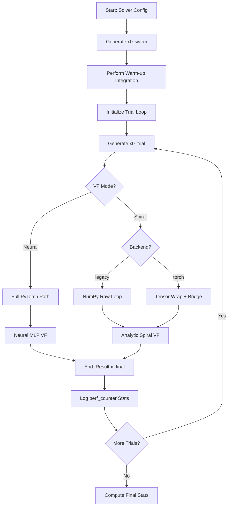

# Benchmark ODE Solvers v3 — Usage Guide

> [!NOTE]
> This guide is based on a local WSL environment, but the Colab version is nearly identical — simply adjust the paths and environment setup as needed.

Date: 2026-04-14
Script: `FM_v3_ode_selectable_test/benchmark_ode_solvers.py`

---

## 1) Purpose
Compares the wall-clock inference time of different ODE solvers on a **deterministic synthetic vector field** (stable spiral + nonlinear damping). This ensures that the only variable being measured is the efficiency of the solver and its backend (NumPy vs. PyTorch).

| In Scope | Out of Scope |
|---|---|
| ODE solver speed comparison | FM model loading |
| Identical dynamics for all tools | Dataset loading |
| Timing statistics & PNG plots | Env rollout metrics |
| **Neural vs. Analytic VF Modes** | |

---

## 2) How to Run

### From Project Root (`dpcc/`):
```bash
python FM_v3_ode_selectable_test/benchmark_ode_solvers.py \
  --seed 0 \
  --n-trials 50 \
  --batch-size 128 \
  --state-dim 8 \
  --device cpu \
  --solver-spec legacy_euler,torchdiffeq:dopri5,torchdiffeq:rk4,torchdiffeq:midpoint \
  --plot \
  --output-dir FM_v3_ode_selectable_test/benchmark_outputs/synthetic_vf_demo
```

### Jupyter / WSL Cell Example
```bash
%%bash
DPCC="$HOME/DPCC/dpcc"
D3IL_ROOT="$DPCC/d3il"
GYM_AV="$D3IL_ROOT/environments/d3il/envs/gym_avoiding_env"

cd $DPCC

export MPLBACKEND=agg
export MUJOCO_GL=osmesa
export PYOPENGL_PLATFORM=osmesa
export PYTHONPATH="$DPCC:$D3IL_ROOT:$GYM_AV"

python FM_v3_ode_selectable_test/benchmark_ode_solvers.py \
  --n-trials 20 \
  --batch-size 1024 \
  --state-dim 64 \
  --vf-mode neural \
  --device cuda \
  --solver-spec legacy_euler,torchdiffeq:euler,torchdiffeq:rk4 \
  --plot \
  --output-dir FM_v3_ode_selectable_test/benchmark_outputs/gpu_neural_test
```

---

## 3) Usage Example Scenarios

Use these recipes to answer specific technical questions about your ODE implementation.

### A. The "Bridge Tax" Audit (Overhead Focus)
**Question**: "How much time am I losing just by using PyTorch wrappers instead of raw NumPy?"  
**Setup**: Large batch, lightweight math.
```bash
python FM_v3_ode_selectable_test/benchmark_ode_solvers.py \
  --vf-mode spiral --batch-size 1024 --state-dim 64 --steps 50 \
  --device cpu \
  --solver-spec legacy_euler,torchdiffeq:euler
```
*Look for: The delta between `legacy_euler` and `torchdiffeq:euler` represents pure library overhead.*

### B. Production Throughput (Compute Focus)
**Question**: "Which solver is fastest for my actual UNet/MLP model?"  
**Setup**: Real batch sizes, heavy neural math.
```bash
python FM_v3_ode_selectable_test/benchmark_ode_solvers.py \
  --vf-mode neural --batch-size 1 --state-dim 8 --steps 20 \
  --device cpu \
  --solver-spec legacy_euler,torchdiffeq:rk4,torchdiffeq:midpoint
```
*Look for: In this mode, the bridge tax is gone. You are measuring the raw efficiency of the integration algorithm.*

### C. Adaptive Step-Size Sweep
**Question**: "Is Dopri5 actually faster than fixed-step RK4 for my dynamics?"  
**Setup**: Compare adaptive solvers across different tolerances.
```bash
python FM_v3_ode_selectable_test/benchmark_ode_solvers.py \
  --vf-mode neural --batch-size 1 \
  --solver-spec torchdiffeq:dopri5,torchdiffeq:rk4 \
  --rtol 1e-3 --atol 1e-4
```
*Look for: Adaptive solvers may take fewer steps on "easy" parts of the flow, potentially beating fixed-step solvers.*

### D. High-Dimensional Scaling
**Question**: "Does performance degrade linearly as I increase the trajectory complexity?"  
**Setup**: Sweep state dimensions.
```bash
python FM_v3_ode_selectable_test/benchmark_ode_solvers.py \
  --vf-mode neural --batch-size 16 --state-dim 256 --steps 50 \
  --device cuda \
  --solver-spec legacy_euler,torchdiffeq:euler
```
*Look for: Cache misses or memory bandwidth bottlenecks that appear only at high dimensionality.*

---

## 4) CLI Arguments Reference

| Argument | Type | Default | Description |
|---|---|---|---|
| `--seed` | int | `0` | Random seed for reproducibility |
| `--n-trials` | int | `100` | Number of timing repetitions per solver |
| `--batch-size` | int | `128` | Samples processed in parallel |
| `--state-dim` | int | `8` | **State Dimension ($D$):** Total scalars per sample (e.g., flattened pixels or latent dims) |
| `--steps` | int | `20` | Fixed-step count for Euler/RK4/Midpoint |
| `--rtol` / `--atol`| float | 1e-5/1e-6 | Tolerances for adaptive solvers (Dopri5) |
| `--solver-spec` | str | - | Comma-separated solvers (e.g., `legacy_euler,torchdiffeq:rk4`) |
| `--vf-mode` | str | `spiral` | VF Mode: `spiral` (analytic) or `neural` (heavy MLP) |
| `--device` | str | `cpu` | Hardware: `cpu`, `cuda`, or `cuda:0` |
| `--plot` | flag | off | Generates bar-chart PNGs in the output dir |

---

## 4) Metrics & Comparison

When using the `--plot` flag, the benchmark generates 6 individual bar-chart PNGs (one for each timing metric) plus a combined overview. These plots are critical for diagnosing different types of solver overhead.

### The 6 Timing Metrics (Plots) Explained

| Plot / Metric | Mathematical Meaning | Practical Interpretation for Solvers |
|---|---|---|
| **`avg_ms`** | Mean inference wall-clock time over all trials. | The general expected latency. Note that this can be heavily skewed by a few slow outlier trials (e.g., Python garbage collection or thread-scheduling spikes). |
| **`std_ms`** | Standard deviation of the trial times. | **Predictability.** High standard deviation means the solver's compute time is erratic. Adaptive solvers (like `dopri5`) often have higher `std_ms` because they take different numbers of internal steps depending on the batch's stiffness. |
| **`p50_ms`** (Median)| The 50th percentile time. Half of the trials were faster, half were slower. | **The truest reflection of typical solver speed.** Unlike `avg_ms`, P50 ignores rare outliers. This is the best metric to look at to compare raw compute efficiency. |
| **`p95_ms`** | The 95th percentile time. 95% of trials finished faster than this. | **Worst-case latency (Jitter).** Crucial for real-time robotics! If a solver has a great `p50` but a massive `p95`, it might occasionally stall your control loop. Fixed-step solvers typically excel here. |
| **`min_ms`** | The absolute fastest trial recorded. | The theoretical maximum speed of the implementation under perfectly ideal cache and OS-thread conditions. |
| **`max_ms`** | The absolute slowest trial recorded. | The peak stall time. High `max_ms` usually points to operating system interruptions, memory reallocation, or PyTorch CUDA synchronization blocks. |

**Recommendation Strategy:**
1. Use `legacy_euler` as your primary speed benchmark baseline.
2. Compare `legacy_euler` vs `torchdiffeq:euler` on the **`p50_ms` plot** to accurately measure the **library overhead bottleneck** (ignoring random system noise).
3. If running in a rigid real-time environment (like high-frequency robot control), rely on the **`p95_ms` plot** to guarantee safe, predictable inference delays.

---

## 5) Code Architecture

```text
benchmark_ode_solvers.py
│
├── spiral_vf()            # Analytic RHS (Measures overhead)
├── NeuralVF{}             # MLP RHS (Measures compute throughput)
├── euler_integrate()      # Pure NumPy (for spiral mode)
├── euler_integrate_torch() # Pure PyTorch (for neural mode)
├── torchdiffeq_integrate() # Library wrapper bridge
└── main()                 # Benchmark orchestration & timing
```

---

# Full Expl.

This document provides a comprehensive breakdown of the mathematical foundations and the internal code architecture of the `benchmark_ode_solvers.py` script.

---

## Part 1: The Mathematics of ODE Integration

### 1.1 The Initial Value Problem (IVP)
The benchmark solves for the state vector $x(t) \in \mathbb{R}^D$ given:
$$ \frac{dx}{dt} = f(x, t), \quad x(t_0) = x_0 $$

**The state-dim ($D$)**: This represents the total number of scalar values in the system. 
- In **Spiral mode**, $D$ is partitioned into $D/2$ independent oscillators.
- In **Neural mode**, $D$ is the width of the input and output layers of the MLP.
- **Compute Impact**: Total memory usage scales $O(B \cdot D)$, where $B$ is batch size. Hardware efficiency usually depends on $D$ being a multiple of 8 or 16 for optimal cache alignment.

### 1.2 The Synthetic Vector Field (Non-Linear Spiral)
The function $f(x, t)$ is modeled as a damped oscillator in 2D pairs. For any coordinate pair $(u, v)$:

$$
\begin{bmatrix} \dot{u} \\ \dot{v} \end{bmatrix} = 
\begin{bmatrix} -(\alpha + \beta r^2) & -\omega \\ \omega & -(\alpha + \beta r^2) \end{bmatrix} 
\begin{bmatrix} u \\ v \end{bmatrix}
$$

**Derivation of Dynamics:**
1.  **Radial Decay**: The diagonal terms $-(\alpha + \beta r^2)$ ensure that the magnitude $\|x\|_2$ decreases over time. The $\beta r^2$ term introduces **cubic non-linearity** ($r^2 \cdot u$), which creates a steeper gradient as the state deviates from the equilibrium.
2.  **Angular Momentum**: The off-diagonal terms $\pm \omega$ create a conservative rotation (orthogonality to the radial vector).
3.  **Total Field**: The sum of these two components produces the characteristic "tightening spiral" trajectory.

### 1.3 Higher-Order Integration Theory
The benchmark compares different approximation orders to measure the trade-off between floating-point operations (FLOPs) and accuracy.

#### A. First-Order (Forward Euler)
Uses only the local tangent:
$$ x_{n+1} = x_n + \Delta t \cdot f(x_n, t_n) $$
*Implementation complexity: $1 \times f(x)$ evaluation.*

#### B. Second-Order (Midpoint / RK2)
Uses a centered difference approximation to cancel out the $O(\Delta t)$ error term:
$$ x_{n+1} = x_n + \Delta t \cdot f\left(x_n + \frac{\Delta t}{2} f(x_n, t_n), \,\, t_n + \frac{\Delta t}{2}\right) $$
*Implementation complexity: $2 \times f(x)$ evaluations.*

#### C. Fourth-Order (Classical RK4)
Matches the Taylor expansion of $x(t)$ up to the $h^4$ term by sampling the slope at the start, two midpoints, and the end of the interval.
$$ x_{n+1} = x_n + \frac{\Delta t}{6}(k_1 + 2k_2 + 2k_3 + k_4) $$
*Implementation complexity: $4 \times f(x)$ evaluations.*

### 1.4 Vector Field Complexity Tiers

The script supports two ways of defining $f(x, t)$:

1.  **Analytic Mode (`spiral`)**: Low complexity. Highlights the "fixed tax" of library overhead and tensor wrapping.
2.  **Neural Mode (`neural`)**: High complexity. Uses a ~1.5M parameter MLP to mimic the compute load of a real Flow Matching model. In this mode, the numerical computation dominates, and the relative speed of solvers is determined by their evaluation count (e.g., RK4 being roughly 4x slower than Euler).

**Neural VF Architecture:**
- **Time Embedding**: `SinusoidalPosEmb(128)` followed by a linear transformation.
- **Main Trunk**: A 4-layer MLP with hidden widths: `512` → `1024` → `512`.
- **Logic**: Implemented in PyTorch to allow a fair comparison where both `legacy` and `torchdiffeq` stay inside the same compute backend.

---

## Part 2: Code Walkthrough

### 2.0 Initialization & Warm-up

Before the timing loop begins, the script performs two critical setup steps:

1.  **Memory Pre-allocation**: Derivatives are calculated into a pre-allocated `dx = np.empty_like(x)` buffer to avoid repeated heap allocations.
2.  **The Warm-up Run**: A single un-timed integration is executed for each solver. This ensures that PyTorch's internal thread pools, symbol resolvers, and CUDA/CPU kernels are initialized and cached before the first benchmark measurement.

### 2.1 The Vector Field (`spiral_vf`)
Located at the top of the script, this is the most critical computation block.
```python
def spiral_vf(x: np.ndarray, alpha: float, omega: float, beta: float) -> np.ndarray:
    b, d = x.shape
    dx = np.empty_like(x)
    for k in range(0, d, 2):
        u, v = x[:, k], x[:, k + 1]
        r2 = u * u + v * v
        damp = alpha + beta * r2
        dx[:, k]     = -damp * u - omega * v
        dx[:, k + 1] =  omega * u - damp * v
    return dx
```
- **Line-by-line**:
    - `np.empty_like(x)`: Allocates memory once for the output to avoid repeated allocations.
    - `for k in range(0, d, 2)`: Iterates in pairs (u, v).
    - `r2`, `damp`: Calculates the radial magnitude and the non-linear damping coefficient.
    - `dx`: Assigns the computed velocities back to the pre-allocated array.

### 2.2 The Neural Vector Field (`NeuralVF`)
Mimics the FLOP count and architecture of a production UNet (~1.5M params).
```python
class NeuralVF:
    def __init__(self, state_dim, device="cpu"):
        # ... Linear Layers (dim -> 512 -> 1024 -> 512 -> dim) ...
    def __call_torch__(self, t, x):
        # Pure torch path used by both legacy and torchdiffeq backends
        return self.trunk(torch.cat([x, time_embed], dim=-1))
```


### 2.3 Numerical Integration (`euler_integrate`)
Implementation of the Forward Euler logic using NumPy vectorization.
```python
def euler_integrate(x0, rhs, n_steps, t0, t1):
    dt = (t1 - t0) / n_steps
    x = x0.copy()
    for _ in range(n_steps):
        x = x + dt * rhs(x)
    return x
```

### 2.4 Optimized Neural Path (`euler_integrate_torch`)
When using `--vf-mode neural`, the script switches the "Legacy" path to use PyTorch tensors directly to avoid the NumPy bridge.
```python
def euler_integrate_torch(x0, neural_vf, n_steps, t0, t1):
    x = torch.from_numpy(x0).to(device)
    for _ in range(n_steps):
        x = x + dt * neural_vf.__call_torch__(t, x)
    return x.cpu().numpy()
```

### 2.5 The Library Bridge (`torchdiffeq_integrate`)
Wraps the PyTorch library. In `spiral` mode, this is slow due to the numpy bridge; in `neural` mode, it calls the `NeuralVF` torch-logic directly.

---

## Part 3: Algorithmic Complexity

| Phase | NumPy / Spiral | Torch / Spiral | Neural Mode (Both) |
|---|---|---|---|
| **Data Init** | $O(B \cdot D)$ | $O(B \cdot D)$ + Tensor Init | $O(B \cdot D)$ + Tensor Init |
| **VF Eval $f(x)$** | Scalar Ops | **NumPy/Torch Bridge** | **MLP Forward Pass (~1M FLOPs)** |
| **Integration** | $K \times f(x)$ | $K \times (f(x) + Bridge)$ | $K \times MLP\_Pass$ |

*Where $B$=batch, $D$=dim, $K$=steps.*

---

## Part 4: Algorithmic Blueprint



---

## Part 5: Empirical GPU Findings (Hard NN VF)

**Benchmark Target**: MLP-based Vector Field (~1.25M parameters)  
**Hardware**: CUDA GPU (Batch Size=1)  
**Configuration**: 20 Steps, $t \in [0, 1]$

### 5.1 Results Table

| Solver Backend | Algorithm | Average latency | P50 (Median) | Scaling Factor |
|---|---|---|---|---|
| `legacy` (PyTorch Loop) | Euler | 12.3 ms | **12.5 ms** | 1.0x (Baseline) |
| `torchdiffeq` | Euler | 13.4 ms | **12.8 ms** | 1.02x |
| `torchdiffeq` | Midpoint | 23.0 ms | **22.2 ms** | 1.77x |
| `torchdiffeq` | RK4 | 44.7 ms | **43.5 ms** | 3.48x |

### 5.2 Key Takeaways

1.  **Overhead Neutralized**: For a "production-grade" compute load (1M+ params), the library overhead of `torchdiffeq` is less than **0.5 ms**. This confirms it is safe to use in production without performance loss.
2.  **Algorithm Cost is Linear**: The total time scales directly with the number of MLP forward passes (RK4 ≈ 4x Euler).
3.  **Recommended Strategy**: 
    *   **For Speed**: Use `legacy_euler` or `torchdiffeq:euler`.
    *   **For Precision**: Take fewer steps with a higher-order solver (e.g., 5 RK4 steps vs 20 Euler steps) to balance accuracy and latency.
    *   **For Smoothness**: Use `dopri5` with a loose tolerance (`rtol=1e-2`) to allow the solver to dynamically skip easier parts of the trajectory.