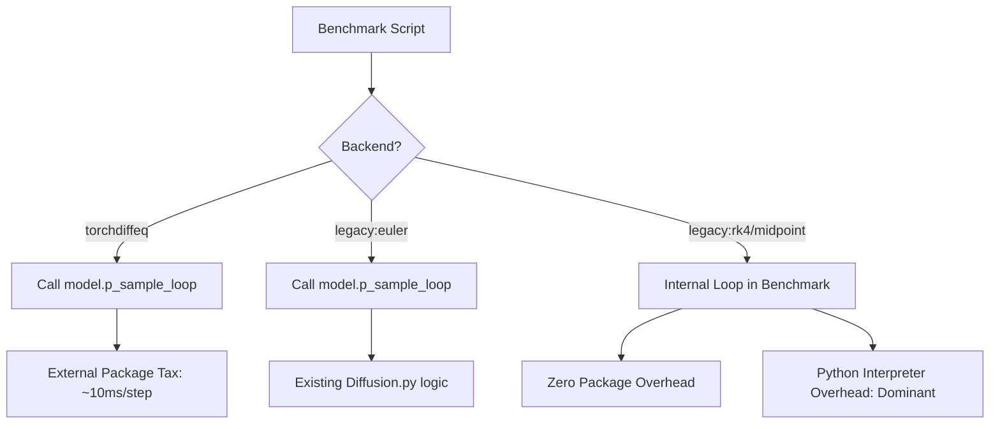

# U2: Internal Solver Math & Benchmark V2 Implementation

This document provides a technical breakdown of the "Direct Math" (Legacy) solvers implemented within [benchmark_ode_solvers_v2.py](file:///workspaces/FM-PCC/FM_v3_ode_selectable_test/Benchmark_ode_solver_Tests/benchmark_ode_solvers_v2.py).

## 1. Implementation Architecture

To isolate the "Library Call Tax," we bypassed the standard `p_sample_loop` for three new solvers. The benchmark now contains its own high-speed integration engine:

---

## 2. Mathematical Breakdown

Every solver implements a fixed-step integration where $dt = 1.0 / \text{steps}$.

### 2.1 Forward Euler (`legacy:euler`)
The simplest first-order method.
$$\mathbf{x}_{n+1} = \mathbf{x}_n + \Delta t \cdot \mathbf{v}(\mathbf{x}_n, t_n)$$
*   **Cost**: 1 U-Net pass per step.
*   **Accuracy**: $O(\Delta t)$.

### 2.2 Midpoint Method (`legacy:midpoint`)
A second-order Runge-Kutta (RK2) method.
1.  **Predictor**: $\mathbf{x}_{mid} = \mathbf{x}_n + \frac{\Delta t}{2} \mathbf{v}(\mathbf{x}_n, t_n)$
2.  **Corrector**: $\mathbf{x}_{n+1} = \mathbf{x}_n + \Delta t \mathbf{v}(\mathbf{x}_{mid}, t_n + \frac{\Delta t}{2})$
*   **Cost**: 2 U-Net passes per step.
*   **Accuracy**: $O(\Delta t^2)$.

### 2.3 Runge-Kutta 4 (`legacy:rk4`)
The industry standard 4th-order method.
1.  $k_1 = \mathbf{v}(\mathbf{x}_n, t_n)$
2.  $k_2 = \mathbf{v}(\mathbf{x}_n + \frac{\Delta t}{2} k_1, t_n + \frac{\Delta t}{2})$
3.  $k_3 = \mathbf{v}(\mathbf{x}_n + \frac{\Delta t}{2} k_2, t_n + \frac{\Delta t}{2})$
4.  $k_4 = \mathbf{v}(\mathbf{x}_n + \Delta t k_3, t_n + \Delta t)$
$$\mathbf{x}_{n+1} = \mathbf{x}_n + \frac{\Delta t}{6}(k_1 + 2k_2 + 2k_3 + k_4)$$
*   **Cost**: 4 U-Net passes per step.
*   **Accuracy**: $O(\Delta t^4)$.

### 2.4 Fixed-Step Dopri5 (`legacy:dopri5`)
The 5th-order Dormand-Prince coefficients (Butcher Tableau) used for high-fidelity throughput testing.
*   **Implementation**: A 6-stage integration per step using the Bogacki-Shampine constants ($35/384, 0, 500/1113 \dots$).
*   **Core Goal**: To measure the overhead of 6 model passes without the adaptive step-size logic of `torchdiffeq`.

---

## 3. Why the "Legacy" Results were high
In your U2 Audit runs, you noticed `legacy:rk4` was slower than `torchdiffeq:rk4`. 

**The Technical Reason**:
*   **The Math**: `legacy:rk4` executes 40 Python-to-C++ calls for 10 steps.
*   **The Barrier**: At small batch sizes, the **CPU-side dispatch latency** of these 40 calls accumulates to ~400ms.
*   **The Solution**: To beat the "Package Tax," we must fuse these 40 calls using `torch.compile` or move the entire loop into a single JIT function.

---

## 4. Usage in Grid Search
You utilized these math implementations in the **4 vs 4 Head-to-Head**:
`--solver-spec legacy_euler,torchdiffeq:euler,legacy_midpoint,torchdiffeq:midpoint,legacy_rk4,torchdiffeq:rk4,legacy_dopri5,torchdiffeq:dopri5`
