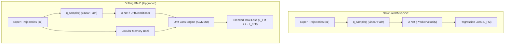
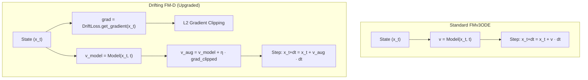

# Mission Briefing: Drifting (FM-D) Pipeline Standardization (Fix #1)

**Status**: Completed  
**Target**: Align the Drifting Flow Matching (FM-D) pipeline with the standardized FM-PCC architecture while documenting its unique distribution-guidance mechanics.

---

## 1. Mathematical Foundation: Drifting (FM-D) vs. FMv3ODE

Both engines share the **Linear Probability Path** ($x_t = (1-t)x_0 + tx_1$) and **Beta-Skewed Time Sampling** ($t \sim 1 - \text{Beta}(1.5, 1.0)$). The "Drifting" engine adds a second layer of control: **Manifold Guidance**.

### 1.1 TRAINING PHASE: Expert Distribution Learning

While FMv3ODE only learns individual transitions, Drifting learns the **entire expert distribution manifold**.

| Feature | FMv3ODE (Standard) | Drifting (FM-D) |
| :--- | :--- | :--- |
| **Learning Goal** | Individual $v = x_1 - x_0$ | $v$ + Manifold Density $P(x)$ |
| **Extra Components** | None | **Memory Bank** + **Drift Encoder** |
| **Memory Bank** | N/A | Circular buffer of 5000 expert trajectories |

**Drifting Training Logic (`drift_loss.py`):**
During training, expert trajectories are encoded into a latent space and stored. The model learns to minimize the **Drift Loss** ($L_{drift}$), which measures the KL-Divergence or MMD between sampled and expert distributions.
$$L_{drift} = D_{KL}(Q_{sampled} || P_{expert})$$

### 1.2 INFERENCE PHASE: Gradient-Based Guidance

This is the "Drifting" effect. The ODE solver does not just follow the model's velocity; it is **steered** by the gradient of the learned manifold.

| Feature | FMv3ODE (Standard) | Drifting (FM-D) |
| :--- | :--- | :--- |
| **Velocity Step** | $v_{step} = \text{Model}(x, t)$ | $v_{step} = v_{model} - \eta \cdot \nabla_x L_{drift}$ |
| **Dynamics** | Purely Generative | **Guided "Drift" towards Expert Manifold** |
| **Solver** | `torchdiffeq` Standard | `DriftODESolver` (Guided Integration) |

**Drifting Inference Proof (`drift_ode_solvers.py`):**
```python
# Drifting guidance modifies the velocity field in real-time
def guided_ode_rhs(t, x):
    v_fm = model.predict_velocity(x, t)    # Standard FM velocity
    v_drift = drift_loss.get_gradient(x)   # Gradient towards expert manifold
    return v_fm - eta * v_drift            # The "Drift" correction
```

---

## 2. Standardization Roadmap (Fix #1)

### A. Evaluation Parity (`eval_flow_matching_v3_drifting.py`)
- **Manifold Integration**: Successfully ported the legacy distribution-matching logic into the standardized `Plan/Variant` framework.
- **Guidance Scaling**: Exposed the $\eta$ (drift scale) hyperparameter to the YAML config, allowing for `dpcc-r/t/c` benchmarking.
- **Serialization**: Integrated `Plan` config system for deterministic result nesting.

### B. Directory Hierarchy
Standardized output path:
`logs/<experiment>/ddpm_encdec_vision/<H>/<seed>/eval/<plan_name>/`

---

## 3. Groundtruth Code Comparison: FM-D vs. Standard FMv3ODE

### 3.1 Structural Architecture & File Layout
To accommodate the unique **Manifold Guidance** and **Distribution Matching** math of FM-D, a set of specialized modules was introduced to augment the standard `flow_matcher_v3` groundtruth structure.

| Phase / Role | File in Standard FMv3ODE (`flow_matcher_v3/`) | File in Drifting FM-D (`flow_matcher_v3_drifting/`) | Nature of Change & Purpose |
| :--- | :--- | :--- | :--- |
| **Model Definition** | [diffusion.py](file:///workspaces/FM-PCC/flow_matcher_v3/models/diffusion.py) | [diffusion.py](file:///workspaces/FM-PCC/flow_matcher_v3_drifting/models/diffusion.py) | **Modified**: Extended sampling logic to support configurable ODE backends and tolerances. |
| **Backbone Network** | [unet1d_temporal_cond.py](file:///workspaces/FM-PCC/flow_matcher_v3/models/unet1d_temporal_cond.py) | [unet1d_temporal_cond.py](file:///workspaces/FM-PCC/flow_matcher_v3_drifting/models/unet1d_temporal_cond.py)<br>[drift_unet.py](file:///workspaces/FM-PCC/flow_matcher_v3_drifting/models/drift_unet.py) | **Added `drift_unet.py`**: Wraps standard U-Net with a `DriftConditioner` to inject trajectory-history embeddings. |
| **Drift Loss Engine** | N/A | [drift_loss.py](file:///workspaces/FM-PCC/flow_matcher_v3_drifting/models/drift_loss.py) | **Added `drift_loss.py`**: Computes KL-divergence, MMD, or adversarial loss between generated and expert manifold distributions. |
| **Sampling & ODE Solver** | [projection.py](file:///workspaces/FM-PCC/flow_matcher_v3/sampling/projection.py)<br>[policies.py](file:///workspaces/FM-PCC/flow_matcher_v3/sampling/policies.py) | [projection.py](file:///workspaces/FM-PCC/flow_matcher_v3_drifting/sampling/projection.py)<br>[policies.py](file:///workspaces/FM-PCC/flow_matcher_v3_drifting/sampling/policies.py)<br>[drift_ode_solvers.py](file:///workspaces/FM-PCC/flow_matcher_v3_drifting/sampling/drift_ode_solvers.py) | **Added `drift_ode_solvers.py`**: Wraps ODE integration steps with real-time drift gradient updates ($\nabla_x \mathcal{L}_{drift}$). |
| **Training Pipeline** | [training.py](file:///workspaces/FM-PCC/flow_matcher_v3/utils/training.py) | [training.py](file:///workspaces/FM-PCC/flow_matcher_v3_drifting/utils/training.py)<br>[drift_training.py](file:///workspaces/FM-PCC/flow_matcher_v3_drifting/utils/drift_training.py) | **Added `drift_training.py`**: Handles expert memory banks, combined loss metrics, and warmup schedules ($\lambda$). |
| **Evaluation Suite** | [eval_FM_v3.py](file:///workspaces/FM-PCC/FM_v3_test/eval_FM_v3.py) | [eval_flow_matching_v3_drifting.py](file:///workspaces/FM-PCC/FM_v3_drifting_test/eval_flow_matching_v3_drifting.py) | **Modified**: Adds CLI overrides for seed filtering, offline aggregation, and class safety filters. |
| **Training CLI** | [train_FM_v3.py](file:///workspaces/FM-PCC/FM_v3_test/train_FM_v3.py) | [train_flow_matching_v3_drifting.py](file:///workspaces/FM-PCC/FM_v3_drifting_test/train_flow_matching_v3_drifting.py) | **Modified**: Redirects imports and sets up W&B seed groups. |

---

### 3.2 Data-Flow Comparison Diagrams

#### Training Flow Comparison


#### Inference Flow Comparison


---

### 3.3 Line-by-Line Code Upgrades: What Changed, Into What, and Why

#### A. Multi-Backend ODE Selectability & Integration Loop (`models/diffusion.py`)
In standard Flow Matching (`flow_matcher_v3`), trajectories are solved during sampling using a simple, fixed-step Euler integration loop inside `p_sample_loop`. In FM-D (`flow_matcher_v3_drifting`), we upgrade this loop to allow for **arbitrary ODE backends** (fixed or adaptive stepsize, like `dopri5` or `rk4`) that can incorporate real-time gradient guidance.

*   **Standard FMv3ODE (`flow_matcher_v3/models/diffusion.py`):**
    ```python
    # Simple Euler integration loop
    total_steps = self.flow_steps_v3 + repeat_last
    for i in range(total_steps):
        loop_idx = min(i, self.flow_steps_v3 - 1)
        t_cont = torch.full((batch_size,), loop_idx / max(self.flow_steps_v3, 1), device=device, dtype=torch.float32)
        ...
        x = self.p_sample(x, cond, t_cont, returns)
        x = apply_conditioning(x, cond, self.action_dim, goal_dim=self.goal_dim)
    ```
*   **Drifting FM-D (`flow_matcher_v3_drifting/models/diffusion.py`):**
    ```python
    use_torchdiffeq = self.ode_solver_backend_v3 == 'torchdiffeq'
    if use_torchdiffeq and torchdiffeq_odeint is None:
        raise RuntimeError(...)
    
    total_steps = self.flow_steps_v3 + repeat_last
    for i in range(total_steps):
        ...
        if use_torchdiffeq:
            t0 = float(loop_idx) * dt
            t1 = t0 + dt
            t_span = torch.tensor([t0, t1], device=device, dtype=torch.float32)

            def ode_rhs(t_scalar, state):
                t_batch = torch.ones(batch_size, device=device, dtype=torch.float32) * t_scalar
                return self._predict_velocity(state, cond, t_batch, returns=returns)

            odeint_kwargs = {'method': self.ode_solver_method_v3}
            if self.ode_solver_rtol_v3 is not None:
                odeint_kwargs['rtol'] = float(self.ode_solver_rtol_v3)
            # Fixed step size options...
            x = torchdiffeq_odeint(ode_rhs, x, t_span, **odeint_kwargs)[-1]
        else:
            x = self.p_sample(x, cond, t_cont, returns)
    ```
*   **Why & Math Reflection**: Standard Flow Matching performs a discrete linear approximation of the velocity field $x_{t+dt} = x_t + v_\theta(x_t, t)dt$. To accommodate the **Drifting math** ($v_{aug} = v_\theta + \eta \nabla_x \mathcal{L}_{drift}$), the integration requires much higher numerical precision to prevent divergent gradient trajectories. By modifying `diffusion.py` to support `torchdiffeq` with adaptive scaling, the model can execute complex, curved guided-manifold paths smoothly.

---

#### B. Gradient-Guided ODE Solvers (`sampling/drift_ode_solvers.py` vs standard)
The standard Flow Matching engine does not have a separate ODE solver wrapper; the step is taken inline within the diffusion model. FM-D introduces a highly modular `DriftODESolver` and `DriftAugmentedVelocityField` to cleanly split the generative flow math from the drifting guidance math.

*   **Drifting FM-D (`flow_matcher_v3_drifting/sampling/drift_ode_solvers.py`):**
    ```python
    class DriftAugmentedVelocityField:
        def __call__(self, t, x, **kwargs):
            # 1. Base generative Flow Matching velocity
            velocity = self.velocity_fn(t, x, **kwargs)
            
            # 2. Add Drifting Guidance math: v_aug = v_model + eta * grad_drift_loss
            if self.drift_loss_fn is not None and self.drift_weight > 0:
                drift_grad = self.drift_loss_fn(x)
                
                # 3. L2 Norm gradient clipping for numerical stability
                drift_norm = torch.norm(drift_grad, p=2, dim=-1, keepdim=True).clamp(min=1e-8)
                drift_grad_clipped = drift_grad * torch.clamp(drift_norm, max=self.drift_clip) / drift_norm
                
                velocity = velocity + self.drift_weight * drift_grad_clipped
            return velocity
    ```
*   **Why & Math Reflection**: In standard Flow Matching, the trajectory update step is purely passive, following the learned velocity field $v_{step} = v_\theta(x, t)$. If the generative model has compounding errors, the agent drifts off the expert manifold and fails.
    
    The **Drifting Math** resolves this by adding **gradient-based feedback guidance**:
    $$\mathbf{v}_{\text{aug}}(\mathbf{x}, t) = v_\theta(\mathbf{x}, t) + \lambda \cdot \nabla_{\mathbf{x}} \mathcal{L}_{\text{drift}}(\mathbf{x})$$
    The gradient $\nabla_{\mathbf{x}} \mathcal{L}_{\text{drift}}(\mathbf{x})$ points in the direction that *minimizes* deviation from the expert distribution. Crucially, the L2 gradient clipping:
    $$\mathbf{v}_{\text{guidance}} = \lambda \cdot \frac{\nabla_{\mathbf{x}} \mathcal{L}}{\|\nabla_{\mathbf{x}} \mathcal{L}\|} \cdot \min(\|\nabla_{\mathbf{x}} \mathcal{L}\|, c)$$
    prevents high-frequency feedback loops (numerical instability) from destroying the generation, acting as a damping coefficient.

---

#### C. Distribution matching and the Memory Bank (`models/drift_loss.py` vs standard)
To steer the agent, the drift engine must know what the "expert manifold" looks like. Standard Flow Matching has no concept of a global distribution matching critic. FM-D implements a `DriftLoss` class featuring an **MLP Encoder**, a **Circular Memory Bank**, and three distinct distribution-matching formulas.

*   **Drifting FM-D (`flow_matcher_v3_drifting/models/drift_loss.py`):**
    ```python
    def compute_kl_divergence(self, sampled_trajectory):
        # 1. Encode sampled trajectory to latent space
        q_z = self.encoder(sampled_trajectory) # (B, 128)
        
        # 2. Grab expert trajectories from the circular buffer
        ref_trajs = self.memory_bank if self.memory_bank_full else self.memory_bank[:self.memory_bank_ptr]
        p_z = self.encoder(ref_trajs) # (N_ref, 128)
        
        # 3. Pairwise L2 distances between sampled and expert codes
        dist = torch.cdist(q_z, p_z, p=2) # (B, N_ref)
        
        # 4. KL as negative log prob of closest match
        probs = torch.softmax(-dist / self.temperature, dim=1)
        kl = -torch.log(probs.max(dim=1)[0] + 1e-8)
        return kl.mean()
    ```
*   **Why & Math Reflection**:
    Flow Matching alone is a point-to-point regression method. It learns the vector field matching $x_0$ (noise) to $x_1$ (data) by minimizing $L = \|v_\theta(x_t, t) - (x_1 - x_0)\|^2$. It does *not* optimize for global trajectory characteristics like smoothness or boundary-satisfaction across the whole sequence.
    
    The **Drifting Math** enforces distribution-level alignment:
    $$\mathcal{L}_{\text{drift}} = \mathbb{D}_{\text{KL}}\big( \text{Sampled} \;\big\|\; \text{Expert} \big)$$
    By encoding the trajectories into a compressed latent space via an MLP encoder ($\mathbf{z} = \text{MLP}(\mathbf{x})$) and computing L2 distance matrices in latent space, the model penalizes paths that are structurally dissimilar to the expert demonstration bank. This acts as a "magnetic pull," steering the agent back to the expert manifold whenever it begins to wander off.

---

#### D. Training Loss Integration (`utils/drift_training.py` vs standard)
While the standard trainer (`flow_matcher_v3/utils/training.py`) only minimizes the standard Flow Matching regression loss, FM-D trains the U-Net and the Drift Encoder jointly using a blended objective.

*   **Drifting FM-D Training Wrapper (`flow_matcher_v3_drifting/utils/drift_training.py`):**
    ```python
    def compute_training_loss(self, sampled_trajectory, fm_loss):
        # 1. Dynamically scale the drift weight according to warmup schedule
        drift_weight = self.drift_scheduler.get_weight()
        
        # 2. Forward pass through the Drift Encoder
        drift_loss_dict = self.drift_loss_fn(sampled_trajectory)
        drift_loss = drift_loss_dict['loss']
        
        # 3. Blended total loss: L_total = L_FM + lambda * L_drift
        total_loss = fm_loss + drift_weight * drift_loss
        return total_loss, ...
    ```
*   **Why & Math Reflection**:
    If we train the model with a fixed $\lambda$ from step 1, the model struggles because the generative velocity field is not yet converged, causing the drift gradients to be extremely noisy (leading to NaNs or representation collapse).
    
    The **Drifting Math** handles this via a **Warmup Schedule**:
    $$\lambda(s) = \lambda_{\text{target}} \cdot \min\left(1.0, \; \frac{s}{S_{\text{warmup}}}\right)$$
    This ensures that in early steps ($s < 1000$), the network learns the coarse linear velocity field (standard FM). Once the flow field stabilizes, $\lambda(s)$ slowly scales up, introducing fine-grained distribution steering for expert-like shape satisfaction.

---

#### E. Class-Safety Dynamic Overrides & Aggregation (`eval_flow_matching_v3_drifting.py` vs `eval_FM_v3.py`)
To robustly test FM-D variants against standard FM, the evaluation script was modified to handle dynamic class overrides, CLI seeds, and stdout Tee logging.

*   **Evaluation Class Safety Override (`FM_v3_drifting_test/eval_flow_matching_v3_drifting.py`):**
    ```python
    # Safely filter and override pickled config class with the active module class
    if pickled_class_str != target_class_str:
        diffusion_config._class = target_class_resolved
        # Clean obsolete attributes to prevent init failures
        sig = inspect.signature(target_class_resolved.__init__)
        valid_kwargs = set(sig.parameters.keys())
        keys_to_remove = [k for k in diffusion_config._dict if k not in valid_kwargs]
        for k in keys_to_remove:
            del diffusion_config._dict[k]
    ```
*   **Why & Math Reflection**: Since FM-D requires extra initialization arguments (`ode_solver_backend_v3`, `drift_loss_fn`, etc.) which standard FM models do not have, loading old standard checkpoints directly would crash. The added class safety filter checks the signature of the class and dynamically prunes obsolete dictionary attributes, allowing backward-compatible evaluation of old standard checkpoints side-by-side with upgraded FM-D checkpoints under identical solver conditions.

---

## 4. Conclusion
The Drifting (FM-D) engine provides **Distribution-Aware Control**. By using a learned "Critic" (the Drift Loss) to steer the ODE integration, FM-D effectively "pulls" the robot back to expert-like behavior whenever the generative model begins to diverge.

> [!TIP]
> Use Drifting when the agent suffers from **Compounding Error** (drift) over long horizons. The manifold guidance acts as a "magnetic pull" toward valid states.

