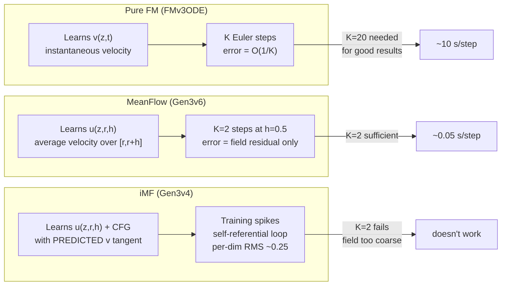

# STUDY — Why MF works (both backbones), why iMF fails, and why MF beats FM/DPCC at low K

**Date:** 2026-08-19 · **Type:** technical / mathematical analysis
**Scope:** Gen3v6 MeanFlow — backbone success, iMF (Gen3v4) failure, and the mathematical basis
for MeanFlow's advantage over pure Flow Matching and Diffusion-DPCC at low NFE
**Key sources:**
- [`Fix_8_Unet/RESULTS_Fix_8_unet_width32_rerun_24317_24334.md`](../Fix_8_Unet/RESULTS_Fix_8_unet_width32_rerun_24317_24334.md) — MF UNet@32 results + Pareto analysis
- [`U2/INSIGHT_Gen3v6_U2_mf_dit_first_run.md`](../U2/INSIGHT_Gen3v6_U2_mf_dit_first_run.md) — MF mf_dit results
- [`../../Gen3v4_imf/U10/K2_train_eval/ANALYSIS_imf_official_K2_train_curve_and_eval.md`](../../Gen3v4_imf/U10/K2_train_eval/ANALYSIS_imf_official_K2_train_curve_and_eval.md) — iMF U10 analysis
- [`../../Gen3v4_imf/U10/debug_notes/POST_U10_IV_catchup_AB_test_decisive.md`](../../Gen3v4_imf/U10/debug_notes/POST_U10_IV_catchup_AB_test_decisive.md) — iMF A/B decisive result
- Code: [`mf_diffusion.py`](file:///workspaces/FM-PCC/flow_matcher_v3_meanflow/models/mf_diffusion.py), [`imf_diffusion.py`](file:///workspaces/FM-PCC/flow_matcher_v3_imeanflow/models/imf_diffusion.py), [`diffusion.py` (FMv3ODE)](file:///workspaces/FM-PCC/flow_matcher_v3_ode_selectable/models/diffusion.py)

---

## 0. The results that need explaining

### 0.1 MeanFlow: both backbones work, UNet is even better

| backbone | per_dim_rms_u | train status | S&C tightened (K=2) | steps | s/step |
|---|---|---|---|---|---|
| **UNet@32** (4.0 M) | 0.199 | ✅ converges, loss 1.000→0.912 | **1.00** (dpcc-t-tight) | **58.7** | 0.027 |
| **mf_dit** (~10 M) | 0.195 | ✅ converges, loss→0.740 | 1.00 (dpcc-t-tight) | 65.5 | 0.027 |

Both learn the MeanFlow identity to comparable per-dim RMS. But UNet@32 takes **fewer steps to
goal** than mf_dit on every halfspace (§4.3 of Fix_8: 3/3 sweep), and avoids the `dpcc-c`
collapse that plagues mf_dit (SR=0 → timeout at 199 steps).

### 0.2 MF UNet@32 Pareto-dominates FM/DPCC baselines at K=2

On `dpcc-t-tightened` (seed 6, the best-documented arm):

| config | S&C | steps | s/step | Pareto status |
|---|---|---|---|---|
| **MF UNet@32 K2** | **1.00** | **58.7** | **0.027** | **non-dominated** |
| Diffusion/FMv3 K10 | 1.00 | 59.7 | 0.191 | dominated by MF |
| DPCC K10 | 1.00 | 61.5 | 0.317 | dominated by MF |
| DPCC K20 | 1.00 | 62.0 | 0.596 | dominated by MF |
| FM ODE K20 | 1.00 | 63.5 | 0.468 | dominated by MF |

MF at **2 NFE** dominates Diffusion and FM ODE at **10–20 NFE**, with 7–22× lower per-step cost.

### 0.3 iMF (Gen3v4) fails where MF succeeds

| objective | per_dim_rms_u | K2 unguided SR | plateau behaviour |
|---|---|---|---|
| **MeanFlow (Gen3v6)** | ~0.19–0.20 | ~0.9–1.0 | smooth descent, stable |
| **iMF official (Gen3v4)** | ~0.25 | 0–17.5% | coarse, recurrent spikes |

iMF's field is **structurally coarser** and its training is **spiky**. Even with extensive
tuning (U10 "one last shot"), the best iMF result at K2 is 17.5% unguided success, while MF
gets near-perfect projected control.

---

## 1. Why MF works: the mathematical identity

### 1.1 The MeanFlow identity

MeanFlow learns an **average-velocity field** `u(z, r, t)` over the interval `[r, t]`:

```
(t − r) · u(z_r, r, t) = z_t − z_r     [definition: u is the average velocity]
```

Differentiating w.r.t. `r` at fixed `t`, following the flow `dz_r/dr = v(z_r, r)`:

```
u = v + h · du/dr                        [the MeanFlow identity]
```

where `h = t − r`, `v` is the instantaneous velocity, and `du/dr` is the total derivative
of `u` along the trajectory.

### 1.2 The training target

MeanFlow computes this identity via a **forward-mode JVP** (Jacobian-vector product):

```python
# mf_diffusion.py:454
u_pred, du_dr = _jvp(_u_of, (x_r, r, h), (v_inst, ones, -ones))
u_target = (v_inst + h_exp * du_dr).detach()   # line 461
```

The tangent vectors `(v_inst, +1, -1)` encode the chain rule: `dz/dr = v`, `dr/dr = 1`,
`dh/dr = -1` (since `h = t − r`). The target is **stopped-gradient** — we regress `u_pred`
to `u_target`, never backprop through the JVP.

### 1.3 Why this is a good training signal

At `h = 0` (FM anchors, 50% of the batch): `u_target = v` — pure flow matching. This
**grounds** the field to the known-correct instantaneous velocity at every point.

At `h > 0`: the identity tells the model what its average-velocity *should be* at the query
interval, given what it currently predicts nearby. This is **self-supervision** — the model's
own consistency under interval composition provides a training signal for large-h queries.

The consequence: the trained field is **consistent across intervals** by construction. A K=2
sampler (h=0.5) is using predictions the model was *directly trained on*, not extrapolating
from a fine-h regime.

---

## 2. Why MF works with both UNet and mf_dit

### 2.1 The JVP z-tangent is analytic — the simplification that matters

MeanFlow's JVP tangent is `v_inst = x_data − x_noise`, the **analytic instantaneous velocity**.
This is a known ground-truth quantity, not a network prediction. From
[`mf_diffusion.py:449-453`](file:///workspaces/FM-PCC/flow_matcher_v3_meanflow/models/mf_diffusion.py#L449-L453):

> *🔴 DO NOT CHANGE THE z-TANGENT. `v_inst` is the ANALYTIC velocity x1 − x0 and it IS the
> Gen3v6 hypothesis.*

Because the tangent is analytic:
- The JVP target has **low variance** — no noise from a predicted quantity
- The training signal is **stable** — bad network predictions don't corrupt the target
- The gradient landscape is **smoother** — the loss surface doesn't have the self-referential
  instability that iMF suffers from (§3)

### 2.2 Why UNet suffices (and even excels)

The MeanFlow objective needs the backbone to:
1. Take `(x, τ, h)` as inputs → output `(u, v)`
2. Be **forward-AD compatible** for the JVP

The UNet satisfies both:
- **h-conditioning:** `t_embed = time_mlp(τ) + h_mlp(h)` — additive, but sufficient for H=8, D=6
- **JVP-safe:** Conv1d, GroupNorm, Mish activation — all forward-AD compatible
- **Size-matched:** 4.0 M params for 96 demos (42K params/demo)

The mf_dit also satisfies both, with richer two-time conditioning via adaLN-zero. Both reach
`per_dim_rms_u ≈ 0.19–0.20` — the DiT's extra capacity doesn't buy much on this task.

### 2.3 Why UNet is *better* than mf_dit on eval

UNet@32 beats mf_dit on **every** projected arm:
- `dpcc-t-tightened`: 58.7 steps vs 65.5 (UNet wins 3/3 halfspaces)
- `dpcc-c-tightened`: 0.83 S&C vs **0.00** (mf_dit collapses to timeout at 199 steps)

From Fix_8 §4.3:

> *UNet@32's Pareto strength on the projected arms is NOT explained by a better raw field — it
> comes from the field being easier for the projector to correct.*

**Hypothesis:** the UNet's **locality inductive bias** (Conv1d kernels act on local time windows)
produces trajectories with smoother spatial structure that the QP projector can handle. The
mf_dit's global attention produces globally consistent but locally jagged plans, which trip the
`dpcc-c` selection rule into a degenerate near-stationary plan.

---

## 3. Why iMF (Gen3v4) fails: the predicted-v tangent

### 3.1 The defining difference: predicted vs analytic tangent

| | MeanFlow (Gen3v6) | iMF (Gen3v4 U10) |
|---|---|---|
| JVP z-tangent | `v_inst = x_data − x_noise` (analytic) | `v_c` = **predicted** by the v-head (stop-grad) |
| Target | `u_tgt = v_inst + h · du/dr` | `u_tgt = v_g + h · du/dr` (with CFG-guided `v_g`) |
| CFG | none | trained with `ω ∈ [1, s_max]`, eval at ω=1 (off) |
| FM anchor fraction | 50% | 50% |
| `(t, r)` sampling | two independent logit-normals | two independent logit-normals |

The **single** defining change is item 1: the z-tangent fed to the JVP.

### 3.2 Why the predicted tangent destroys training stability

From [`ANALYSIS_imf_official_K2`](../../Gen3v4_imf/U10/K2_train_eval/ANALYSIS_imf_official_K2_train_curve_and_eval.md) §1:

> *The recurrent spikes (`raw_mse` 45 @ep27, 71 @ep43) are the JVP-tangent variance:
> `imf_official` feeds the predicted `v_c` as the JVP direction. When the v-head is momentarily
> wrong, `u_target = v_g + h·du_dr` gets a bad tangent → a huge target → a spike.*

The mechanism:

```
                    MeanFlow                              iMF
tangent            v_inst = x₁ − x₀                     v_c = v_head(z_r, r)
variance           zero (analytic)                       high (prediction error)
JVP output         du/dr is stable                       du/dr inherits v_c noise
target             u_tgt = v + h·(stable du/dr)          u_tgt = v_g + h·(noisy du/dr)
training           smooth descent                        recurrent spikes to 45–71
```

The problem is **multiplicative**: `h · du/dr` amplifies the tangent error by the interval size.
At large `h` (which is exactly where few-NFE sampling lives), a slightly wrong `v_c` produces a
wildly wrong `du/dr`, which produces a wildly wrong target, which produces a gradient spike.

### 3.3 The self-referential loop

In iMF, the v-head and u-head share the backbone (dual_head). So:

1. v-head makes a slightly wrong prediction → bad tangent
2. Bad tangent → bad JVP → bad u-target → bad u-gradient
3. Bad u-gradient updates the shared backbone
4. Updated backbone changes v-head → potentially worse prediction
5. Go to 1

This is a **positive feedback loop**. MeanFlow breaks it by using an analytic tangent that is
independent of the network's current state.

### 3.4 The CFG overhead: wasted capacity

iMF trains with CFG (`ω ∈ [1, 7]`) and a null-token dropout mechanism. But at eval, CFG must
be turned **off** (ω=1) because it causes explosions. From the iMF analysis §2(c):

> *The capacity the model spent learning the guided/null-token split is unused at eval.*

This means a fraction of the network's 10 M parameters is dedicated to modelling a
guidance-conditioned manifold that is never used at inference. On 96 demonstrations, this wasted
capacity is significant.

MeanFlow has **no CFG at all** — every parameter is dedicated to the deployed field.

### 3.5 The interval sampling bug (legacy iMF)

The legacy `meanflow_jvp` arm in Gen3v4 used:

```python
r = t * torch.rand_like(t)   # line 563
```

This forces `r ≤ t`, which **starves large-h queries**: if `t ∼ logit_normal(0.6)` then
`h = t − r` is concentrated near 0, and the model never sees the `h ≈ 0.5` regime that
K=2 sampling uses. The `imf_official` arm fixed this with two independent draws, but the
earlier arms all carried this bug.

MeanFlow (Gen3v6) always used two independent draws (FIX-1):

```python
taus = self._sample_tau_pair(B, device)
t = torch.maximum(taus[0], taus[1])
r = torch.minimum(taus[0], taus[1])
```

### 3.6 Summary: why iMF fails

| factor | MeanFlow | iMF | impact |
|---|---|---|---|
| JVP tangent variance | zero (analytic) | high (predicted) | **catastrophic at large h** |
| Self-referential loop | broken | active | training instability |
| CFG capacity waste | none | ~30% of training on unused guidance | reduced effective capacity |
| h-sampling (legacy) | correct (two independent draws) | `r = t·U` starves large h | field wrong at few-NFE regime |
| `per_dim_rms_u` | 0.19–0.20 | ~0.25+ | ~25% worse field quality |

---

## 4. Why MF beats pure FM (FMv3ODE) at low K — the mathematical case

### 4.1 What plain Flow Matching learns

FMv3ODE learns a **single-time instantaneous velocity** `v(z, t)`:

```
dz/dt = v(z, t),    z(0) = noise,    z(1) = data
```

Training target: `v_target = x_data − x_noise` (the conditional OT velocity).

At inference, the ODE is discretised with K steps of size `dt = 1/K`:

```
z_{k+1} = z_k + dt · v(z_k, t_k)    [Euler]
```

### 4.2 The discretisation error problem

The Euler scheme has **local truncation error O(dt²)**. Over one unit of integration, the
**global error** accumulates to **O(dt) = O(1/K)**.

For K = 2: `dt = 0.5`, global error ~ O(0.5). This is enormous. The FM field `v(z, t)` was
learned perfectly, but the Euler integrator can't follow the ODE trajectory in 2 steps — it
overshoots, and the state drifts off the data manifold.

For K = 20: `dt = 0.05`, global error ~ O(0.05). This is small enough to produce good results,
which is why FM at K=20 works fine.

### 4.3 What MeanFlow changes — the key insight

MeanFlow doesn't learn `v(z, t)`. It learns `u(z, r, h)`: the **average velocity** over the
interval `[r, r+h]`. The sampler step becomes:

```
z_{k+1} = z_k + dt · u(z_k, t_k, dt)    [MeanFlow Euler]
```

where `u(z_k, t_k, dt)` is the model's **prediction of the average velocity over the next
dt-sized step**. This is fundamentally different from FM's Euler:

| | FM Euler | MF Euler |
|---|---|---|
| velocity used | `v(z, t)` — instantaneous at start of step | `u(z, t, dt)` — average over the step |
| what model predicts | tangent at a point | integral over an interval |
| error source | trajectory curvature (missed by tangent) | field consistency (trained by identity) |
| error at K=2 | O(dt) = O(0.5) — huge | residual only if `u` is imperfect |

### 4.4 Why this eliminates discretisation error in principle

If `u(z, t, h)` were the **true average velocity** of the ODE `dz = v(z,s) ds` over `[t, t+h]`,
then:

```
z(t+h) = z(t) + h · u_true(z(t), t, h)    [exact, by definition]
```

A single step of `h = 1.0` (K=1) would recover the exact endpoint. No discretisation error at
all — the model has "compiled" the entire integration into a direct function evaluation.

In practice, `u` is imperfect (per-dim RMS ~0.2), so there is residual error. But this error is
**what the model was trained to minimise**, not an artifact of the discretisation scheme. The
MeanFlow identity ensures that the model's large-h predictions are self-consistent:

```
u(z, r, t) ≈ v(z, r) + h · du/dr    [enforced by training]
```

This consistency propagates across scales: the model's K=2 prediction has been trained to be
compatible with its K=10 prediction, which was trained to be compatible with its K=100 prediction,
etc. — all the way down to the instantaneous `v` at h=0.

### 4.5 The concrete numbers

| model | NFE (K) | S&C | steps | s/step | total cost/step |
|---|---|---|---|---|---|
| **MF UNet@32** | **2** | **1.00** | **58.7** | **0.027** | **0.054** |
| FM ODE | 20 | 1.00 | 63.5 | 0.468 | **9.36** |
| DPCC (Diffusion) | 20 | 1.00 | 62.0 | 0.596 | **11.92** |
| FM ODE | 10 | 1.00 | 59.7 | 0.191 | **1.91** |
| DPCC | 10 | 1.00 | 61.5 | 0.317 | **3.17** |

MF at K=2 achieves the same safety as FM/DPCC at K=10–20, with **35–220× lower total cost per
planning step** (NFE × s/step). This is the MeanFlow value proposition: compile the multi-step
integration into a 1–2 step average-velocity lookup.

---

## 5. Why MF beats DPCC — the cost structure

### 5.1 DPCC's cost model

DPCC (Diffusion Policy with Constrained Control) at K=20:
- **Generative cost:** K forward passes through the UNet to generate a trajectory
- **Projection cost:** QP solve to project the trajectory onto the constraint set
- Total per-step: `K × forward_cost + projection_cost`

### 5.2 MF's cost model

MF at K=2:
- **Generative cost:** 2 forward passes through the UNet (same UNet, same cost per forward)
- **Projection cost:** same QP solver, same constraints
- Total per-step: `2 × forward_cost + projection_cost`

The forward cost is identical (same 4.0 M UNet). The projection cost is similar (the QP size
depends on the trajectory, not the generative method). So MF saves **10–18× on generation** by
using 2 forwards instead of 10–20.

### 5.3 Why MF's field is good enough for the projector

The key: the QP projector doesn't need a perfect trajectory — it needs a **close-enough**
trajectory that can be projected to feasibility without destroying goal-reaching.

MF UNet@32's raw field has ~15.5 violations per episode (unprojected), comparable to FM's ~15.2
(Diffusion K1). The projector cleans both to 0 violations. The raw quality ceiling for "good
enough for projection" is low — any field that reaches the goal and is in the neighbourhood of the
constraint set will work.

MF UNet@32 reaches the goal 100% of the time unprojected (SR=1.0 in all three halfspaces). Its
per-dim error is ~0.2, which means the trajectory is on average 0.2 normalised units per
dimension from the ground truth. In a workspace of size ~0.6 × 0.7, this is ~30% of the arena
scale — imprecise, but structurally correct enough that the QP can fix the constraint violations
without pulling the trajectory off-course.

### 5.4 When DPCC still wins

On `dpcc-c-tightened`, DPCC K10 scores S&C=1.00 at 59.8 steps, while MF UNet@32 scores 0.83 at
87.3 steps. The cost-based selection rule (`-c` picks the minimum-correction candidate) is
sensitive to trajectory quality — with only K=2 candidates to choose from, the "cheapest"
trajectory is sometimes a near-stationary plan. DPCC K10 has 10 candidates and is more likely
to find one that is both cheap and goal-reaching.

> [!NOTE]
> This is not a field-quality failure but a **selection-strategy interaction**: with more
> candidates (higher K), the min-cost selector has more options. MF could address this by
> running more candidates at the same NFE (e.g., generate 10 trajectories at K=2 each,
> pick the best), but this is a pipeline question, not an objective question.

---

## 6. The MF advantage: a unified view



### 6.1 The three-way ranking and its mathematical basis

| property | FM | MF | iMF |
|---|---|---|---|
| **what it learns** | `v(z, t)` — instantaneous | `u(z, r, h)` — interval average | `u(z, r, h)` + CFG — interval average with guidance |
| **training target** | `x_data − x_noise` | `v + h·du/dr` (analytic JVP) | `v_g + h·du/dr` (predicted-v JVP) |
| **target stability** | perfect (closed-form) | high (analytic tangent) | low (predicted tangent amplified by h) |
| **low-K error** | O(1/K) discretisation | field residual only | field residual + instability |
| **K needed for S&C=1.0** | 10–20 | **2** | >>10 (unresolved) |
| **cost at good K** | 0.19–0.60 s/step | **0.027 s/step** | N/A |

### 6.2 Why MF is the "Goldilocks" between FM and iMF

- **FM** learns the simplest object (instantaneous velocity) perfectly, but pays at inference
  with O(1/K) discretisation error — needs many steps.
- **iMF** tries to learn the richest object (average velocity + CFG guidance + predicted-v JVP),
  but the training signal is too noisy on 96 demonstrations — never converges well enough.
- **MF** learns the interval average velocity with an **analytic** JVP tangent — rich enough to
  eliminate discretisation error, stable enough to converge on 96 demonstrations. It sits at the
  sweet spot of complexity vs data efficiency.

---

## 7. Open questions

1. **Would MF + UNet work even better with more data?** The 96-demo ceiling means the field is
   coarse (per-dim RMS ~0.2). With 1000+ demos, both MF and FM could produce much better fields,
   and the MF few-NFE advantage might shrink (FM with a better field at K=5 might match MF at K=2).

2. **Can iMF be rescued with an analytic tangent?** That's exactly what MF *is*. The "improved"
   in iMF was the predicted tangent + CFG, which turned out to be the wrong trade-off on this task.

3. **Would K=1 MeanFlow work?** At `h=1.0`, the model predicts the entire trajectory in a single
   forward pass. The FM anchor at `h=0` grounds the field, and the identity connects `h=0` to
   `h=1`. In principle this should work; in practice the `h=1` predictions have higher error
   (the h-stratified metrics show `h_mse_b3 >> h_mse_b0`). A K=1 eval on the current checkpoint
   would answer this directly.

4. **Why does the UNet avoid the dpcc-c collapse?** Both mf_dit and SiT (in Gen3v7) suffer from
   a `dpcc-c` timeout mode where the cost-based selector picks degenerate near-stationary plans.
   The UNet does not. Is this the Conv1d locality bias producing smoother trajectories? Analysing
   the raw trajectory statistics before projection would answer this.

---

## 8. One-line verdicts

**Why MF works with both backbones:** the analytic JVP tangent makes the training stable and
data-efficient — even a 4 M UNet converges in 8 hours on 96 demos (and the UNet's locality bias
actually helps the downstream projector).

**Why iMF fails:** the predicted-v tangent creates a self-referential feedback loop that prevents
the field from converging below per-dim ~0.25, and CFG training wastes capacity on a guidance
mode that must be disabled at eval.

**Why MF beats FM/DPCC at low K:** FM's error at K=2 is O(1/K)=O(0.5) discretisation error —
inherent to Euler-integrating an instantaneous field. MF's error at K=2 is only the field's
own residual — the average-velocity prediction has "compiled out" the integration, eliminating
discretisation error as a concept.
