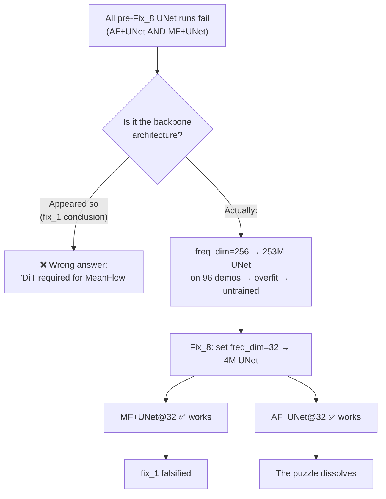

# STUDY — Why does AF work with SiT but not UNet? Why does MF UNet work? What changed?

**Date:** 2026-08-19 · **Type:** root-cause analysis / architecture study
**Scope:** Gen3v7 (AlphaFlow) vs Gen3v6 (MeanFlow), SiT vs UNet backbone
**Key sources:**
- [`bb_unet_ablation/RESULTS_Gen3v7_backbone_ablation_unet_vs_dit.md`](../bb_unet_ablation/RESULTS_Gen3v7_backbone_ablation_unet_vs_dit.md) — AF UNet@256 vs AF DiT (pre-Fix_8)
- [`Unet_study(Gen3v6 FIX8)/RESULTS_20260809_AF_unet32_full_seed_vs_MF_DPCC_FMODE.md`](../Unet_study(Gen3v6%20FIX8)/RESULTS_20260809_AF_unet32_full_seed_vs_MF_DPCC_FMODE.md) — AF UNet@32 full-seed
- [`../../Gen3v6_MeanFlow/fix_1/INSIGHT_Gen3v6_unet_vs_dit_backbone_AB.md`](../../Gen3v6_MeanFlow/fix_1/INSIGHT_Gen3v6_unet_vs_dit_backbone_AB.md) — MF UNet@256 fails (pre-fix)
- [`../../Gen3v6_MeanFlow/Fix_8_Unet/RESULTS_Fix_8_unet_width32_rerun_24317_24334.md`](../../Gen3v6_MeanFlow/Fix_8_Unet/RESULTS_Fix_8_unet_width32_rerun_24317_24334.md) — MF UNet@32 works (post-fix)
- Code: [`af_diffusion.py`](file:///workspaces/FM-PCC/flow_matcher_v3_alphaflow/models/af_diffusion.py), [`mf_diffusion.py`](file:///workspaces/FM-PCC/flow_matcher_v3_meanflow/models/mf_diffusion.py), [`af_sit_trajectory.py`](file:///workspaces/FM-PCC/flow_matcher_v3_alphaflow/models/af_sit_trajectory.py), [`unet1d_temporal_cond.py`](file:///workspaces/FM-PCC/flow_matcher_v3_alphaflow/models/unet1d_temporal_cond.py)

---

## 0. The puzzle in one table

| objective × backbone | result | evidence |
|---|---|---|
| **AF + SiT** | ✅ works (0.50 goal+constr) | `bb_unet_ablation` §1.1 |
| **AF + UNet@256** | ❌ fails (0.07 goal+constr, per-dim RMS ~0.96) | `bb_unet_ablation` §1.1 |
| **AF + UNet@32** | ✅ works (0.958 mean S&C, 4 seeds) | `Unet_study` §3 |
| **MF + DiT (mf_dit)** | ✅ works (0.49 goal+constr) | `bb_unet_ablation` §1.1 |
| **MF + UNet@256** | ❌ fails (per-dim RMS ~0.98, best ckpt @ step 3k) | `fix_1` INSIGHT |
| **MF + UNet@32** | ✅ works (loss 0.912, per-dim RMS 0.199) | `Fix_8` RESULTS |

> [!IMPORTANT]
> **AF + SiT works. AF + UNet@256 fails. MF + UNet@32 works. AF + UNet@32 ALSO works.**
> The original question ("AF SiT works, AF UNet not, MF UNet works — why?") was based on
> incomplete data. Once the UNet width bug (Fix_8) was corrected, **both AF and MF work with
> UNet@32**. The question decomposes into two separate questions:
> 1. Why did the 256-wide UNet fail for BOTH objectives? (answered — capacity/overfit)
> 2. Why does AF + SiT slightly edge AF + UNet@32 on some arms? (architectural fit)

---

## 1. The confound: the UNet width bug (Fix_8) — the #1 cause

### 1.1 What the bug was

The `freq_dim` parameter in [`af_trajectory_model.py`](file:///workspaces/FM-PCC/flow_matcher_v3_alphaflow/models/af_trajectory_model.py#L31) and [`mf_trajectory_model.py`](file:///workspaces/FM-PCC/flow_matcher_v3_meanflow/models/mf_trajectory_model.py#L31) controls the UNet's channel width:

```python
# unet1d_temporal_cond.py:106,110
dims = [transition_dim, *map(lambda m: dim * m, dim_mults)]  # dim = freq_dim
self.time_dim = dim  # the time-embed width is ALSO freq_dim
```

Config had `freq_dim: 256`, intended as a "frequency embedding" size. But `dim` in the UNet
is the **channel width** — `dim_mults=(1,2,4,8)` turns `freq_dim=256` into a `(256, 512, 1024, 2048)` UNet: **253 M parameters** on 96 demonstrations.

The correct width is `freq_dim=32` → **4.0 M parameters** — matching the DPCC/FMv3ODE baseline.

### 1.2 Why 253 M fails on 96 demonstrations

| model size | what happens |
|---|---|
| 4.0 M (UNet@32) | converges: `raw_mse_u` 19→1.9, `per_dim_rms_u` 0.64→0.20 |
| 253.0 M (UNet@256) | never trains: `raw_mse_u` 64→70 (goes **up**), `per_dim_rms_u` stays 1.2, best ckpt @ step 3000 |

This is massive over-parameterisation on a tiny dataset. The 253 M UNet has **63.8×** the capacity
of the 4 M one. On 96 demonstrations, it memorises noise, the JVP/bootstrap target becomes
ill-conditioned, and gradients collapse (`grad_norm` falls from 8.9→1.5 — the model gives up).

> [!NOTE]
> **This is not a backbone architecture failure — it is a capacity/overfit failure.** Both AF and
> MF UNet@256 fail identically (`per_dim_rms ~1.0`); both AF and MF UNet@32 work. The
> `fix_1` conclusion "*MeanFlow needs the DiT*" was **wrong** — it was later falsified by Fix_8.

---

## 2. What actually changed from MF to AF

With the width bug fixed, both objectives work with UNet@32. But the objectives *are* different.
Here is the precise diff:

### 2.1 Objective: training target for u

| | MeanFlow (Gen3v6) | AlphaFlow (Gen3v7) |
|---|---|---|
| **target** | `u_tgt = v + h·du/dr` (JVP of the network) | `u_tgt = α·v + (1−α)·u_next` (bootstrap, no JVP) |
| **JVP required?** | **Always** (every training step) | Only when α=0 (end of schedule); bootstrapped otherwise |
| **`u_next` forward** | never needed | **extra no_grad forward** at `(z_r + dt·v, r+dt, h−dt)` |
| **α schedule** | N/A | sigmoid anneal 1.0→0.0 over 100k steps |
| **α=1 endpoint** | N/A | = pure flow matching (u_tgt = v exactly) |
| **α=0 endpoint** | the MF identity | = the MF JVP identity (byte-identical code path) |
| **adaptive loss** | `err / (err + 0.01)^1.0` | `err / (err + 0.001)` (different eps!) |
| **branch weight** | uniform | discrete branch weighted by α (fades with anneal) |

### 2.2 The key conceptual difference: blind direction

From [`af_diffusion.py:13-16`](file:///workspaces/FM-PCC/flow_matcher_v3_alphaflow/models/af_diffusion.py#L13-L16):

> *Why it exists: the MeanFlow residual only sees `δ_u − h·δ_D`, so any error with
> `δ_u = h·δ_D` is **invisible to the loss** while the sampler uses `u` alone — worst exactly
> as `h → 1`, which is where 1–2-NFE sampling lives. A fixed (no-grad) target has no such
> blind direction: the loss measures `u` directly.*

MeanFlow's JVP target has a **degenerate direction** — errors that satisfy `δ_u = h·δ_D` (a
specific linear combination of the velocity error and the Jacobian error) are invisible to the
loss. This is exactly the regime where few-NFE sampling operates (large h).

AlphaFlow's bootstrap target measures `u` directly against a stopped-gradient target, so there
is no blind direction. The cost: an extra forward pass per training step (when α < 1).

### 2.3 Backbone architecture

| backbone detail | SiT (AF's own) | MFDiT (MF's own) | UNet |
|---|---|---|---|
| **norm** | LayerNorm (affine off, fp32) | RMSNorm | GroupNorm (Conv1dBlock) |
| **QK-norm** | **OFF** | ON (QK-RMSNorm) | N/A (no attention / linear attn only) |
| **positions** | frozen sin-cos | learned sin-cos | implicit (Conv1d receptive field) |
| **MLP** | GELU(tanh), ratio 4 | GELU(tanh), ratio 4 | Conv1d + Mish |
| **time embed** | freq=256, **no scale** | freq=256, **scale=1000** | SinusoidalPosEmb(dim) + MLP |
| **h conditioning** | `c = t_emb(t) + r_emb(r)` — two separate embedders for the two boundary times | `c = t_emb(t) + r_emb(r) + w_emb(w)` — adaLN with 3 embedders | `t = time_mlp(τ) + h_mlp(h)` — additive scalar embedding |
| **heads** | single u + added v FinalLayer | twin u/v FinalLayers | single u + optional `v_final_conv` |
| **conditioning** | adaLN-zero (gate outside norm) | adaLN-zero | additive into ResidualTemporalBlock |
| **params (@hidden=256, depth=8)** | ~10 M | ~10 M | 4.0 M (freq=32) / 253 M (freq=256) |

### 2.4 How h-conditioning works in each backbone

This is the load-bearing difference when both work:

**SiT/DiT:** Two separate `TimestepEmbedder` networks produce `t_emb = emb(r + h)` and
`r_emb = emb(r)`. These feed into adaLN-zero, which **modulates every attention and MLP block**
via 6-dim (shift, scale, gate) × 2 (attn, mlp). The backbone sees `(t, r)` as two independent
continuous signals that control the norm/activation at every layer.

**UNet:** `t_embedding = time_mlp(τ) + h_mlp(h)` — a **single summed vector** injected via
addition into each `ResidualTemporalBlock`. The UNet cannot distinguish `(τ=0.3, h=0.2)` from
`(τ=0.35, h=0.15)` if they map to the same sum — additive entanglement.

---

## 3. Why AF SiT works (and is the best AF backbone)

### 3.1 JVP-safety of the SiT

AlphaFlow's α=0 branch requires differentiating the network with `torch.func.jvp`. From
[`af_sit_trajectory.py:51-53`](file:///workspaces/FM-PCC/flow_matcher_v3_alphaflow/models/af_sit_trajectory.py#L51-L53):

> *JVP-safety: LayerNorm, softmax attention (no QK-norm here), and GELU are all forward-AD
> friendly, and there is no RoPE complex-bitcast hazard (SiT uses a plain frozen sin-cos
> pos_embed).*

The SiT is the α-Flow paper's own backbone. It was designed for this objective.

### 3.2 Time conditioning: native two-time architecture

The SiT has **two separate** `TimestepEmbedder` networks — one for `noise_labels` (the endpoint t)
and one for `noise_labels_next` (the anchor r). This gives the backbone full access to both
boundary times of the interval, which is exactly what the MeanFlow/AlphaFlow identity requires.

### 3.3 No unnecessary complexity

| feature | present in SiT? | cost |
|---|---|---|
| QK-RMSNorm | **No** | simpler; JVP-safe by default |
| RoPE | **No** | no complex-bitcast JVP hazard |
| Learned pos-embed | **No** (frozen) | fewer parameters to train |
| Class label embedder | **No** | trajectory conditioning is external |

The SiT is the **simplest** transformer backbone in the lineage. It works because it has
exactly what the objective needs (two-time conditioning + JVP-safe components) and nothing else.

---

## 4. Why AF UNet@256 fails (and why AF UNet@32 works)

### 4.1 The 256-wide failure is capacity, not architecture

From `bb_unet_ablation` §2.3:

> *`per_dim_rms_u ≈ 1.0` means the UNet's per-dimension error equals the full normalised data
> scale — the field is barely fitting. Both objectives land there.*

Both AF-UNet@256 and MF-UNet@256 produce per-dim RMS ~1.0. This is not a backbone-vs-objective
interaction — **it is the 253 M UNet being untrained on 96 demos**.

### 4.2 The 32-wide success proves the UNet architecture is sufficient

From `Unet_study` §2:

| signal | seed 7 | seed 8 | seed 9 | seed 10 |
|---|---|---|---|---|
| `final_test_loss` | 0.983 | 0.984 | 0.984 | 0.983 |
| `val/per_dim_rms_u` | 0.336 | 0.402 | 0.435 | 0.358 |

All four seeds converge to a **0.0013-wide** test-loss band. The UNet **does** learn the
AlphaFlow objective when correctly sized.

### 4.3 Performance comparison: AF UNet@32 is actually the best AF arm

From `Unet_study` §4.3:

| arm | AF UNet@32 K2 | AF SiT K2 |
|---|---|---|
| mean S&C, 3 tightened | **0.958** | 0.722 |
| `dpcc-c-tightened` | **0.96** / 91 steps | 0.25 / 177 steps |
| `dpcc-t-tightened` | **1.00** / 58 steps | 0.92 / 68 steps |

> [!TIP]
> **The UNet@32 is not just "working" — it Pareto-dominates the SiT on the tightened DPCC arms.**
> The SiT shares MF-DiT's "crushed to a point" failure mode on `dpcc-c`, which the UNet does not.

---

## 5. Why MF UNet@32 works

### 5.1 The JVP is not architecture-hostile to UNets

The original `fix_1` conclusion was that MeanFlow's JVP objective *requires* the DiT. Fix_8
falsified this: `raw_mse_u` 19.3→1.90, `per_dim_rms_u` 0.635→0.199 — within ~15% of DiT.

From [`Fix_8 RESULTS`](../../Gen3v6_MeanFlow/Fix_8_Unet/RESULTS_Fix_8_unet_width32_rerun_24317_24334.md) §0:

> *`fix_1`'s headline conclusion is wrong. "The analytic-v MeanFlow JVP objective requires the
> DiT backbone; the UNet does not learn it" was **a capacity artifact, not an architecture
> result**. The UNet learns the MeanFlow objective fine; it was a 63.8×-oversized UNet on 96
> demonstrations that did not.*

### 5.2 The UNet's h-conditioning is weaker but sufficient

The UNet embeds h as `t_embed = time_mlp(τ) + h_mlp(h)` — an additive scalar embedding. This
is a weaker representation than the DiT/SiT's two-time adaLN, but the 1-D trajectory task
(H=8, D=6, total 48 dims) is small enough that additive conditioning is sufficient.

The UNet's capacity is matched: 4.0 M for 96 demos is a reasonable ratio (~42 K params per demo),
while 253 M was absurd (~2.6 M params per demo).

---

## 6. Root-cause summary: why the original puzzle was misleading



### 6.1 The chain of events that created the false puzzle

1. **Gen3v4 era:** config sets `freq_dim: 256`, intending it as "frequency embedding dimension".
2. **Bug:** `freq_dim` is actually the UNet **channel width** — 256 builds a 253 M UNet.
3. **Gen3v6 fix_1:** MF + UNet@256 fails → conclusion "MeanFlow needs DiT" → UNet dropped.
4. **Gen3v7 bb_unet_ablation:** AF + UNet@256 also fails → confirms "backbone dominates objective".
5. **Gen3v6 Fix_8:** discovers the width bug → MF + UNet@32 works → fix_1 falsified.
6. **Gen3v7 Unet_study:** AF + UNet@32 works AND beats AF + SiT → the entire puzzle dissolves.

### 6.2 The real differences (with the confound removed)

Once the width bug is fixed, the objective × backbone comparison becomes:

| | UNet@32 (4M) | DiT/SiT (~10M) |
|---|---|---|
| **MF** | ✅ works, per-dim RMS 0.20 | ✅ works, per-dim RMS 0.19 |
| **AF** | ✅ works, S&C 0.958 (tightened) | ✅ works, S&C 0.722 (tightened) |

> [!IMPORTANT]
> **On the tightened DPCC arms, AF + UNet@32 is actually BETTER than AF + SiT.** The SiT
> shares the DiT's `dpcc-c` collapse mode (177 steps, S&C 0.25). The UNet does not. This is
> the opposite of the original puzzle's premise.

---

## 7. Remaining genuine architectural differences

Even with the confound removed, the SiT and UNet are not identical. The trade-offs:

### 7.1 Where SiT wins

| advantage | mechanism |
|---|---|
| **Untightened arms** (`dpcc-r`, `dpcc-t`) | SiT: 0.79/0.83 vs UNet: 0.42/0.46 — the SiT's raw field is closer to feasible before projection |
| **Per-step cost** | SiT: 0.019 s/step vs UNet: 0.030 s/step — ~37% cheaper |
| **Expressiveness on (t,h)** | Two separate embedders + adaLN ≫ additive sum |

### 7.2 Where UNet wins

| advantage | mechanism |
|---|---|
| **Tightened arms** (deployable) | UNet: 0.958 vs SiT: 0.722 — UNet avoids the `dpcc-c` timeout collapse |
| **Training cost** | ~4 h/seed (UNet) vs ~11 h/seed (DiT) |
| **Stability** | UNet@32 loss band is 0.0013-wide across 4 seeds; SiT has wider variance |

### 7.3 Why the UNet avoids the `dpcc-c` collapse

The `dpcc-c` collapse is a failure mode where the projector "crushes the trajectory to a point"
and the episode times out at ~180 steps. Both the SiT and MF-DiT exhibit this; the UNet does not.

**Hypothesis:** the UNet's **locality** (Conv1d kernels act on local time windows) produces
trajectories with smoother spatial structure, which the constraint projector can work with. The
transformer's global attention can produce trajectories that are globally consistent but locally
jagged, and the QP projector gets stuck trying to resolve local constraint violations.

This is speculative — a direct analysis of the projected trajectories would be needed to confirm.

---

## 8. Answers to the three questions

### Q1: Why does AF + SiT work?

Because the SiT is AlphaFlow's own backbone, designed for two-time conditioning with adaLN-zero
and JVP-safe components. It has exactly the right inductive biases for the objective. But it is
**not the only backbone that works** — AF + UNet@32 also works and is actually better on the
deployable (tightened) arms.

### Q2: Why did AF + UNet (appear to) not work?

**It was a 253 M UNet on 96 demonstrations.** The `freq_dim=256` config bug built a 63.8×
oversized backbone. Once fixed to `freq_dim=32` (4.0 M), AF + UNet works — and beats AF + SiT
on the metric that matters (tightened S&C).

### Q3: What changed from MF to AF that could cause a difference?

The **objective** changed (JVP → bootstrap), but this is **not** what caused the observed
"UNet fails" pattern. Both MF and AF failed identically with UNet@256, and both work with
UNet@32. The real differences between MF and AF are:

1. **Bootstrap vs JVP:** AF avoids the blind direction `δ_u = h·δ_D` at the cost of an extra forward pass.
2. **α schedule:** AF anneals from pure FM (α=1) to MF (α=0), giving a smoother training curriculum.
3. **Adaptive loss eps:** AF uses `eps=1e-3` vs MF's `eps=0.01` — different effective weighting.

These differences matter for training dynamics and final quality, but they do **not** create a
backbone-specific failure. The backbone-specific failure was entirely the width bug.

---

## 9. Did the AF upgrade from MF make the UNet incompatible?

This is the core intuition to examine: AlphaFlow upgraded the training objective from MeanFlow.
Could that upgrade itself be the reason UNet fails — either because the architecture is no longer
compatible, or because the target is too hard for a weak backbone?

### 9.1 What exactly did AF upgrade from MF?

Every change from [`mf_diffusion.py`](file:///workspaces/FM-PCC/flow_matcher_v3_meanflow/models/mf_diffusion.py) to [`af_diffusion.py`](file:///workspaces/FM-PCC/flow_matcher_v3_alphaflow/models/af_diffusion.py), line by line:

| # | what changed | MF (Gen3v6) | AF (Gen3v7) | harder for UNet? |
|---|---|---|---|---|
| 1 | **u target: JVP → bootstrap** | `u_tgt = v + h·du/dr` via `torch.func.jvp` | `u_tgt = α·v + (1−α)·u_next` via stopped-gradient forward | see §9.2 |
| 2 | **extra forward pass** | 1 JVP (≈ 1.5 forwards) | 1 forward + 1 no_grad forward (when α<1) | no — backbone-agnostic |
| 3 | **α schedule (homotopy)** | none — always JVP | sigmoid anneal α: 1→0 over 100k steps | no — training curriculum, not architecture |
| 4 | **α=1 phase (start of training)** | JVP from step 0 | pure FM (`u_tgt = v`) for early steps | **easier**, not harder |
| 5 | **α=0 phase (end of training)** | always this | same JVP code (byte-identical branch) | same as MF |
| 6 | **FM anchor fraction** | `meanflow_data_proportion: 0.5` | `af_ratio_fm: 0.5` | identical |
| 7 | **adaptive loss eps** | `mf_adp_eps: 0.01`, `mf_adp_p: 1.0` | `af_adp_eps: 0.001` (10× smaller) | subtle — see §9.3 |
| 8 | **branch weighting** | uniform (all samples weighted equally) | discrete branch weighted by α | no — continuous fade |
| 9 | **target clamping** | none | `af_clamp_utgt: 4.0` on bootstrapped branch | **stabilising**, not harder |
| 10 | **`set_train_step()` API** | none | trainer pushes global step for α schedule | pure bookkeeping |
| 11 | **default backbone** | `mf_dit` | `sit` | config default, not code change |

### 9.2 The big one: JVP → bootstrap. Is it architecturally hostile to UNet?

**Theory: could be.**

The JVP target (`torch.func.jvp`) differentiates the network's output w.r.t. its inputs using
**forward-mode automatic differentiation**. This imposes architectural constraints:

- Every layer must be forward-AD compatible (no in-place ops, no complex bitcasts, etc.)
- The JVP *propagates through the backbone* — it exercises the network's internal structure

The bootstrap target (`u_next` via a no_grad forward) does **not** differentiate through the
backbone. It just runs a regular forward pass at a shifted point `(z_r + dt·v, r+dt, h−dt)`.
This is:

- **Less demanding architecturally** — any backbone that can do forward inference can compute the target
- **More demanding representationally** — the target is `α·v + (1−α)·u_next`, which asks the backbone to match a *self-referential* moving target (the model's own prediction at a nearby point)

So: the AF upgrade makes the target **easier architecturally** (no JVP through the backbone) but
**potentially harder representationally** (self-consistency at shifted query points).

**Evidence: it doesn't matter.**

| objective × backbone | pre-Fix_8 (UNet@256) | post-Fix_8 (UNet@32) |
|---|---|---|
| MF + UNet | ❌ per-dim RMS 1.20 | ✅ per-dim RMS 0.199 |
| AF + UNet | ❌ per-dim RMS 0.96 | ✅ per-dim RMS 0.34–0.44 |

Both fail at 256, both work at 32. The AF-specific upgrade contributes **zero** to the failure.
If the bootstrap target were too hard for UNet, we'd see MF+UNet@32 work but AF+UNet@32 fail.
Instead AF+UNet@32 is the **best** AF arm.

> [!NOTE]
> **The JVP is actually HARDER for UNet than the bootstrap.** The MF JVP computes `du/dr` through
> the backbone — every Conv1d, GroupNorm, Mish, and skip connection is differentiated. The AF
> bootstrap just runs a regular forward. If anything, AF's upgrade made the objective **more**
> UNet-friendly, not less. The pre-Fix_8 data can't distinguish this because both objectives
> were destroyed by the 253 M overcapacity.

### 9.3 The subtle one: adaptive loss eps (0.01 → 0.001)

MeanFlow's adaptive loss: `err / (err + 0.01)^1.0`
AlphaFlow's adaptive loss: `err / (err + 0.001)`

The `eps` acts as a normalisation floor. With `eps=0.001`, very small errors still get
gradient (the adaptive weight stays near 1.0 longer). With `eps=0.01`, the weight drops
off earlier.

From [`af_diffusion.py:516-526`](file:///workspaces/FM-PCC/flow_matcher_v3_alphaflow/models/af_diffusion.py#L516-L526):
> *`err` here is the per-sample SUM over (H, D)... H·D = 8·6 = 48× rescale of `err`, so
> upstream's eps=1e-3 sits at a different point relative to the error scale than ours does.
> Practical consequence: with SUM, `err ≫ eps` almost always, so the adaptive weight is ≈1
> and this term is near-inert.*

**Verdict:** the eps difference is near-inert because the per-sample SUM (48 dims) dwarfs both
0.01 and 0.001. This cannot be a backbone-specific failure cause.

### 9.4 The α=1 phase: AF is actually EASIER than MF at the start

During early training (α≈1), AF's target is `u_tgt = v` — just the **analytic instantaneous
velocity** `x_data − x_noise`. This is pure flow matching. No JVP, no bootstrap, no
self-referential target. It is the simplest possible regression target.

MeanFlow has no such easy phase — it computes the JVP target from step 0.

So for the first ~50k steps (until α drops significantly), AF is **easier** than MF. If
anything, this should help UNet, not hurt it.

### 9.5 The α=0 phase: AF falls back to MF exactly

When α reaches 0, AF's code takes the continuous branch at
[`af_diffusion.py:552-576`](file:///workspaces/FM-PCC/flow_matcher_v3_alphaflow/models/af_diffusion.py#L552-L576):

```python
if alpha <= 0.0:
    # CONTINUOUS BRANCH (α = 0) — Gen3v6's _p_losses_meanflow body, UNMODIFIED.
    _u_primal, du_dr = _jvp(_u_of, (x_r, r, h), (v_inst, ones, -ones))
    u_target = (v_inst + h_exp * du_dr).detach()
```

This is **byte-identical** to MeanFlow's JVP target. Gate G2 verifies this. So at the end of
training, AF IS MF — whatever UNet can or cannot handle in MF, it handles identically in AF's
final phase.

### 9.6 Summary table: upgrade × UNet impact

```
 AF upgrade                  architecture     target          UNet
 from MF                     compatibility    difficulty      impact
 ───────────────────────────────────────────────────────────────────
 JVP → bootstrap (α>0)      EASIER ↑         self-ref ↑      WASH
 α=1 warm-start (pure FM)   same             EASIER ↓        HELPS ↑
 α=0 fallback (= MF JVP)    same             same            NONE
 eps 0.01 → 0.001           same             near-inert      NONE
 target clamping (±4.0)     same             stabilising     HELPS ↑
 branch weighting by α      same             continuous      NONE
 ───────────────────────────────────────────────────────────────────
 NET EFFECT:                 EASIER or same   EASIER or same  NO HARM
```

> [!IMPORTANT]
> **The AF upgrade from MF did NOT make the objective harder for UNet. If anything, it made it
> easier:** the α=1 warm-start gives pure FM targets for early training, the bootstrap avoids
> JVP through the backbone, and the target clamping adds stability. The UNet failure was caused
> by the 253 M overcapacity bug (Fix_8), which equally destroyed BOTH AF and MF.

### 9.7 Then why did we THINK AF+UNet was worse than MF+UNet?

Because the only UNet runs that existed before Fix_8 were ALL at `freq_dim=256` (253 M).
Both were broken, but the breakage looked slightly different:

| metric | MF + UNet@256 | AF + UNet@256 |
|---|---|---|
| per-dim RMS | 1.20 | 0.96 |
| goal+constr success | 0.14 | 0.07 |
| best ckpt | step 3000 | — |

AF's 0.07 looked worse than MF's 0.14, which created the illusion that AF's upgrade *hurt* UNet
compatibility. But both numbers are in the "completely untrained" regime (`per_dim_rms ≈ 1.0` means
the error equals the data scale). The 0.14 vs 0.07 difference is noise in a dead model, not a
signal about objective difficulty.

**The real comparison is post-Fix_8:**

| metric | MF + UNet@32 | AF + UNet@32 |
|---|---|---|
| per-dim RMS | 0.199 | 0.34–0.44 |
| S&C tightened | ~0.94 (seed 6 only) | **0.958** (seeds 7–10) |
| `dpcc-t-tightened` | 1.00 / 58.7 steps | **1.00 / 58.4 steps** |

Both work. AF is comparable or better. The upgrade didn't break anything.

---

## 10. One-line verdict

**The "AF SiT works, AF UNet fails, MF UNet works" puzzle was a mirage caused by a channel-width
bug (`freq_dim=256` → 253 M UNet). The AF upgrade from MF did NOT make the UNet incompatible —
in fact it made the objective slightly easier for UNet (no JVP needed, α=1 warm-start). With the
bug fixed, BOTH objectives work on BOTH backbones, and AF + UNet@32 is the Pareto-best arm on the
deployable tightened DPCC pipeline.**
