# Full Lifecycle Analysis: Gen6 Visual-Aligning Engine (ddpm_encdec_vision) vs. Original D3IL Baseline

This document provides a highly detailed, academically rigorous end-to-end trace of both the **Gen6 Visual-Aligning Engine** (implemented in the `ddpm_encdec_vision` folder) and the **Original D3IL Baseline** (implemented in the `d3il` folder). Both models are built on stochastic denoising diffusion (DDPM) but use fundamentally different neural backbones and state-action sequence representations.

---

## 🗺️ Master Architectural Comparison

```mermaid
flowchart TD
    subgraph D3IL["NATIVE D3IL BASELINE (d3il/ folder)"]
        direction LR
        A1["Dataset & Prep<br/><b>aligning_dataset.py</b>"] --> A2["D3IL Scaler<br/><b>d3il/agents/utils/scaler.py</b>"]
        A2 --> A3["Obs Encoder<br/><b>multi_image_obs_encoder.py</b>"]
        A3 --> A4["Transformer Diffusion Core<br/><b>diffusion_models.py (EncDec)<br/>act_vae.py (Transformer VAE)</b>"]
        A4 --> A5["Reverse p-Sampling Loop<br/><b>diffusion_policy.py (16 steps)</b>"]
        A5 --> A6["Epsilon Scale<br/><b>std + 1e-12</b>"]
        A6 --> A7["EE Integration<br/><b>aligning_sim.py</b>"]
        A7 --> A8["MuJoCo Control<br/><b>IKControllers.py</b>"]
    end

    subgraph Gen6["GEN6 VISUAL ENGINE (ddpm_encdec_vision/ folder)"]
        direction LR
        B1["Dataset & Prep<br/><b>aligning_dataset.py</b>"] --> B2["Gen6 Scaler<br/><b>ddpm_encdec_vision/utils/scaler.py</b>"]
        B2 --> B3["Model Backbone<br/><b>visual_unet.py (1D Temporal U-Net)</b>"]
        B3 --> B4["Visual Gaussian Diffusion<br/><b>visual_gaussian_diffusion.py (Stochastic DDPM Engine)</b>"]
        B4 --> B5["Denoising Loop<br/><b>p_sample_loop (16 steps)</b>"]
        B5 --> B6["Epsilon Safe std<br/><b>std_safe = std + 1e-12</b>"]
        B6 --> B7["EE Integration<br/><b>eval_ddpm_encdec_vision.py</b>"]
        B7 --> B8["MuJoCo Control<br/><b>IKControllers.py</b>"]
    end

    style D3IL fill:#f9f9f9,stroke:#333,stroke-width:2px,color:#333
    style Gen6 fill:#f5f7fa,stroke:#4a90e2,stroke-width:2px,color:#333
    classDef d3il_node fill:#fff,stroke:#333,stroke-width:1px,color:#333;
    classDef gen6_node fill:#fff,stroke:#4a90e2,stroke-width:1px,color:#333;
    class A1,A2,A3,A4,A5,A6,A7,A8 d3il_node;
    class B1,B2,B3,B4,B5,B6,B7,B8 gen6_node;
```



---

# PART 1: The Original D3IL Visual-Aligning Baseline

The native D3IL baseline utilizes an **Action Chunking with Transformers (ACT)** architecture adapted for denoising diffusion (known as the Encoder-Decoder VAE diffusion policy).

### 1. Expert Dataset & Delta Calculations
* **Source File**: [d3il/environments/dataset/aligning_dataset.py](file:///workspaces/FM-PCC/d3il/environments/dataset/aligning_dataset.py)
* Loads absolute end-effector (EE) Cartesian positions from the recorded expert trajectories:
  ```python
  robot_des_pos = env_state['robot']['des_c_pos']  # absolute [x, y, z] coord
  ```
* Calculates 3D action velocities as Cartesian delta displacements between successive frames:
  ```python
  vel_state = robot_des_pos[1:] - robot_des_pos[:-1] # Shape: [N, 3] (vx, vy, vz)
  ```

### 2. D3IL Baseline Normalization & Scaling
* **Source File**: [d3il/agents/utils/scaler.py](file:///workspaces/FM-PCC/d3il/agents/utils/scaler.py)
* Computes $z$-score bounds and standard deviations. Epsilon is added directly inside scaling functions during execution:
  ```python
  def scale_input(self, x):
      return (x - self.x_mean) / (self.x_std + 1e-12)
  ```

### 3. Visual Observation Encoding
* **Source File**: [d3il/agents/models/vision/multi_image_obs_encoder.py](file:///workspaces/FM-PCC/d3il/agents/models/vision/multi_image_obs_encoder.py)
* Combines Background and In-Hand camera streams through shared ResNet-18 architectures to extract a 128D visual embedding representation of the tabletop state:
  ```python
  visual_features = self.obs_encoder(obs_dict) # [Batch, Time, 128]
  ```

### 4. VAE Transformer Diffusion Core
* **Source Files**: [d3il/agents/models/diffusion/diffusion_models.py](file:///workspaces/FM-PCC/d3il/agents/models/diffusion/diffusion_models.py) & [d3il/agents/models/act/act_vae.py](file:///workspaces/FM-PCC/d3il/agents/models/act/act_vae.py)
* Encapsulated inside `ddpm_encdec_vision_agent.py` via `DiffusionEncDec` which coordinates:
  * **TransformerEncoder**: Maps the visual embeddings, absolute coordinates, and actions into VAE latents.
  * **TransformerDecoder**: Decodes the noisy action latents back into clean action sequences, heavily conditioned on the visual features.

### 5. Denoising & Inference Planning (Rollout)
* **Source File**: [d3il/agents/models/diffusion/diffusion_policy.py](file:///workspaces/FM-PCC/d3il/agents/models/diffusion/diffusion_policy.py)
* Executes backward reverse denoising over exactly **16** discrete steps (as configured by `n_timesteps` in `ddpm_encdec_vision_agent.yaml`). Starts from raw Gaussian noise $x_T$ and subtracts predicted noise $\epsilon$ step-by-step:
  ```python
  # diffusion_policy.py (p_sample_loop)
  for t in reversed(range(0, self.n_timesteps)):
      noise_pred = self.model(x, t, cond) 
      x = (x - beta * noise_pred / sqrt(1 - alpha_cumprod)) / sqrt(alpha) + std * z
  ```

---

# PART 2: The Gen6 Visual-Aligning Engine (ddpm_encdec_vision)

Gen6 represents a complete structural overhaul. It keeps the D3IL dual-camera setup but replaces the VAE Transformer architecture with a **1D Temporal Convolutional U-Net** and implements a highly stable training/eval framework.

### 1. Training CLI Entry Point & Parameter Resolution
* **Training CLI**:
  ```bash
  python ddpm_encdec_vision_test/train_ddpm_encdec_vision.py --seed 6 --use-wandb
  ```
* **Source File**: [ddpm_encdec_vision_test/train_ddpm_encdec_vision.py](file:///workspaces/FM-PCC/ddpm_encdec_vision_test/train_ddpm_encdec_vision.py)
* Dynamically parses command-line parameters and sets up the watched configurations in the `Parser` class, writing logs under:
  `logs/aligning-d3il-visual/ddpm_encdec_vision/`

### 2. Gen6 Masked Scaler Parity
* **Source File**: [ddpm_encdec_vision/utils/scaler.py](file:///workspaces/FM-PCC/ddpm_encdec_vision/utils/scaler.py)
* Pre-calculates dataset statistics ignoring zero-padding sequences to avoid mathematical scale corruption. Epsilon-safe parameters are calculated directly inside the constructor:
  ```python
  # scaler.py (Constructor)
  self.x_std_safe = self.x_std + 1e-12
  self.y_std_safe = self.y_std + 1e-12
  ```

### 3. Model Backbone: 1D Temporal U-Net
* **Source File**: [ddpm_encdec_vision/models/visual_unet.py](file:///workspaces/FM-PCC/ddpm_encdec_vision/models/visual_unet.py)
* `VisualUNet` embeds the shared ResNet visual encoder (`MultiImageObsEncoder`) inside its architecture, performing temporal 1D convolutional downsampling and upsampling over a sliding trajectory window of size $8$ (`horizon`) via `UNet1DTemporalCondModel`:
  ```python
  # visual_unet.py
  visual_features = self.visual_encoder(bp_imgs, inhand_imgs)
  # 1D Temporal U-Net extracts spatial-temporal correlations
  noise_pred = self.unet(x_noisy, diffusion_step, cond=visual_features)
  ```

### 4. Diffusion Engine: Visual Gaussian Diffusion
* **Source File**: [ddpm_encdec_vision/models/visual_gaussian_diffusion.py](file:///workspaces/FM-PCC/ddpm_encdec_vision/models/visual_gaussian_diffusion.py)
* Manages continuous noise scheduling (exactly **16** diffusion timesteps, matching `n_diffusion_steps` in the active workspace config `aligning-d3il-visual.py`) over a 6D concatenated trajectory vector $x = [act, obs]$:
  ```python
  # visual_gaussian_diffusion.py (loss)
  x = torch.cat([act, obs], dim=-1)
  predicted_noise = self.model(x_noisy, t, visual_cond)
  loss = F.mse_loss(noise, predicted_noise)
  ```

### 5. Denoising Sampling and Snapping
* **Source File**: [ddpm_encdec_vision/models/visual_gaussian_diffusion.py](file:///workspaces/FM-PCC/ddpm_encdec_vision/models/visual_gaussian_diffusion.py)
* During rollout inference, the `p_sample_loop` runs the denoising steps. At each stage, the observation dimensions (indices $3$ to $5$) are clamped directly to the scaled robot proprioceptive position to preserve consistency:
  ```python
  def apply_conditioning(self, x, cond):
      # Cond = current scaled [x_ee, y_ee, z_ee] coordinate
      # Snaps the starting trajectory step observation dimensions
      x[:, 0, self.action_dim:] = cond
      return x
  ```

### 6. Closed-Loop Rollout Execution in MuJoCo
* **Evaluation CLI**:
  ```bash
  python ddpm_encdec_vision_test/eval_ddpm_encdec_vision.py --seed 6 --use-wandb
  ```
* **Source File**: [ddpm_encdec_vision_test/eval_ddpm_encdec_vision.py](file:///workspaces/FM-PCC/ddpm_encdec_vision_test/eval_ddpm_encdec_vision.py)
* Generates predicted spatial trajectory vectors, unnormalizes using the safe constructor standard deviation, integrates the delta displacement `pred_action[0]` into absolute coordinates, couples orientation quaternions, and steps the low-level Cartesian controller in MuJoCo:
  ```python
  pred_action = agent.predict((bp_image, inhand_image, des_robot_pos))
  pred_action = pred_action[0] + des_robot_pos # EE target pos
  pred_action = np.concatenate((pred_action, [0, 1, 0, 0]), axis=0) # 7D command Pose
  obs, reward, done, info = env.step(pred_action)
  ```

---

# PART 3: Rigorous Comparative Analysis (D3IL vs. Gen6)

Below is an extensive, granular audit of every structural and operational difference between the two frameworks.

> [!IMPORTANT]
> **Is the Transformer vs. U-Net Backbone swap the only difference between D3IL and Gen6?**
>
> **No!** While the backbone swap is the most prominent neural network replacement, they differ across multiple key architectural, mathematical, and data formulations:
> 1. **Trajectory formulation**: D3IL processes absolute spatial actions $a_{t:t+H}$ only; Gen6 couples actions and observations in a **joint 6D sequence** $[act, obs]$.
> 2. **Context Enforcing**: D3IL relies on cross-attention weights; Gen6 actively enforces physical starting boundaries by **hard-snapping observation dimensions** to robot joints at $t=0$.
> 3. **Horizon Safety padding**: Gen6 implements **auto-padding to multiples of 8** to protect downsampling layers from size mismatch crashes.
> 4. **Data Normalization**: Gen6 isolates standard deviation parameters (`std_safe`) inside the constructor to **prevent zero-padding scale corruption**.
> 5. **Weighted Loss**: Gen6 weighs immediately next actions **10x higher** (`action_weight = 10.0`) than predicted states to encourage precise alignment tracking.
> 6. **EMA Parameter Smoothing**: Gen6 optimizes parameters using **Exponential Moving Average** (`decay = 0.9999`) to yield smooth, lower-variance physical rollouts.

### 📊 Side-by-Side Architectural Audit

| Comparison Axis | Original D3IL Baseline (`d3il`) | Gen6 Engine (`ddpm_encdec_vision`) | Difference Context & Scientific Rationale |
| :--- | :--- | :--- | :--- |
| **Model Core** | Transformer VAE Encoder-Decoder (`DiffusionEncDec`) | 1D Temporal CNN U-Net (`VisualUNet`) | **Core Backbone Swap**: Transformer relies on cross-attention tokens; Gen6 uses a temporal convolutional grid that filters spatial-temporal correlations. |
| **Neural Backbone Files** | [act_vae.py](file:///workspaces/FM-PCC/d3il/agents/models/act/act_vae.py), [diffusion_models.py](file:///workspaces/FM-PCC/d3il/agents/models/diffusion/diffusion_models.py#L687) | [visual_unet.py](file:///workspaces/FM-PCC/ddpm_encdec_vision/models/visual_unet.py#L11), [unet1d_temporal_cond.py](file:///workspaces/FM-PCC/diffuser/models/unet1d_temporal_cond.py) | **Code Separation**: Native D3IL utilizes nested modules inside VAE blocks; Gen6 imports 1D conv blocks from `diffuser` and maps them directly. |
| **Denoising Steps ($T$)** | **16** Steps | **16** Steps | **Parity Verified**: Both configs are aligned to exactly 16 steps, eliminating scale mismatches during checkpoint evaluation. |
| **Trajectory sequence** | Action displacements $a_{t:t+H}$ **only** | Joint 6D vector $[act_{t:t+H}, obs_{t:t+H}]$ | **Joint vs. Action Planning**: D3IL plans purely in action delta-velocity space; Gen6 couples actions and state dimensions in a unified sequence. |
| **Initial Context Enforce** | Implicitly encoded via cross-attention tokens | Explicit snapped projection via `apply_conditioning` | **Drift Control**: D3IL relies on soft attention matching; Gen6 actively snaps starting states to eliminate starting Cartesian offset drift. |
| **Epsilon Normalization** | Added dynamically `std + 1e-12` during calls | Pre-calculated `self.y_std_safe` inside Scaler constructor | **Zero-Variance Protection**: Gen6 guarantees that standard deviations are locked safely inside the constructor, preventing zero-padding math errors. |
| **Loss Function Configuration** | Standard reconstruction MSE (L2) | MSE with prioritized `action_weight = 10.0` | **Action Prioritisation**: Gen6 weighs immediately next actions 10x higher than state prediction losses to encourage precise tracking. |
| **Temporal Context Horizon** | `obs_seq_len = 5` history sliding frame buffer | `horizon = 8` / `padded_horizon` multiple of 8 | **Safe Temporal Horizon**: Gen6 pads sequences to multiples of 8 to support the 1D U-Net down/up layers; D3IL uses custom sliding history bounds. |
| **Optimization / EMA** | Standard Adam optimizer (no weight EMA) | Adam with Trainer-level Weight EMA (`decay = 0.9999`) | **Inference Parity**: Gen6 averages network parameters over steps to yield smooth, lower-variance rollout movements. |
| **MuJoCo Execution Hook** | Inline integration in `aligning_sim.py` | Wrapped inside high-fidelity `VisualAgentWrapper` | **Rollout Metrics**: Gen6 metrics track 7 distinct parameters (contact, xy foresight, error) with real-time video exporting. |

---

# PART 4: Specific Hyperparameter Parameter Sets

The following tables show the exact hyperparameter values configured in the files of both frameworks:

### ⚙️ Training Parameters

| Hyperparameter | Original D3IL Baseline Config | Gen6 Engine Config | Config Source Files |
| :--- | :--- | :--- | :--- |
| **Active Epochs / Steps** | `epoch = 4` | `n_train_steps = 1.0e5` (100,000 steps) | [ddpm_encdec_vision_agent.yaml](file:///workspaces/FM-PCC/d3il/configs/agents/ddpm_encdec_vision_agent.yaml#L151) / [aligning-d3il-visual.py](file:///workspaces/FM-PCC/config/aligning-d3il-visual.py#L79) |
| **Training Batch Size** | `train_batch_size = 64` | `batch_size = 64` | [aligning_vision_config.yaml](file:///workspaces/FM-PCC/d3il/configs/aligning_vision_config.yaml#L43) / [aligning-d3il-visual.py](file:///workspaces/FM-PCC/config/aligning-d3il-visual.py#L80) |
| **Optimizer Type** | `torch.optim.Adam` | `torch.optim.Adam` (Trainer-level) | [ddpm_encdec_vision_agent.yaml](file:///workspaces/FM-PCC/d3il/configs/agents/ddpm_encdec_vision_agent.yaml#L134) / [train_ddpm_encdec_vision.py](file:///workspaces/FM-PCC/ddpm_encdec_vision_test/train_ddpm_encdec_vision.py#L280) |
| **Base Learning Rate** | `lr = 5e-4` | `train_lr = 2e-4` | [ddpm_encdec_vision_agent.yaml](file:///workspaces/FM-PCC/d3il/configs/agents/ddpm_encdec_vision_agent.yaml#L135) / [train_ddpm_encdec_vision.py](file:///workspaces/FM-PCC/ddpm_encdec_vision_test/train_ddpm_encdec_vision.py#L288) |
| **Weight Decay** | `weight_decay = 0` | `weight_decay = 0` | [ddpm_encdec_vision_agent.yaml](file:///workspaces/FM-PCC/d3il/configs/agents/ddpm_encdec_vision_agent.yaml#L137) / [train_ddpm_encdec_vision.py](file:///workspaces/FM-PCC/ddpm_encdec_vision_test/train_ddpm_encdec_vision.py#L280) |
| **Weight EMA Decay** | None | `ema_decay = 0.9999` | None / [train_ddpm_encdec_vision.py](file:///workspaces/FM-PCC/ddpm_encdec_vision_test/train_ddpm_encdec_vision.py#L284) |
| **Loss Type** | `loss_type = 'l2'` (MSE) | `loss_type = 'l2'` (MSE) | [ddpm_encdec_vision_agent.yaml](file:///workspaces/FM-PCC/d3il/configs/agents/ddpm_encdec_vision_agent.yaml#L22) / [aligning-d3il-visual.py](file:///workspaces/FM-PCC/config/aligning-d3il-visual.py#L47) |
| **Action Prioritization** | None | `action_weight = 10.0` | None / [aligning-d3il-visual.py](file:///workspaces/FM-PCC/config/aligning-d3il-visual.py#L50) |

### 🧠 Model Network Parameters

| Parameter Name | Original D3IL Baseline Config | Gen6 Engine Config | Config Source Files |
| :--- | :--- | :--- | :--- |
| **Diffusion Timesteps ($T$)** | `n_timesteps = 16` | `n_diffusion_steps = 16` | [ddpm_encdec_vision_agent.yaml](file:///workspaces/FM-PCC/d3il/configs/agents/ddpm_encdec_vision_agent.yaml#L21) / [aligning-d3il-visual.py](file:///workspaces/FM-PCC/config/aligning-d3il-visual.py#L46) |
| **Beta Schedule** | `beta_schedule = 'cosine'` | Cosine Schedule | [ddpm_encdec_vision_agent.yaml](file:///workspaces/FM-PCC/d3il/configs/agents/ddpm_encdec_vision_agent.yaml#L20) / [diffusion.py](file:///workspaces/FM-PCC/diffuser/models/diffusion.py#L29) |
| **Temporal Horizon ($H$)** | `window_size = 8` | `horizon = 8` | [ddpm_encdec_vision_agent.yaml](file:///workspaces/FM-PCC/d3il/configs/agents/ddpm_encdec_vision_agent.yaml#L161) / [aligning-d3il-visual.py](file:///workspaces/FM-PCC/config/aligning-d3il-visual.py#L39) |
| **Action Chunk Length** | `action_seq_len = 4` | `action_seq_size = 4` | [ddpm_encdec_vision_agent.yaml](file:///workspaces/FM-PCC/d3il/configs/agents/ddpm_encdec_vision_agent.yaml#L37) / [aligning-d3il-visual.py](file:///workspaces/FM-PCC/config/aligning-d3il-visual.py#L45) |
| **Observation History length** | `obs_seq_len = 5` | `obs_seq_len = 5` | [ddpm_encdec_vision_agent.yaml](file:///workspaces/FM-PCC/d3il/configs/agents/ddpm_encdec_vision_agent.yaml#L36) / [aligning-d3il-visual.py](file:///workspaces/FM-PCC/config/aligning-d3il-visual.py#L44) |
| **Epsilon Clamping** | `clip_denoised = True` (limits: standard) | `clip_denoised = True` (limits: action dims only) | [ddpm_encdec_vision_agent.yaml](file:///workspaces/FM-PCC/d3il/configs/agents/ddpm_encdec_vision_agent.yaml#L23) / [visual_gaussian_diffusion.py](file:///workspaces/FM-PCC/ddpm_encdec_vision/models/visual_gaussian_diffusion.py#L45) |
| **Network Embed Dimensions** | `embed_dim = 64` | `dim = 32` / `dim_mults = (1, 2, 4, 8)` | [ddpm_encdec_vision_agent.yaml](file:///workspaces/FM-PCC/d3il/configs/agents/ddpm_encdec_vision_agent.yaml#L40) / [aligning-d3il-visual.py](file:///workspaces/FM-PCC/config/aligning-d3il-visual.py#L51) |
| **Conditioning Dropout** | None | `condition_dropout = 0.25` | None / [aligning-d3il-visual.py](file:///workspaces/FM-PCC/config/aligning-d3il-visual.py#L57) |
| **Image Input Dimensions** | Shared `96x96` RGB (AgentView + In-Hand) | Shared `96x96` RGB (AgentView + In-Hand) | [ddpm_encdec_vision_agent.yaml](file:///workspaces/FM-PCC/d3il/configs/agents/ddpm_encdec_vision_agent.yaml#L70) / [visual_unet.py](file:///workspaces/FM-PCC/ddpm_encdec_vision/models/visual_unet.py#L23) |

### 🎮 Simulator & Controller parameters

| Parameter Name | Original D3IL Baseline Config | Gen6 Engine Config | Config Source Files |
| :--- | :--- | :--- | :--- |
| **Low-Level Controller Type** | `CartPosQuatCartesianRobotController` | `CartPosQuatCartesianRobotController` | [IKControllers.py](file:///workspaces/FM-PCC/d3il/environments/d3il/d3il_sim/controllers/IKControllers.py#L473) |
| **Action Command Format** | 7D absolute Pose Target `[x, y, z, 0, 1, 0, 0]` | 7D absolute Pose Target `[x, y, z, 0, 1, 0, 0]` | [aligning_sim.py](file:///workspaces/FM-PCC/d3il/simulation/aligning_sim.py#L90) / [eval_ddpm_encdec_vision.py](file:///workspaces/FM-PCC/ddpm_encdec_vision_test/eval_ddpm_encdec_vision.py#L149) |
| **Inference Step Controller** | Closed-Loop inline tracking | Closed-Loop `VisualAgentWrapper` Open-Loop mental accumulation | [aligning_sim.py](file:///workspaces/FM-PCC/d3il/simulation/aligning_sim.py#L85) / [eval_ddpm_encdec_vision.py](file:///workspaces/FM-PCC/ddpm_encdec_vision_test/eval_ddpm_encdec_vision.py#L499) |
| **Max Trajectory Steps** | `max_path_length = 512` | `max_path_length = 512` | [aligning_vision_config.yaml](file:///workspaces/FM-PCC/d3il/configs/aligning_vision_config.yaml#L54) / [aligning-d3il-visual.py](file:///workspaces/FM-PCC/config/aligning-d3il-visual.py#L67) |
| **Evaluation Seeds** | Configured dynamically in evaluation run | Evaluated on CLI parameter `seed = 6` | [aligning_sim.py](file:///workspaces/FM-PCC/d3il/simulation/aligning_sim.py#L76) / [eval_ddpm_encdec_vision.py](file:///workspaces/FM-PCC/ddpm_encdec_vision_test/eval_ddpm_encdec_vision.py#L605) |

---

# PART 5: Backbone Identity: Gen6 VisualUNet vs. FMv3ODE UNet

A crucial point for thesis modularity and architectural traceability is the exact relationship between the Gen6 U-Net and the one used by the **`FMv3ODE` (Flow Matching v3 ODE)** engine.

### 🧬 Architectural Identity: They are the Same Model
The U-Net model backbone loaded by the Gen6 Visual Engine is **completely identical** to the one used by the FMv3ODE visual training script. Both frameworks instantiate [visual_unet.py](file:///workspaces/FM-PCC/ddpm_encdec_vision/models/visual_unet.py#L11) (`VisualUNet`):

* **Shared Components**:
  1. **Vision Encoder**: Both use `MultiImageObsEncoder` (ResNet-18) to yield a 128D visual embedding representation.
  2. **Temporal Backbone**: Both instantiate `UNet1DTemporalCondModel` (temporal 1D convolutional layers with FiLM projection conditioning).
  3. **Auto-Padding Safety**: Both rely on `VisualUNet`'s internal horizontal padding calculations to pad short trajectories to a multiple of 8, preventing convolutional downsampling layer dimensional mismatch crashes.

---

### 🎨 The Mathematical Separation: DDM vs. Flow Matching
Although the **model backbone (`VisualUNet`)** is identical, the **top-level engines** that wrap and train this model formulate the machine learning objectives and mathematical trajectories in fundamentally different ways:

```
                  ┌────────────────────────────────────────────────────────┐
                  │                 Shared Model Backbone                  │
                  │        ddpm_encdec_vision/models/visual_unet.py        │
                  │                     (VisualUNet)                       │
                  └───────────────────────────┬────────────────────────────┘
                                              │
                      ┌───────────────────────┴───────────────────────┐
                      ▼                                               ▼
     ┌──────────────────────────────────┐            ┌──────────────────────────────────┐
     │      Stochastic DDPM Engine      │            │        FMv3ODE Vector Engine     │
     │   visual_gaussian_diffusion.py   │            │   flow_matcher_v3_ode_selectable │
     └────────────────┬─────────────────┘            └────────────────┬─────────────────┘
                      │                                               │
  Objective: Predicts stochastic noise               Objective: Predicts continuous-time
  vectors ε inside a forward cosine                  vector fields (velocity vectors)
  beta scheduler chain:                              governed by continuous ODE paths:
     loss = ||ε_true - ε_pred||²                        loss = ||v_true - v_pred||²
```

1. **Stochastic Denoising Diffusion Engine (`VisualGaussianDiffusion`)**:
   * **Training Objective**: Learns to predict the random noise vector $\epsilon$ injected at a random diffusion step $t \in [0, T]$ inside the cosine schedule:
     $$\mathcal{L}_{\text{DDPM}} = \mathbb{E}_{t, x_0, \epsilon} \left[ \| \epsilon - \text{VisualUNet}(x_t, t, \text{cond}) \|^2 \right]$$
   * **Inference Rollout**: Runs a discrete, stochastic $16$-step backward Markov chain from raw Gaussian noise $x_T$ back to $x_0$.

2. **Flow Matching ODE Engine (`flow_matcher_v3_ode_selectable`)**:
   * **Training Objective**: Learns to predict a continuous-time vector field (velocity vectors $v_t$) that defines the straight-line ODE trajectory mapping starting distributions to targets:
     $$\mathcal{L}_{\text{FM}} = \mathbb{E}_{t, x_0, x_1} \left[ \| u_t(x_t) - \text{VisualUNet}(x_t, t, \text{cond}) \|^2 \right]$$
   * **Inference Rollout**: Solves the ordinary differential equation (ODE) using numerical solvers (such as Euler or Runge-Kutta 4th Order) over continuous integration steps, yielding a deterministic trajectory path.

---

### 🧮 Theoretical Contrast

#### 1. Native D3IL ACT-Transformer VAE:
The native baseline conditions the generative process by passing the proprioceptive state directly through the Transformer VAE's cross-attention layers alongside the visual tokens. Denoising only acts on the action sequence ($3\text{D}$ delta velocities):
$$a_{t-1} = \text{TransformerDecoder}(a_t, \text{Conditioning}(\text{Visual}, \text{Proprioception}))$$
* **Pros & Cons**: 
  * *Pros*: Captures highly complex cross-attention patterns.
  * *Cons*: Prone to spatial offset drift due to lack of hard bounds on the starting coordinate context.

#### 2. Gen6 Temporal CNN U-Net:
The Gen6 engine processes the action sequence alongside predicted proprioceptive states inside a unified 6D spatio-temporal grid. This allows the 1D temporal convolutions to learn joint dynamics directly. Crucially, the starting boundary condition is locked via hard projection snapping:
$$x_t \gets \text{apply\_conditioning}(x_t, \text{scaled\_obs})$$
* **Pros & Cons**:
  * *Pros*: Complete elimination of tabletop drift; highly coherent trajectories starting exactly at the robot's physical end-effector location.
  * *Cons*: CNN downsampling requires sequence horizons to be aligned to multiples of 8 (`Safe Horizon` padding).

---

## 🕒 Deep-Dive: Temporal Sequence Parameters (`obs_seq_len` & `action_seq_size`)

Inside the model configuration [aligning-d3il-visual.py](file:///workspaces/FM-PCC/config/aligning-d3il-visual.py#L68-L69), the parameters `obs_seq_len` (default: 5) and `action_seq_size` (default: 4) play a critical role in framing the temporal trajectory representations during both training and evaluation rollouts.

### 1. The Mathematical Binding (`window_size`)
Both parameters are structurally locked to the total context `window_size` (default: 8) through the following temporal equation:
$$\text{window\_size} = \text{obs\_seq\_len} + \text{action\_seq\_size} - 1$$
For the default setup, this resolves to:
$$8 = 5 + 4 - 1$$
This overlapping boundary ensures that the last step of the observation history aligns precisely with the start of the predicted action trajectory.

### 2. Usage during Training Loop (`training.py`)
In the dataset processing phase inside [training.py](file:///workspaces/FM-PCC/ddpm_encdec_vision/utils/training.py#L141-L149), the full window sequence is split into observation history and action predictions:
* **Observation Sequence Slicing:**
  ```python
  batch[2] = batch[2][:, :obs_seq_len, :] # Extracts frames 0 to 4 (length 5)
  ```
  This is passed as the conditioning context for the model.
* **Action Sequence Slicing:**
  ```python
  batch[3] = batch[3][:, obs_seq_len-1:, :] # Extracts frames 4 to 7 (length 4)
  ```
  The loss calculations only evaluate action errors across this sliced action future chunk.

### 3. Usage during Online Rollout Evaluation (`eval_ddpm_encdec_vision.py`)
During inference inside [eval_ddpm_encdec_vision.py](file:///workspaces/FM-PCC/ddpm_encdec_vision_test/eval_ddpm_encdec_vision.py#L151-L197):
* **Observation Context Buffer:**
  The agent uses a sliding `deque` buffer to gather visual/proprioceptive observations. Its maximum capacity is locked to `obs_seq_len`:
  ```python
  self.des_robot_pos_context = deque(maxlen=self.obs_seq_len) # Fixed size of 5
  ```
* **Receding Horizon Chunk Execution:**
  The agent predicts actions in chunks. It executes actions open-loop for `action_seq_size` (4) timesteps. 
  When the `action_counter` reaches `action_seq_size`, it queries the model for a fresh plan, resets the counter, and continues:
  ```python
  if self.action_counter == self.action_seq_size:
      self.action_counter = 0
      # ... query VisualUNet / solve trajectory ...
  ```

---

## 🌁 The Role of the Model Bridge (`d3il_visual_bridge.py`)

A common architectural question is whether [d3il_visual_bridge.py](file:///workspaces/FM-PCC/ddpm_encdec_vision/models/d3il_visual_bridge.py) represents dead code. 

### 🚫 Verification: It is NOT Dead Code!
The file is an **active and critical entry point** within the Gen6 framework. It implements `VisualDiffusionBridge` (and similarly, `fm_encdec_vision/models/d3il_visual_bridge.py` for the Flow Matching suite) which acts as the outer container module loaded by the workspace configs.

### 📐 Structural Hierarchy
The workspace configs target `VisualDiffusionBridge` as the primary `'model'` entry point:
* **Config Hook:** [aligning-d3il-visual.py](file:///workspaces/FM-PCC/config/aligning-d3il-visual.py#L57)
  ```python
  'model': 'ddpm_encdec_vision.models.d3il_visual_bridge.VisualDiffusionBridge'
  ```
The structural delegation flows as follows:
```
  ┌────────────────────────────────────────────────────────┐
  │                 VisualDiffusionBridge                  │
  │     ddpm_encdec_vision/models/d3il_visual_bridge.py    │
  │   (Serves as the high-level PyTorch wrapper module)    │
  └───────────────────────────┬────────────────────────────┘
                              │ instantiates & delegates to
                              ▼
  ┌────────────────────────────────────────────────────────┐
  │                VisualGaussianDiffusion                 │
  │  ddpm_encdec_vision/models/visual_gaussian_diffusion.py│
  │      (Stochastic DDPM Noise/Loss Scheduling Engine)    │
  └───────────────────────────┬────────────────────────────┘
                              │ instantiates & delegates to
                              ▼
  ┌────────────────────────────────────────────────────────┐
  │                       VisualUNet                       │
  │        ddpm_encdec_vision/models/visual_unet.py        │
  │        (1D Temporal Conv U-Net Backbone Model)         │
  └────────────────────────────────────────────────────────┘
```

### ⚙️ Operational Responsibilities
During both training (`train_ddpm_encdec_vision.py`) and online rollout evaluation (`eval_ddpm_encdec_vision.py`), `VisualDiffusionBridge` coordinates:
1. **Model Parameter Initialization:** Automatically constructs downstream diffusion schedulers and temporal convolution networks.
2. **Forward Predictions:** Receives multi-modal observations, unnormalizes action vectors using proper safe standards, and handles formatting requirements before sending inputs to the U-Net.

---

## 🔬 Deep Architectural Insight: Why Do We Have Two Different Paradigms?

A deep-dive investigation into this repository reveals a fascinating structural clash between two completely different reinforcement learning/imitation learning paradigms: the **Transformer VAE (ACT) Paradigm** and the **1D Temporal U-Net (Diffusion Policy) Paradigm**.

### 1. The Legacy Origin of Split Parameters (`obs_seq_len` and `action_seq_size`)

These parameters were **originally designed for the Transformer VAE (ACT) architecture**, not the U-Net. 

* **Transformer VAE (ACT):** Requires a strict split during training because the Transformer Encoder and Decoder expect separate, distinct token sequences for history (context) and future (actions).
* **1D Temporal U-Net:** Treats the entire window as a single continuous spatio-temporal grid ($H$). It has no native concept of "splitting" history and future tokens inside its convolutional layers.

> [!NOTE]
> The split configuration is a **pure Transformer-VAE artifact** carried over into the U-Net codebase solely via the bridge adapter to maintain data-loading parity.

### 2. Why U-Net is Forced to Inherit the Split Parameters in this Repository

| Axis | Rationale & Impact |
|:---|:---|
| **Dataset Compatibility** | The expert demonstration files (`train_files.pkl`) are pre-processed specifically for the D3IL benchmarks. The dataset loaders ([aligning_dataset.py](file:///workspaces/FM-PCC/d3il/environments/dataset/aligning_dataset.py)) are hardcoded to load sequences of a fixed `window_size = 8`. Without the bridge, you would have to completely re-process and rewrite the dataset loaders. |
| **Scientific Parity** | To ensure a scientifically valid comparison, both models must be trained and evaluated under *identical information capacities* (e.g., matching historical observation context and target future prediction horizons). |
| **Evaluation Loop** | The low-level simulator ([aligning_sim.py](file:///workspaces/FM-PCC/d3il/simulation/aligning_sim.py)) and receding horizon control wrappers rely on `action_seq_size` to manage temporal block execution. |

### 3. Contrast with the Avoiding Task (Pure Trajectory Paradigm)

In contrast, the **Avoiding** task ([avoiding-d3il.py](file:///workspaces/FM-PCC/config/avoiding-d3il.py)) is configured as a standard **receding-horizon control** framework:

* **Simple Horizon:** Uses standard `SequenceDataset` and only requires a single parameter: **`horizon = 8`**. There is no VAE-style split.
* **Closed-Loop Planning:** During rollout, the policy runs denoising over the full $8$ steps, executes **only the very first step ($a_0$)**, and replans immediately on the next timestep.

This comparison highlights why the Aligning task's double parameters are an adapter requirement for baseline comparison, while standard U-Nets operate on a clean, single-horizon trajectory.

---

## 🧮 Mathematical Configuration Rules (Temporal Parameter Relationships)

The relationship between **Horizon (`horizon` / `H`)**, **Observation Sequence Length (`obs_seq_len`)**, and **Action Sequence Size (`action_seq_size`)** is strictly coupled. These parameters cannot be set randomly.

### 1. The Dataset Overlap Equation
Because the observation context and the predicted action plan overlap at the "current" frame (shared index `obs_seq_len - 1`), the sequence length loaded by the dataloader must satisfy:

$$\text{window\_size} = \text{obs\_seq\_len} + \text{action\_seq\_size} - 1$$

In the D3IL benchmark settings:
* `obs_seq_len = 5` (History window capacity)
* `action_seq_size = 4` (Future action trajectory)
* $\Rightarrow \text{window\_size} = 5 + 4 - 1 = \mathbf{8}$

> [!IMPORTANT]
> The configuration parameter `horizon` inside the Gen6 config files **MUST** be set exactly equal to `window_size` (8). If mismatched, the training loss function will crash on spatial-temporal dimension checks.

### 2. The U-Net Downsampling Grid Constraint
The 1D Temporal CNN U-Net backbone ([visual_unet.py](file:///workspaces/FM-PCC/ddpm_encdec_vision/models/visual_unet.py)) consists of **3 downsampling / upsampling stages**, which scale the sequence sequence timeline by a factor of $2^3 = 8$.
* The sequence size processed by the U-Net **must be a multiple of 8**.
* For horizons that are not multiples of 8, the U-Net automatically applies temporal padding and crops the sequence back during the forward pass:
  ```python
  self.padded_horizon = ((self.target_horizon + 7) // 8) * 8
  ```

---

## 🗃️ Deep Discovery: The Custom D3IL Log Scraper

A key architectural finding is that the DPCC developers did not have a ready-made D4RL dataset for the Avoiding task. Instead, they wrote a **custom scraper/parser adapter** directly inside the diffuser dataset loader.

### 🔍 Code Analysis: [diffuser/datasets/d4rl.py](file:///workspaces/FM-PCC/diffuser/datasets/d4rl.py#L136-L160)
When loading the `avoiding-d3il` task, the loader does not load a clean, pre-bundled HDF5 database. Instead, it iterates over raw D3IL simulator `.pkl` log dumps:
1. **Raw Log Extraction:** Scrapes raw dictionary fields (`robot['des_c_pos']` and `robot['c_pos']`).
2. **Proprioceptive Concatenation:** Merges targets and current poses into a 4D coordinate observation space:
   ```python
   input_state = np.concatenate((robot_des_pos, robot_c_pos), axis=-1)
   ```
3. **Delta Velocity Formulation:** Calculates the delta displacements on the fly to yield physical joint action velocities:
   ```python
   vel_state = robot_des_pos[1:] - robot_des_pos[:-1]
   ```
4. **Adapter Interface:** Wraps the scraped steps into the standard `observations`, `actions`, `rewards`, and `terminals` sequence dictionary, allowing standard `SequenceDataset` to load them cleanly.


