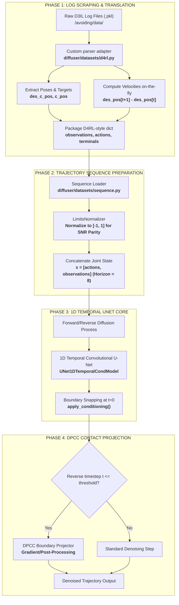

# D3IL Ingestion, U-Net Integration, and DPCC Constraint Projection

This document provides a highly detailed walkthrough of how the **DPCC (Diffusion Policy with Contact Constraints)** framework in this repository ingests raw **D3IL simulation logs**, reformats and normalizes them for temporal U-Net ingestion, processes them through the denoising backbone, and applies continuous boundary projections to guarantee safety and stability.

---

## 🗺️ System Overview Flowchart

The following diagram maps out the complete pipeline: from raw simulator files on disk to real-time physical contact projection inside the inverse diffusion sampling loop:



---

## 📂 Phase 1: Raw D3IL Avoiding Dataset Parsing (The Log Scraper)

Standard diffusion codebases expect formatted benchmarks (like D4RL or Minari). Because D3IL stores expert runs as individual simulator log dictionary files, the developers **invented a custom translation scraper** directly inside [diffuser/datasets/d4rl.py](file:///workspaces/FM-PCC/diffuser/datasets/d4rl.py#L136-L160).

### ⚙️ Exact Log Parsing Code
The custom scraper iterates over serialized trajectory `.pkl` files, extracting physical descriptors and computing velocity actions on the fly:

```python
# File: diffuser/datasets/d4rl.py (Lines 136-160)
    elif env == 'avoiding-d3il' or env == 'd3il-avoiding':
        data_directory = 'environments/dataset/data/avoiding/data'
        data_dir = sim_framework_path(data_directory)
        state_files = os.listdir(data_dir)

        for file in state_files:
            with open(os.path.join(data_dir, file), 'rb') as f:
                env_state = pickle.load(f)

                # 1. Extract raw 2D coordinate positions from simulated robot logs
                robot_des_pos = env_state['robot']['des_c_pos'][:, :2]
                robot_c_pos = env_state['robot']['c_pos'][:, :2]

                # 2. Stacks desired and actual poses into a unified 4D state vector
                input_state = np.concatenate((robot_des_pos, robot_c_pos), axis=-1)

                # 3. Manually computes the delta velocity action vectors between adjacent steps
                vel_state = robot_des_pos[1:] - robot_des_pos[:-1]
                valid_len = len(vel_state)

            # 4. Construct standard D4RL-compatible dataset dictionary
            episode_data = {
                'observations': input_state[:-1],
                'actions': vel_state,
                'rewards': np.zeros(valid_len),
                'terminals': np.concatenate((np.zeros(valid_len-1), np.array([1])))
            }

            yield episode_data
```

---

## 📈 Phase 2: Sequence Trajectory Ingestion & Normalization

Once formatted by the scraper, the trajectory segments are loaded via `SequenceDataset` ([diffuser/datasets/sequence.py](file:///workspaces/FM-PCC/diffuser/datasets/sequence.py#L15-L57)).

### ⚖️ The LimitsNormalizer and Signal-to-Noise Ratio (SNR)
Standard neural backbones fail if observation magnitudes are vastly different from action velocities. To match the optimal **SNR** expected by the temporal convolutional layers:
* Observations and actions are scaled to $[-1, 1]$ bounds using `LimitsNormalizer` ([diffuser/datasets/normalization.py](file:///workspaces/FM-PCC/diffuser/datasets/normalization.py)).
* The normalized components are then concatenated along the last dimension to form joint trajectory sequences of shape `[Horizon, Action_Dim + Obs_Dim]`:

```python
# File: diffuser/datasets/sequence.py (Lines 120-125)
    def __getitem__(self, idx, eps=1e-4):
        path_ind, start, end = self.indices[idx]

        observations = self.fields.normed_observations[path_ind, start:end]
        actions = self.fields.normed_actions[path_ind, start:end]

        # Stacks actions and observations into a single joint grid
        trajectories = np.concatenate([actions, observations], axis=-1)
        conditions = self.get_conditions(observations)
        
        return Batch(trajectories, conditions)
```

---

## 🧠 Phase 3: The 1D Temporal U-Net Core & Boundary Snapping

The joint trajectory sequence is fed directly to the **1D Temporal U-Net Backbone** (`UNet1DTemporalCondModel`). 

### 🔒 The apply_conditioning Boundary Lock
To prevent the diffusion path from drifting away from the robot's physical starting position, the U-Net locks the first observation step to the simulator state during reverse denoising passes:

```python
# File: diffuser/models/helpers.py (Lines 145-168)
def apply_conditioning(x, conditions, action_dim, goal_dim=0, noise=False):
    '''
        x : tensor
            [ batch_size x horizon x (action_dim + obs_dim + goal_dim) ]
        conditions : dict
            { t: values }, where values is a batch_size x obs_dim tensor
    '''
    for t, val in conditions.items():
        if isinstance(t, str):     # unsafe sets
            continue
        else:
            # Snaps the observation slice at index t back to the simulator condition
            x[:, t, action_dim:] = val.clone() if not noise else 0
    
    if goal_dim > 0:
        x[:, :, -goal_dim:] = conditions[0][:, -goal_dim:].unsqueeze(1).clone() if not noise else 0

    return x
```

---

## 🛡️ Phase 4: Physics-Based Contact Constraint Projection (DPCC)

The defining innovation of the **DPCC** framework is the **Boundary Projector** inside the inverse diffusion sampling loop ([diffuser/models/diffusion.py](file:///workspaces/FM-PCC/diffuser/models/diffusion.py#L179-L195)).

Instead of waiting for the model to finish generating actions and then correcting them, DPCC injects physical boundary guidelines **inside intermediate denoising timesteps** ($t \leq \text{threshold}$):

```python
# File: diffuser/models/diffusion.py (Lines 176-196)
        for i in reversed(range(last_timestep, self.n_timesteps)):
            t = i if i >= 0 else 0
            timesteps = torch.full((batch_size,), t, device=device, dtype=torch.long)
            
            # If under threshold, apply constraint gradient-guidance or QP projections
            if projector is not None and projector.gradient and t <= projector.diffusion_timestep_threshold * self.n_timesteps:
                x = self.p_sample(x, cond, timesteps, returns, projector=projector, constraints=constraints)
            else:
                x = self.p_sample(x, cond, timesteps, returns)

            x = apply_conditioning(x, cond, self.action_dim, goal_dim=self.goal_dim)

            if projector is not None and not projector.gradient and t <= projector.diffusion_timestep_threshold * self.n_timesteps:
                if self.goal_dim > 0:
                    x[:,:,:-self.goal_dim], projection_costs = projector.project(x[:,:,:-self.goal_dim], constraints)
                else:
                    # Snaps intermediate denoised coordinates directly to safe physics manifold
                    x, projection_costs = projector.project(x, constraints)

            x = apply_conditioning(x, cond, self.action_dim, goal_dim=self.goal_dim)
```

---

## 🔬 The DPCC Mathematical Solver & Gradient Projection

The low-level projection engine is implemented in [diffuser/sampling/projection.py](file:///workspaces/FM-PCC/diffuser/sampling/projection.py). It converts physical limits into scaled equations to support dual-paradigm projections:

### 1. Quadratic Programming SLSQP Projection Solver
Solves constrained convex optimization problems of the form:
$$\hat z = \operatorname{argmin}_z \frac{1}{2} z^T Q z + r^T z \quad \text{s.t. } Az = b, \ Cz \le d$$

```python
# File: diffuser/sampling/projection.py (Lines 90-175)
    def project(self, trajectory, constraints=None):
        dims = trajectory.shape
        batch_size = trajectory.shape[0]
        trajectory_reshaped = trajectory.reshape(trajectory.shape[0], -1)

        # 1. Setup cost vector based on normalized input
        r = - trajectory_reshaped @ self.Q
        r_np = r.cpu().numpy()
        Q = self.Q_np.astype('double')
        trajectory_np = trajectory_reshaped.cpu().numpy()

        # 2. Extract constraint matrices (A=Equality, C=Inequality)
        A = self.A_np.astype('double')
        b = self.b_np.astype('double')
        C = self.C_np.astype('double')
        d = self.d_np.astype('double')

        # 3. Incorporate obstacle constraints dynamically
        constraints = ()
        for constraint_idx in range(len(self.obstacle_constraints.P_list)):
            P = self.obstacle_constraints.P_list[constraint_idx]
            q = self.obstacle_constraints.q_list[constraint_idx]
            v = self.obstacle_constraints.v_list[constraint_idx]
            for t in range(1, self.horizon):
                start_idx = t * self.transition_dim
                end_idx = (t + 1) * self.transition_dim
                constraints += ({'type': 'ineq', 
                                 'fun': lambda x, start_idx=start_idx, end_idx=end_idx, P=P, q=q, v=v: -x[start_idx: end_idx] @ P @ x[start_idx: end_idx] - q @ x[start_idx: end_idx] + v,
                                 'jac': lambda x, start_idx=start_idx, end_idx=end_idx, P=P, q=q: np.concatenate([np.zeros(start_idx), -2 * P @ x[start_idx: end_idx] - q, np.zeros(len(x) - end_idx)])},)

        if C.size > 0:
            constraints += ({'type': 'ineq', 'fun': lambda x: -C @ x + d, 'jac': lambda x: -C},)
        if A.size > 0:
            constraints += ({'type': 'eq', 'fun': lambda x: A @ x - b, 'jac': lambda x: A},)   
        
        # 4. Solve the optimization for each batch element
        sol_np = np.zeros((batch_size, self.horizon * self.transition_dim), dtype=np.float32)
        for i in range(batch_size):
            cost_fun = lambda x: 0.5 * x @ Q @ x + r_np_double[i] @ x
            jac_cost_fun = lambda x: Q @ x + r_np_double[i]
            res = minimize(fun=cost_fun, 
                            x0=trajectory_np_double[i],
                            constraints=constraints, 
                            method='SLSQP', 
                            jac=jac_cost_fun, 
                            bounds=Bounds(-5 * np.ones_like(trajectory_np_double[i]), 5 * np.ones_like(trajectory_np_double[i])),
                            tol=1e-6,
                            options={'maxiter': 1000, 'disp': False})
            sol_np[i] = res.x

        sol = torch.tensor(sol_np, device=self.device).reshape(dims)
        return sol, projection_costs
```

### 2. Analytical Safety Gradient Guidance
Instead of hard projection, the model can add directional constraint gradients directly to the model mean predictions to steer trajectories:

```python
# File: diffuser/sampling/projection.py (Lines 177-231)
    def compute_gradient(self, trajectory, constraints=None):
        trajectory_reshaped = trajectory.reshape(trajectory.shape[0], -1)
        A, b, C, d = self.A, self.b, self.C, self.d

        grad1 = torch.zeros_like(trajectory_reshaped)
        grad2 = torch.zeros_like(trajectory_reshaped)
        for i in range(trajectory.shape[0]):
            # Dynamic derivative constraints gradient
            grad1[i] = - A.T @ (A @ trajectory_reshaped[i] - b)
            # Polytopic workspace boundary constraints gradient
            grad2[i] = - C.T @ torch.max(torch.zeros_like(C @ trajectory_reshaped[i] - d), C @ trajectory_reshaped[i] - d)
            
        grad1 = grad1.reshape(trajectory.shape)
        grad2 = grad2.reshape(trajectory.shape)
        
        return grad1 + grad2
```

### 3. Normalization-Aware Constraint Transformations
To ensure the mathematical solver computes bounds accurately in the normalized $[-1, 1]$ coordinate space:

```python
# File: diffuser/sampling/projection.py (Lines 311-319)
                    if self.normalizer is not None:
                        x_min = self.normalizer.mins[dim]
                        x_max = self.normalizer.maxs[dim]
                        # Transforms physical limits into normalized scale offsets
                        mat_append = mat_append * (x_max - x_min) / 2
                        vec_append = vec_append - sign * (x_min + x_max) / 2
```

---

## 🏆 Key Architectural Value
By dynamically parsing D3IL log directories via custom generators and passing the results to the standard `SequenceDataset`, the DPCC engine unifies raw robotics logs with clean trajectory diffusion.

Applying intermediate `apply_conditioning` locks at $t=0$ keeps predictions anchored to active environment states, while the QP solver/gradient guide projects spatial coordinates back onto safe boundary manifolds on every denoising iteration. This dual-layer protection guarantees both physical safety and simulation stability.
