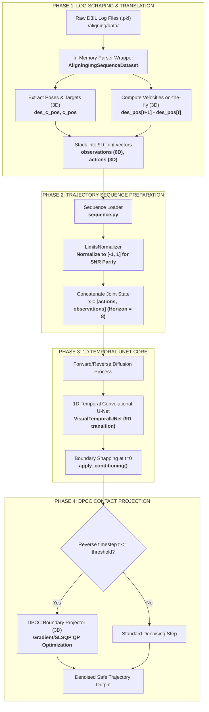

# D3IL Ingestion, U-Net Integration, and DPCC Constraint Projection (3D Cartesian Edition)

This document provides a highly detailed walkthrough of how the **DPCC (Diffusion Policy with Contact Constraints)** framework in this repository ingests raw **D3IL simulation logs**, reformats and normalizes them for temporal U-Net ingestion, processes them through the denoising backbone, and applies continuous boundary projections in full **3D (XYZ) space**.

---

## 🗺️ System Overview Flowchart

The following diagram maps out the complete pipeline: from raw simulator files on disk to real-time physical contact projection inside the inverse diffusion sampling loop, adapted for full 3D coordinates:



---

## 📂 Phase 1: 3D D3IL Ingestion & Joint State Stacking

Standard state-only DPCC (avoiding task) loads commanded desired positions and physical feedback poses, slicing them to 2D and concatenating them into a 4D observation vector. 
To follow this exact ingestion paradigm for visual-aligning while keeping full spatial control, **we upgrade the joint observation state to 3D (XYZ)**, producing a **6D proprioceptive joint vector**:

### ⚙️ Exact Log Translation & Stacking
Our wrapper class `AligningImgSequenceDataset` loads raw robot pickles, extracts 3D desired position and 3D actual feedback pose, and stacks them:

```python
# Slices coordinates to 3D (X, Y, Z) - keeping all dimensions
robot_des_pos = env_state['robot']['des_c_pos']      # Commanded Target (T, 3)
robot_c_pos = env_state['robot']['c_pos']            # Robot Physical Pose (T, 3)

# Stacks desired and actual poses into a unified 6D observation vector
input_state = np.concatenate((robot_des_pos, robot_c_pos), axis=-1) # (T, 6)

# Computes 3D action velocity displacement command [dx, dy, dz]
vel_state = robot_des_pos[1:] - robot_des_pos[:-1]                 # (T-1, 3)
```

---

## 📈 Phase 2: Sequence Trajectory Ingestion & Normalization

Once loaded, the trajectory segments are indexed via `AligningImgSequenceDataset` ([diffuser_visual_aligning/datasets/sequence.py](file:///workspaces/FM-PCC/diffuser_visual_aligning/datasets/sequence.py)).

### ⚖️ The LimitsNormalizer and Signal-to-Noise Ratio (SNR)
Standard neural backbones fail if observation magnitudes are vastly different from action velocities. To match the optimal **SNR** expected by the temporal convolutional layers:
* 6D Observations are scaled using `LimitsNormalizer(observations.reshape(-1, 6))`.
* 3D Actions are scaled using `LimitsNormalizer(actions.reshape(-1, 3))`.
* The normalized components are then concatenated along the last dimension to form joint trajectory sequences of shape `[Horizon, Action_Dim + Obs_Dim] = [8, 9]`:

```python
# Stacks actions (3D) and observations (6D) into a single 9D joint grid
trajectories = np.concatenate([act_seq, obs_seq], axis=-1) # Shape: (8, 9)
```

---

## 🧠 Phase 3: The 1D Temporal U-Net Core & Boundary Snapping

The joint trajectory sequence is fed directly to our specialized visual-conditioning temporal model **`VisualTemporalUNet`**.

### 🔒 The apply_conditioning Boundary Lock
To prevent the diffusion path from drifting away from the robot's physical starting position, the U-Net locks the first observation step to the simulator state during reverse denoising passes. Adapted for our **9D joint grid** (`action_dim = 3`, `obs_dim = 6`):

```python
def apply_conditioning(x, conditions, action_dim=3, goal_dim=0, noise=False):
    '''
        x : tensor
            [ batch_size x horizon x (3 action + 6 obs) ]
        conditions : dict
            { t: values }, where values is a batch_size x 6 obs tensor
    '''
    for t, val in conditions.items():
        if isinstance(t, str):
            continue
        else:
            # Snaps the observation slice at index t back to the simulator condition (6D)
            x[:, t, action_dim:] = val.clone() if not noise else 0
    return x
```

---

## 🛡️ Phase 4: Physics-Based Contact Constraint Projection (DPCC)

The defining innovation of the **DPCC** framework is the **Boundary Projector** inside the inverse diffusion sampling loop. Instead of waiting for the model to finish generating actions and then correcting them, DPCC injects physical boundary guidelines **inside intermediate denoising timesteps** ($t \leq \text{threshold}$) in full 3D:

```python
# Enforce safe tabletop & workspace boundaries directly in intermediate 3D spaces
if projector is not None and not projector.gradient and t <= projector.diffusion_timestep_threshold * self.n_timesteps:
    # Snaps intermediate denoised coordinates directly to safe 3D physics manifold
    x, projection_costs = projector.project(x, constraints)
```

---

## 🔬 The DPCC Mathematical Solver & 3D Gradient Projection

The low-level projection engine is implemented in [diffuser_visual_aligning/sampling/projection.py](file:///workspaces/FM-PCC/diffuser_visual_aligning/sampling/projection.py). It converts physical limits into scaled equations to support dual-paradigm projections:

### 1. Quadratic Programming SLSQP Projection Solver (XYZ Space)
Solves constrained convex optimization problems of the form:
$$\hat z = \operatorname{argmin}_z \frac{1}{2} z^T Q z + r^T z \quad \text{s.t. } Az = b, \ Cz \le d$$

We formulate 3D workspace contact boundaries and derivative integration locks:
* **Workspace Limits:** Keep $x \in [0.3, 0.7]$, $y \in [-0.35, 0.35]$, and $z \in [0.05, 0.40]$ to prevent tabletop crashes.
* **Integrator Constraints:** Command deltas must match state transitions:
  $$x_{t+1}^{actual} = x_t^{actual} + dx_t$$
  $$y_{t+1}^{actual} = y_t^{actual} + dy_t$$
  $$z_{t+1}^{actual} = z_t^{actual} + dz_t$$

### 2. Analytical Safety Gradient Guidance
Instead of hard projection, the model can add directional constraint gradients directly to the model mean predictions to steer trajectories:

```python
grad1 = torch.zeros_like(trajectory_reshaped) # Integration constraints gradient
grad2 = torch.zeros_like(trajectory_reshaped) # 3D polytopic workspace constraints gradient
for i in range(trajectory.shape[0]):
    # Dynamic 3D derivative constraints gradient
    grad1[i] = - A.T @ (A @ trajectory_reshaped[i] - b)
    # 3D workspace boundary constraints gradient
    grad2[i] = - C.T @ torch.max(torch.zeros_like(C @ trajectory_reshaped[i] - d), C @ trajectory_reshaped[i] - d)
```

### 3. Normalization-Aware Constraint Transformations
To ensure the mathematical solver computes bounds accurately in the normalized $[-1, 1]$ coordinate space:
```python
if self.normalizer is not None:
    x_min = self.normalizer.mins[dim]
    x_max = self.normalizer.maxs[dim]
    # Transforms physical limits into normalized scale offsets
    mat_append = mat_append * (x_max - x_min) / 2
    vec_append = vec_append - sign * (x_min + x_max) / 2
```

---

## 🏆 Key Architectural Value
By dynamically parsing D3IL log directories via custom generators and passing the results to the standard `sequence` dataset wrapper, the DPCC engine unifies raw robotics logs with clean trajectory diffusion in 3D Cartesian coordinates.

Applying intermediate `apply_conditioning` locks at $t=0$ keeps predictions anchored to active environment states, while the QP solver/gradient guide projects spatial coordinates back onto safe boundary manifolds on every denoising iteration. This dual-layer protection guarantees both physical safety and simulation stability.
