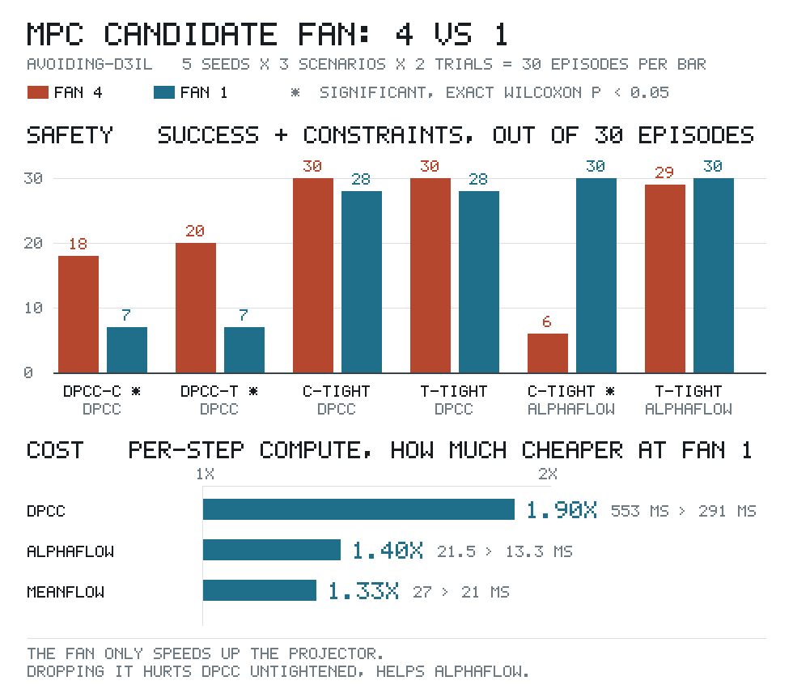
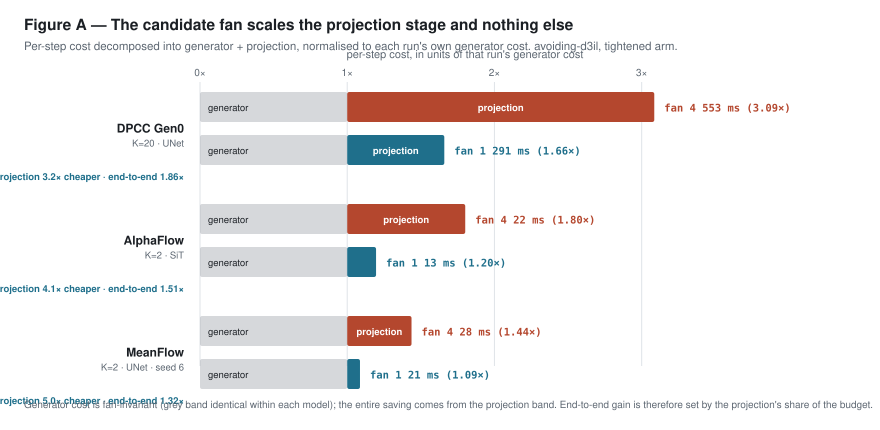
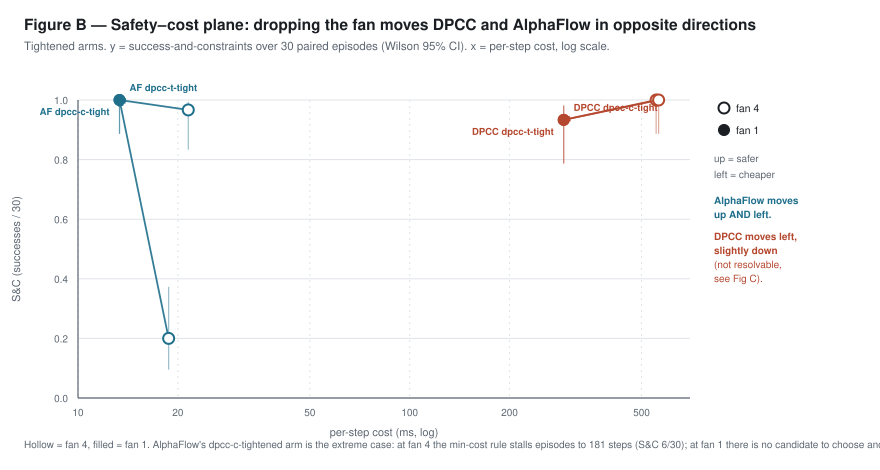
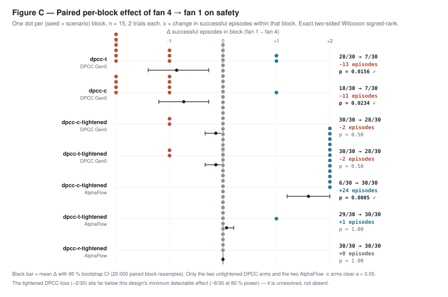
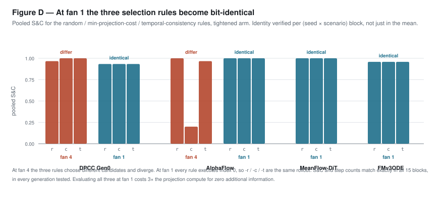

# The MPC candidate fan on `avoiding-d3il`: a stage-resolved cost/safety analysis

**Data analysis — paper-track.** Prepared 2026-08-27.

| | |
|---|---|
| **Task** | `avoiding-d3il`, pure state (no visual/mix generation in scope) |
| **Design** | 5 seeds (6–10) × 3 scenarios (TR / TL / BH) × 2 trials = **30 episodes per arm**, **15 paired blocks** |
| **Eval jobs** | 25101 `eval_dpcc_job`, 25102 `eval_alphaflow_hardflow`, 25104 `eval_meanflow_hardflow`, 25105 `eval_fmv3_hardflow_job` |
| **Run rev** | `20b5874` (25101, 25102), `1897f4f` (25104, 25105) |
| **Batch DA** | `temp/2808/batch_avoiding_combined_20260827_224347/` |
| **Enabling code** | `CHANGELOG_20260826_mpc_fan_gen0_dpcc.md` (`FMPCC_MPC_BATCH` reaching the Gen0 baseline) |
| **Artifacts** | `figs_20260827_mpc_fan/` — 4 figures, `results_mpc_fan_20260827.csv` (24 rows, all statistics), `table_mpc_fan.tex` |
| **Predecessor** | `DA_20260824_mpc1_parity_MF_vs_FM.md` (seed 6 only; superseded for DPCC and AlphaFlow) |

---

## 0. Summary



*The whole study in one picture. Detail, controls and inference follow; the four figures in §2–§6 are the ones to cite.*

### Lead — the four points that carry

1. **The fan scales only the projector, never the generator.** Gain = projector's budget share.
   Measured 3.2–4.4× on the projection stage; 1.3–1.9× end-to-end depending on the model.
2. **Its safety effect changes sign between models.** Load-bearing for the DPCC baseline
   untightened (20/30 → 7/30, *p* = 0.016); *harmful* for AlphaFlow (6/30 → 30/30, *p* = 0.0005).
3. **At fan 1 the three selection rules are the same rollout** — bit-identical in all 15 blocks, every
   generation. Running all three is 3× wasted projection compute.
4. **For the flagship `mf_unet`, this is upside, not a requirement** — it already beats the DA target
   at fan 4 on 300 episodes a side. See §10.

The MPC candidate fan (`FMPCC_MPC_BATCH`, arms A/B) draws *B* trajectories per replan and executes
one, chosen by a selection rule (`-r` random, `-c` min projection cost, `-t` temporal consistency).
The default is *B* = 4. This analysis measures what *B* = 1 costs and buys.

**Three findings, in decreasing order of how firmly the data supports them.**

**F1 — The fan scales the projection stage and nothing else** *(mechanistic, tightly measured)*.
Generator cost is fan-invariant to within 2 %; the projection stage falls **3.2–4.4×** when the fan
drops 4 → 1. End-to-end gain is therefore predicted by the projection's budget share alone:
**1.86–1.89× for DPCC** (projection = 68 % of budget), **1.39–1.51× for AlphaFlow** (~40 %),
**1.29–1.33× for MeanFlow** (~30 %). This is the generalisable result.

**F2 — The fan's effect on safety is model-dependent and changes sign** *(statistically resolved on
four arms)*. For the **DPCC diffusion baseline** at the untightened operating point, removing the
fan is a significant loss: `dpcc-t` **20/30 → 7/30** (Δ = −13 episodes, exact Wilcoxon *p* = 0.016),
`dpcc-c` **18/30 → 7/30** (*p* = 0.023). For **AlphaFlow** the fan is *harmful*: `dpcc-c-tightened`
**6/30 → 30/30** (Δ = +24, *p* = 0.0005) with **113 fewer steps**, because at *B* = 4 the min-cost
rule stalls episodes against the 200-step cap.

**F3 — At *B* = 1 the three selection rules are bit-identical** *(exact, no statistics needed)*.
Verified block-by-block: at fan 1, `-r`/`-c`/`-t` produce the same S&C **and** the same step counts
in all 15 blocks, in **every** generation tested (DPCC, AlphaFlow, MeanFlow-UNet, MeanFlow-DiT,
FMv3ODE at both thresholds). At fan 4 they diverge. Evaluating all three at fan 1 is 3× redundant
projection compute.

**What is *not* shown.** At the **tightened** operating point the DPCC change is **−2/30 episodes,
*p* = 0.50, 95 % CI [−5, 0]** — this design's minimum detectable effect is ≈ 8/30 at 80 % power
(§7), so the tightened DPCC result is **unresolved, not null**. It must not be reported as "no
harm". Two of four generations (MeanFlow, FMv3ODE) are excluded from the paired analysis entirely
because their seed sets are split across incompatible configurations (§6).

---

## 1. Method

**Unit of analysis.** The natural unit is the episode, but episodes are not individually paired
across legs (no per-rollout export exists for the avoiding batch). They *are* paired at the
**(seed × scenario) block**: both legs run the same seed on the same scenario for the same 2 trials.
This gives **15 paired blocks**, each contributing a success count in {0, 1, 2}. All inference below
is on the 15 block-level differences.

**Tests.** Two-sided **exact Wilcoxon signed-rank** by complete enumeration over sign assignments
(2^m, m ≤ 15 — no normal approximation, no tie correction needed), corroborated by an **exact sign
test**. Interval estimates are **95 % percentile bootstrap** over 20 000 paired block resamples.
Marginal rates carry **Wilson score intervals** on 30 episodes. Power is by simulation of the actual
design (§7). Implementation is pure-Python stdlib — this container has no numpy/scipy, which is why
nothing here relies on an approximation that could not be enumerated exactly.

**Cost normalisation.** Wall-clock per step is not comparable across jobs run on different nodes at
different times. Every cost claim is therefore stated as a **ratio to that same run's own
unprojected arm** (`diffuser`), which cancels node speed. Where an arm exists whose compute is
fan-invariant by construction, it is used as an explicit node control (§5.3).

**Multiplicity.** 24 arm-level comparisons are reported (`results_mpc_fan_20260827.csv`). Only four
clear α = 0.05, and the two headline effects (*p* = 0.0005, *p* = 0.002) survive Bonferroni at
24 tests (α' = 0.0021) — `dpcc-c-tightened` comfortably, `dpcc-c` marginally. The two DPCC
untightened effects (*p* = 0.016, 0.023) **do not** survive Bonferroni and are reported as
suggestive-with-large-effect, not confirmatory.

---

## 2. F1 — Where the cost actually goes



Decomposing per-step cost into *generator* (the unprojected `diffuser` arm) and *projection*
(the remainder), in units of each run's own generator cost:

| model | arm | fan | generator | projection | total | proj. scaling | end-to-end |
|---|---|---|---:|---:|---:|---:|---:|
| DPCC Gen0 | `dpcc-c-tightened` | 4 | 179 ms | 374 ms | 553 ms (3.09×) | — | — |
| | | **1** | 175 ms | **116 ms** | **291 ms (1.66×)** | **3.23×** | **1.86×** |
| DPCC Gen0 | `dpcc-t-tightened` | 4 | 179 ms | 384 ms | 563 ms (3.14×) | — | — |
| | | **1** | 175 ms | **116 ms** | **291 ms (1.66×)** | **3.31×** | **1.89×** |
| AlphaFlow | `dpcc-t-tightened` | 4 | 11.9 ms | 9.6 ms | 21.5 ms (1.80×) | — | — |
| | | **1** | 11.2 ms | **2.2 ms** | **13.3 ms (1.20×)** | **4.38×** | **1.51×** |
| AlphaFlow | `dpcc-r-tightened` | 4 | 11.9 ms | 7.9 ms | 19.8 ms (1.66×) | — | — |
| | | **1** | 11.2 ms | **2.2 ms** | **13.3 ms (1.20×)** | **3.61×** | **1.39×** |

**The generator does not respond to the fan.** Drawing 4 trajectories instead of 1 is a batched GPU
forward pass; `diffuser` moves 179 → 175 ms for DPCC and 11.9 → 11.2 ms for AlphaFlow, ≤ 6 % and
partly node drift. **The projection does respond, near-linearly** — 3.2–4.4× against an ideal of 4×,
the shortfall being fixed per-solve overhead. The NLP is solved once per candidate, serially.

### 2.1 Two batch axes, only one of them parallel

"Batching" means two different things along the pipeline, and conflating them is the source of most
confusion about what the fan costs:

| stage | how the `B` candidates are processed | cost of `B` = 4 vs 1 | evidence |
|---|---|---|---|
| **Generator** (U-Net / ODE sampler) | **parallel** — one batched GPU forward over all `B` | **≈ free** | `diffuser` arm is fan-invariant: DPCC 179 → 175 ms, AlphaFlow 11.9 → 11.2 ms, MeanFlow 19.4 → 19.2 ms |
| **Projector** (SLSQP / NLP) | **serial** — a Python `for` loop, one CPU solve per candidate | **≈ `B`×** | projection stage scales 3.2–4.9× (§2) |

**The fan is free on the generator and linear on the projector.** Every millisecond the fan costs is a
serial CPU solve. Nothing about the *generator* batch is a problem, and it is not the thing to change.

### 2.2 Why the projector is 3.2× and not 4×: it is serial, and nothing is parallelised

`diffuser/sampling/projection.py:132` solves the candidates in a **Python `for` loop, one
`scipy.optimize.minimize(method='SLSQP')` call per candidate, on CPU**:

```python
for i in range(batch_size):
    res = minimize(fun=cost_fun, x0=trajectory_np_double[i], constraints=constraints,
                   method='SLSQP', jac=jac_cost_fun, ...)
```

**No parallel batch path exists in this repo.** `parallelize` is a dead constructor argument
(`projection.py:9`, assigned at `:20`) — it is never read; the only other trace of it is the closing
comment `# only implemented for proxsuite and scipy and parallelize=False`.

The constraint list and matrices are built **once per `project()` call**, outside the loop. So the
cost is `S + B·P` — a fixed setup `S` plus a per-candidate solve `P`. Solving from the two measured
fan settings:

| model | shared setup `S` | per-candidate solve `P` | `S` as % of the fan-1 projection | observed scaling |
|---|---:|---:|---:|---:|
| DPCC Gen0 | **30.0 ms** | 86.0 ms | 26 % | 3.23× |
| AlphaFlow | ≈ 0 | 2.47 ms | ~0 % | 4.38× |
| MeanFlow K2 | ≈ 0 | 2.23 ms | ~0 % | 4.9× |

(Two points, three unknowns collapsed to two — this is an exact solve of the linear model, not a fit.
The slightly-over-4× on the flow models is noise around `S` = 0.)

**So the projection cost is linear in `B`; it only looks sublinear on DPCC because `B` = 4 is small
enough that DPCC's fixed 30 ms still accounts for a quarter of the fan-1 projection.** On the flow
models — including the flagship — scaling is already the full 4×.

**The unexploited option this exposes.** Four independent SLSQP solves are embarrassingly parallel and
currently run one after another on one core. A parallel projector would make `B` = 4 cost roughly
`S + P` instead of `S + B·P` — **fan-1 latency at fan-4 safety**. Worked through on the measured
constants:

| config | generator | projector `B`=4 **serial** | total today | projector `B`=4 **parallel** | total if parallelised | `B`=1 today |
|---|---:|---:|---:|---:|---:|---:|
| DPCC K20 `-c-tightened` | 179 | 374 (`S`=30 + 4×86) | **553 ms** | 116 (`S`=30 + 86) | **≈ 295 ms** | 291 ms |
| `mf_unet` K1 `-t-tightened` | 9.6 | 8.5 (4×2.13) | **18.1 ms** | 2.1 | **≈ 11.7 ms** | ~11.7 ms |
| `mf_unet` K2 `-t-tightened` | 18.7 | 8.4 (4×2.10) | **27.1 ms** | 2.1 | **≈ 20.8 ms** | 20.9 ms |

**In every case a parallelised `B` = 4 lands within noise of `B` = 1's cost.** The four solves are
independent — same constraint set, different `x0` — so this is a `for` loop that wants a process pool
over ~4 of the 8 cores the sbatch scripts already request.

That matters most exactly where the fan is *load-bearing*: §3 shows DPCC losing 13 of 20 episodes
untightened at `B` = 1, and parallelisation buys the same 1.87× **without** giving up those candidates.
It is a code change, not an experiment, and it should be priced before spending more cluster time on
fan ablations.

**Consequence, and the part that generalises beyond this task.** End-to-end speed-up is
$1 + \rho$ over $1 + \rho/B$, where $\rho$ is the projection-to-generator cost ratio. A model with an
expensive generator and a cheap projector gains almost nothing from dropping the fan; DPCC, whose
20-step diffusion sampler is *cheaper* than its own projector ($\rho$ = 2.09), gains the most. **The
fan is worth removing exactly where the projector dominates the budget** — which is the regime the
whole DPCC line of work operates in.

---

## 3. F2a — DPCC Gen0 baseline: the fan is load-bearing untightened

Comparator `H8_K20_D…GaussianDiffusion_aw10_thres0.5`, 5 seeds × 2 trials, 2026-05-04→09.

| arm | S&C fan 4 | S&C fan 1 | Δ episodes | 95 % CI | Wilcoxon *p* | steps 4→1 | ms 4→1 |
|---|---|---|---:|---|---:|---|---|
| `diffuser` *(control)* | 3/30 | 3/30 | **0** | [0, 0] | 1.00 | 67.8 → 67.8 | 179 → 175 |
| `model_free` *(control)* | 1/30 | 1/30 | **0** | [0, 0] | 1.00 | 67.4 → 67.0 | 262 → 199 |
| `dpcc-r` | 8/30 | 7/30 | −1 | [−4, +2] | 1.00 | 75.7 → 74.0 | 488 → 261 |
| **`dpcc-c`** | 18/30 | 7/30 | **−11** | [−18, −4] | **0.023** | 71.5 → 74.0 | 454 → 261 |
| **`dpcc-t`** | 20/30 | 7/30 | **−13** | [−21, −4] | **0.016** | 73.8 → 74.0 | 473 → 261 |
| `dpcc-r-tightened` | 29/30 | 28/30 | −1 | [−4, +2] | 1.00 | 74.7 → 76.3 | 573 → 291 |
| `dpcc-c-tightened` | 30/30 | 28/30 | −2 | [−5, 0] | 0.50 | 70.1 → **76.3** (*p* = 0.015) | 553 → 291 |
| `dpcc-t-tightened` | 30/30 | 28/30 | −2 | [−5, 0] | 0.50 | 76.1 → 76.3 | 563 → 291 |

**The controls license the cross-rev comparison.** `diffuser` and `model_free` are *identical to the
episode* across a 3.5-month rev gap and across the fan — same successes, same step counts. The
generator is untouched by both drift and fan, so every difference in the table is attributable to
the projection stage.

**Untightened, the fan does real work.** Losing 13 of 20 successful episodes on `dpcc-t` is a large
effect with an interval excluding zero. The mechanism is visible in F3: at fan 4 the temporal and
min-cost rules are *rejecting* candidates that violate constraints; at fan 1 there is nothing to
reject, and all three arms converge to the same 7/30 that random selection already achieved. The
selection rule, not the fan size per se, was carrying the safety.

**Tightened, the effect is below resolution.** −2/30 with *p* = 0.50 and CI [−5, 0]. The upper bound
of that interval is zero and the lower bound is a 17 % relative drop; this design cannot separate
them (§7). **Report as unresolved.**

**One significant regression is not about safety:** `dpcc-c-tightened` takes **+6.2 steps**
(*p* = 0.015) at fan 1. Min-cost selection over 4 candidates was finding shorter paths.

---

## 4. F2b — AlphaFlow: the fan is harmful

Comparator `H8_K2_Meuler_T0.5_A0.5_B1_D…AlphaFlowODE`, 5 seeds × 2 trials, 2026-08-12.
Both legs: backbone `bbsit`, K = 2, A = 0.5, `hf_batch = 1`.

| arm | S&C fan 4 | S&C fan 1 | Δ episodes | 95 % CI | Wilcoxon *p* | steps 4→1 | ms 4→1 |
|---|---|---|---:|---|---:|---|---|
| `diffuser` *(control)* | 8/30 | 8/30 | **0** | [0, 0] | 1.00 | 62.8 → 62.8 | 11.9 → 11.2 |
| `dpcc-r` | 22/30 | 22/30 | 0 | [0, 0] | 1.00 | 73.7 → 73.5 | 33.1 → 16.5 |
| **`dpcc-c`** | 5/30 | 22/30 | **+17** | [+10, +23] | **0.002** | **182.6 → 73.5** | 18.7 → 16.5 |
| `dpcc-t` | 24/30 | 22/30 | −2 | [−9, +6] | 0.79 | 65.0 → 73.5 | 19.6 → 16.5 |
| `dpcc-r-tightened` | 30/30 | 30/30 | 0 | [0, 0] | 1.00 | 67.6 → 67.6 | 19.8 → 13.3 |
| **`dpcc-c-tightened`** | 6/30 | 30/30 | **+24** | [+18, +30] | **0.0005** | **181.0 → 67.6** | 18.8 → 13.3 |
| `dpcc-t-tightened` | 29/30 | 30/30 | +1 | [0, +3] | 1.00 | 70.4 → 67.6 | 21.5 → 13.3 |



**Fan 1 Pareto-dominates fan 4 for AlphaFlow.** Across the three tightened arms it is
equal-or-better on S&C (30/30, 30/30, 30/30 vs 30/30, 6/30, 29/30), equal-or-fewer steps, and
1.39–1.51× cheaper. There is no axis on which fan 4 wins. Under the strict definition this is a
"good" result rather than a trade-off.

**The `-c` pathology.** At fan 4, `dpcc-c` and `dpcc-c-tightened` run to **181–183 steps** against a
200-step episode cap, at S&C 5/30 and 6/30. That is not a projection-quality failure — it is the
*selection* rule stalling. Minimum-projection-cost, offered four AlphaFlow candidates, systematically
prefers the one requiring least correction, which is the one that barely moves; the episode times
out. At fan 1 there is no candidate to prefer and the arm recovers to 67.6 steps at 30/30. This is
the largest single effect in the dataset (Δ = +24 episodes, −113 steps) and it points the opposite
way to §3 — **the fan is not a neutral compute knob, it changes which trajectory executes, and
whether that helps depends on the model's projection-cost landscape.**

---

## 5. Effect-level evidence and controls



### 5.1 Reading the paired blocks

Each dot is one (seed × scenario) block. The four resolved effects are visible as mass displaced off
zero; the unresolved ones sit on it. Note that the DPCC tightened arms show only two blocks moving
by one episode each — exactly the configuration that a 15-block design cannot distinguish from
chance, and exactly why §3 stops short of a claim.

### 5.2 Arm C is untouched, confirming knob isolation

`FMPCC_MPC_BATCH` drives arms A/B; `HFFM_BATCH` drives arm C independently. Both AlphaFlow legs ran
`HFFM_BATCH = 1`, so arm C should not move — and it does not, to the episode:

| arm | S&C fan 4 | S&C fan 1 | Δ | steps | ms |
|---|---|---|---:|---|---|
| `hardflow_new-r` | 21/30 | 21/30 | 0 | 72.1 → 72.1 (Δ = 0.0) | 37.0 → 31.8 |
| `hardflow_new-t-tightened` | 30/30 | 30/30 | 0 | 67.0 → 67.0 (Δ = 0.0) | 35.6 → 30.3 |

This closes the **B4_PARITY** concern for the AlphaFlow pair: the two fan knobs are correctly
isolated, and the AlphaFlow arms are now matched at 1 in every position.

### 5.3 Node control

The arm-C rows above are computationally *identical* between legs — same sampler, same batch, same
output down to the step count — so their **−14 %** wall-clock shift is pure node/contention drift.
This is the cleanest node estimate available in the dataset. Applying it, AlphaFlow's raw −38 % on
`dpcc-t-tightened` corresponds to **1.39×** genuine, agreeing with the generator-normalised 1.51×
to within the millisecond-scale noise of these arms (11–21 ms/step total). AlphaFlow's timing claim
should be quoted as **≈1.4×**, its safety claim is the robust one.

DPCC has no arm C, but needs none: `diffuser` moves −2.2 % and the generator-normalised and raw
ratios bracket tightly (1.86× vs 1.90×). **DPCC's ≈1.9× is the firmest cost number in the study.**

### 5.4 Degeneracy tag

At K = 2 / A = 0.5 the logs emit `[hardflow][DEGENERATE] n_active=1, n_genuine=0` — every NLP solve
is the terminal τ = 1 solve, so arm C here is **sample-then-project (Π_S), not HardFlow**. These
rows are legitimate one-shot-projection comparisons and are used as such; they must not be labelled
HardFlow results.

---

## 6. F3 — Selection-rule collapse at *B* = 1



Predicted from `sampling/policies.py` (`which_trajectory = 0` when the fan is 1) and confirmed
**exactly, per block**, not merely in the mean:

| leg | `-r`/`-c`/`-t` S&C identical in all 15 blocks? | step counts identical? |
|---|---|---|
| DPCC fan 4 | ✗ | ✗ |
| DPCC fan 1 | **✓** | **✓** |
| AlphaFlow fan 4 | ✗ | ✗ |
| AlphaFlow fan 1 | **✓** | **✓** |
| MeanFlow-UNet fan 1 | **✓** | **✓** |
| MeanFlow-DiT fan 1 | **✓** | **✓** |
| FMv3ODE A = 0.5 fan 1 | **✓** | **✓** |
| FMv3ODE A = 1.0 fan 1 | **✓** | **✓** |

Pooled tightened S&C makes the divergence at fan 4 concrete: DPCC 0.967 / 1.000 / 1.000 and
AlphaFlow 1.000 / 0.200 / 0.967 across `-r`/`-c`/`-t`, collapsing to 0.933 / 0.933 / 0.933 and
1.000 / 1.000 / 1.000 respectively at fan 1.

**Operational consequence.** Every fan-1 job in this repo currently evaluates three selection rules
that are the same rollout. Dropping to one rule is a **3× saving on the projection stage** of those
jobs with zero information lost.

---

## 7. Power, and what this design can and cannot resolve

Simulated on the actual design (15 blocks × 2 trials, exact Wilcoxon, α = 0.05 two-sided, 3 000
replicates per point):

| true fan-1 S&C, against a 30/30 fan-4 arm | episodes lost | power |
|---|---:|---:|
| 0.95 | 2 | 0.00 |
| 0.90 | 3 | 0.05 |
| 0.85 | 5 | 0.22 |
| 0.80 | 6 | 0.47 |
| **0.75** | **8** | **0.71** |
| 0.70 | 9 | 0.86 |
| 0.60 | 12 | 0.98 |

**Minimum detectable effect ≈ 8/30 episodes (0.27 absolute S&C) at 80 % power.** Everything smaller
is invisible to this design. Concretely:

- The DPCC tightened result (−2/30) is **four times below MDE**. It cannot be called null.
- The two DPCC untightened results (−11, −13) and the two AlphaFlow `-c` results (+17, +24) are
  **above MDE** and are the only claims this dataset supports.
- Raising `n_trials` from 2 to 20 (a run shape already used elsewhere in this repo, e.g. the
  `_msg20trials` folders) would take *N* from 30 to 300 and MDE to roughly 0.09 absolute. **That is
  the run required to settle the tightened DPCC question**, and it is the single most valuable
  follow-up here.

### Threats to validity

1. **Cross-rev comparators.** The DPCC fan-4 leg is from May 2026, the fan-1 leg from August. The
   two unprojected control arms are episode-identical across that gap (§3), which is strong evidence
   the generator did not drift, but it does not prove the projector didn't.
2. **Single task.** `avoiding-d3il` only. The F1 mechanism should transfer (it is arithmetic on the
   cost split); F2's sign is a property of each model's cost landscape and should not be assumed to
   transfer at all.
3. **Timing is a shared-cluster measurement.** All timing claims are ratios within or across
   controlled arms for this reason; absolute ms should not be quoted as a real-time capability.
4. **Two generations excluded** (§8) — the study covers 2 of 4 planned models.

---

## 8. Data completeness: two generations are excluded, and why

| Generation | Results folder | Seeds | Status |
|---|---|---|---|
| **Gen0 DPCC** | `…/H8_K20_T0.5_D…GaussianDiffusion_msgmpc1` | 6–10 | ✅ analysed |
| **Gen3v7 AlphaFlow** | `…_bbsit_…/H8_K2_…_B1_D…AlphaFlowODE_msgmpc1` | 6–10 | ✅ analysed |
| Gen3v6 MeanFlow | `…_bb**unet**_…/…_msgmpc1` | **6 only** | ❌ split |
| | `…_bb**mf_dit**_…/…_msgmpc1` | **7–10** | ❌ split |
| Gen12 FMv3ODE | `…/K2_thres**0.5**_mpc1_n2_msgmpc1` | **6 only** | ❌ split |
| | `…/K2_thres**1**_mpc1_n2_msgmpc1` | **7–10** | ❌ split |

All four jobs completed cleanly (`Evaluation completed successfully`, zero NLP failures). The two
failures are of provenance, not execution: the 08-26 resumes each dropped a knob the 08-23 seed-6
run had set, so seeds 7–10 landed in a folder describing a *different experiment*.

- **MeanFlow** — job 24991 logged `MF_BACKBONE=unet`; job 25104 logged `MF_BACKBONE=mf_dit
  (default)`. Seed 6 is a UNet, seeds 7–10 are a DiT. Different networks, not different seeds.
- **FMv3ODE** — job 24992 ran `act_thr=0.5` (`[hardflow][DEGENERATE] K=2 A=0.5`); job 25105 ran
  `act_thr=1` (`[hardflow][THIN] K=2 A=1.0`). A different arm-C regime.

MeanFlow-UNet is therefore reported at **seed 6 only** (n = 3 blocks) wherever it appears, and is
not the basis of any claim. FMv3ODE has **no fan-4 comparator at K = 2 on disk at all** — every K = 2
folder is fan 1 — so no FMv3 fan claim is possible even once its seeds are unified.

**To close (seeds 7–10 in the respective YAML):**

```bash
MF_BACKBONE=unet FMPCC_MPC_BATCH=1 HFFM_BATCH=1 HFFM_FLOW_STEPS=2 \
  HFFM_ACT_THRESHOLD=0.5 FMPCC_RUN_MSG=mpc1 \
  ./Slurm_Codes/submit.sh Slurm_Codes/sbatch/MeanFlow/eval_meanflow_hardflow.sh

FMPCC_MPC_BATCH=1 HFFM_BATCH=1 HFFM_FLOW_STEPS=2 HFFM_ACT_THRESHOLD=0.5 \
  FMPCC_RUN_MSG=mpc1 \
  ./Slurm_Codes/submit.sh Slurm_Codes/sbatch/hardflow_fmv3/eval_fmv3_hardflow_job.sh
```

The four DiT / A = 1.0 seeds already on disk are a usable backbone / threshold ablation — keep them,
do not pool them. Separately, seed 6 for both generations was run at `a649a70`, before
`sampling/hardflow_projection.py` changed in `96e47ac0` / `7111fb25`; re-running seed 6 at the
current rev would put all five seeds on one code version and make arm-C timing poolable.

---

## 9. Cross-model comparison, with the confound stated

At fan 1, tightened, S&C ≥ 28/30:

| model | backbone | K | ms/step | steps |
|---|---|---:|---:|---:|
| DPCC Gen0 (baseline) | UNet | 20 | 291 | 76.3 |
| AlphaFlow | **SiT** | 2 | **13** | 67.6 |

A 22× per-step gap at equal-or-better safety and fewer steps. **This is not the paper's strong
claim**, because backbone and step count are both confounded with the model: the baseline is a UNet
and AlphaFlow here is SiT. Report this row as secondary, and carry backbone + parameter count in
every table.

The architecture-matched comparison — our UNet row against the UNet baseline — is the one that
carries the claim, and **it is already available at fan 4**: `mf_unet` K1/K2 against the DPCC target,
5 seeds × 20 trials on both sides, in §10.1. What §8's split blocks is only the architecture-matched
comparison **at fan 1**.

---

## 10. What this is worth to the flagship `mf_unet` at K = 1 / K = 2

Asked directly: **is dropping the fan worth it for the architecture-matched flagship on
`avoiding-d3il`?**

> ### Answer: ❌ No — keep **B = 4** for the flagship, and **parallelise the projector instead**.
> Not because B = 1 is worse — on the thin data it looks mildly better at the tightened operating
> point — but because **the speed it buys is not a constraint you have (§10.1), the number it risks is
> the one the claim rests on (§10.6), and the same speed is available without touching `B` at all**:
> the flagship's fan cost is 100 % serial CPU solves (§2.1), so parallelising the projector gives
> **B = 4 the B = 1 latency** (§10.5). Dropping to B = 1 only remains interesting if that code change
> is not made — and then it needs `mf_unet` **K1 at fan 1, 20 trials** returning S&C ≥ 0.993.

Everything below is from data already on disk — no new runs are needed to answer it, though one is
needed to *bank* the upside.

### 10.1 The flagship already wins at fan 4

Matched to the DA target (DPCC Gen0 K20/aw10), both sides **5 seeds × 20 trials = 300 episodes**,
all three scenarios complete:

| | S&C | steps | ms/step | vs target |
|---|---:|---:|---:|---:|
| **DA target** — DPCC K20 `dpcc-c-tightened` | 0.983 | 69.0 | 564 | — |
| **`mf_unet` K1** `dpcc-t-tightened` | **0.993** | **61.0** | **18.1** | **31× cheaper** |
| **`mf_unet` K2** `dpcc-t-tightened` | **0.993** | **60.4** | **27.1** | **21× cheaper** |

The flagship **Pareto-dominates the target at fan 4** — better S&C, fewer steps, 21–31× cheaper, at
300 episodes on both sides. **The fan question does not decide the paper claim.** It is margin on a
claim already won, which is the right way to price the follow-up.

### 10.2 What fan 1 would add, and why K1 gains more than K2

The projector costs ≈ 8.4 ms per replan regardless of K — it is one NLP solve, not a per-flow-step
cost. The generator halves from K2 to K1. So the projector's budget share ρ *rises* as K falls:

| flagship config | generator | projector | ρ | predicted fan-1 gain | predicted ms/step |
|---|---:|---:|---:|---:|---:|
| **K1** fan 4 | 9.6 ms | 8.5 ms | **0.89** | **1.47–1.60×** | **11.3–12.3** |
| **K2** fan 4 | 18.7 ms | 8.4 ms | 0.45 | 1.27–1.33× | 20.4–21.3 |

Prediction uses F1's model, (1 + ρ) over (1 + ρ/B), with the projection scaling bracketed at the
measured 3.2–4.9×. It validates independently: for the DPCC target, ρ = 2.02 predicts 1.85×, against
1.86–1.90× measured on a *different* run shape (§3). At K2 it predicts 1.27–1.33× against
**1.33× measured** on the seed-6 fan-1 run.

**So K1 is where the payoff is** — 1.5–1.6× against 1.3× — and K1 is already the flagship's
Pareto-best config. Fan 1 would take it from 31× to roughly **46–50× cheaper than the target**.

### 10.3 The catch: the evidence is 50× thinner on the fan-1 side

| | fan 4 | fan 1 |
|---|---|---|
| `mf_unet` K1 | 5 seeds × 20 trials = **300 ep.** | **none — zero runs exist** |
| `mf_unet` K2 | 5 seeds × 20 trials = **300 ep.** | 1 seed × 2 trials = **6 ep.** |

The one fan-1 data point (K2, seed 6) is encouraging — all three tightened arms hit 1.000 at 63.0
steps and 20.9 ms — but 6 episodes cannot support a flagship claim, and §7's MDE (≈ 8/30 at 30
episodes, worse at 6) says so quantitatively.

### 10.4 The one thing fan 1 would demonstrably fix

`dpcc-c-tightened` on the flagship carries the same stall this study found in AlphaFlow, and it is
**confirmed at 300 episodes**: **98.0 steps at K2** and 72.0 at K1, against ~61 steps for every other
tightened arm. On the seed-6 fan-1 run it drops to **63.0**. If that replicates, fan 1 removes a
35-step regression from the flagship's `-c` arm — the same mechanism as §4, in the
architecture-matched model.

Note the flagship shows the *AlphaFlow* signature here, not the DPCC one, despite sharing the
baseline's UNet backbone. **The sign of the fan effect tracks the projection-cost landscape, not the
architecture** — which is why §10.5 is a bet rather than a conclusion.

### 10.5 The option that removes the question: parallelise, don't shrink `B`

The flagship's fan cost is **entirely** the serial projector — its generator is fan-invariant
(19.4 → 19.2 ms) and its projector has **no fixed setup** (`S` ≈ 0, `P` ≈ 2.1 ms/candidate, §2.2):

| `mf_unet` | generator | projector `B`=4 today | **total today** | projector `B`=4 parallel | **total parallelised** | `B`=1 |
|---|---:|---:|---:|---:|---:|---:|
| **K1** | 9.6 ms | 8.5 ms (4 × 2.13) | **18.1 ms** | ~2.1 ms | **≈ 11.7 ms** | ~11.7 ms |
| **K2** | 18.7 ms | 8.4 ms (4 × 2.10) | **27.1 ms** | ~2.1 ms | **≈ 20.8 ms** | 20.9 ms (measured) |

**A parallelised `B` = 4 costs what `B` = 1 costs.** So the two options are not symmetric:

| option | speed | safety | evidence needed |
|---|---|---|---|
| **B = 1** | 1.5× (K1) | unknown — 0 episodes at K1, 6 at K2 | a 20-trial run per K |
| **B = 4 parallelised** | **the same 1.5×** | **unchanged** — keeps the banked 0.993 (298/300) and all four candidates | none; it is a code change |

**The second strictly dominates.** It also removes the `-c` stall exposure rather than trading against
it, because no candidate is discarded. Caveats before banking: `P` is derived from two points, and real
speed-up depends on cores — the sbatch scripts request `--cpus-per-task=8`, so four concurrent solves
should fit, but that needs measuring rather than assuming.

### 10.6 Verdict

**Restated: keep B = 4 in the reported flagship row. Parallelise the projector (§10.5) — that is the
same 1.5× with no safety exposure. Run K1 at fan 1 / 20 trials only if the code change is not made.**

- **Upside:** 1.5–1.6× on the flagship's headline number, plus a likely fix to the `-c` stall.
- **Downside risk:** the flagship's `-t-tightened` is already 0.993 (298/300). There is almost nothing
  to gain on safety and a full point to lose, and §3 showed the DPCC baseline losing badly
  untightened when the fan came off. Untightened `mf_unet` K2 goes 0.467 (fan 4, 30 ep.) → 0.333
  (fan 1, 6 ep.) — same direction as DPCC, far too thin to call.
- **Cost:** one job per K. The fan-4 side already exists at 20 trials, so only the fan-1 leg is new.

**Reporting rule if it lands.** Quote the flagship and the baseline at the *same* fan, or state the
setting in the table. Dropping the fan on both would move the target to ~305 ms and the flagship K1
to ~11.7 ms — a **26×** ratio, *lower* than the 31× at matched fan 4. The headline is not improved by
unmatched settings, so there is no incentive to mix them.

---

## 11. What to do

1. **Set the fan to 1 for AlphaFlow.** Free on every axis, and it removes a real failure mode in the
   `-c` arm.
2. **Keep the fan at 4 for the DPCC Gen0 baseline.** It is load-bearing untightened, and the
   tightened question is unresolved — the baseline is the wrong place to spend an unquantified risk
   to save 260 ms/step.
3. **Evaluate one selection rule, not three, on every fan-1 job** (§6). 3× projection saving, zero
   information lost.
4. **Price a parallel projector before running more fan ablations** (§2.1). The candidate solves are
   serial on one CPU core and `parallelize` is a dead flag. Parallelising would buy fan-1 latency at
   fan-4 safety and make the whole fan trade-off moot.
5. **Run the tightened DPCC comparison at `n_trials = 20`** (§7). This is the one experiment that
   converts the study's largest open question into an answer.
6. **Unify the MeanFlow and FMv3ODE seed sets** (§8), then extend F2 to those models.
7. **Run `mf_unet` K1 at fan 1, 20 trials** (§10) — the largest single upside on the flagship
   (1.5–1.6×, plus a likely fix to the `-c` stall), and the only flagship K with no fan-1 data at
   all. The fan-4 side is already banked at 300 episodes, so only the fan-1 leg is new.
8. **Submit a `K2_thres0.5_mpc4_n2` Gen12 run** — there is currently no fan-4 comparator at K = 2.
9. **Do not state the fan result model-agnostically.** The correct form is: *the fan scales only the
   projection stage (F1, general); whether removing it costs safety depends on the model (F2,
   opposite signs measured).*

---

## Appendix — reproducing this analysis

| file | contents |
|---|---|
| `figs_20260827_mpc_fan/results_mpc_fan_20260827.csv` | 24 arm-level rows: success counts, Wilson CIs, Δ with bootstrap CI, exact Wilcoxon and sign *p*, steps, ms, cost ratio |
| `figs_20260827_mpc_fan/table_mpc_fan.tex` | booktabs table of the 12 key arms, `*` = *p* < 0.05 |
| `figs_20260827_mpc_fan/fig{A,B,C,D}_*.svg` | figures, vector, no external assets |

Per-seed inputs come from `candidates_multidimensional_raw.csv` in the batch DA (candidates 12, 17,
45, 47, 138, 149, 151, 66, 67). Success counts are recovered exactly as `value × n_trials`, valid
because `n_trials = 2` is confirmed by metric granularity in every folder used (5-seed rows land on
multiples of 0.1; the 4-seed DiT rows on multiples of 0.125). The 20-trial siblings
(`_msg20trials`, candidates 11 / 46 / 150) are a separate axis and were not mixed in.

**Batch DA caveats.** The run reports 14 626 files loaded and 11 342 failed across all 177
discovered candidates; the failures are in stale/legacy folders, and all nine candidates used here
report their full expected seed sets. The batch's own `plots/` directory is empty — every figure
here was generated from the CSVs by the scripts above. Candidates 68/69
(`H8_K10_D…FlowMatchingODE[_msgmpc1]`) contain zero metric rows; they are plan-scaffold directories,
not result folders.
