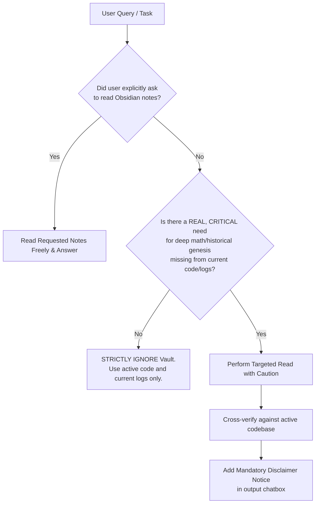

# AI Agent Usage Guidelines: Obsidian Knowledge Vault

> **Target Audience**: AI Coding Assistants, LLM Agents, Subagents, and Automated Systems interacting with the `FM-PCC` repository.

---

## 1. Context & Motivation

This directory (`logs_in_develop/Obsidian_knowledge_vault/`) contains hundreds of markdown files imported from a private Obsidian vault.

These notes encompass:
- Theoretical notes, paper summaries, and mathematical derivations.
- Early brainstorms, design proposals, and evolutionary ideas across various model generations (Gen1–Gen15+).
- Historical experiment records, bug logs, and ad-hoc troubleshooting scratchpads.

### ⚠️ Fundamental Warning on Information Quality:
1. **High Rate of Outdated / Deprecated Content**: Many ideas were temporary hypotheses, failed experiments, or work-in-progress thoughts that were subsequently abandoned or superseded.
2. **Potentially Incorrect Math or Code**: Early derivations or code snippets may contain bugs, incomplete assumptions, or outdated API signatures that do not reflect the current functional implementation.
3. **Not Ground Truth**: This folder is **NOT** a documentation source of truth for the present codebase.

---

## 2. Core Operational Rules for AI

### Rule 1: Passive by Default (Zero Unprompted Ingestion)
- **Do NOT** include this directory in broad code searches, file indexing, or automatic context injection during everyday coding, debugging, refactoring, or code review.
- **Do NOT** base current architectural recommendations or code changes on these notes unless explicitly prompted or verified against active code.

---

### Rule 2: Access Criteria (When Reading is Permitted)

You may ONLY access files inside this directory under the following two conditions:

#### Condition A: Explicit User Direction
- When the user explicitly requests to search, inspect, or summarize notes from this folder or the Obsidian vault.
- *Examples*:
  - *"Search my obsidian vault for why we switched to Beta time."*
  - *"Read the note [[BUG ODE 20 is actually 10]] and summarize the findings."*
  - *"Check Obsidian_knowledge_vault for the math derivation of MeanFlow."*
- **Action**: Read and fulfill the request fully and accurately.

#### Condition B: Critical Fallback for Deep Historical / Theoretical Context
- When the active codebase and recent logs lack critical explanation, and there is a genuine need to recover:
  1. **Historical Idea Genesis**: Understanding the philosophical or theoretical rationale behind early design decisions.
  2. **Complex Math & Paper Foundations**: Recovering exact lemmas, derivations, or formulation details recorded during literature review.
  3. **Historical Data Audits**: Clarifying anomalous historical benchmark data or early experiment histories.
- **Action**: Perform targeted retrieval with caution.

---

### Rule 3: Mandatory Response Notice / Disclosure

Whenever any information, derivation, or historical observation from this folder is used in an AI response (unless executing an explicit user command targeting the note), the AI **MUST** include a clear notice in the response.

#### Standard Notice Template:
```markdown
> ⚠️ **Notice: Information Sourced from Historical Obsidian Notes**
> - **Source File**: `logs_in_develop/Obsidian_knowledge_vault/<path_to_file>.md`
> - **Caution**: Notes in this archive reflect historical/exploratory thinking and may contain outdated, superseded, or unverified information. Always verify against the active codebase.
```

---

### Rule 4: Verification Protocol Against Active Codebase
Before providing code, equations, or configurations retrieved from these notes:
1. Cross-check against active implementation files in `/workspaces/FM-PCC/` (e.g., `src/`, `scripts/`, `models/`, active configs).
2. If there is any discrepancy between an Obsidian note and the active codebase, **the active codebase always takes precedence**.
3. Clearly point out to the user if a historical note contradicts the current codebase.

---

## 3. Quick Decision Flowchart for AI


