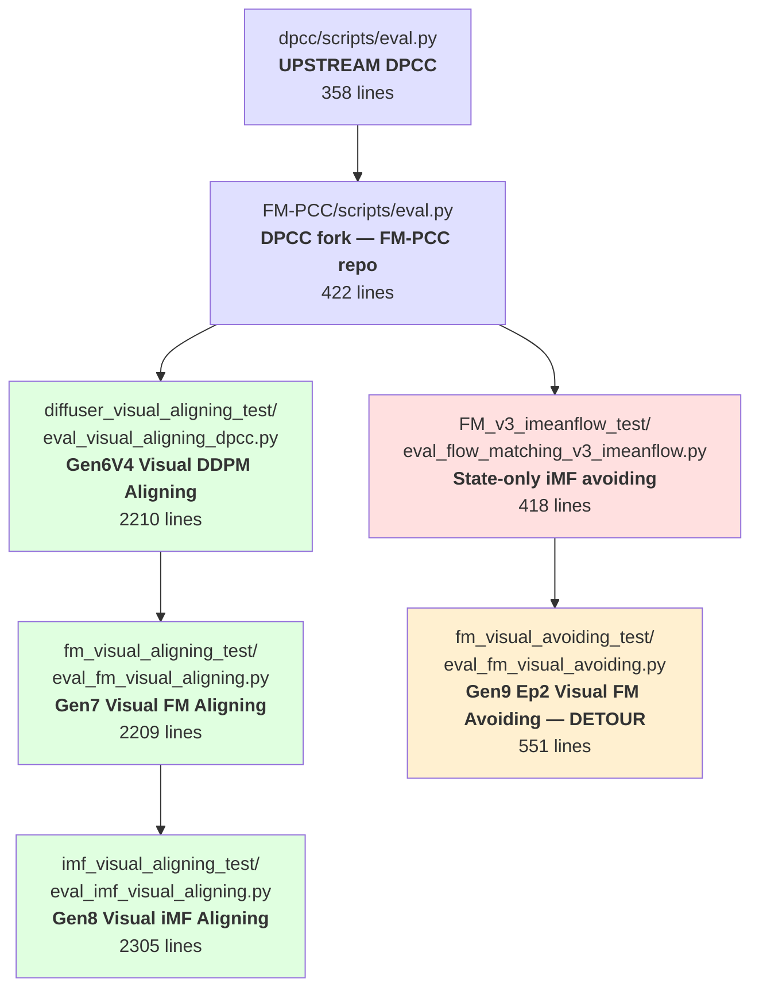
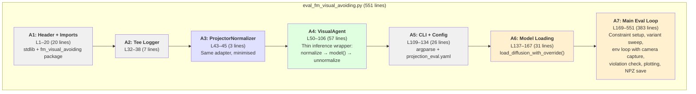

# Evaluation Script Evolution — Full Genealogy

**Author**: Antigravity  
**Date**: June 11, 2026  
**Scope**: Every `eval_*.py` from the original DPCC repo to the latest Gen8 iMF visual aligning pipeline, including the Gen9 visual avoiding detour.

---

## Lineage Diagram



**Two parallel lineages** emerge from the DPCC fork:
1. **State-only avoiding** (top path, red): lightweight ~400-line scripts, `Policy` + `Projector` imported from the engine package
2. **Visual aligning** (bottom path, green): heavyweight ~2200-line scripts, monolithic `VisualAgentWrapper` class embedded in the eval script itself
3. **Visual avoiding** (side branch, yellow): a hybrid — visual camera input grafted onto the state-only skeleton

---

## Generation-by-Generation Breakdown

### Gen 0 — Upstream DPCC (`dpcc/scripts/eval.py`)

| Attribute | Value |
|---|---|
| **Lines** | 358 |
| **ML Engine** | DDPM (GaussianDiffusion) — reverse Markov chain T→0 |
| **Env** | D3IL ObstacleAvoidanceEnv (2D XY avoiding) |
| **Obs schema** | State-only: `[action_xy(2) \| obs_4d]` |
| **Agent** | `Policy` class (imported from `diffuser.sampling`) |
| **Projector** | `Projector` class — SciPy SLSQP constrained QP |
| **Constraints** | Halfspace, bounds, obstacles, dynamics (`deriv` Euler link) |
| **Config** | `config/projection_eval.yaml` — multi-variant sweep |
| **Diagnostics** | 5-metric print: success rate, constraint satisfaction, violations, steps, timing |
| **Output** | `.npz` arrays + matplotlib `.png` per variant per seed |

> This is the **Adam** of all eval scripts. Every subsequent script inherits its constraint formulation math, its YAML config structure, and its multi-variant/multi-seed sweep loop verbatim.

---

### Gen 1 — FM-PCC Fork (`FM-PCC/scripts/eval.py`)

| Attribute | Delta from Gen 0 |
|---|---|
| **Lines** | 422 (+64) |
| **ML Engine** | Still DDPM — no engine change |
| **New features** | `--seed` CLI override, `--aggregate-only` mode, `Tee` stdout logger, `obs_all`/`act_all` saved to `.npz` |

**What changed**: Pure infrastructure. Added CLI ergonomics (`argparse`), per-variant `.log` files via `Tee`, and the ability to re-aggregate plots without re-running inference. The core loop, constraint math, and `Policy`/`Projector` usage remain character-for-character identical to Gen 0.

---

### Gen 2 — State-only iMF Avoiding (`FM_v3_imeanflow_test/eval_flow_matching_v3_imeanflow.py`)

| Attribute | Delta from Gen 1 |
|---|---|
| **Lines** | 418 (-4) |
| **ML Engine** | Flow Matching ODE (iMFDiffusion) — Euler forward 0→1 replaces DDPM reverse chain |
| **Imports** | `flow_matcher_v3_imeanflow.sampling.{policies, projection}` — identical code, different package |
| **Agent** | Same `Policy` class, comment says "FlowMatchingIMF model" |
| **Model load** | Custom `load_diffusion_with_override()` with class-override + kwarg filtering |
| **ODE params** | `flow_steps_v3`, `ode_inference_steps_v3`, `ode_solver_backend_v3` injected post-load |

**What changed**: The generative math swapped from a 1000-step DDPM Markov chain to a ~10-step Euler ODE integration. Everything else — constraint formulation, projection, variant sweep, plotting — stays identical. The `Policy` and `Projector` classes are byte-for-byte copies across packages.

> **NOTE:** This script contains the **import mismatch** identified earlier: although it sits in the `FM_v3_imeanflow_test` folder, a sibling file `eval_flow_matching_v3_ode_selectable.py` in the same directory imports from `flow_matcher_v3_ode_selectable` instead of `flow_matcher_v3_imeanflow`. De facto harmless (identical code), but architecturally messy. A warning comment was added.

---

### Gen 6V4 — Visual DDPM Aligning (`diffuser_visual_aligning_test/eval_visual_aligning_dpcc.py`)

| Attribute | Delta from Gen 1 |
|---|---|
| **Lines** | 2210 (+1788) — **5.2x larger** |
| **ML Engine** | DDPM (VisualGaussianDiffusion) — same math, visual U-Net backbone |
| **Env** | D3IL Aligning (box-pushing), not avoiding |
| **Obs schema** | 9D trajectory: `[act_xyz(3) \| des_c_pos(3) \| c_pos(3)]` |
| **Vision input** | Dual camera: `bp_image` + `inhand_image` via deque context windows |
| **Agent** | **`VisualAgentWrapper`** — 700-line monolithic class embedded in the eval script |
| **Projector** | `setup_dpcc_projector()` helper — builds `Projector` from YAML geo config |
| **Constraint geometry** | `plot_geo_constraints()` — 3D wireframe + XY + XZ panels |
| **Diagnostics** | 7-metric report, per-rollout `.mp4`/`.gif` video, `_stats.json`, `_report.png`, `_mpc_foresight.png`, constraint satisfaction metrics (UF-16.3) |
| **Expert reference** | `generate_expert_reference()` — renders ground-truth rollouts for visual comparison |

**What changed — everything structural**:

The eval script underwent a **paradigm shift** from a lightweight loop calling `policy()` to a full simulation harness:

1. **`VisualAgentWrapper`** replaced `Policy`. Instead of importing a thin wrapper, the entire agent logic (image context buffering, normalization, model call, action clamping, candidate selection, MPC foresight plotting, per-step diagnostics) is hardcoded into a ~700-line class inside the eval script itself.

2. **Observation pipeline** went from `obs = env.reset(); policy(conditions={0: obs})` to a multi-step image + state fusion: camera images are stacked into temporal deques, concatenated with normalised state vectors, and fed to the VisualUNet backbone.

3. **Constraint setup** was refactored from inline code to a `setup_dpcc_projector()` function that reads the YAML's `workspace_bounds`, `halfspace_constraints`, `obstacle_constraints`, and `constraint_types` into the same `Projector` QP solver.

4. **Diagnostics** exploded: each rollout now produces a video, a JSON stats file, a matplotlib report PNG, and a foresight plot showing planned vs executed trajectories.

> The `Projector` class itself is still the exact same SciPy SLSQP solver from Gen 0. Only the wrapper around it changed.

---

### Gen 7 — Visual FM Aligning (`fm_visual_aligning_test/eval_fm_visual_aligning.py`)

| Attribute | Delta from Gen 6V4 |
|---|---|
| **Lines** | 2209 (-1) |
| **ML Engine** | Flow Matching ODE (VisualFlowMatching) replaces VisualGaussianDiffusion |
| **Imports** | `fm_visual_aligning.utils` / `fm_visual_aligning.sampling.projection` |
| **Diff lines** | 334 diff lines — almost entirely comment/header and import path swaps |

**What changed**: The generative engine swapped from DDPM reverse chain to FM ODE forward integration. The `VisualAgentWrapper`, `setup_dpcc_projector()`, all diagnostics, and the entire simulation harness remain functionally identical. The diff is dominated by:
- Header comments updated (Gen6V4 → Gen7)
- Import paths: `diffuser_visual_aligning` → `fm_visual_aligning`
- `experiment='plan_fm_visual_aligning'` config block reference
- Minor doc comment additions (e.g. UF-17 non-visual dim handling)

---

### Gen 8 — Visual iMF Aligning (`imf_visual_aligning_test/eval_imf_visual_aligning.py`)

| Attribute | Delta from Gen 7 |
|---|---|
| **Lines** | 2305 (+96) |
| **ML Engine** | iMeanFlow ODE (dual u/v velocity decomposition) |
| **Imports** | `imf_visual_aligning.utils` / `imf_visual_aligning.sampling.projection` |
| **New code** | `_rebuild_engine_config_from_path()` — reconstructs model config from checkpoint directory name for pre-Fix_2 compatibility |
| **Diff lines** | 141 diff lines — import paths + config block reference + checkpoint compat shim |

**What changed**: Another engine swap — from vanilla FM ODE to iMeanFlow's dual-velocity (u/v head) architecture. The iMF model predicts both a mean velocity `u` and an instantaneous velocity `v`, with weighted combination at sampling time. The eval script's only structural addition is a ~74-line checkpoint reconstruction function for backwards compatibility with checkpoints saved before the model config was standardised.

---

### Gen 9 Ep2 — Visual FM Avoiding (DETOUR) (`fm_visual_avoiding_test/eval_fm_visual_avoiding.py`)

| Attribute | Value |
|---|---|
| **Lines** | 551 |
| **ML Engine** | Flow Matching ODE (VisualFlowMatching) — same as Gen 7 |
| **Env** | D3IL ObstacleAvoidanceEnv (2D XY avoiding) — same env as Gen 0-2 |
| **Obs schema** | 6D trajectory: `[act_xy(2) \| des_xy(2) \| c_xy(2)]` |
| **Vision input** | Single camera: `bp_cam` only (no inhand), 96x96 BGR→RGB |
| **Agent** | **`VisualAgent`** — 57-line thin wrapper (replaces 700-line VisualAgentWrapper) |
| **Projector** | Same `Projector` via `ProjectorNormalizer` adapter |
| **Parent script** | Copy-modified from `FM_v3_ode_selectable_test/eval_flow_matching_v3_ode_selectable.py` (state-only) |

**What changed**: This is a **cross-pollination** branch. It grafts visual camera input onto the lightweight state-only avoiding skeleton, rather than inheriting from the heavy visual aligning lineage:

1. The constraint loop, variant sweep, and plotting code come from the **state-only Gen 2** lineage
2. Camera image capture (`env.bp_cam.get_image()`) and a thin `VisualAgent` class are the only visual additions
3. The `VisualAgent` is deliberately minimal (57 lines) compared to `VisualAgentWrapper` (700+ lines) — it handles only single-step predict, no diagnostics, no video recording

> This script represents an alternative architectural choice: instead of bloating the eval script with a monolithic agent wrapper (as in the aligning lineage), it keeps the eval loop simple and pushes complexity into the model's `forward()` method.

---

## Comparative Summary

| Script | Gen | Lines | Engine Math | Task | Vision | Agent Class |
|--------|-----|-------|-------------|------|--------|-------------|
| `dpcc/scripts/eval.py` | 0 | 358 | DDPM reverse chain | Avoiding 2D | No | `Policy` (imported) |
| `FM-PCC/scripts/eval.py` | 1 | 422 | DDPM reverse chain | Avoiding 2D | No | `Policy` (imported) |
| `eval_flow_matching_v3_imeanflow.py` | 2 | 418 | FM ODE forward | Avoiding 2D | No | `Policy` (imported) |
| `eval_visual_aligning_dpcc.py` | 6V4 | 2210 | DDPM reverse chain | Aligning 3D | Dual cam | `VisualAgentWrapper` (embedded, 700 lines) |
| `eval_fm_visual_aligning.py` | 7 | 2209 | FM ODE forward | Aligning 3D | Dual cam | `VisualAgentWrapper` (embedded, 700 lines) |
| `eval_imf_visual_aligning.py` | 8 | 2305 | iMF dual-velocity ODE | Aligning 3D | Dual cam | `VisualAgentWrapper` (embedded, 700+ lines) |
| `eval_fm_visual_avoiding.py` | 9 Ep2 | 551 | FM ODE forward | Avoiding 2D | Single cam | `VisualAgent` (embedded, 57 lines) |

---

## Invariants Across All Generations

These modules remain **mathematically and functionally identical** from Gen 0 through Gen 8:

1. **`Projector`** — SciPy SLSQP constrained QP solver. The `project()` method, constraint matrix construction (`SafetyConstraints`, `DynamicConstraints`, `ObstacleConstraints`), and `ProjectionNormalizer` are byte-for-byte copies across every package.

2. **Constraint YAML schema** — `config/projection_eval.yaml` (or visual `visual_aligning_eval.yaml`) always defines: `constraint_types`, `workspace_bounds`, `halfspace_constraints`, `obstacle_constraints`, `dt`, `enlarge_constraints`.

3. **Multi-variant sweep loop** — Every eval script iterates over `projection_variants` x `seeds` x `halfspace_variants`, building a fresh `Projector` per variant with appropriate tightening/gradient/dt overrides.

4. **Metric set** — Success rate, constraint satisfaction rate, steps, violations, and timing are printed in every generation. Visual scripts add distance-to-target and tracking error.

---

## Key Architectural Observations

1. **The engine math is the only thing that actually changes between generations.** DDPM → FM ODE → iMF ODE is the progression. Everything around it (constraints, projections, variant sweeps, plotting) is inherited scaffolding.

2. **The visual lineage's 5x code bloat** comes entirely from embedding the `VisualAgentWrapper` + diagnostics into the eval script. The Gen 9 avoiding detour proves this is optional — a 57-line `VisualAgent` achieves the same functional goal.

3. **Cross-package imports are everywhere.** `policies.py` and `projection.py` are copied verbatim across 6+ packages. Any future fix to the projector math must be applied to all copies simultaneously.

4. **`Policy` (imported) vs `VisualAgentWrapper` (embedded)** is the fundamental architectural fork. State-only scripts delegate agent logic to a reusable imported class; visual scripts inline it. Neither approach is strictly better — the tradeoff is reusability vs diagnostic depth.

---

## Module Anatomy — Branch 1: Visual Aligning (2305 lines)

The 2305-line `eval_imf_visual_aligning.py` (Gen8) is not a monolith — it is **9 independent modules** stacked vertically in a single file. Each module has a clear boundary, a single responsibility, and could in principle be extracted into its own `.py` file.

```mermaid
graph TD
    subgraph "eval_imf_visual_aligning.py (2305 lines)"
        M1["<b>M1: Header + Imports</b><br/>L1–58 (58 lines)<br/>stdlib, torch, cv2, imageio,<br/>package imports, sys.path setup"]
        M2["<b>M2: ProjectorNormalizer</b><br/>L59–73 (15 lines)<br/>Adapter class wrapping obs+act<br/>normalizers into Projector-compatible dict"]
        M3["<b>M3: setup_dpcc_projector()</b><br/>L74–166 (93 lines)<br/>Reads YAML geo config →<br/>builds constraint_list →<br/>instantiates Projector(SLSQP)"]
        M4["<b>M4: Constraint Geometry Viz</b><br/>L167–467 (301 lines)<br/>_hs_xy_draw(), plot_geo_constraints()<br/>3D wireframe + XY + XZ panels<br/>UF-15 constraint overview PNG"]
        M5["<b>M5: Constraint Metrics</b><br/>L468–631 (164 lines)<br/>check_trajectory_constraints()<br/>_check_planned_violations()<br/>UF-16.3 bounds/HS/obstacle eval"]
        M6["<b>M6: Utilities</b><br/>L633–712 (80 lines)<br/>Tee logger (10 lines)<br/>generate_expert_reference() (70 lines)"]
        M7["<b>M7: VisualAgentWrapper</b><br/>L713–1653 (941 lines)<br/>THE BIG ONE — see sub-breakdown below"]
        M8["<b>M8: Model Loading</b><br/>L1654–1772 (119 lines)<br/>_rebuild_engine_config_from_path()<br/>load_diffusion_with_override()"]
        M9["<b>M9: Parser + Main Loop</b><br/>L1773–2306 (534 lines)<br/>CLI args, YAML config, seed loop,<br/>geo constraint loop, sim.test_agent(),<br/>NPZ/pkl save, PNG grid, metrics print"]
    end

    M1 --> M2
    M2 --> M3
    M3 --> M4
    M4 --> M5
    M5 --> M6
    M6 --> M7
    M7 --> M8
    M8 --> M9

    style M1 fill:#f0f0f0
    style M2 fill:#e0e0ff
    style M3 fill:#e0e0ff
    style M4 fill:#ffe0e0
    style M5 fill:#ffe0e0
    style M6 fill:#f0f0f0
    style M7 fill:#e0ffe0
    style M8 fill:#fff0d0
    style M9 fill:#fff0d0
```



### Module Line Budget

| Module | Lines | % of Total | Role |
|--------|------:|:----------:|------|
| M1: Header + Imports | 58 | 2.5% | Wiring |
| M2: ProjectorNormalizer | 15 | 0.7% | Adapter |
| M3: setup_dpcc_projector() | 93 | 4.0% | Constraint builder |
| M4: Constraint Geometry Viz | 301 | 13.1% | 3D/2D constraint plots |
| M5: Constraint Metrics | 164 | 7.1% | Post-hoc violation analysis |
| M6: Utilities | 80 | 3.5% | Logger + expert video |
| **M7: VisualAgentWrapper** | **941** | **40.8%** | **Agent logic — the core** |
| M8: Model Loading | 119 | 5.2% | Checkpoint reconstruction |
| M9: Parser + Main Loop | 534 | 23.2% | Orchestration + output |
| **TOTAL** | **2305** | **100%** | |

> **Key insight:** M7 (VisualAgentWrapper) alone is 41% of the file. M4+M5 (constraint visualisation and post-hoc metrics) together are another 20%. These three blocks account for 61% of the file and are purely about **diagnostics and the agent's internal logic** — not about the ML engine or the environment.

### M7 Sub-Breakdown: VisualAgentWrapper (941 lines)

The agent wrapper itself decomposes into distinct functional blocks:

| Method | Lines | Purpose |
|--------|------:|---------|
| `__init__()` | 73 | State init: deques, history buffers, config |
| `reset()` | 26 | Per-rollout state reset |
| `update_rollout_info()` | 103 | End-of-rollout: compute mean_dist, constraint check, save master history |
| `record_step_info()` | 5 | Per-step metadata logging |
| `capture_frame()` | 16 | Camera image → video frame buffer |
| `record_context_info()` | 16 | Save box/target scene context |
| `_export_rollout_realtime()` | 417 | **Diagnostics export** — video, GIF, JSON stats, report PNG, MPC foresight plot |
| `predict()` | 261 | **Inference** — normalize obs, call model, project, select trajectory, unnormalize action |

> **Key insight:** Of the 941-line agent, `_export_rollout_realtime()` alone is 417 lines (44%) — nearly half the class is **just diagnostic export** (rendering videos, generating report PNGs, plotting MPC foresight). The actual neural network inference (`predict()`) is 261 lines, and the rest is bookkeeping.

### What Each Module Inherits From

| Module | Origin | Shared across Gen6V4/Gen7/Gen8? |
|--------|--------|---------------------------------|
| M2: ProjectorNormalizer | New for visual branch (Gen6V4) | Yes — identical across all 3 |
| M3: setup_dpcc_projector() | Refactored from Gen0 inline code | Yes — identical across all 3 |
| M4: Constraint Geometry Viz | New for visual branch (Gen6V4, UF-15) | Yes — identical across all 3 |
| M5: Constraint Metrics | New for visual branch (Gen6V4, UF-16.3) | Yes — identical across all 3 |
| M6: Expert reference | New for visual branch (Gen6V4) | Yes — identical across all 3 |
| M7: VisualAgentWrapper | New for visual branch (Gen6V4) | Yes — identical predict() logic |
| M8: Model Loading | Gen0 `utils.load_diffusion` + Gen8 compat shim | Gen8 adds 74-line compat shim |
| M9: Main Loop | Restructured from Gen0 sweep loop | Different orchestration per gen |

---

## Module Anatomy — Branch 2: Visual Avoiding / Detour (551 lines)

The 551-line `eval_fm_visual_avoiding.py` (Gen9 Ep2) represents the **minimal viable visual eval** — it inherits the state-only avoiding skeleton from Branch 1 and adds just enough visual code to work.



### Module Line Budget

| Module | Lines | % of Total | Role |
|--------|------:|:----------:|------|
| A1: Header + Imports | 20 | 3.6% | Wiring |
| A2: Tee Logger | 7 | 1.3% | Logging |
| A3: ProjectorNormalizer | 3 | 0.5% | Adapter |
| A4: VisualAgent | 57 | 10.3% | Inference wrapper |
| A5: CLI + Config | 26 | 4.7% | Argument parsing |
| A6: Model Loading | 31 | 5.6% | Checkpoint loading |
| **A7: Main Eval Loop** | **383** | **69.5%** | **Everything else** |
| **TOTAL** | **551** | **100%** | |

### What's Missing vs Branch 1

This script achieves the same core function (generate trajectories + project + evaluate) in **4.2x fewer lines** by omitting:

| Feature (from Branch 1) | Lines Saved | Impact |
|--------------------------|:-----------:|--------|
| M4: Constraint geometry visualisation | −301 | No 3D/XY/XZ constraint overview PNGs |
| M5: Post-hoc constraint metrics | −164 | No per-step violation analysis JSON |
| M6: Expert reference videos | −70 | No ground-truth comparison videos |
| M7: VisualAgentWrapper diagnostics | −600 | No per-rollout video/GIF/report/foresight |
| M8: Checkpoint compat shim | −74 | No legacy checkpoint support |
| **Total saved** | **~1209** | **Pure diagnostic/viz code** |

> **Key insight:** The 1750-line difference between Branch 1 (2305 lines) and Branch 2 (551 lines) is almost entirely diagnostic infrastructure. The actual inference math — calling the model, projecting the trajectory, checking constraints, stepping the environment — is the same ~380 lines in both branches.

---

## Side-by-Side: What Makes Up a 2300-Line Eval Script

```
╔══════════════════════════════════════════════════════════════════════╗
║          Branch 1: Visual Aligning (2305 lines)                    ║
╠══════════════════════════════════════════════════════════════════════╣
║  ┌─ Imports + Adapters ────────────────────────── 73 lines  (3%)   ║
║  ├─ Constraint Builder (setup_dpcc_projector) ── 93 lines  (4%)   ║
║  ├─ Constraint Viz (3D/XY/XZ plots) ─────────── 301 lines (13%)  ║
║  ├─ Constraint Metrics (post-hoc analysis) ──── 164 lines  (7%)  ║
║  ├─ Utilities (Tee + Expert Reference) ──────── 80 lines   (3%)  ║
║  ├─ VisualAgentWrapper ──────────────────────── 941 lines (41%)  ║
║  │   ├─ Bookkeeping (__init__, reset, etc) ──── 239 lines         ║
║  │   ├─ Diagnostic Export (_export_realtime) ── 417 lines         ║
║  │   └─ INFERENCE (predict) ─────────────────── 261 lines         ║
║  ├─ Model Loading ───────────────────────────── 119 lines  (5%)  ║
║  └─ Main Loop (orchestration + output) ──────── 534 lines (23%)  ║
╚══════════════════════════════════════════════════════════════════════╝

╔══════════════════════════════════════════════════════════════════════╗
║          Branch 2: Visual Avoiding (551 lines)                     ║
╠══════════════════════════════════════════════════════════════════════╣
║  ┌─ Imports + Adapters ────────────────────────── 30 lines  (5%)  ║
║  ├─ VisualAgent (thin inference wrapper) ─────── 57 lines  (10%) ║
║  ├─ CLI + Config ─────────────────────────────── 26 lines  (5%)  ║
║  ├─ Model Loading ────────────────────────────── 31 lines  (6%)  ║
║  └─ Main Loop (constraints + env + plot) ─────── 383 lines (70%) ║
║                                                                    ║
║  ❌ No constraint viz    ❌ No constraint metrics                   ║
║  ❌ No expert reference  ❌ No per-rollout video/report/foresight   ║
╚══════════════════════════════════════════════════════════════════════╝
```

**Bottom line:** The ~380-line core (model call → project → env step → violation check → plot) is the same in both branches. Branch 1 wraps it with ~1900 lines of diagnostic infrastructure. Branch 2 leaves it bare.
