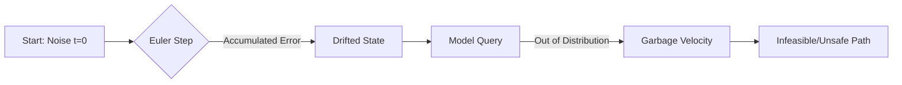

# ODE Steps vs. Accuracy: Scientific Computing vs. Flow Matching Manifolds

This document provides a rigorous theoretical comparison of how ODE integration trade-offs differ between **Classical Scientific Computing** and **Neural Flow Matching (FM)** in robotics.

---

## 1. The Trade-Off Comparison Matrix

| Dimension | Classical Scientific Computing | Flow Matching (Neural) VF |
| :--- | :--- | :--- |
| **Primary Goal** | Minimize absolute error $\epsilon$ | Maintain "Manifold Fidelity" and Safety |
| **Error Scaling** | Order-driven ($O(h^1)$ to $O(h^8)$) | Distribution-driven (Stay on support) |
| **Step Strategy** | **Adaptive** (Dopri5, LSODE) | **Fixed** (Euler, RK4) |
| **Failure Mode** | Numerical Instability / Blow-up | "Extrapolation Drift" into garbage space |
| **Bottleneck** | Floating Point Operations (FLOPs) | **Sequential Dispatch Tax** (Python/IO) |

---

## 2. The Classical Perspective: Discretization Error

In classical math, we assume $f(x, t)$ is a known, continuous function. The error of an integrator is defined by its **Local** and **Global** truncation error.

### The "Step Count" Logic
If we double the steps ($h \to h/2$):
*   **Euler ($O(h)$)**: Error is reduced by **2x**.
*   **RK4 ($O(h^4)$)**: Error is reduced by **16x**.

> [!TIP]
> **Scientific Computing Rule**: If you need high precision, always increase the **Order** (Method) before increasing the **Density** (Steps). Doubling steps in Euler is the most expensive way to gain accuracy.

---

## 3. The Flow Matching Perspective: Manifold Drift

In Flow Matching, $v_\theta(x,t)$ is a **Learned Approximation**. This changes the trade-off fundamentally because the model is only valid on the "Data Manifold."

### The "Extrapolation Hazard"
When an ODE solver drifts away from the true solution, it doesn't just lose precision—it exits the **Learned Support**.

*   **Euler's Hazard**: Euler assumes the velocity field is constant over $dt$. In regions of high curvature (e.g., avoiding an obstacle), Euler "overshoots" the curve, landing the robot in a state the model never saw during training.
*   **RK4's Shield**: RK4 samples the velocity field 4 times within the step. It "discovers" the manifold's curvature before the step is finalized, keeping the trajectory "on the rails."

---

## 4. The FM-PCC Pathing Perspective: Interleaved Safety Guidance

In standard generative AI, the intermediate steps ($x_{0.5}$) do not matter; only the final generated image ($x_1$) matters. **This is fundamentally untrue for FM-PCC.**

In FM-PCC (and DPCC), the ODE solver does not operate in a vacuum. It is heavily coupled with a **Safety Projector (SLSQP/SQP)** at every step.

### The "Proposal and Correction" Cycle
At every step $k$:
1.  **ODE Solver (The Proposal)**: Moves the state slightly forward along the vector field.
2.  **Projector (The Correction)**: Evaluates that new intermediate state against collision boundaries and "pushes" it to safety.

> [!CAUTION]
> **Why Intermediate Accuracy is Critical:**
> If you reduce the ODE steps too much (e.g., from 10 to 2), you are **blindfolding the Projector**. The trajectory will jump wildly, and the Safety Projector will struggle to find a feasible solution because the "proposal" state has drifted too far into collision geometry. 
> 
> Furthermore, if you use a "dumb" solver like Euler, it mathematically extrapolates into a wall. The computational burden on the Safety Projector spikes heavily as it desperately tries to yank the trajectory back to safety. If you use **RK4**, the ODE "proposal" is deeply accurate, meaning the Safety Projector only has to make minor tweaks. 

### The "Garbage In, Struggle Out" Problem
The Safety Projector (SLSQP solver) takes whatever state the ODE solver gives it and tries to mathematically force it back into a safe zone.
*   **Low Accuracy (Euler)**: The state handed to the Projector is numerical "garbage." The robot's proposed state might be clipping through the floor due to straight-line extrapolation. The SLSQP solver now has to work *twice as hard*—fixing the obstacle collision **and** fixing the broken physics caused by Euler's drift. This spikes SLSQP iterations, causing massive and unpredictable latency spikes.
*   **High Accuracy (RK4)**: The proposed state is extremely clean. It perfectly follows the vector-field manifold. The Projector looks at this clean trajectory, sees a minor obstacle boundary violation, and only has to make a tiny "nudge" to fix it. Because the state is already highly feasible, the SLSQP solver converges in fewer iterations, running much faster.

**Summary**: By improving the per-step accuracy (using higher-order solvers), we ensure that the unconstrained trajectory remains dynamically feasible. This prevents the Safety Projector from wasting massive computational effort trying to recover from numerical drift, ultimately resulting in smoother, safer, and more predictable robot control.

---

## 5. The Robotics Perspective: The Sequential Bottleneck

In real-time MPC (Model Predictive Control), we have a "Communication Tax" for every step we take.

### The $4 \times 10$ vs. $1 \times 40$ Comparison
Assume we have a 20ms budget:
1.  **Euler ($N=40$ steps)**: 40 sequential trips to the GPU. Even if the math is fast, the overhead of Python, tensor slicing, and IO happens 40 times.
2.  **RK4 ($N=10$ steps)**: 10 sequential trips to the GPU. Each trip performs 4 "internal stages."

> [!IMPORTANT]
> **The Real Trade-off**: In Flow Matching, **10 steps of RK4 is superior to 40 steps of Euler**. 
> Even though they both perform 40 model evaluations, the RK4 version pays the "Boilerplate Tax" (indexing, conditioning, safety projector) 75% less often. 

---

## 6. Summary of Findings

1.  **For Math Mode (Scientific Proof)**: RK4 is used to prove that the vector field has "Curvature." If Euler and RK4 were identical, it would mean your Flow is a straight line (Constant Velocity). Since they differ, the Flow has **Dynamics** that require higher-order handling.
2.  **For Production Mode (Robot Safety)**: Advanced solvers are a "Safety Guard." By staying closer to the true mathematical trajectory, the robot avoids drifting into "garbage states" where the neural network might suddenly output a high-velocity command into a wall.
3.  **The "Sweet Spot"**: For the `avoiding-d3il` task, we found that **RK4 with 10-15 steps** provides the best balance between "Geometric Fidelity", "Safety Projector Load", and "Control Frequency."
