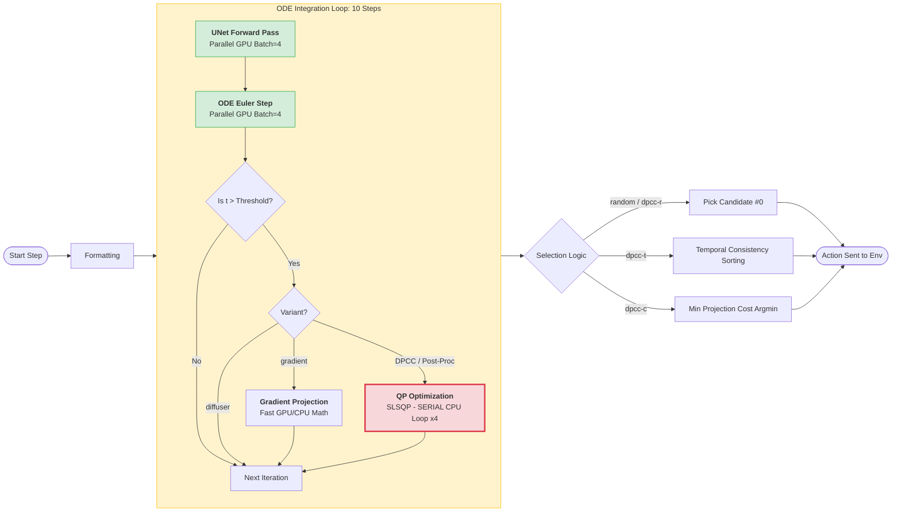

# Eval Pipeline Step-by-Step Investigation

## TLDR: Process Flow & Bottlenecks



### At a Glance:
1.  **The Bottleneck (Red):** `QP Optimization` is the only **Serial CPU** part of the core loop. Since `batch_size=4`, it runs 4 times sequentially for every single ODE step past the threshold.
2.  **GPU Parallel (Green):** `UNet` and `ODE` steps process all 4 candidates in a single batched call.
3.  **Wasted Effort:** `diffuser`, `dpcc-r`, and `post_processing` compute 4 candidates but **ignore 3 of them** at the end. For these, `batch_size=1` would be ~4x faster on the QP portion.

---

> **Date**: 2026-04-25  
> **Scope**: What happens at each step inside `policy(...)` during eval, how many candidates, what is serial vs parallel, and where the time goes.  
> **Source files**:  
> - [eval_flow_matching_v3_ode_selectable.py](file:///workspaces/FM-PCC/FM_v3_ode_selectable_test/eval_flow_matching_v3_ode_selectable.py)  
> - [diffusion.py (FMv3)](file:///workspaces/FM-PCC/flow_matcher_v3_ode_selectable/models/diffusion.py)  
> - [policies.py](file:///workspaces/FM-PCC/flow_matcher_v3_ode_selectable/sampling/policies.py)  
> - [projection.py](file:///workspaces/FM-PCC/flow_matcher_v3_ode_selectable/sampling/projection.py)  
> - [diffusion.py (DPCC/legacy)](file:///workspaces/FM-PCC/diffuser/models/diffusion.py)

---

## 1. Overview: What the Timer Captures

In the eval script, **one** timer wraps the entire `policy(...)` call per MPC step:

```python
# eval L238-240
start = time.time()
action, samples = policy(conditions={0: obs}, batch_size=args.batch_size, horizon=args.horizon, ...)
avg_time[i] += time.time() - start
```

The printed `avg_time` is **the wall-clock time of the ENTIRE pipeline per environment step**, averaged over the episode. It includes *everything* below.

---

## 2. Pipeline Stages (Inside `policy(...)`)

The call chain is:

```
Policy.__call__()
 ├─ 1. Preprocessing / Condition formatting         ← negligible
 ├─ 2. model(conditions, ..., projector=..., ...)   ← THE BIG ONE
 │    └─ GaussianDiffusion.forward() → conditional_sample() → p_sample_loop()
 │         ├─ 2a. Gaussian noise init               ← negligible
 │         ├─ 2b. ODE integration loop (flow_steps_v3 iterations)
 │         │    Each iteration:
 │         │    ├─ UNet forward pass (velocity prediction)     ← GPU
 │         │    ├─ Euler step: x = x + v * dt                  ← GPU trivial
 │         │    ├─ [If projector.gradient && near_end]:
 │         │    │     gradient projection                       ← GPU/CPU
 │         │    ├─ [If projector && !gradient && near_end]:
 │         │    │     QP projection (scipy.optimize.minimize)   ← CPU SERIAL
 │         │    └─ apply_conditioning (clamp obs at t=0)        ← GPU trivial
 │         └─ return x, infos{projection_costs}
 ├─ 3. Unnormalize observations                     ← negligible
 ├─ 4. Trajectory selection (DPCC-R/T/C)            ← CPU, cheap
 │    ├─ DPCC-R (random):  which_trajectory = 0     ← instant
 │    ├─ DPCC-T:  sort by temporal consistency      ← numpy argsort
 │    └─ DPCC-C:  argmin of projection costs        ← numpy argmin
 └─ 5. Extract action[which_trajectory, 0]          ← negligible
```

---

## 3. Detailed Breakdown: Each Stage

### Stage 2b: UNet Forward + ODE Integration

| Parameter | Value (current config) |
|---|---|
| `flow_steps_v3` | 10 |
| `ode_solver_backend_v3` | `legacy_euler` |
| `batch_size` (candidates) | **4** (plan config) |
| Horizon | 8 |

**What happens**: 10 iterations of the ODE loop. Each iteration runs **one UNet forward pass** on a batch of shape `(4, 8, transition_dim)`. All 4 candidates are processed **in parallel on the GPU** in a single batched forward pass.

```python
# diffusion.py L199-201
for i in range(total_steps):   # 10 iterations
    t_cont = torch.full((batch_size,), ...)  # batch_size = 4
    # Single batched UNet call for all 4 candidates:
    velocity = self._predict_velocity(x, cond, t_cont, ...)  # x shape: (4, 8, T)
    x = x + velocity * dt   # Euler step
```

> **Key**: The UNet forward pass is **batched across all candidates**. 4 candidates = 1 GPU call, not 4 serial calls. This is efficient.

### Stage 2b (QP branch): DPCC-R / Post-Process Projection

When `projector is not None` and `not projector.gradient` and `near_end`:

```python
# diffusion.py L263-269
if projector is not None and not projector.gradient and near_end:
    x, projection_costs = projector.project(x, constraints)
```

Inside `projector.project()` — **THIS IS THE BOTTLENECK**:

```python
# projection.py L131-144
for i in range(batch_size):   # ← SERIAL LOOP over candidates
    res = minimize(fun=cost_fun,
                   x0=trajectory_np_double[i],
                   constraints=constraints,
                   method='SLSQP',
                   ...)
    sol_np[i] = res.x
```

> [!CAUTION]
> **The QP solve is 100% SERIAL on CPU.**  
> For each candidate trajectory, `scipy.optimize.minimize(method='SLSQP')` is called **one at a time** in a Python for-loop.  
> With `batch_size=4` → 4 sequential QP solves per near-end ODE step.

**How many ODE steps trigger QP?**  
Controlled by `diffusion_timestep_threshold` (default: 0.5). For FM flow going t=0→1:
- `snapping_start_idx = int((1.0 - 0.5) * 10) = 5`
- So steps 5, 6, 7, 8, 9 **all** trigger QP projection → **5 steps × 4 QP solves = 20 QP solves per env step**

> [!WARNING]
> **Massive QP load**: With threshold=0.5, flow_steps=10, batch_size=4:  
> **20 sequential scipy SLSQP optimizations** per single environment step.  
> Each QP solves over `horizon × transition_dim` = 8×6 = 48 decision variables with obstacle (quadratic), halfspace, bounds, and dynamics constraints.

### Stage 2b (Gradient branch): Alternative to QP

When `projector.gradient = True` (variant contains `'gradient'`):
- Uses `projector.compute_gradient()` instead of `project()`
- This computes analytical gradients on CPU/GPU — **much faster** than QP
- Still loops over batch but each iteration is cheap matrix math, not an optimization

### Stage 4: Trajectory Selection (DPCC-R / T / C)

This happens **after** all ODE + projection is complete, in `policies.py`:

| Variant Suffix | Selection Method | Code | Cost |
|---|---|---|---|
| `dpcc-r` | **Random** (first candidate) | `which_trajectory = 0` | O(1), instant |
| `dpcc-t` | **Temporal Consistency** | `np.argsort(‖obs_prev - obs_curr‖)` over batch | O(B·H·D) numpy, cheap |
| `dpcc-c` | **Minimum Projection Cost** | `np.argmin(Σ projection_costs)` | O(B), instant |

> [!IMPORTANT]
> The selection step itself is negligible in time. But **DPCC-T and DPCC-C logically require multiple candidates to be meaningful**.  
> - DPCC-R: only needs **1** candidate — the others are wasted computation.
> - DPCC-T: needs ≥2 candidates (compares with previous timestep's trajectory).
> - DPCC-C: needs ≥2 candidates (picks lowest-cost projected trajectory).

---

## 4. The Key Question: Are We Still 4 Candidates?

### Answer: **YES — always 4 candidates** (from config)

```python
# config/avoiding-d3il.py L511
'plan_fm_v3_ode_selectable': {
    'batch_size': 4,
    ...
}
```

The batch_size is **fixed at 4 for all variants**, including `diffuser` (no projection) and `dpcc-r` (random selection).

### Implications by Variant

| Variant | Needs Multiple Candidates? | Currently Uses | Waste? |
|---|---|---|---|
| `diffuser` | No (no projection, random select) | 4 | **3 wasted** — only candidate 0 is used |
| `dpcc-r` | No (random selection) | 4 | **3 wasted** — QP runs on all 4, then picks #0 |
| `post_processing` | No (random selection) | 4 | **3 wasted** — same as dpcc-r |
| `gradient` | No (random selection) | 4 | **3 wasted** — gradient computed for all 4 |
| `dpcc-t` | Yes (temporal consistency) | 4 | **Correct** — needs all candidates to compare |
| `dpcc-c` | Yes (min projection cost) | 4 | **Correct** — needs all candidates to compare costs |

> [!WARNING]
> **For `dpcc-r` and `post_processing`**: Running 4 candidates means 4× the QP cost for ZERO benefit. The selection is always candidate #0.  
> If batch_size were reduced to 1 for these variants, per-step time would drop by ~4× on the QP portion.

---

## 5. Parallelism vs. Serialization Audit

| Operation | Parallel? | Notes |
|---|---|---|
| UNet forward pass (all candidates) | ✅ **GPU batched** | Single `model(x, ...)` call, shape `(4, H, T)` |
| ODE Euler step `x + v*dt` | ✅ **GPU batched** | Trivial tensor add |
| `apply_conditioning` | ✅ **GPU batched** | Tensor index assignment |
| `projector.project()` (QP/SLSQP) | ❌ **CPU SERIAL** | Python for-loop over `range(batch_size)` |
| `projector.compute_gradient()` | ⚠️ **Partially serial** | Matrix ops are batched, but obstacle loop is serial over constraints×horizon |
| Trajectory selection | ✅ **Vectorized numpy** | Cheap regardless |

### The Critical Bottleneck

```
Total time per env step ≈ (flow_steps_v3 × UNet_forward_time)
                        + (near_end_steps × batch_size × QP_solve_time)
                        + negligible_selection_time
```

With current defaults:
- `flow_steps_v3 = 10` → 10 UNet calls (GPU parallel across batch, fast)
- `near_end_steps = 5` (threshold 0.5 → steps 5-9)
- `batch_size = 4`
- **→ 20 serial SLSQP calls on CPU**

---

## 6. Time Cost Comparison: Variant Families

### Family A: "diffuser" (No Projection)

```
Time ≈ 10 × UNet_forward(batch=4)
```

Pure GPU. Fastest variant. ~milliseconds on modern GPU.

### Family B: "dpcc-r" / "post_processing" / "model_free" (QP + Random Select)

```
Time ≈ 10 × UNet_forward(batch=4) + 5 × 4 × SLSQP_solve
     ≈ GPU_fast + 20 × SLSQP_time
```

> [!CAUTION]
> **If batch_size=1 is sufficient for dpcc-r**: Time drops to  
> `10 × UNet_forward(batch=1) + 5 × 1 × SLSQP = 5 × SLSQP`  
> This is **4× faster on QP** and slightly faster on UNet (smaller batch).  
> **Must re-evaluate reported avg_time if changing batch_size.**

### Family C: "dpcc-t" / "dpcc-c" (QP + Smart Select)

```
Time ≈ 10 × UNet_forward(batch=4) + 5 × 4 × SLSQP_solve + selection_overhead
```

Selection overhead is negligible. **These variants NEED batch_size ≥ 2 to function correctly.**

### Family D: "gradient" variants (Gradient Projection)

```
Time ≈ 10 × UNet_forward(batch=4) + 5 × gradient_compute(batch=4)
```

No QP solver. Gradient compute is mostly matrix ops. **Significantly faster than QP variants.**

---

## 7. What the Eval Output Columns Mean

From [load_results_flow_matching_v3_ode_selectable.py](file:///workspaces/FM-PCC/FM_v3_ode_selectable_test/load_results_flow_matching_v3_ode_selectable.py):

| Metric | Source | Meaning |
|---|---|---|
| `Success rate (goal)` | `n_success.mean()` | Fraction of trials reaching the goal |
| `Success rate (goal + constraints)` | `n_success_and_constraints.mean()` | Goal reached AND zero constraint violations |
| `Success rate (constraints)` | `collision_free_completed.mean()` | No constraint violations throughout episode |
| `Average steps` | `n_steps[success>0].mean()` | Env steps to reach goal (only successful trials) |
| `Average violations` | `n_violations.mean()` | Count of timesteps with any violation |
| `Average total violations` | `total_violations.mean()` | Sum of violation magnitudes (penetration depth) |
| `Average time` | `avg_time.mean()` | **Wall-clock time per env step** (the full policy call) |

### What `avg_time` includes (the timer):

```
avg_time = TOTAL_episode_time / n_steps_in_episode
```

Where `TOTAL_episode_time = Σ (time for each policy(...) call)` and each call includes:
1. Condition formatting (~0ms)
2. 10× UNet + ODE step (~fast GPU)
3. 5× QP projection on all 4 candidates (~slow CPU)
4. Selection (~0ms)
5. Action extraction (~0ms)

---

## 8. The `.npz` File Contents

```python
# eval L308
np.savez(f'{save_path}/{variant}.npz',
    n_success=n_success,                       # (n_trials,) binary
    n_success_and_constraints=...,             # (n_trials,) binary
    n_steps=n_steps,                           # (n_trials,) int — steps to terminal
    n_violations=n_violations,                 # (n_trials,) int — count
    total_violations=total_violations,         # (n_trials,) float — magnitude
    avg_time=avg_time,                         # (n_trials,) float — seconds/step
    collision_free_completed=...,              # (n_trials,) binary
    args=args                                  # config snapshot
)
```

---

## 9. Cross-Reference: DPCC (Original Diffuser) vs. FMv3

| Aspect | DPCC (diffuser/) | FMv3 ODE Selectable |
|---|---|---|
| Denoising/Integration | DDPM reverse: t=T→0, `n_timesteps=20` steps | FM forward: t=0→1, `flow_steps_v3=10` steps |
| UNet calls per step | 20 (one per DDPM step) | 10 (one per ODE step) |
| QP trigger condition | `t <= threshold * n_timesteps` (near t=0, near data) | `loop_idx >= (1-threshold) * flow_steps` (near t=1, near data) |
| Noise injection | Yes (Gaussian noise at each step) | No (deterministic ODE) |
| Projection code | Identical `projector.project()` / `compute_gradient()` | Identical — same Projector class |
| Batch size (plan) | 4 | 4 |
| QP solver | scipy SLSQP, serial loop | scipy SLSQP, serial loop |

> [!NOTE]
> The **projection and selection logic is identical** between DPCC and FMv3. The only difference is the generative backbone (DDPM vs FM ODE). The time-cost structure of the QP bottleneck is the same.

---

## 10. Open Questions & Warnings

> [!CAUTION]
> ### Q1: Should `dpcc-r` / `post_processing` use batch_size=1?
> These variants select candidate #0 regardless. Running 4 QP solves is pure waste.  
> **BUT**: Changing batch_size changes the UNet batching and potentially the random seed behavior, which may affect reproducibility and reported metrics.  
> **Action needed**: Re-evaluate if batch_size=1 gives equivalent quality for dpcc-r. If yes, reported `avg_time` would need recomputation.

> [!WARNING]
> ### Q2: Serial QP is the dominant cost — is parallelization feasible?
> The `Projector` class has a `parallelize` flag (L9) but it is **never used** — the `project()` method always runs a serial for-loop.  
> Options:
> - `multiprocessing.Pool` for parallel SLSQP calls (CPU parallelism)
> - `proxsuite` backend (supports vectorized QP, solver param exists but code not present for QP-project path)
> - GPU-based QP solvers (e.g., `qpth`, `cvxpylayers`)
> 
> **Impact**: With 4 candidates and 5 near-end steps = 20 QP solves, parallelizing across the 4 candidates would give ~4× speedup on the QP portion.

> [!IMPORTANT]
> ### Q3: The threshold controls how many QP solves happen
> `diffusion_timestep_threshold = 0.5` means 50% of ODE steps trigger projection.  
> Reducing to 0.1 would trigger only the last step → **1 step × 4 candidates = 4 QP solves** instead of 20.  
> This is a **quality vs. speed tradeoff** that directly affects `avg_time`.

---

## 11. Visual Summary: Time Flow per Environment Step

```
┌──────────────────────────────────────────────────────────────────────┐
│ policy(obs)  ← timer starts                                         │
│                                                                      │
│  ┌─── p_sample_loop ──────────────────────────────────────────────┐  │
│  │                                                                │  │
│  │  Step 0-4 (t < threshold): UNet fwd only, NO projection       │  │
│  │    [UNet GPU batch=4] → [Euler step] → [clamp]  ×5            │  │
│  │                                                                │  │
│  │  Step 5-9 (t ≥ threshold): UNet fwd + QP projection           │  │
│  │    [UNet GPU batch=4] → [Euler step] → [clamp]                │  │
│  │    → [QP solve cand#0 CPU] → [QP solve cand#1 CPU]            │  │
│  │    → [QP solve cand#2 CPU] → [QP solve cand#3 CPU]  ×5       │  │
│  │                                                                │  │
│  └────────────────────────────────────────────────────────────────┘  │
│                                                                      │
│  ┌─── Trajectory Selection ───────────────────────────────────────┐  │
│  │  dpcc-r: pick #0              ← O(1)                          │  │
│  │  dpcc-t: argsort by temporal  ← O(B·H·D) numpy               │  │
│  │  dpcc-c: argmin of QP costs   ← O(B)                          │  │
│  └────────────────────────────────────────────────────────────────┘  │
│                                                                      │
│  action = actions[which_trajectory, 0]                               │
│                                                                      │
│ ← timer ends                                                         │
└──────────────────────────────────────────────────────────────────────┘
```

### Approximate Time Breakdown (GPU-equipped system)

| Component | Approx. Time | Notes |
|---|---|---|
| 10× UNet forward (batch=4) | ~5-20 ms total | GPU, fast |
| 5 steps × 4 QP SLSQP | ~50-500 ms total | CPU serial, **dominant** |
| Selection | <1 ms | Negligible |
| **Total per env step** | **~55-520 ms** | QP is 90%+ of time |

> The `diffuser` variant (no projection) would be ~5-20 ms.  
> The `dpcc-*` variants with QP would be ~10-100× slower due to serial SLSQP.
